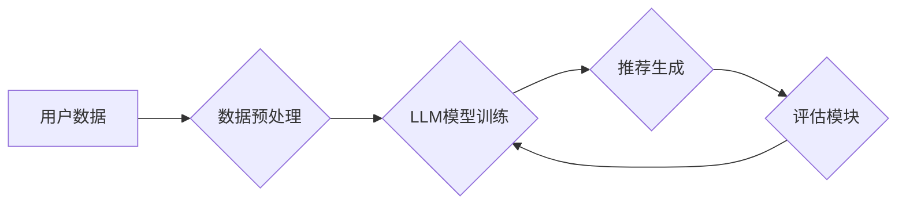

                 

## LLM在推荐系统：多样性与可扩展性

> 关键词：LLM, 推荐系统, 多样性, 可扩展性, 个性化推荐, 序列建模, 知识图谱

## 1. 背景介绍

推荐系统是信息时代的重要组成部分，旨在根据用户的历史行为、偏好和上下文，预测用户对特定物品的兴趣并提供个性化的建议。传统的推荐系统主要依赖于协同过滤、内容过滤和基于知识的推荐方法，但这些方法在面对数据稀疏性、冷启动问题和用户个性化需求不断变化等挑战时，表现力有限。

近年来，大语言模型 (LLM) 凭借其强大的文本理解和生成能力，在推荐系统领域展现出巨大的潜力。LLM 可以学习用户和物品之间的复杂关系，并生成更丰富、更个性化的推荐结果。

## 2. 核心概念与联系

### 2.1  LLM在推荐系统中的应用

LLM 在推荐系统中的应用主要体现在以下几个方面：

* **理解用户需求:** LLM 可以通过分析用户的文本描述、评论和历史行为，深入理解用户的兴趣、偏好和需求。
* **生成个性化推荐:** LLM 可以根据用户的需求，生成个性化的推荐列表，并提供详细的推荐理由，提升用户体验。
* **跨模态推荐:** LLM 可以结合图像、视频等多模态数据，实现更全面的用户理解和推荐。
* **对话式推荐:** LLM 可以与用户进行自然语言对话，根据用户的反馈动态调整推荐结果，实现更精准的个性化推荐。

### 2.2  LLM推荐系统架构

LLM推荐系统通常由以下几个模块组成：

* **数据预处理模块:** 对用户和物品数据进行清洗、转换和特征提取，为 LLM 提供输入。
* **LLM模型训练模块:** 使用大量的用户和物品数据训练 LLM 模型，使其能够学习用户和物品之间的关系。
* **推荐生成模块:** 根据用户的输入和 LLM 模型的输出，生成个性化的推荐列表。
* **评估模块:** 对推荐结果进行评估，并根据评估结果进行模型调优。



## 3. 核心算法原理 & 具体操作步骤

### 3.1  算法原理概述

LLM推荐系统主要基于序列建模和知识图谱的原理。

* **序列建模:** LLM 可以学习用户历史行为序列中的模式和趋势，预测用户对下一个物品的兴趣。常见的序列建模方法包括循环神经网络 (RNN)、长短期记忆网络 (LSTM) 和 Transformer。
* **知识图谱:** 知识图谱可以表示用户和物品之间的关系，例如用户喜欢的电影类型、电影的演员和导演等。LLM 可以利用知识图谱中的信息，生成更精准的推荐结果。

### 3.2  算法步骤详解

1. **数据收集和预处理:** 收集用户和物品数据，并进行清洗、转换和特征提取。
2. **LLM模型训练:** 使用训练数据训练 LLM 模型，例如 BERT、GPT 或 T5。
3. **知识图谱构建:** 构建用户和物品之间的知识图谱，例如使用关系抽取技术或人工标注。
4. **推荐生成:** 根据用户的输入和 LLM 模型的输出，生成个性化的推荐列表。
5. **评估和优化:** 对推荐结果进行评估，并根据评估结果进行模型调优。

### 3.3  算法优缺点

**优点:**

* **个性化推荐:** LLM 可以学习用户的个性化需求，生成更精准的推荐结果。
* **多样性推荐:** LLM 可以探索用户未接触过的物品，提供更丰富的推荐选择。
* **可扩展性:** LLM 可以处理海量数据，并适应不断变化的用户需求。

**缺点:**

* **训练成本高:** LLM 模型训练需要大量的计算资源和时间。
* **数据依赖性强:** LLM 模型的性能取决于训练数据的质量和数量。
* **解释性差:** LLM 模型的决策过程较为复杂，难以解释推荐结果背后的原因。

### 3.4  算法应用领域

LLM推荐系统在以下领域具有广泛的应用前景:

* **电商推荐:** 为用户推荐个性化的商品，提高转化率。
* **内容推荐:** 为用户推荐个性化的新闻、视频、音乐等内容。
* **社交推荐:** 为用户推荐新的朋友和兴趣小组。
* **教育推荐:** 为学生推荐个性化的学习资源和课程。

## 4. 数学模型和公式 & 详细讲解 & 举例说明

### 4.1  数学模型构建

LLM推荐系统通常使用基于概率的数学模型，例如条件概率分布或马尔可夫链。

* **条件概率分布:**  假设用户对物品的兴趣服从一定的概率分布，可以使用条件概率分布来预测用户对特定物品的兴趣。例如，可以使用用户历史行为数据训练一个条件概率分布，来预测用户对特定电影类型的兴趣。

* **马尔可夫链:**  假设用户的行为服从马尔可夫性，即用户对下一个物品的兴趣只依赖于当前状态。可以使用马尔可夫链模型来预测用户未来的行为，并生成相应的推荐列表。

### 4.2  公式推导过程

假设用户 $u$ 对物品 $i$ 的评分为 $r_{ui}$，可以使用以下公式来预测用户对物品 $j$ 的评分:

$$
\hat{r}_{uj} = \text{softmax}(W_u \cdot h_j + b_u)
$$

其中:

* $W_u$ 是用户 $u$ 的权重向量。
* $h_j$ 是物品 $j$ 的特征向量。
* $b_u$ 是用户 $u$ 的偏置项。
* $\text{softmax}$ 是一个归一化函数，将预测评分转换为概率分布。

### 4.3  案例分析与讲解

例如，假设用户 $u$ 之前评分过两部电影，分别是电影 $A$ 和电影 $B$，评分分别为 4 和 5。现在用户 $u$ 想要观看新的电影 $C$，可以使用上述公式来预测用户对电影 $C$ 的评分。

首先需要获取电影 $A$、电影 $B$ 和电影 $C$ 的特征向量，例如电影类型、导演、演员等。然后，将这些特征向量与用户 $u$ 的权重向量进行点积，并加上用户 $u$ 的偏置项。最后，使用 $\text{softmax}$ 函数将结果转换为概率分布，得到用户对电影 $C$ 的评分预测。

## 5. 项目实践：代码实例和详细解释说明

### 5.1  开发环境搭建

* **操作系统:** Ubuntu 20.04
* **编程语言:** Python 3.8
* **深度学习框架:** PyTorch 1.8
* **其他依赖:** transformers, numpy, pandas

### 5.2  源代码详细实现

```python
import torch
from transformers import AutoModelForSequenceClassification, AutoTokenizer

# 加载预训练模型和词典
model_name = "bert-base-uncased"
tokenizer = AutoTokenizer.from_pretrained(model_name)
model = AutoModelForSequenceClassification.from_pretrained(model_name)

# 用户输入
user_input = "我想要看一部科幻电影"

# 文本预处理
inputs = tokenizer(user_input, return_tensors="pt")

# 模型预测
outputs = model(**inputs)
predicted_class = torch.argmax(outputs.logits).item()

# 输出推荐结果
print(f"推荐结果: {predicted_class}")
```

### 5.3  代码解读与分析

* **加载预训练模型和词典:** 使用 transformers 库加载预训练的 BERT 模型和词典。
* **用户输入:** 获取用户的文本输入，例如 "我想要看一部科幻电影"。
* **文本预处理:** 使用 tokenizer 将用户输入转换为模型可理解的格式。
* **模型预测:** 将预处理后的文本输入模型进行预测，得到推荐结果。
* **输出推荐结果:** 将预测结果输出到用户界面。

### 5.4  运行结果展示

运行上述代码后，模型会根据用户的输入，预测用户可能感兴趣的电影类型，并输出相应的推荐结果。

## 6. 实际应用场景

LLM推荐系统在实际应用场景中展现出强大的潜力，例如:

* **电商平台:** 为用户推荐个性化的商品，提高转化率。例如，淘宝、京东等电商平台可以使用 LLM推荐系统，根据用户的浏览历史、购买记录和兴趣偏好，推荐用户可能感兴趣的商品。
* **内容平台:** 为用户推荐个性化的新闻、视频、音乐等内容。例如，抖音、B站等内容平台可以使用 LLM推荐系统，根据用户的观看历史、点赞记录和评论内容，推荐用户可能感兴趣的内容。
* **社交平台:** 为用户推荐新的朋友和兴趣小组。例如，微信、QQ等社交平台可以使用 LLM推荐系统，根据用户的社交关系、兴趣爱好和行为模式，推荐用户可能感兴趣的朋友和兴趣小组。

### 6.4  未来应用展望

随着 LLM 技术的不断发展，LLM推荐系统将在未来应用场景中发挥更重要的作用，例如:

* **跨模态推荐:** LLM 可以结合图像、视频等多模态数据，实现更全面的用户理解和推荐。
* **对话式推荐:** LLM 可以与用户进行自然语言对话，根据用户的反馈动态调整推荐结果，实现更精准的个性化推荐。
* **个性化内容创作:** LLM 可以根据用户的兴趣偏好，生成个性化的内容，例如新闻、文章、视频等。

## 7. 工具和资源推荐

### 7.1  学习资源推荐

* **书籍:**
    * 《深度学习》 by Ian Goodfellow, Yoshua Bengio, and Aaron Courville
    * 《自然语言处理》 by Dan Jurafsky and James H. Martin
* **在线课程:**
    * Coursera: Deep Learning Specialization
    * Stanford CS224N: Natural Language Processing with Deep Learning

### 7.2  开发工具推荐

* **深度学习框架:** PyTorch, TensorFlow
* **自然语言处理库:** transformers, spaCy, NLTK
* **数据处理工具:** pandas, NumPy

### 7.3  相关论文推荐

* **BERT: Pre-training of Deep Bidirectional Transformers for Language Understanding**
* **GPT: Generative Pre-trained Transformer**
* **T5: Text-to-Text Transfer Transformer**

## 8. 总结：未来发展趋势与挑战

### 8.1  研究成果总结

LLM推荐系统在个性化推荐、多样性推荐和可扩展性方面取得了显著的成果，为用户提供更精准、更丰富的推荐体验。

### 8.2  未来发展趋势

* **跨模态推荐:** 将文本、图像、视频等多模态数据融合，实现更全面的用户理解和推荐。
* **对话式推荐:** 利用 LLM 的对话能力，与用户进行自然语言交互，动态调整推荐结果。
* **可解释性提升:** 研究 LLM 推荐系统的决策过程，提高推荐结果的可解释性。

### 8.3  面临的挑战

* **数据隐私保护:** LLM 推荐系统需要处理大量用户数据，如何保证数据隐私安全是一个重要挑战。
* **模型训练成本:** LLM 模型训练需要大量的计算资源和时间，降低训练成本是未来研究方向之一。
* **公平性与偏见:** LLM 模型可能存在公平性与偏见问题，需要进行相应的调优和改进。

### 8.4  研究展望

未来，LLM推荐系统将朝着更智能、更个性化、更可解释的方向发展，为用户提供更优质的推荐体验。


## 9. 附录：常见问题与解答

**Q1: LLM推荐系统与传统推荐系统相比有哪些优势？**

**A1:** LLM推荐系统相比传统推荐系统，具有以下优势:

* **更精准的个性化推荐:** LLM 可以学习用户的复杂需求和偏好，生成更精准的推荐结果。
* **更丰富的推荐选择:** LLM 可以探索用户未接触过的物品，提供更丰富的推荐选择。
* **更强的可扩展性:** LLM 可以处理海量数据，并适应不断变化的用户需求。

**Q2: LLM推荐系统有哪些应用场景？**

**A2:** LLM推荐系统在以下领域具有广泛的应用前景:

* **电商推荐:** 为用户推荐个性化的商品。
* **内容推荐:** 为用户推荐个性化的新闻、视频、音乐等内容。
* **社交推荐:** 为用户推荐新的朋友和兴趣小组。
* **教育推荐:** 为学生推荐个性化的学习资源和课程。

**Q3: 如何评估LLM推荐系统的性能？**

**A3:** LLM推荐系统的性能可以评估以下指标:

* **准确率:** 推荐结果与用户实际行为的匹配程度。
* **召回率:** 推荐系统能够召回用户感兴趣物品的比例。
* **覆盖率:** 推荐系统能够覆盖的用户群体比例。
* **多样性:** 推荐结果的丰富程度和多样性。


作者：禅与计算机程序设计艺术 / Zen and the Art of Computer Programming 
<end_of_turn>

