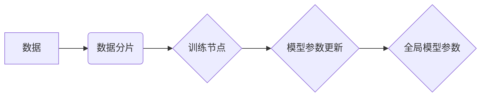

                 

## LLM的数据并行化策略与实现

> 关键词：LLM、数据并行、模型并行、模型训练、深度学习、效率提升、分布式计算

## 1. 背景介绍

大型语言模型（LLM）近年来取得了令人瞩目的成就，在自然语言处理领域展现出强大的能力。然而，训练这些庞大的模型需要海量数据和强大的计算资源，这给模型训练带来了巨大的挑战。数据并行化作为一种有效的训练策略，通过将数据分片并行处理，显著提升了模型训练的效率。

随着模型规模的不断增长，单机训练已难以满足需求，分布式训练成为主流趋势。数据并行化在分布式训练中扮演着至关重要的角色，它可以有效地利用多台机器的计算资源，加速模型训练过程。

## 2. 核心概念与联系

数据并行化是指将训练数据分割成多个子集，分别在不同的计算节点上进行训练，然后将各个节点的训练结果汇总起来，最终得到全局模型参数。

**数据并行化架构**



**核心概念：**

* **数据分片：** 将原始数据分割成多个大小相等的子集，每个子集在不同的计算节点上进行训练。
* **训练节点：** 负责处理数据分片并训练模型的计算单元。
* **模型参数更新：** 每个训练节点根据其处理的数据分片更新模型参数。
* **全局模型参数：** 将所有训练节点更新的模型参数汇总起来，得到最终的模型参数。

## 3. 核心算法原理 & 具体操作步骤

### 3.1  算法原理概述

数据并行化训练的核心思想是将模型训练任务分解成多个子任务，并行执行，从而加速训练速度。

**主要步骤：**

1. **数据分片：** 将原始数据按照一定的策略分割成多个子集，每个子集包含一部分数据。
2. **数据分配：** 将数据子集分配到不同的训练节点上。
3. **模型复制：** 在每个训练节点上复制一份模型，每个节点训练一个独立的模型副本。
4. **并行训练：** 每个训练节点使用其分配的数据子集训练模型，并更新模型参数。
5. **参数汇总：** 将所有训练节点更新的模型参数汇总起来，得到全局模型参数。
6. **模型更新：** 使用汇总的全局模型参数更新所有节点的模型副本。

### 3.2  算法步骤详解

1. **数据分片：** 数据分片策略的选择取决于数据特点和训练环境。常见的策略包括：
    * **数据切片：** 将数据按照行或样本分割成多个子集。
    * **数据桶化：** 将数据按照特征值范围进行分组，每个桶对应一个数据子集。
    * **数据哈希：** 使用哈希函数将数据映射到不同的节点上。

2. **数据分配：** 数据子集分配策略可以根据节点资源和数据分布进行调整。常见的策略包括：
    * **轮询分配：** 轮流将数据子集分配到不同的节点上。
    * **负载均衡分配：** 根据节点资源情况，将数据子集分配到负载较低的节点上。

3. **模型复制：** 在每个训练节点上复制一份模型，每个节点训练一个独立的模型副本。

4. **并行训练：** 每个训练节点使用其分配的数据子集训练模型，并更新模型参数。

5. **参数汇总：** 使用平均、加权平均或其他聚合方法将所有训练节点更新的模型参数汇总起来，得到全局模型参数。

6. **模型更新：** 使用汇总的全局模型参数更新所有节点的模型副本。

### 3.3  算法优缺点

**优点：**

* **效率提升：** 通过并行处理数据，显著加速模型训练速度。
* **模型规模扩展：** 可以训练更大规模的模型，因为可以利用更多计算资源。

**缺点：**

* **通信开销：** 数据和模型参数的传输需要消耗网络带宽和时间。
* **复杂性增加：** 数据并行化需要处理数据分片、参数汇总等复杂操作，增加了系统的复杂度。

### 3.4  算法应用领域

数据并行化广泛应用于各种深度学习任务，例如：

* **自然语言处理：** 训练大型语言模型、机器翻译模型、文本分类模型等。
* **计算机视觉：** 训练图像识别模型、目标检测模型、图像分割模型等。
* **语音识别：** 训练语音识别模型、语音合成模型等。

## 4. 数学模型和公式 & 详细讲解 & 举例说明

### 4.1  数学模型构建

假设我们有 $N$ 个数据样本，每个样本包含 $D$ 个特征。我们将数据划分为 $P$ 个数据分片，每个分片包含 $S$ 个样本，其中 $S = \frac{N}{P}$。

每个训练节点 $i$ 负责处理数据分片 $i$，并训练模型参数 $\theta_i$。

### 4.2  公式推导过程

模型的损失函数为 $L(\theta, X, Y)$，其中 $\theta$ 为模型参数，$X$ 为输入数据，$Y$ 为目标输出。

每个训练节点 $i$ 的损失函数为：

$$L_i(\theta_i, X_i, Y_i)$$

其中 $X_i$ 和 $Y_i$ 为节点 $i$ 处理的数据分片。

全局模型参数的更新规则为：

$$\theta = \frac{1}{P} \sum_{i=1}^{P} \theta_i$$

### 4.3  案例分析与讲解

假设我们有一个包含 1000 个样本的数据集，将其划分为 4 个数据分片，每个分片包含 250 个样本。

在 4 台机器上进行数据并行化训练，每台机器负责处理一个数据分片。

训练完成后，将所有机器更新的模型参数汇总起来，得到全局模型参数。

## 5. 项目实践：代码实例和详细解释说明

### 5.1  开发环境搭建

* 操作系统：Linux
* Python 版本：3.7+
* 深度学习框架：PyTorch 或 TensorFlow

### 5.2  源代码详细实现

```python
# 数据分片
def data_partition(data, num_partitions):
    # ...

# 模型复制
def model_replicate(model, num_partitions):
    # ...

# 并行训练
def parallel_train(model_replicas, data_partitions, optimizer):
    # ...

# 参数汇总
def parameter_aggregate(model_replicas):
    # ...

# 模型更新
def model_update(global_model, model_replicas):
    # ...

# 主程序
if __name__ == "__main__":
    # 数据加载
    data = load_data()

    # 数据分片
    data_partitions = data_partition(data, num_partitions=4)

    # 模型复制
    model_replicas = model_replicate(model, num_partitions=4)

    # 并行训练
    parallel_train(model_replicas, data_partitions, optimizer)

    # 参数汇总
    global_model = parameter_aggregate(model_replicas)

    # 模型更新
    model_update(global_model, model_replicas)
```

### 5.3  代码解读与分析

* `data_partition()` 函数将数据按照指定的策略分割成多个数据分片。
* `model_replicate()` 函数将模型复制到不同的训练节点上。
* `parallel_train()` 函数在每个训练节点上并行训练模型。
* `parameter_aggregate()` 函数将所有训练节点更新的模型参数汇总起来。
* `model_update()` 函数使用汇总的全局模型参数更新所有节点的模型副本。

### 5.4  运行结果展示

运行代码后，可以观察到模型在各个训练节点上的训练进度，以及全局模型参数的更新情况。

## 6. 实际应用场景

数据并行化在实际应用场景中发挥着重要作用，例如：

* **大型语言模型训练：** 训练 GPT-3 等大型语言模型需要海量数据和强大的计算资源，数据并行化是实现高效训练的关键。
* **图像识别模型训练：** 训练 ImageNet 等大型图像识别数据集的模型需要处理大量图像数据，数据并行化可以显著加速训练速度。
* **推荐系统训练：** 训练推荐系统模型需要处理海量用户行为数据，数据并行化可以提高训练效率。

### 6.4  未来应用展望

随着模型规模的不断增长和计算资源的不断提升，数据并行化将继续在深度学习领域发挥重要作用。未来，数据并行化技术将朝着以下方向发展：

* **更复杂的并行策略：** 探索更复杂的并行策略，例如混合数据并行和模型并行，以进一步提升训练效率。
* **自动化数据并行化：** 开发自动化数据并行化工具，简化数据并行化配置和管理。
* **异构计算资源利用：** 充分利用异构计算资源，例如 CPU、GPU 和 TPU，以实现更有效的并行训练。

## 7. 工具和资源推荐

### 7.1  学习资源推荐

* **论文：**
    * Dean, J., Corrado, G. S., Monga, R., Chen, K., Devin, M., Le, Q. V., ... & Ng, A. Y. (2012). Large scale distributed deep networks.
    * Recht, B., Re, C., & Wright, S. (2011). Revisiting communication-efficient distributed optimization.
* **书籍：**
    * Deep Learning (Ian Goodfellow, Yoshua Bengio, Aaron Courville)
    * Distributed Machine Learning with Python (A. Géron)

### 7.2  开发工具推荐

* **PyTorch：** https://pytorch.org/
* **TensorFlow：** https://www.tensorflow.org/
* **Horovod：** https://horovod.ai/

### 7.3  相关论文推荐

* **Data Parallelism in Distributed Deep Learning**
* **Efficient Distributed Training of Deep Networks**
* **Communication-Efficient Distributed Optimization**

## 8. 总结：未来发展趋势与挑战

### 8.1  研究成果总结

数据并行化技术在深度学习领域取得了显著成果，有效提升了模型训练效率，推动了大型模型的开发和应用。

### 8.2  未来发展趋势

未来，数据并行化技术将朝着以下方向发展：

* **更复杂的并行策略：** 探索更复杂的并行策略，例如混合数据并行和模型并行，以进一步提升训练效率。
* **自动化数据并行化：** 开发自动化数据并行化工具，简化数据并行化配置和管理。
* **异构计算资源利用：** 充分利用异构计算资源，例如 CPU、GPU 和 TPU，以实现更有效的并行训练。

### 8.3  面临的挑战

数据并行化技术也面临着一些挑战：

* **通信开销：** 数据和模型参数的传输需要消耗网络带宽和时间，尤其是在分布式训练中。
* **模型并行策略：** 模型并行策略的选择需要根据模型结构和数据特点进行调整，并非所有模型都适合并行训练。
* **系统复杂性：** 数据并行化系统需要处理数据分片、参数汇总等复杂操作，增加了系统的复杂度。

### 8.4  研究展望

未来，研究者将继续探索新的数据并行化策略和技术，以克服现有挑战，进一步提升深度学习模型的训练效率和性能。

## 9. 附录：常见问题与解答

* **Q：数据并行化和模型并行有什么区别？**

* **A：** 数据并行化是指将数据分片并行处理，而模型并行是指将模型复制到不同的计算节点上并行训练。

* **Q：如何选择合适的并行策略？**

* **A：** 选择合适的并行策略需要根据模型结构、数据特点和计算资源进行综合考虑。

* **Q：数据并行化训练的通信开销如何降低？**

* **A：** 可以使用高效的通信协议、数据压缩技术和模型优化策略来降低通信开销。


作者：禅与计算机程序设计艺术 / Zen and the Art of Computer Programming<end_of_turn>

