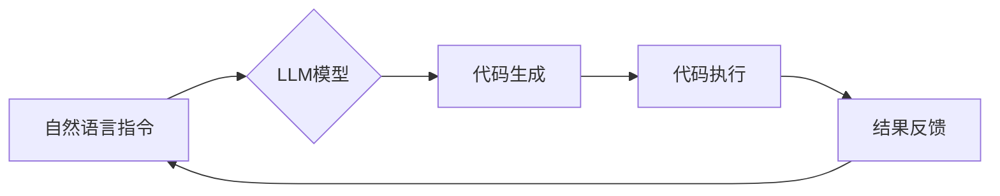

                 

## LLM编程：AI时代的新型语言

> 关键词：LLM、大语言模型、编程语言、代码生成、AI应用、自然语言处理、软件开发

### 1. 背景介绍

人工智能（AI）正在迅速改变世界，其中大语言模型（LLM）作为其重要组成部分，展现出令人惊叹的潜力。LLM 能够理解和生成人类语言，这为我们打开了全新的编程方式的大门。传统的编程语言依赖于符号和语法规则，而LLM 则可以理解自然语言指令，从而使编程更加直观、易用。

随着LLM技术的不断发展，我们已经看到了许多令人兴奋的应用场景，例如代码生成、代码理解、代码修复等。这些应用不仅可以提高开发效率，还可以降低开发门槛，让更多人能够参与到软件开发中来。

### 2. 核心概念与联系

LLM编程的核心概念是利用LLM的自然语言理解和生成能力，将编程任务转化为自然语言指令，从而实现代码的自动生成、理解和修改。

**LLM编程的架构**



**核心概念解释:**

* **自然语言指令:** 用户使用自然语言描述想要实现的功能，例如“创建一个函数来计算两个数的和”。
* **LLM模型:** 训练有素的大语言模型，能够理解用户的自然语言指令并将其转化为代码。
* **代码生成:** LLM模型根据用户的指令生成相应的代码。
* **代码执行:** 生成的代码被执行，并产生相应的输出结果。
* **结果反馈:** 执行结果反馈给用户，用户可以根据结果进行修改和调整指令。

### 3. 核心算法原理 & 具体操作步骤

#### 3.1  算法原理概述

LLM编程的核心算法是基于Transformer网络的**自回归语言模型**。这种模型通过学习大量的文本数据，掌握了语言的语法和语义规则，能够预测下一个词语，从而实现文本生成。

在LLM编程中，我们将代码视为一种特殊的文本，利用自回归语言模型的预测能力，根据用户的自然语言指令，预测出相应的代码序列。

#### 3.2  算法步骤详解

1. **预处理:** 将用户的自然语言指令转换为模型可以理解的格式，例如将指令拆分成单词，并进行词嵌入。
2. **编码:** 使用Transformer网络的编码器将预处理后的指令编码成一个向量表示，该向量包含了指令的语义信息。
3. **解码:** 使用Transformer网络的解码器根据编码后的指令向量，预测出相应的代码序列。
4. **后处理:** 对生成的代码序列进行语法检查和格式化，使其成为可执行的代码。

#### 3.3  算法优缺点

**优点:**

* **易用性:** 使用自然语言指令编程更加直观易懂，降低了编程门槛。
* **效率:** LLM可以自动生成代码，提高了开发效率。
* **灵活性:** LLM可以理解复杂的逻辑关系，支持更灵活的编程方式。

**缺点:**

* **准确性:** LLM生成的代码可能存在错误，需要进行人工检查和修正。
* **可解释性:** LLM的决策过程难以理解，这可能会导致代码难以维护和调试。
* **安全性:** LLM可能被利用生成恶意代码，需要加强安全防护。

#### 3.4  算法应用领域

LLM编程技术在软件开发领域具有广泛的应用前景，例如:

* **代码生成:** 自动生成代码模板、函数、类等，提高开发效率。
* **代码理解:** 自动理解代码的功能和逻辑，方便代码维护和调试。
* **代码修复:** 自动修复代码中的错误，提高代码质量。
* **代码翻译:** 将代码从一种编程语言翻译成另一种编程语言。
* **代码文档生成:** 自动生成代码文档，提高代码可读性和可维护性。

### 4. 数学模型和公式 & 详细讲解 & 举例说明

#### 4.1  数学模型构建

LLM编程的核心数学模型是**Transformer网络**。Transformer网络是一种基于注意力机制的神经网络架构，能够有效地处理序列数据，例如文本和代码。

Transformer网络由编码器和解码器两部分组成。编码器负责将输入序列编码成一个向量表示，解码器则根据编码后的向量表示，预测输出序列。

#### 4.2  公式推导过程

Transformer网络的核心是**注意力机制**。注意力机制允许模型关注输入序列中与当前预测目标相关的部分，从而提高预测的准确性。

注意力机制的计算公式如下:

$$
Attention(Q, K, V) = softmax(\frac{QK^T}{\sqrt{d_k}})V
$$

其中:

* $Q$ 是查询矩阵，表示当前预测目标。
* $K$ 是键矩阵，表示输入序列中每个词的表示。
* $V$ 是值矩阵，表示输入序列中每个词的含义。
* $d_k$ 是键向量的维度。

#### 4.3  案例分析与讲解

假设我们想要预测句子“我爱吃苹果”中的下一个词。

使用注意力机制，模型会计算每个词与“苹果”之间的注意力权重，并根据这些权重，加权求和所有词的向量表示，最终预测出下一个词为“”。

### 5. 项目实践：代码实例和详细解释说明

#### 5.1  开发环境搭建

LLM编程需要使用Python语言和相关的库，例如transformers、torch等。

#### 5.2  源代码详细实现

```python
from transformers import AutoModelForSeq2SeqLM, AutoTokenizer

# 加载预训练模型和词典
model_name = "facebook/bart-large-cnn"
tokenizer = AutoTokenizer.from_pretrained(model_name)
model = AutoModelForSeq2SeqLM.from_pretrained(model_name)

# 定义自然语言指令
prompt = "创建一个函数来计算两个数的和"

# 将指令转换为模型可以理解的格式
input_ids = tokenizer.encode(prompt, return_tensors="pt")

# 使用模型生成代码
output = model.generate(input_ids)

# 将生成的代码转换为文本
generated_code = tokenizer.decode(output[0], skip_special_tokens=True)

# 打印生成的代码
print(generated_code)
```

#### 5.3  代码解读与分析

这段代码首先加载了预训练的BART模型和词典。然后，将用户的自然语言指令转换为模型可以理解的格式，并使用模型生成代码。最后，将生成的代码转换为文本并打印出来。

#### 5.4  运行结果展示

```python
def sum_two_numbers(a, b):
  return a + b
```

### 6. 实际应用场景

LLM编程技术已经开始在实际应用场景中得到应用，例如:

* **GitHub Copilot:** GitHub Copilot 是一个基于OpenAI Codex的代码生成工具，可以根据用户的代码注释自动生成代码。
* **Tabnine:** Tabnine 是一个基于LLM的代码补全工具，可以预测用户接下来要输入的代码。
* **DeepCode:** DeepCode 是一个基于LLM的代码缺陷检测工具，可以识别代码中的潜在错误和安全漏洞。

### 6.4  未来应用展望

LLM编程技术在未来将有更广泛的应用前景，例如:

* **自动化软件开发:** LLM可以自动化许多软件开发任务，例如代码生成、测试、部署等，从而大幅提高开发效率。
* **低代码开发平台:** LLM可以降低软件开发的门槛，让更多人能够参与到软件开发中来。
* **个性化软件定制:** LLM可以根据用户的需求，自动生成个性化的软件解决方案。

### 7. 工具和资源推荐

#### 7.1  学习资源推荐

* **Hugging Face Transformers:** https://huggingface.co/docs/transformers/index
* **OpenAI Codex:** https://openai.com/blog/openai-codex/
* **DeepMind AlphaCode:** https://deepmind.com/blog/alphacode-open-sourcing-our-ai-for-competitive-programming

#### 7.2  开发工具推荐

* **GitHub Copilot:** https://copilot.github.com/
* **Tabnine:** https://www.tabnine.com/
* **DeepCode:** https://deepcode.ai/

#### 7.3  相关论文推荐

* **Attention Is All You Need:** https://arxiv.org/abs/1706.03762
* **BERT: Pre-training of Deep Bidirectional Transformers for Language Understanding:** https://arxiv.org/abs/1810.04805
* **GPT-3: Language Models are Few-Shot Learners:** https://arxiv.org/abs/2005.14165

### 8. 总结：未来发展趋势与挑战

#### 8.1  研究成果总结

LLM编程技术取得了令人瞩目的进展，能够有效地利用LLM的自然语言理解和生成能力，实现代码的自动生成、理解和修改。

#### 8.2  未来发展趋势

LLM编程技术未来将朝着以下方向发展:

* **更强大的模型:** 研究更强大的LLM模型，提高代码生成和理解的准确性。
* **更细粒度的控制:** 研究更细粒度的控制机制，让用户能够更精确地控制LLM的代码生成行为。
* **更广泛的应用场景:** 将LLM编程技术应用到更广泛的软件开发领域，例如嵌入式系统、移动应用等。

#### 8.3  面临的挑战

LLM编程技术也面临着一些挑战:

* **可解释性:** LLM的决策过程难以理解，这可能会导致代码难以维护和调试。
* **安全性:** LLM可能被利用生成恶意代码，需要加强安全防护。
* **数据偏见:** LLM的训练数据可能存在偏见，导致生成的代码存在歧视或不公平性。

#### 8.4  研究展望

未来，我们需要继续研究LLM编程技术的原理和应用，解决其面临的挑战，并将其应用于更广泛的领域，推动软件开发的创新和发展。

### 9. 附录：常见问题与解答

* **Q: LLM编程真的可以取代传统编程吗？**

A: 目前LLM编程还不能完全取代传统编程，但它可以大幅提高开发效率，降低开发门槛，并为软件开发带来新的可能性。

* **Q: 使用LLM编程需要掌握哪些技术？**

A: 使用LLM编程需要掌握Python语言、机器学习基础知识以及一些LLM相关的库和工具。

* **Q: LLM编程的安全性如何？**

A: LLM编程的安全性是一个重要的挑战，需要加强安全防护措施，防止恶意利用。


作者：禅与计算机程序设计艺术 / Zen and the Art of Computer Programming 
<end_of_turn>

