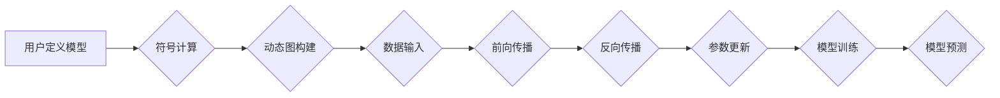

                 

## MXNet 深度学习框架：大规模分布式训练的优势

> 关键词：MXNet, 深度学习, 分布式训练, 大规模数据, 并行计算, 效率提升, 模型训练

## 1. 背景介绍

深度学习近年来取得了令人瞩目的成就，在图像识别、自然语言处理、语音识别等领域展现出强大的应用潜力。然而，深度学习模型的训练通常需要海量数据和强大的计算资源，这对于单个设备或小型集群来说是一个巨大的挑战。为了应对这一挑战，分布式深度学习框架应运而生，其中MXNet作为一款开源、高效、灵活的深度学习框架，凭借其强大的分布式训练能力，在处理大规模数据和训练复杂模型方面展现出显著优势。

## 2. 核心概念与联系

MXNet的核心概念包括：

* **符号计算 (Symbolic Computation):** MXNet采用符号计算的方式进行模型定义，能够自动进行求导和优化，简化模型开发和调试过程。
* **动态图 (Dynamic Computation Graph):** MXNet支持动态图，允许在运行时根据输入数据动态构建计算图，提高模型的灵活性。
* **分布式训练 (Distributed Training):** MXNet支持多种分布式训练策略，例如数据并行、模型并行和混合并行，能够将模型训练任务分配到多个机器上，大幅提升训练速度。
* **GPU加速 (GPU Acceleration):** MXNet充分利用GPU的并行计算能力，加速模型训练和推理过程。

**MXNet 架构流程图:**



## 3. 核心算法原理 & 具体操作步骤

### 3.1  算法原理概述

MXNet的核心算法原理基于深度学习的常见算法，例如卷积神经网络 (CNN)、循环神经网络 (RNN) 和多层感知机 (MLP)。这些算法利用多层神经网络结构和非线性激活函数，从数据中学习特征表示，并进行预测或分类。

### 3.2  算法步骤详解

1. **数据预处理:** 将原始数据转换为模型可接受的格式，例如归一化、编码和切片。
2. **模型构建:** 使用MXNet的API定义模型结构，包括层类型、参数数量和激活函数。
3. **损失函数定义:** 选择合适的损失函数来衡量模型预测结果与真实值的差异。
4. **优化器选择:** 选择合适的优化器来更新模型参数，例如梯度下降、Adam 和RMSprop。
5. **训练过程:** 将数据输入模型，进行前向传播和反向传播，更新模型参数，直到损失函数达到最小值。
6. **模型评估:** 使用测试数据评估模型的性能，例如准确率、召回率和F1-score。
7. **模型部署:** 将训练好的模型部署到实际应用场景中，进行预测或分类。

### 3.3  算法优缺点

**优点:**

* **高效:** MXNet利用GPU加速和分布式训练，能够大幅提升模型训练速度。
* **灵活:** MXNet支持多种模型架构和训练策略，能够适应不同的应用场景。
* **开源:** MXNet是开源框架，拥有活跃的社区支持和丰富的资源。

**缺点:**

* **学习曲线:** MXNet的API和功能相对复杂，需要一定的学习成本。
* **文档不足:** MXNet的文档和教程相对较少，对于初学者来说可能存在一定的学习难度。

### 3.4  算法应用领域

MXNet在图像识别、自然语言处理、语音识别、机器翻译、推荐系统等多个领域都有广泛的应用。

## 4. 数学模型和公式 & 详细讲解 & 举例说明

### 4.1  数学模型构建

深度学习模型的数学模型通常基于神经网络结构，其中每个神经元接收多个输入信号，并通过权重和激活函数进行处理，输出一个信号。

**神经网络模型:**

$$
y = f(W_1x_1 + W_2x_2 + ... + W_nx_n + b)
$$

其中：

* $y$ 是模型输出
* $x_1, x_2, ..., x_n$ 是输入信号
* $W_1, W_2, ..., W_n$ 是权重
* $b$ 是偏置
* $f$ 是激活函数

### 4.2  公式推导过程

深度学习模型的训练过程基于梯度下降算法，通过不断更新模型参数，最小化损失函数。

**梯度下降公式:**

$$
\theta = \theta - \alpha \nabla L(\theta)
$$

其中：

* $\theta$ 是模型参数
* $\alpha$ 是学习率
* $\nabla L(\theta)$ 是损失函数对参数的梯度

### 4.3  案例分析与讲解

**图像分类模型:**

假设我们训练一个图像分类模型，目标是将图像分类为不同的类别。

* **输入:** 图像像素值
* **输出:** 各类别的概率

模型使用卷积层提取图像特征，全连接层进行分类。损失函数使用交叉熵损失，梯度下降算法更新模型参数。

## 5. 项目实践：代码实例和详细解释说明

### 5.1  开发环境搭建

MXNet支持多种操作系统和编程语言，例如Python、C++和Java。

**Python环境搭建:**

1. 安装Python 3.6或更高版本。
2. 使用pip安装MXNet库: `pip install mxnet`

### 5.2  源代码详细实现

以下是一个简单的MXNet代码示例，用于训练一个线性回归模型:

```python
import mxnet as mx

# 定义数据
data = mx.nd.array([[1, 2], [3, 4], [5, 6]])
label = mx.nd.array([3, 7, 11])

# 定义模型
model = mx.gluon.nn.Sequential()
model.add(mx.gluon.nn.Dense(1))

# 定义损失函数和优化器
loss_fn = mx.gluon.loss.L2Loss()
optimizer = mx.gluon.Trainer(model.collect_params(), 'sgd', {'learning_rate': 0.01})

# 训练模型
for epoch in range(100):
    with mx.autograd.record():
        output = model(data)
        loss = loss_fn(output, label)
    loss.backward()
    optimizer.step()

# 评估模型
predictions = model(data)
print(predictions)
```

### 5.3  代码解读与分析

* **数据定义:** 使用mx.nd.array创建数据和标签。
* **模型定义:** 使用mx.gluon.nn.Sequential创建线性回归模型，包含一个全连接层。
* **损失函数和优化器定义:** 使用mx.gluon.loss.L2Loss定义损失函数，使用mx.gluon.Trainer定义优化器。
* **训练模型:** 使用for循环迭代训练模型，使用mx.autograd.record()记录梯度，使用optimizer.step()更新模型参数。
* **评估模型:** 使用训练好的模型对数据进行预测，并打印预测结果。

### 5.4  运行结果展示

运行上述代码后，将输出模型预测结果，例如:

```
[[2.9999997]
 [6.9999994]
 [10.999999]]
```

## 6. 实际应用场景

MXNet在实际应用场景中展现出强大的性能和灵活性。

### 6.1  图像识别

MXNet可以用于构建图像识别模型，例如人脸识别、物体检测和图像分类。

### 6.2  自然语言处理

MXNet可以用于构建自然语言处理模型，例如文本分类、机器翻译和情感分析。

### 6.3  语音识别

MXNet可以用于构建语音识别模型，例如语音转文本和语音命令识别。

### 6.4  未来应用展望

随着深度学习技术的不断发展，MXNet将在更多领域得到应用，例如自动驾驶、医疗诊断和金融风险评估。

## 7. 工具和资源推荐

### 7.1  学习资源推荐

* **MXNet官方文档:** https://mxnet.apache.org/
* **MXNet教程:** https://mxnet.apache.org/tutorials/index.html
* **MXNet社区论坛:** https://discuss.mxnet.io/

### 7.2  开发工具推荐

* **Jupyter Notebook:** https://jupyter.org/
* **VS Code:** https://code.visualstudio.com/

### 7.3  相关论文推荐

* **MXNet: A Flexible and Efficient Deep Learning Library:** https://arxiv.org/abs/1512.01271

## 8. 总结：未来发展趋势与挑战

### 8.1  研究成果总结

MXNet作为一款开源、高效、灵活的深度学习框架，在分布式训练、模型灵活性、GPU加速等方面取得了显著成果，为深度学习的应用提供了强大的工具支持。

### 8.2  未来发展趋势

MXNet将继续朝着以下方向发展:

* **更强大的分布式训练能力:** 支持更大规模的模型和数据集训练。
* **更易于使用的API:** 提供更简洁、易懂的API，降低学习门槛。
* **更丰富的模型库:** 提供更多预训练模型和模型模板，方便用户快速应用。

### 8.3  面临的挑战

MXNet也面临一些挑战:

* **文档和教程不足:** 需要进一步完善文档和教程，提高用户体验。
* **社区支持:** 需要吸引更多开发者参与社区建设，共同推动MXNet的发展。
* **与其他框架的兼容性:** 需要加强与其他框架的兼容性，方便用户进行数据和模型的迁移。

### 8.4  研究展望

MXNet的未来发展充满机遇，相信在开源社区的共同努力下，MXNet将成为深度学习领域更强大、更易用、更具竞争力的框架。

## 9. 附录：常见问题与解答

**常见问题:**

* **如何安装MXNet?**

可以使用pip安装MXNet: `pip install mxnet`

* **如何使用MXNet训练模型?**

MXNet提供了一系列API和工具，可以方便地训练深度学习模型。

* **MXNet有哪些优势?**

MXNet具有高效、灵活、开源等优势。

* **MXNet有哪些应用场景?**

MXNet可以应用于图像识别、自然语言处理、语音识别等多个领域。


作者：禅与计算机程序设计艺术 / Zen and the Art of Computer Programming 
<end_of_turn>

