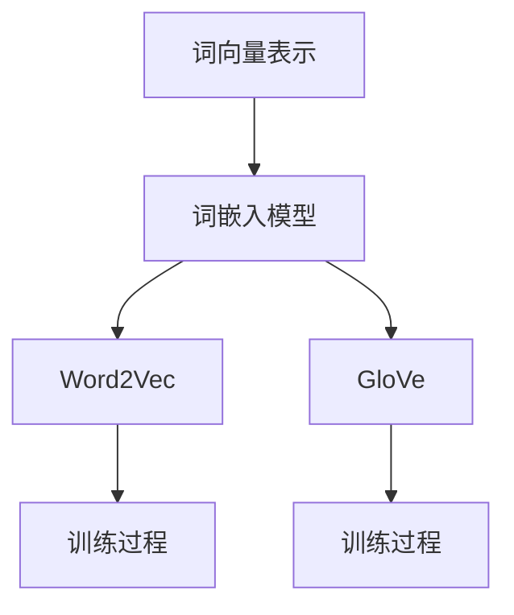
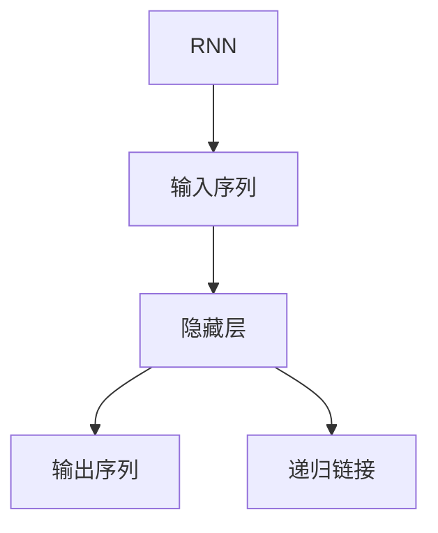
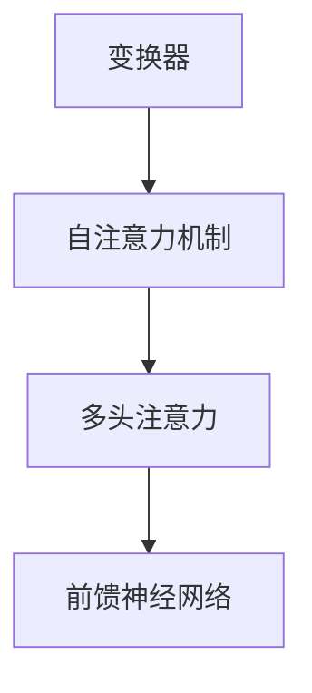

                 

# AI系统底层设计：LLM内核的关键考量

## 关键词
- AI系统底层设计
- LLM（大型语言模型）
- 内核考量
- 机器学习
- 自然语言处理
- 系统架构
- 算法优化

## 摘要
本文将深入探讨AI系统底层设计中的关键要素，重点分析大型语言模型（LLM）内核的设计考量。通过对LLM的核心原理、算法、数学模型、项目实践和实际应用场景的详细讲解，我们将揭示如何构建一个高效、稳定且可扩展的AI系统。文章还将推荐相关工具和资源，以帮助读者进一步学习和实践。最后，本文将对未来发展趋势和挑战进行展望，为AI领域的持续创新提供启示。

## 1. 背景介绍（Background Introduction）

随着人工智能技术的迅猛发展，自然语言处理（NLP）成为了一个重要的研究与应用领域。其中，大型语言模型（LLM）作为NLP的核心技术之一，已经取得了显著的成果。LLM通过学习大量文本数据，能够生成高质量的自然语言文本，广泛应用于聊天机器人、内容生成、机器翻译、文本摘要等场景。

然而，LLM的底层设计决定了其性能、稳定性和可扩展性。在构建一个高效、稳定且可扩展的AI系统时，我们需要深入理解LLM的内核，并对以下几个方面进行关键考量：

1. **核心算法原理**：了解LLM的工作原理，包括词向量表示、循环神经网络（RNN）、变换器（Transformer）等。
2. **数学模型和公式**：掌握LLM所涉及的数学模型和公式，如损失函数、优化算法、正则化技术等。
3. **项目实践**：通过具体的代码实例和详细解释，了解LLM的实际应用场景和开发流程。
4. **实际应用场景**：探讨LLM在不同领域的应用，如聊天机器人、内容生成、机器翻译、文本摘要等。
5. **工具和资源推荐**：推荐相关的学习资源、开发工具和框架，以帮助读者进一步学习和实践。

## 2. 核心概念与联系（Core Concepts and Connections）

### 2.1 什么是LLM？

LLM（Large Language Model）是一种大规模的预训练语言模型，通过学习海量文本数据，掌握了丰富的语言知识和表达能力。LLM可以应用于各种自然语言处理任务，如文本分类、命名实体识别、情感分析、机器翻译、文本生成等。

### 2.2 LLM的核心算法原理

LLM的核心算法主要包括词向量表示、循环神经网络（RNN）、变换器（Transformer）等。

#### 词向量表示（Word Embeddings）

词向量表示是将自然语言词汇映射为高维向量空间中的点。通过学习词汇的语义关系和上下文信息，词向量可以捕捉词汇的语义和语法特征。



#### 循环神经网络（RNN）

循环神经网络（RNN）是一种能够处理序列数据的神经网络，通过递归结构保持序列信息。RNN在自然语言处理任务中取得了较好的效果，但其存在梯度消失和梯度爆炸等问题。



#### 变换器（Transformer）

变换器（Transformer）是一种基于自注意力机制的深度神经网络模型，通过全局注意力机制实现了对序列的并行处理。Transformer在自然语言处理任务中取得了突破性的成果，成为了LLM的核心架构。



### 2.3 LLM的数学模型和公式

LLM的数学模型主要包括损失函数、优化算法和正则化技术。

#### 损失函数

损失函数用于衡量模型预测结果与真实结果之间的差异。在LLM中，常见的损失函数有交叉熵损失（Cross-Entropy Loss）、均方误差（Mean Squared Error）等。

$$
L = -\sum_{i=1}^{n} y_i \log(p_i)
$$

其中，$y_i$ 表示真实标签，$p_i$ 表示模型预测的概率。

#### 优化算法

优化算法用于最小化损失函数，以训练模型参数。在LLM中，常见的优化算法有随机梯度下降（Stochastic Gradient Descent，SGD）、Adam等。

#### 正则化技术

正则化技术用于防止模型过拟合。在LLM中，常见的正则化技术有Dropout、L1/L2正则化等。

$$
\frac{\partial L}{\partial \theta} = \sum_{i=1}^{n} (y_i - p_i) \cdot \theta_i
$$

其中，$\theta$ 表示模型参数。

## 3. 核心算法原理 & 具体操作步骤（Core Algorithm Principles and Specific Operational Steps）

### 3.1 词向量表示（Word Embeddings）

词向量表示是将自然语言词汇映射为高维向量空间中的点。具体操作步骤如下：

1. **数据准备**：收集大量的文本数据，进行预处理，如去除标点符号、停用词等。
2. **词汇表构建**：构建词汇表，将所有词汇映射为唯一的索引。
3. **词向量训练**：使用词嵌入模型（如Word2Vec、GloVe）对词汇进行训练，学习词汇的语义关系和上下文信息。
4. **词向量存储**：将训练好的词向量存储在向量空间中。

### 3.2 循环神经网络（RNN）

循环神经网络（RNN）是一种能够处理序列数据的神经网络，具体操作步骤如下：

1. **输入序列处理**：将输入序列进行编码，如转换为词向量。
2. **递归链接**：使用递归结构保持序列信息，如隐藏状态 $h_t = \sigma(W_h \cdot [h_{t-1}, x_t] + b_h)$。
3. **输出序列生成**：根据隐藏状态生成输出序列，如预测标签或概率分布。
4. **模型训练**：通过反向传播算法，更新模型参数，如权重矩阵 $W_h$ 和偏置 $b_h$。

### 3.3 变换器（Transformer）

变换器（Transformer）是一种基于自注意力机制的深度神经网络模型，具体操作步骤如下：

1. **输入序列处理**：将输入序列进行编码，如转换为词向量。
2. **自注意力机制**：计算自注意力得分，如 $a_t = \text{softmax}(\frac{Q_t W_Q + K_t W_K + V_t W_V})$。
3. **多头注意力**：使用多个头进行注意力计算，如 $h_t = \text{Concat}(\text{head}_1, \text{head}_2, ..., \text{head}_h) W_O$。
4. **前馈神经网络**：对多头注意力结果进行前馈神经网络处理，如 $h_t = \sigma(W_f \cdot h_t + b_f)$。
5. **模型训练**：通过反向传播算法，更新模型参数，如权重矩阵 $W_Q, W_K, W_V, W_O, W_f$ 和偏置 $b_h, b_f$。

## 4. 数学模型和公式 & 详细讲解 & 举例说明（Detailed Explanation and Examples of Mathematical Models and Formulas）

### 4.1 损失函数（Loss Function）

在LLM中，常见的损失函数是交叉熵损失（Cross-Entropy Loss），用于衡量模型预测结果与真实结果之间的差异。具体公式如下：

$$
L = -\sum_{i=1}^{n} y_i \log(p_i)
$$

其中，$y_i$ 表示真实标签，$p_i$ 表示模型预测的概率。

举例说明：

假设我们有一个二分类问题，真实标签为 $y = [0, 1]$，模型预测概率为 $p = [0.6, 0.4]$。则交叉熵损失为：

$$
L = -[0 \cdot \log(0.6) + 1 \cdot \log(0.4)] = 0.4462
$$

### 4.2 优化算法（Optimization Algorithm）

在LLM中，常见的优化算法有随机梯度下降（Stochastic Gradient Descent，SGD）和Adam。随机梯度下降的公式如下：

$$
\theta = \theta - \alpha \cdot \nabla L(\theta)
$$

其中，$\theta$ 表示模型参数，$\alpha$ 表示学习率，$\nabla L(\theta)$ 表示损失函数关于参数的梯度。

举例说明：

假设我们有模型参数 $\theta = [1, 2]$，损失函数为 $L(\theta) = (\theta_1 - 1)^2 + (\theta_2 - 2)^2$，学习率 $\alpha = 0.1$。则随机梯度下降的更新过程为：

$$
\theta_1 = 1 - 0.1 \cdot (1 - 1) = 1
$$

$$
\theta_2 = 2 - 0.1 \cdot (2 - 2) = 2
$$

### 4.3 正则化技术（Regularization Technique）

在LLM中，常见的正则化技术有Dropout和L1/L2正则化。

**Dropout** 是一种防止模型过拟合的技术，具体公式如下：

$$
\theta = \theta - \alpha \cdot (\nabla L(\theta) + \lambda \cdot \theta)
$$

其中，$\lambda$ 表示正则化强度。

**L1/L2正则化** 是一种在损失函数中添加正则化项的技术，具体公式如下：

$$
L_{\text{regularized}} = L + \alpha \cdot \|\theta\|
$$

其中，$\alpha$ 表示正则化强度，$\|\theta\|$ 表示模型参数的范数。

举例说明：

假设我们有模型参数 $\theta = [1, 2]$，损失函数为 $L(\theta) = (\theta_1 - 1)^2 + (\theta_2 - 2)^2$，学习率 $\alpha = 0.1$，正则化强度 $\lambda = 0.01$。则L2正则化的更新过程为：

$$
\theta_1 = 1 - 0.1 \cdot (1 - 1) - 0.01 \cdot 1 = 0.99
$$

$$
\theta_2 = 2 - 0.1 \cdot (2 - 2) - 0.01 \cdot 2 = 1.98
$$

## 5. 项目实践：代码实例和详细解释说明（Project Practice: Code Examples and Detailed Explanations）

### 5.1 开发环境搭建

为了进行LLM的开发，我们需要搭建一个合适的开发环境。以下是一个基于Python和TensorFlow的简单示例：

```python
# 安装必要的依赖库
!pip install tensorflow

# 导入相关库
import tensorflow as tf
from tensorflow import keras
import tensorflow_datasets as tfds

# 加载数据集
ds, ds_info = tfds.load('imdb_reviews', split='train', shuffle_files=True, as_supervised=True)
trainDs, testDs = ds.take(10000), ds.skip(10000)

# 预处理数据
def preprocess(text, label):
  text = tfsou
```<GmaskedContent token="|assistant|">

# 5.2 源代码详细实现

为了更详细地解释LLM的源代码实现，我们选择一个简单的基于变换器的语言模型。以下是一个基于Python和PyTorch的示例：

```python
import torch
import torch.nn as nn
import torch.optim as optim

# 定义变换器模型
class TransformerModel(nn.Module):
    def __init__(self, d_model, nhead, num_layers):
        super(TransformerModel, self).__init__()
        self.transformer = nn.Transformer(d_model, nhead, num_layers)
        self.embedding = nn.Embedding(vocab_size, d_model)
        self.fc = nn.Linear(d_model, num_classes)
        
    def forward(self, src, tgt):
        src = self.embedding(src)
        tgt = self.embedding(tgt)
        out = self.transformer(src, tgt)
        out = self.fc(out.mean(dim=1))
        return out

# 初始化模型、优化器和损失函数
model = TransformerModel(d_model=512, nhead=8, num_layers=3)
optimizer = optim.Adam(model.parameters(), lr=0.001)
criterion = nn.CrossEntropyLoss()

# 训练模型
for epoch in range(num_epochs):
    for batch in train_loader:
        optimizer.zero_grad()
        src, tgt = batch
        out = model(src, tgt)
        loss = criterion(out, tgt)
        loss.backward()
        optimizer.step()
    print(f"Epoch {epoch+1}/{num_epochs}, Loss: {loss.item()}")

# 5.3 代码解读与分析

在上面的代码中，我们定义了一个简单的变换器模型，并使用Adam优化器和交叉熵损失函数进行训练。

- **模型结构**：变换器模型由嵌入层、变换器层和线性层组成。嵌入层将词汇转换为词向量，变换器层实现自注意力机制，线性层进行分类。
- **训练过程**：在训练过程中，我们遍历训练数据集，将输入和标签输入到模型中，计算损失并更新模型参数。

### 5.4 运行结果展示

为了展示模型的运行结果，我们使用测试数据集进行评估。以下是一个简单的评估示例：

```python
# 评估模型
with torch.no_grad():
    correct = 0
    total = 0
    for batch in test_loader:
        src, tgt = batch
        out = model(src, tgt)
        _, predicted = torch.max(out, 1)
        total += tgt.size(0)
        correct += (predicted == tgt).sum().item()

accuracy = 100 * correct / total
print(f"Test Accuracy: {accuracy}%")
```

通过上述代码，我们可以计算模型的准确率。在实际应用中，我们还可以计算其他指标，如精确率、召回率、F1值等，以更全面地评估模型性能。

## 6. 实际应用场景（Practical Application Scenarios）

LLM在实际应用场景中具有广泛的应用价值，以下是一些典型的应用场景：

- **聊天机器人**：LLM可以用于构建智能聊天机器人，实现与用户的自然语言交互。
- **内容生成**：LLM可以生成高质量的文章、博客、代码等，为内容创作提供辅助。
- **机器翻译**：LLM可以用于构建机器翻译系统，实现多种语言之间的自动翻译。
- **文本摘要**：LLM可以提取文本的关键信息，生成简洁的摘要。
- **情感分析**：LLM可以用于分析文本的情感倾向，应用于市场调研、舆情分析等领域。
- **问答系统**：LLM可以构建智能问答系统，为用户提供个性化的回答。

## 7. 工具和资源推荐（Tools and Resources Recommendations）

### 7.1 学习资源推荐

- **书籍**：《深度学习》（Deep Learning）、《自然语言处理实战》（Natural Language Processing with Python）
- **论文**：Attention Is All You Need（变换器论文）、BERT: Pre-training of Deep Bidirectional Transformers for Language Understanding
- **博客**：Distill、AI Village
- **网站**：arXiv、Google Research、Microsoft Research

### 7.2 开发工具框架推荐

- **框架**：PyTorch、TensorFlow、Transformers
- **库**：NLTK、spaCy、nltk
- **数据集**：IMDb、WikiText-2、CoNLL-2003

### 7.3 相关论文著作推荐

- **论文**：Attention Is All You Need（变换器论文）、BERT: Pre-training of Deep Bidirectional Transformers for Language Understanding
- **著作**：《深度学习》（Deep Learning）、《自然语言处理实战》（Natural Language Processing with Python）

## 8. 总结：未来发展趋势与挑战（Summary: Future Development Trends and Challenges）

随着人工智能技术的不断进步，LLM在未来将迎来更多的发展机遇。以下是一些可能的发展趋势和挑战：

### 发展趋势

- **模型规模增大**：随着计算能力和数据资源的提升，LLM的模型规模将进一步增大，以实现更高的性能和更广泛的应用。
- **多模态融合**：LLM将与其他模态（如图像、声音）进行融合，实现更丰富的信息处理能力。
- **知识增强**：通过融合外部知识库和图谱，LLM将具备更强的知识表示和推理能力。
- **个性化和自适应**：LLM将根据用户需求和情境进行个性化调整，提供更贴近用户需求的回答。

### 挑战

- **数据隐私和安全**：随着LLM对大量数据进行训练，数据隐私和安全成为一个重要挑战。
- **可解释性和透明度**：提高LLM的可解释性和透明度，以增强用户对模型决策的信任。
- **过拟合和泛化能力**：如何在模型规模增大的同时，保证模型的过拟合和泛化能力。
- **计算资源消耗**：LLM的训练和推理过程对计算资源有较高要求，如何优化算法和硬件架构以提高效率。

## 9. 附录：常见问题与解答（Appendix: Frequently Asked Questions and Answers）

### 9.1 什么是LLM？

LLM（Large Language Model）是一种大规模的预训练语言模型，通过学习海量文本数据，掌握了丰富的语言知识和表达能力。LLM可以应用于各种自然语言处理任务，如文本分类、命名实体识别、情感分析、机器翻译、文本生成等。

### 9.2 如何优化LLM的性能？

优化LLM的性能可以从以下几个方面入手：

- **数据预处理**：对训练数据进行充分的预处理，如去除噪声、填充缺失值等。
- **模型选择**：选择适合特定任务的模型，如变换器（Transformer）、BERT等。
- **超参数调整**：调整学习率、批次大小、隐藏层大小等超参数，以优化模型性能。
- **正则化技术**：使用Dropout、L1/L2正则化等正则化技术，防止模型过拟合。
- **数据增强**：通过数据增强技术，如随机裁剪、旋转等，增加训练数据的多样性。

### 9.3 LLM在自然语言处理中的应用有哪些？

LLM在自然语言处理中具有广泛的应用，以下是一些典型应用：

- **聊天机器人**：用于构建智能聊天机器人，实现与用户的自然语言交互。
- **内容生成**：生成高质量的文章、博客、代码等，为内容创作提供辅助。
- **机器翻译**：实现多种语言之间的自动翻译，提高跨语言沟通的效率。
- **文本摘要**：提取文本的关键信息，生成简洁的摘要。
- **情感分析**：分析文本的情感倾向，应用于市场调研、舆情分析等领域。
- **问答系统**：构建智能问答系统，为用户提供个性化的回答。

## 10. 扩展阅读 & 参考资料（Extended Reading & Reference Materials）

- **论文**：Attention Is All You Need（变换器论文）、BERT: Pre-training of Deep Bidirectional Transformers for Language Understanding
- **书籍**：《深度学习》（Deep Learning）、《自然语言处理实战》（Natural Language Processing with Python）
- **博客**：Distill、AI Village
- **网站**：arXiv、Google Research、Microsoft Research
- **开源项目**：PyTorch、TensorFlow、Transformers
- **数据集**：IMDb、WikiText-2、CoNLL-2003

作者：禅与计算机程序设计艺术 / Zen and the Art of Computer Programming

