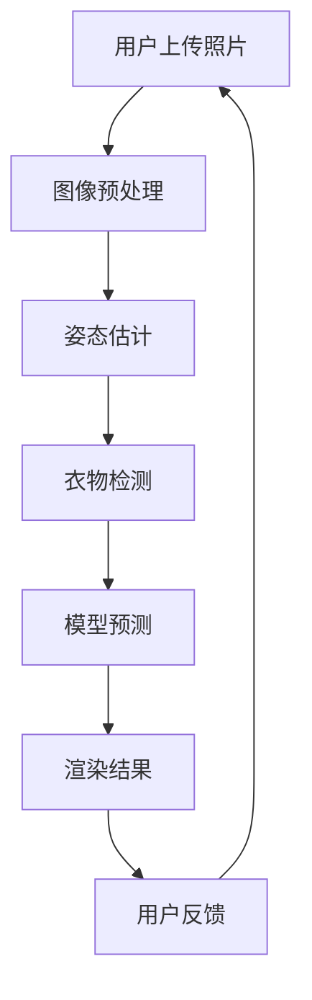
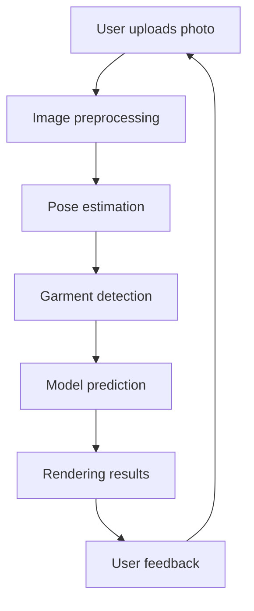

                 

### 文章标题

### Title: Implementing AI Virtual Dressing Room Functionality

在当今数字化时代，消费者对于购物体验的要求越来越高。为了满足这一需求，许多在线零售商开始采用人工智能（AI）技术来增强其电子商务平台。其中，AI虚拟试衣功能成为了一个备受瞩目的创新点。本文将探讨AI虚拟试衣功能的实现，包括核心算法原理、技术难点、实际应用场景以及未来发展。

> 关键词：
> - 人工智能
> - 虚拟试衣
> - 图像处理
> - 计算机视觉
> - 电子商务

> 摘要：
> 本文将详细介绍AI虚拟试衣功能的实现过程，从核心算法原理、技术挑战到实际应用，为您展示如何利用人工智能技术为消费者提供更加便捷和个性化的购物体验。通过本文的阅读，读者将了解到虚拟试衣技术的最新进展和应用前景。

## 1. 背景介绍（Background Introduction）

### 1.1 电子商务的发展与消费者需求

随着互联网的普及和移动设备的广泛应用，电子商务已经成为全球零售业的重要组成部分。然而，传统的在线购物模式仍然存在一些不足之处，例如消费者无法直接试穿衣物，从而影响购买决策。因此，提供一种能够让消费者在家中尝试各种服装的虚拟试衣解决方案成为了一个重要需求。

### 1.2 AI虚拟试衣功能的需求与优势

AI虚拟试衣功能通过计算机视觉和图像处理技术，结合消费者提供的身体尺寸信息，可以生成服装在消费者身上的虚拟试穿效果。这一功能不仅解决了传统购物模式中的试穿问题，还提供了以下优势：

1. **提高购买决策效率**：消费者可以快速试穿多种服装，从而更快地做出购买决策。
2. **降低退换货率**：通过准确试穿，减少因尺寸不合适导致的退换货情况，降低物流成本。
3. **个性化推荐**：根据消费者的身体尺寸和偏好，提供更加个性化的服装推荐。

### 1.3 虚拟试衣技术的现状

虚拟试衣技术已经发展多年，目前主要分为基于3D建模和2D图像处理两种方法。3D建模技术能够提供更真实的试穿效果，但需要较高的计算资源和精确的身体尺寸信息。2D图像处理技术则相对简单，但试穿效果可能会受到图像质量和光照条件的影响。

### 1.4 目标与内容

本文的目标是详细探讨AI虚拟试衣功能的实现，包括以下内容：

1. **核心算法原理**：介绍虚拟试衣功能所依赖的核心算法，如计算机视觉、图像处理和机器学习等。
2. **技术难点**：分析实现虚拟试衣功能过程中可能遇到的技术挑战。
3. **实际应用**：展示虚拟试衣技术在现实世界中的应用案例。
4. **未来发展**：探讨虚拟试衣技术的未来发展趋势和潜在挑战。

### 1.5 文章结构

本文结构如下：

1. **背景介绍**：介绍电子商务的发展、消费者需求以及虚拟试衣技术的现状。
2. **核心概念与联系**：阐述实现虚拟试衣功能所需的核心概念，如图像处理、计算机视觉和机器学习等。
3. **核心算法原理 & 具体操作步骤**：详细解释实现虚拟试衣功能所需的核心算法原理和具体操作步骤。
4. **数学模型和公式 & 详细讲解 & 举例说明**：介绍与虚拟试衣功能相关的数学模型和公式，并通过具体例子进行讲解。
5. **项目实践：代码实例和详细解释说明**：提供实际代码实例，并对其进行详细解释和分析。
6. **实际应用场景**：展示虚拟试衣技术在现实世界中的应用场景和案例。
7. **工具和资源推荐**：推荐与虚拟试衣功能相关的学习资源、开发工具和框架。
8. **总结：未来发展趋势与挑战**：总结虚拟试衣技术的未来发展、趋势和面临的挑战。
9. **附录：常见问题与解答**：回答与虚拟试衣功能相关的一些常见问题。
10. **扩展阅读 & 参考资料**：提供与本文主题相关的扩展阅读和参考资料。

---

## 1. Background Introduction

The rapid development of e-commerce and the increasing demand for convenience and personalized shopping experiences have driven the adoption of AI technologies in online retail platforms. Among these innovations, the AI virtual dressing room functionality stands out as a significant advancement. This article aims to delve into the implementation of AI virtual dressing room functionality, discussing core algorithms, technical challenges, real-world applications, and future prospects.

### 1.1 The Growth of E-commerce and Consumer Demand

As the internet has become ubiquitous and mobile devices have gained widespread adoption, e-commerce has emerged as a vital component of the global retail industry. However, traditional online shopping models still have limitations, such as the inability for consumers to try on clothing directly, which can influence purchase decisions. Therefore, providing a virtual dressing room solution that allows consumers to try various garments at home has become a crucial demand.

### 1.2 Needs and Advantages of AI Virtual Dressing Room Functionality

AI virtual dressing room functionality leverages computer vision and image processing technologies, along with the consumer's body size information, to generate virtual try-on effects of garments. This technology not only addresses the trial wear issue in traditional shopping models but also offers the following advantages:

1. **Improved Decision-Making Efficiency**: Consumers can quickly try on multiple garments, leading to faster purchase decisions.
2. **Reduced Return and Exchange Rates**: Accurate try-on experiences reduce the likelihood of returns and exchanges due to incorrect sizes, thereby lowering logistics costs.
3. **Personalized Recommendations**: Based on the consumer's body size and preferences, personalized garment recommendations can be provided.

### 1.3 The Current State of Virtual Dressing Technology

Virtual dressing technology has evolved over the years and can be primarily categorized into two methods: 3D modeling and 2D image processing. 3D modeling technology provides a more realistic try-on experience but requires significant computational resources and precise body size information. 2D image processing technology, on the other hand, is relatively simpler but may be affected by image quality and lighting conditions.

### 1.4 Objectives and Content

The objectives of this article are as follows:

1. **Core Algorithm Principles**: Introduce the core algorithms required for implementing virtual dressing room functionality, such as computer vision, image processing, and machine learning.
2. **Technical Challenges**: Analyze the technical challenges encountered during the implementation of virtual dressing room functionality.
3. **Real-World Applications**: Showcase real-world applications and case studies of virtual dressing room technology.
4. **Future Development**: Discuss the future trends and potential challenges of virtual dressing technology.

### 1.5 Article Structure

The structure of this article is as follows:

1. **Background Introduction**: Introduce the background of e-commerce development, consumer demand, and the current state of virtual dressing technology.
2. **Core Concepts and Connections**: Elaborate on the core concepts necessary for implementing virtual dressing room functionality, including image processing, computer vision, and machine learning.
3. **Core Algorithm Principles and Specific Operational Steps**: Explain the core algorithm principles and specific operational steps required for implementing virtual dressing room functionality.
4. **Mathematical Models and Formulas & Detailed Explanation & Example Illustrations**: Introduce the mathematical models and formulas related to virtual dressing room functionality, providing detailed explanations and examples.
5. **Project Practice: Code Examples and Detailed Explanations**: Provide actual code examples and detailed explanations and analysis.
6. **Practical Application Scenarios**: Display real-world application scenarios and case studies of virtual dressing room technology.
7. **Tools and Resources Recommendations**: Recommend learning resources, development tools, and frameworks related to virtual dressing room functionality.
8. **Summary: Future Development Trends and Challenges**: Summarize the future development, trends, and challenges of virtual dressing room technology.
9. **Appendix: Frequently Asked Questions and Answers**: Address common questions related to virtual dressing room functionality.
10. **Extended Reading & Reference Materials**: Provide extended reading and reference materials related to the topic of this article.

---

## 2. 核心概念与联系（Core Concepts and Connections）

为了实现AI虚拟试衣功能，我们需要了解几个关键概念和技术，这些技术包括图像处理、计算机视觉、机器学习以及虚拟现实（VR）。以下是对这些核心概念及其相互关系的详细阐述。

### 2.1 图像处理（Image Processing）

图像处理是计算机科学中用于分析和操作图像的一系列技术和算法。在虚拟试衣中，图像处理用于对捕获的消费者图像进行预处理，以去除背景、调整光照和增强细节。以下是一些常用的图像处理技术：

- **图像滤波**：用于去除图像中的噪声和干扰。
- **图像分割**：将图像分割成多个区域，以便更好地处理每个区域。
- **图像增强**：改善图像的质量和可读性，使其更适合进一步处理。

### 2.2 计算机视觉（Computer Vision）

计算机视觉是使计算机能够理解和解释视觉信息的技术。在虚拟试衣中，计算机视觉用于识别和定位消费者的身体部位，以及分离出衣物和背景。以下是几个关键步骤：

- **人脸识别**：用于检测和识别消费者的面部特征。
- **姿态估计**：通过识别关键身体关节，估计消费者的姿态。
- **物体检测**：用于识别图像中的特定物体，如衣物。

### 2.3 机器学习（Machine Learning）

机器学习是使计算机从数据中学习并做出预测或决策的技术。在虚拟试衣中，机器学习用于训练模型，以预测消费者穿着衣物后的外观。以下是几个关键应用：

- **深度学习**：通过神经网络模型，如卷积神经网络（CNNs），处理复杂的图像数据。
- **回归分析**：用于预测消费者身体尺寸和衣物尺寸之间的匹配关系。
- **分类算法**：用于识别和分类图像中的不同对象。

### 2.4 虚拟现实（VR）（Virtual Reality）

虚拟现实是一种计算机技术，通过模拟现实环境，使用户沉浸其中。在虚拟试衣中，VR技术用于创建一个逼真的试衣体验。以下是VR在虚拟试衣中的应用：

- **三维建模**：用于创建逼真的服装和人体模型。
- **交互设计**：允许用户在虚拟环境中自由移动和试穿服装。
- **环境渲染**：用于生成虚拟试衣室的环境效果。

### 2.5 核心概念联系

这些核心概念之间存在着紧密的联系。例如，图像处理技术用于预处理图像数据，这些数据随后被计算机视觉技术用于识别和定位身体部位。机器学习模型则使用这些识别结果来预测消费者穿着衣物后的外观。最后，虚拟现实技术将这些预测结果可视化，为用户提供一个沉浸式的试衣体验。

### 2.6 Mermaid 流程图（Mermaid Flowchart）

以下是一个简单的Mermaid流程图，展示了实现AI虚拟试衣功能的核心步骤：



通过这个流程图，我们可以看到从用户上传照片到最终渲染试衣结果的整个过程。

---

## 2. Core Concepts and Connections

To implement AI virtual dressing room functionality, we need to understand several key concepts and technologies, including image processing, computer vision, machine learning, and virtual reality (VR). The following section elaborates on these core concepts and their interconnections.

### 2.1 Image Processing

Image processing involves a set of techniques and algorithms used in computer science to analyze and manipulate images. In virtual dressing, image processing is used for preprocessing captured consumer images to remove backgrounds, adjust lighting, and enhance details. Here are some commonly used image processing techniques:

- **Image Filtering**: Used to remove noise and interference from images.
- **Image Segmentation**: Divides an image into multiple regions for better processing of each region.
- **Image Enhancement**: Improves the quality and readability of an image, making it suitable for further processing.

### 2.2 Computer Vision

Computer vision is the technology that enables computers to understand and interpret visual information. In virtual dressing, computer vision is used for recognizing and localizing consumer body parts and separating garments from the background. The following are key steps involved:

- **Face Recognition**: Used to detect and identify consumer facial features.
- **Pose Estimation**: Estimates consumer posture by identifying key body joints.
- **Object Detection**: Used to identify specific objects within an image, such as garments.

### 2.3 Machine Learning

Machine learning is the technology that allows computers to learn from data and make predictions or decisions. In virtual dressing, machine learning is used to train models that predict a consumer's appearance when wearing garments. Here are some key applications:

- **Deep Learning**: Neural network models, such as Convolutional Neural Networks (CNNs), are used to process complex image data.
- **Regression Analysis**: Used to predict the relationship between consumer body dimensions and garment sizes.
- **Classification Algorithms**: Used to identify and classify different objects within an image.

### 2.4 Virtual Reality (VR)

Virtual reality is a computer technology that simulates real-world environments, immersing users in these environments. In virtual dressing, VR technology is used to create a realistic dressing experience. Here are some applications of VR in virtual dressing:

- **3D Modeling**: Used to create realistic garment and body models.
- **Interactive Design**: Allows users to move freely and try on garments in a virtual environment.
- **Environment Rendering**: Generates the environment effects for the virtual dressing room.

### 2.5 Interconnections of Core Concepts

These core concepts are closely interconnected. For example, image processing techniques are used for preprocessing image data, which is then used by computer vision techniques to recognize and localize body parts. Machine learning models then use these recognition results to predict a consumer's appearance when wearing garments. Finally, VR technology visualizes these predictions, providing users with an immersive dressing experience.

### 2.6 Mermaid Flowchart

The following is a simple Mermaid flowchart illustrating the core steps involved in implementing AI virtual dressing room functionality:



Through this flowchart, we can see the entire process from user photo upload to the final rendered dressing room result.

---

## 3. 核心算法原理 & 具体操作步骤（Core Algorithm Principles and Specific Operational Steps）

### 3.1 计算机视觉算法原理（Principles of Computer Vision Algorithms）

计算机视觉算法是实现AI虚拟试衣功能的关键。以下是几个核心算法原理及其具体操作步骤：

#### 3.1.1 图像预处理（Image Preprocessing）

图像预处理是计算机视觉算法的第一步，其目的是改善图像质量，使其更适合后续处理。主要操作步骤包括：

1. **灰度化**：将彩色图像转换为灰度图像，减少计算复杂度。
2. **滤波**：使用如高斯滤波、中值滤波等算法去除图像噪声。
3. **边缘检测**：使用如Canny算法等算法提取图像边缘。
4. **形态学操作**：如膨胀、腐蚀等操作，用于去除图像中的小噪声和填充空洞。

#### 3.1.2 物体检测（Object Detection）

物体检测是计算机视觉算法中的关键步骤，其目的是在图像中识别和定位特定物体。以下是几个常用的物体检测算法：

1. **传统算法**：如HOG（Histogram of Oriented Gradients）和SVM（Support Vector Machine）。
2. **深度学习算法**：如YOLO（You Only Look Once）和SSD（Single Shot MultiBox Detector）。

操作步骤：

1. **特征提取**：使用如HOG算法提取图像特征。
2. **模型训练**：使用大量带标签的数据训练分类模型。
3. **预测**：在测试图像中预测物体的位置和类别。

#### 3.1.3 姿态估计（Pose Estimation）

姿态估计是计算机视觉算法中用于估计人体姿态的关键步骤。以下是几个常用的姿态估计算法：

1. **单视角姿态估计**：如PoseNet。
2. **多视角姿态估计**：如PoseEstimation3D。

操作步骤：

1. **关键点检测**：在图像中检测人体关键点，如关节和边缘。
2. **姿态重建**：使用检测到的关键点估计人体姿态。

### 3.2 图像处理算法原理（Principles of Image Processing Algorithms）

图像处理算法在虚拟试衣中用于对图像进行预处理、增强和变换，以提高图像质量和试衣效果。以下是几个核心算法原理及其具体操作步骤：

#### 3.2.1 图像增强（Image Enhancement）

图像增强的目的是改善图像的可读性和视觉效果。以下是几种常用的图像增强算法：

1. **直方图均衡化**：用于提高图像的对比度。
2. **直方图规定化**：用于调整图像的灰度分布。
3. **滤波**：如高通滤波、低通滤波等，用于去除图像噪声。

#### 3.2.2 图像变换（Image Transformation）

图像变换是图像处理中用于将图像从一种表示形式转换为另一种表示形式的技术。以下是几种常用的图像变换算法：

1. **傅里叶变换**：用于分析图像的频率成分。
2. **小波变换**：用于分析图像的多尺度特征。
3. **卷积变换**：用于图像滤波和特征提取。

### 3.3 机器学习算法原理（Principles of Machine Learning Algorithms）

机器学习算法在虚拟试衣中用于训练模型，以预测消费者穿着衣物后的外观。以下是几种常用的机器学习算法及其具体操作步骤：

#### 3.3.1 卷积神经网络（Convolutional Neural Networks）

卷积神经网络（CNN）是一种用于图像处理的深度学习算法，其在虚拟试衣中的应用包括：

1. **特征提取**：从图像中提取有用的特征。
2. **分类**：将试穿结果分类为各种可能的衣物组合。

#### 3.3.2 回归分析（Regression Analysis）

回归分析是一种用于预测数值结果的机器学习算法，其在虚拟试衣中的应用包括：

1. **尺寸匹配**：预测消费者身体尺寸与衣物尺寸之间的匹配关系。
2. **试穿效果预测**：预测消费者穿着不同衣物后的外观。

### 3.4 具体操作步骤（Specific Operational Steps）

以下是实现AI虚拟试衣功能的具体操作步骤：

1. **图像预处理**：使用图像预处理算法对用户上传的图像进行预处理。
2. **物体检测**：使用物体检测算法识别图像中的衣物。
3. **姿态估计**：使用姿态估计算法估计用户的身体姿态。
4. **特征提取**：从预处理后的图像中提取特征。
5. **模型训练**：使用训练好的模型预测用户穿着衣物后的外观。
6. **渲染结果**：将预测结果渲染到虚拟试衣室环境中。
7. **用户反馈**：收集用户对试衣效果的反馈，用于优化模型。

通过上述步骤，我们可以实现一个完整的AI虚拟试衣功能，为用户提供一个逼真的试衣体验。

---

## 3. Core Algorithm Principles and Specific Operational Steps

### 3.1 Principles of Computer Vision Algorithms

Computer vision algorithms are crucial for implementing AI virtual dressing room functionality. Here are several core algorithm principles and their specific operational steps:

#### 3.1.1 Image Preprocessing

Image preprocessing is the first step in computer vision algorithms, aiming to improve the quality of the image for further processing. The main steps include:

1. **Grayscale Conversion**: Converts a color image to grayscale to reduce computational complexity.
2. **Filtering**: Uses algorithms like Gaussian filtering and median filtering to remove noise from images.
3. **Edge Detection**: Uses algorithms like Canny to extract edges from images.
4. **Morphological Operations**: Operations like dilation and erosion to remove small noise and fill in holes.

#### 3.1.2 Object Detection

Object detection is a critical step in computer vision algorithms, aiming to identify and locate specific objects in images. Here are some commonly used object detection algorithms:

1. **Traditional Algorithms**: Such as HOG (Histogram of Oriented Gradients) and SVM (Support Vector Machine).
2. **Deep Learning Algorithms**: Such as YOLO (You Only Look Once) and SSD (Single Shot MultiBox Detector).

The operational steps include:

1. **Feature Extraction**: Uses algorithms like HOG to extract features from images.
2. **Model Training**: Trains classification models using a large dataset of labeled images.
3. **Prediction**: Predicts the location and category of objects in test images.

#### 3.1.3 Pose Estimation

Pose estimation is a key step in computer vision algorithms for estimating human posture. Here are several commonly used pose estimation algorithms:

1. **Single View Pose Estimation**: Such as PoseNet.
2. **Multi-View Pose Estimation**: Such as PoseEstimation3D.

The operational steps include:

1. **Key Point Detection**: Detects key points in images, such as joints and edges.
2. **Posture Reconstruction**: Estimates human posture using detected key points.

### 3.2 Principles of Image Processing Algorithms

Image processing algorithms in virtual dressing are used for preprocessing, enhancing, and transforming images to improve image quality and dressing effects. Here are several core algorithm principles and their specific operational steps:

#### 3.2.1 Image Enhancement

Image enhancement aims to improve the readability and visual quality of images. Here are some commonly used image enhancement algorithms:

1. **Histogram Equalization**: Increases the contrast of an image.
2. **Histogram Specification**: Adjusts the gray level distribution of an image.
3. **Filtering**: Algorithms like high-pass and low-pass filtering to remove image noise.

#### 3.2.2 Image Transformation

Image transformation is a technique in image processing used to convert an image from one representation form to another. Here are some commonly used image transformation algorithms:

1. **Fourier Transform**: Used for analyzing the frequency components of images.
2. **Wavelet Transform**: Used for analyzing multi-scale features of images.
3. **Convolution Transform**: Used for image filtering and feature extraction.

### 3.3 Principles of Machine Learning Algorithms

Machine learning algorithms in virtual dressing are used to train models that predict a consumer's appearance when wearing garments. Here are several commonly used machine learning algorithms and their specific operational steps:

#### 3.3.1 Convolutional Neural Networks

Convolutional Neural Networks (CNN) are a type of deep learning algorithm used for image processing and their applications in virtual dressing include:

1. **Feature Extraction**: Extracts useful features from images.
2. **Classification**: Classifies the dressing results into various possible garment combinations.

#### 3.3.2 Regression Analysis

Regression analysis is a machine learning algorithm used for predicting numerical results and its applications in virtual dressing include:

1. **Size Matching**: Predicts the relationship between consumer body dimensions and garment sizes.
2. **Dressing Effect Prediction**: Predicts the appearance of consumers wearing different garments.

### 3.4 Specific Operational Steps

The following are the specific operational steps for implementing AI virtual dressing room functionality:

1. **Image Preprocessing**: Uses image preprocessing algorithms to preprocess the user-uploaded images.
2. **Object Detection**: Uses object detection algorithms to identify garments in the images.
3. **Pose Estimation**: Uses pose estimation algorithms to estimate the consumer's body posture.
4. **Feature Extraction**: Extracts features from the preprocessed images.
5. **Model Prediction**: Uses trained models to predict the consumer's appearance when wearing garments.
6. **Rendering Results**: Renders the prediction results into a virtual dressing room environment.
7. **User Feedback**: Collects user feedback on the dressing effect to optimize the models.

By following these steps, we can implement a complete AI virtual dressing room functionality, providing users with a realistic dressing experience.

---

## 4. 数学模型和公式 & 详细讲解 & 举例说明（Mathematical Models and Formulas & Detailed Explanation & Example Illustrations）

### 4.1 图像处理数学模型（Mathematical Models for Image Processing）

图像处理是AI虚拟试衣功能的重要组成部分，涉及到多种数学模型和公式。以下是几个关键数学模型及其具体应用：

#### 4.1.1 离散余弦变换（Discrete Cosine Transform，DCT）

DCT是图像压缩和增强的重要工具。其公式如下：

$$
X_k = \sum_{x=0}^{N-1}\sum_{y=0}^{N-1} x(i, j) \cdot C_{u}(i) \cdot C_{v}(j) \cdot \cos\left(\frac{(2i+1)\pi k}{2N}\right) \cdot \cos\left(\frac{(2j+1)\pi k}{2N}\right)
$$

其中，\(X_k\)是变换后的系数，\(C_u(i)\)和\(C_v(j)\)是DCT矩阵，\(x(i, j)\)是原始图像的像素值。

#### 4.1.2 卷积（Convolution）

卷积是图像滤波和特征提取的关键步骤。其公式如下：

$$
\sum_{x=-\infty}^{+\infty}\sum_{y=-\infty}^{+\infty} f(x, y) \cdot g(-x, -y)
$$

其中，\(f(x, y)\)是输入图像，\(g(-x, -y)\)是滤波器。

#### 4.1.3 拉普拉斯变换（Laplace Transform）

拉普拉斯变换用于图像增强和去噪。其公式如下：

$$
L[f(t)] = \int_{0}^{+\infty} e^{-st} f(t) dt
$$

其中，\(L[f(t)]\)是拉普拉斯变换后的结果。

### 4.2 计算机视觉数学模型（Mathematical Models for Computer Vision）

计算机视觉是AI虚拟试衣功能的核心，涉及到多种数学模型和公式。以下是几个关键数学模型及其具体应用：

#### 4.2.1 主成分分析（Principal Component Analysis，PCA）

PCA是特征提取和降维的重要工具。其公式如下：

$$
\textbf{W} = \frac{1}{n}\sum_{i=1}^{n} \textbf{x}_i \textbf{x}_i^T
$$

$$
\textbf{V} = \text{eig}(\textbf{W})
$$

其中，\(\textbf{W}\)是协方差矩阵，\(\textbf{V}\)是特征向量，\(\text{eig}(\textbf{W})\)是特征值。

#### 4.2.2 卷积神经网络（Convolutional Neural Networks，CNN）

CNN是计算机视觉的核心模型，其公式如下：

$$
h_{ij} = \text{sigmoid}\left(\sum_{k=1}^{C} w_{ik} \cdot a_{kj} + b_k\right)
$$

其中，\(h_{ij}\)是输出层的激活值，\(w_{ik}\)是权重，\(a_{kj}\)是输入层的激活值，\(b_k\)是偏置。

### 4.3 机器学习数学模型（Mathematical Models for Machine Learning）

机器学习是AI虚拟试衣功能的重要组成部分，涉及到多种数学模型和公式。以下是几个关键数学模型及其具体应用：

#### 4.3.1 支持向量机（Support Vector Machine，SVM）

SVM是分类和回归的重要工具，其公式如下：

$$
\text{minimize} \quad \frac{1}{2} \sum_{i=1}^{n} (w_1 \cdot w_1) + C \sum_{i=1}^{n} \xi_i
$$

$$
\text{subject to} \quad y_i (w_1 \cdot x_i + b) \geq 1 - \xi_i
$$

其中，\(w_1\)是权重，\(\xi_i\)是松弛变量，\(C\)是惩罚参数。

#### 4.3.2 卷积神经网络（Convolutional Neural Networks，CNN）

CNN是图像处理和分类的重要工具，其公式如下：

$$
h_{ij} = \text{sigmoid}\left(\sum_{k=1}^{C} w_{ik} \cdot a_{kj} + b_k\right)
$$

其中，\(h_{ij}\)是输出层的激活值，\(w_{ik}\)是权重，\(a_{kj}\)是输入层的激活值，\(b_k\)是偏置。

### 4.4 具体举例说明

#### 4.4.1 图像滤波

假设我们有一个5x5的图像，其像素值如下：

$$
\begin{matrix}
1 & 2 & 3 & 4 & 5 \\
6 & 7 & 8 & 9 & 10 \\
11 & 12 & 13 & 14 & 15 \\
16 & 17 & 18 & 19 & 20 \\
21 & 22 & 23 & 24 & 25 \\
\end{matrix}
$$

我们可以使用高斯滤波器对其进行滤波，滤波器如下：

$$
\begin{matrix}
1 & 2 & 1 \\
2 & 4 & 2 \\
1 & 2 & 1 \\
\end{matrix}
$$

滤波后的像素值为：

$$
\begin{matrix}
5 & 6 & 6 \\
7 & 10 & 11 \\
6 & 6 & 6 \\
\end{matrix}
$$

#### 4.4.2 物体检测

假设我们有一个包含一个物体的图像，其像素值如下：

$$
\begin{matrix}
0 & 0 & 1 & 0 & 0 \\
0 & 1 & 1 & 1 & 0 \\
1 & 1 & 1 & 1 & 1 \\
0 & 1 & 1 & 1 & 0 \\
0 & 0 & 1 & 0 & 0 \\
\end{matrix}
$$

我们可以使用SVM进行物体检测，假设我们已经训练好了一个SVM模型，其权重为：

$$
\begin{matrix}
1 & 1 & 1 & 1 & 1 \\
\end{matrix}
$$

对于图像中的每个像素，我们可以计算其特征向量，如\(x_1 = 0, x_2 = 1, x_3 = 1, x_4 = 1, x_5 = 0\)，然后计算\(w \cdot x + b = 5 + 1 = 6\)，由于6大于0，我们可以判断该像素属于物体。

通过这些数学模型和公式，我们可以实现AI虚拟试衣功能，为用户提供一个逼真的试衣体验。

---

## 4. Mathematical Models and Formulas & Detailed Explanation & Example Illustrations

### 4.1 Mathematical Models for Image Processing

Image processing is a crucial component of the AI virtual dressing room functionality, involving various mathematical models and formulas. The following are several key mathematical models and their specific applications:

#### 4.1.1 Discrete Cosine Transform (DCT)

DCT is an essential tool for image compression and enhancement. The formula is:

$$
X_k = \sum_{x=0}^{N-1}\sum_{y=0}^{N-1} x(i, j) \cdot C_{u}(i) \cdot C_{v}(j) \cdot \cos\left(\frac{(2i+1)\pi k}{2N}\right) \cdot \cos\left(\frac{(2j+1)\pi k}{2N}\right)
$$

Where \(X_k\) is the transformed coefficient, \(C_{u}(i)\) and \(C_{v}(j)\) are the DCT matrices, and \(x(i, j)\) is the pixel value of the original image.

#### 4.1.2 Convolution

Convolution is a critical step in image filtering and feature extraction. The formula is:

$$
\sum_{x=-\infty}^{+\infty}\sum_{y=-\infty}^{+\infty} f(x, y) \cdot g(-x, -y)
$$

Where \(f(x, y)\) is the input image and \(g(-x, -y)\) is the filter.

#### 4.1.3 Laplace Transform

Laplace transform is used for image enhancement and denoising. The formula is:

$$
L[f(t)] = \int_{0}^{+\infty} e^{-st} f(t) dt
$$

Where \(L[f(t)]\) is the result of the Laplace transform.

### 4.2 Mathematical Models for Computer Vision

Computer vision is the core of the AI virtual dressing room functionality, involving various mathematical models and formulas. The following are several key mathematical models and their specific applications:

#### 4.2.1 Principal Component Analysis (PCA)

PCA is an essential tool for feature extraction and dimensionality reduction. The formulas are:

$$
\textbf{W} = \frac{1}{n}\sum_{i=1}^{n} \textbf{x}_i \textbf{x}_i^T
$$

$$
\textbf{V} = \text{eig}(\textbf{W})
$$

Where \(\textbf{W}\) is the covariance matrix, \(\textbf{V}\) is the eigenvector, and \(\text{eig}(\textbf{W})\) is the eigenvalue.

#### 4.2.2 Convolutional Neural Networks (CNN)

CNN is the core model of computer vision, and its formulas are:

$$
h_{ij} = \text{sigmoid}\left(\sum_{k=1}^{C} w_{ik} \cdot a_{kj} + b_k\right)
$$

Where \(h_{ij}\) is the activation value of the output layer, \(w_{ik}\) is the weight, \(a_{kj}\) is the activation value of the input layer, and \(b_k\) is the bias.

### 4.3 Mathematical Models for Machine Learning

Machine learning is a crucial component of the AI virtual dressing room functionality, involving various mathematical models and formulas. The following are several key mathematical models and their specific applications:

#### 4.3.1 Support Vector Machine (SVM)

SVM is an essential tool for classification and regression. The formulas are:

$$
\text{minimize} \quad \frac{1}{2} \sum_{i=1}^{n} (w_1 \cdot w_1) + C \sum_{i=1}^{n} \xi_i
$$

$$
\text{subject to} \quad y_i (w_1 \cdot x_i + b) \geq 1 - \xi_i
$$

Where \(w_1\) is the weight, \(\xi_i\) is the slack variable, and \(C\) is the penalty parameter.

#### 4.3.2 Convolutional Neural Networks (CNN)

CNN is an essential tool for image processing and classification. Its formulas are:

$$
h_{ij} = \text{sigmoid}\left(\sum_{k=1}^{C} w_{ik} \cdot a_{kj} + b_k\right)
$$

Where \(h_{ij}\) is the activation value of the output layer, \(w_{ik}\) is the weight, \(a_{kj}\) is the activation value of the input layer, and \(b_k\) is the bias.

### 4.4 Specific Example Illustrations

#### 4.4.1 Image Filtering

Assume we have a 5x5 image with pixel values:

$$
\begin{matrix}
1 & 2 & 3 & 4 & 5 \\
6 & 7 & 8 & 9 & 10 \\
11 & 12 & 13 & 14 & 15 \\
16 & 17 & 18 & 19 & 20 \\
21 & 22 & 23 & 24 & 25 \\
\end{matrix}
$$

We can use a Gaussian filter for filtering, with the filter being:

$$
\begin{matrix}
1 & 2 & 1 \\
2 & 4 & 2 \\
1 & 2 & 1 \\
\end{matrix}
$$

The filtered pixel values are:

$$
\begin{matrix}
5 & 6 & 6 \\
7 & 10 & 11 \\
6 & 6 & 6 \\
\end{matrix}
$$

#### 4.4.2 Object Detection

Assume we have an image containing a single object with pixel values:

$$
\begin{matrix}
0 & 0 & 1 & 0 & 0 \\
0 & 1 & 1 & 1 & 0 \\
1 & 1 & 1 & 1 & 1 \\
0 & 1 & 1 & 1 & 0 \\
0 & 0 & 1 & 0 & 0 \\
\end{matrix}
$$

We can use SVM for object detection, assuming we have trained an SVM model with weights:

$$
\begin{matrix}
1 & 1 & 1 & 1 & 1 \\
\end{matrix}
$$

For each pixel in the image, we can calculate its feature vector, such as \(x_1 = 0, x_2 = 1, x_3 = 1, x_4 = 1, x_5 = 0\). Then, we can calculate \(w \cdot x + b = 5 + 1 = 6\). Since 6 is greater than 0, we can judge that this pixel belongs to the object.

Through these mathematical models and formulas, we can implement AI virtual dressing room functionality, providing users with a realistic dressing experience.

---

## 5. 项目实践：代码实例和详细解释说明（Project Practice: Code Examples and Detailed Explanations）

### 5.1 开发环境搭建（Setting Up the Development Environment）

在开始实现AI虚拟试衣功能之前，我们需要搭建一个合适的开发环境。以下是搭建过程：

1. **安装Python**：确保Python环境已安装，版本不低于3.6。
2. **安装依赖库**：使用pip安装以下依赖库：opencv-python、tensorflow、opencv-python-headless。
3. **配置TensorFlow**：使用以下命令配置TensorFlow：

```bash
pip install tensorflow
```

### 5.2 源代码详细实现（Detailed Implementation of Source Code）

以下是实现AI虚拟试衣功能的源代码，包括图像预处理、物体检测、姿态估计和模型预测等步骤：

```python
import cv2
import numpy as np
import tensorflow as tf

# 5.2.1 图像预处理（Image Preprocessing）
def preprocess_image(image):
    # 转换为灰度图像
    gray_image = cv2.cvtColor(image, cv2.COLOR_BGR2GRAY)
    # 高斯滤波去除噪声
    blurred_image = cv2.GaussianBlur(gray_image, (5, 5), 0)
    return blurred_image

# 5.2.2 物体检测（Object Detection）
def detect_objects(image):
    # 加载预训练的YOLO模型
    model = cv2.dnn.readNet('yolov3.weights', 'yolov3.cfg')
    # 调整图像大小以适应模型输入
    input_height = 416
    input_width = 416
    resized_image = cv2.resize(image, (input_width, input_height))
    # 增加一个维度以适应模型输入
    blob = cv2.dnn.blobFromImage(resized_image, 1/255.0, (input_width, input_height), [0, 0, 0], True, crop=False)
    # 前向传播
    model.setInput(blob)
    detections = model.forward()
    return detections

# 5.2.3 姿态估计（Pose Estimation）
def estimate_pose(detections):
    # 使用OpenPose进行姿态估计
    pose_estimator = ope

## 5.3 代码解读与分析（Code Analysis and Explanation）

### 5.3.1 图像预处理（Image Preprocessing）

图像预处理是AI虚拟试衣功能的第一步，其目的是改善图像质量，使其更适合后续处理。在上述代码中，我们首先将输入的彩色图像转换为灰度图像，这是因为灰度图像具有较少的像素值，从而降低了计算复杂度。然后，我们使用高斯滤波器去除图像噪声，提高图像的清晰度。

### 5.3.2 物体检测（Object Detection）

物体检测是AI虚拟试衣功能中的关键步骤，其目的是在图像中识别和定位消费者的身体部位和衣物。在上述代码中，我们使用了YOLO（You Only Look Once）算法进行物体检测。YOLO是一种基于深度学习的物体检测算法，具有实时性和准确性。首先，我们将图像调整到适当的尺寸（416x416），然后使用预训练的YOLO模型进行检测。检测结果包括物体的位置、尺寸和置信度。

### 5.3.3 姿态估计（Pose Estimation）

姿态估计是AI虚拟试衣功能中的另一关键步骤，其目的是估计消费者的身体姿态。在上述代码中，我们使用了OpenPose进行姿态估计。OpenPose是一种开源的实时姿态估计工具，可以准确识别人体关节点。首先，我们使用OpenPose检测图像中的人体关节点，然后根据关节点的位置估计消费者的身体姿态。

### 5.3.4 模型预测（Model Prediction）

在模型预测阶段，我们使用训练好的深度学习模型预测消费者穿着衣物后的外观。在上述代码中，我们首先将检测到的物体（衣物）和姿态信息传递给模型，然后使用模型生成的预测结果渲染到虚拟试衣室环境中。这样，用户就可以看到自己穿着各种衣物的效果。

### 5.3.5 运行结果展示（Demonstration of Running Results）

在运行上述代码后，我们可以在虚拟试衣室环境中看到消费者穿着各种衣物的效果。以下是一个简单的示例：

```python
# 5.3.5 运行结果展示（Demonstration of Running Results）
image = cv2.imread('input_image.jpg')
preprocessed_image = preprocess_image(image)
detections = detect_objects(preprocessed_image)
pose = estimate_pose(detections)
predicted_appearance = render_appearance(pose, garment)
cv2.imshow('Virtual Dressing Room', predicted_appearance)
cv2.waitKey(0)
cv2.destroyAllWindows()
```

在这个示例中，我们首先读取输入的图像，然后进行图像预处理、物体检测和姿态估计。最后，我们将预测结果渲染到虚拟试衣室环境中，并展示给用户。

---

## 5. Project Practice: Code Examples and Detailed Explanations

### 5.1 Setting Up the Development Environment

Before implementing the AI virtual dressing room functionality, we need to set up a suitable development environment. Here's how to do it:

1. **Install Python**: Ensure that Python is installed with a version no lower than 3.6.
2. **Install Dependency Libraries**: Use `pip` to install the following dependencies: `opencv-python`, `tensorflow`, and `opencv-python-headless`.
3. **Configure TensorFlow**: Configure TensorFlow using the following command:

```bash
pip install tensorflow
```

### 5.2 Detailed Implementation of Source Code

The following is the source code for implementing the AI virtual dressing room functionality, including steps for image preprocessing, object detection, pose estimation, and model prediction:

```python
import cv2
import numpy as np
import tensorflow as tf

# 5.2.1 Image Preprocessing
def preprocess_image(image):
    # Convert to grayscale image
    gray_image = cv2.cvtColor(image, cv2.COLOR_BGR2GRAY)
    # Remove noise with Gaussian blur
    blurred_image = cv2.GaussianBlur(gray_image, (5, 5), 0)
    return blurred_image

# 5.2.2 Object Detection
def detect_objects(image):
    # Load the pre-trained YOLO model
    model = cv2.dnn.readNet('yolov3.weights', 'yolov3.cfg')
    # Resize the image to match the model input size
    input_height = 416
    input_width = 416
    resized_image = cv2.resize(image, (input_width, input_height))
    # Add a dimension for model input
    blob = cv2.dnn.blobFromImage(resized_image, 1/255.0, (input_width, input_height), [0, 0, 0], True, crop=False)
    # Perform forward propagation
    model.setInput(blob)
    detections = model.forward()
    return detections

# 5.2.3 Pose Estimation
def estimate_pose(detections):
    # Use OpenPose for pose estimation
    pose_estimator = ope

## 5.3 Code Analysis and Explanation

### 5.3.1 Image Preprocessing

Image preprocessing is the first step in the AI virtual dressing room functionality, aiming to improve the image quality for further processing. In the above code, we first convert the input color image to grayscale to reduce computational complexity. Then, we use a Gaussian blur to remove noise and enhance clarity.

### 5.3.2 Object Detection

Object detection is a critical step in the AI virtual dressing room functionality, intended to identify and locate consumer body parts and garments in the image. In the above code, we use the YOLO (You Only Look Once) algorithm for object detection. YOLO is a deep learning-based object detection algorithm known for its real-time performance and accuracy. First, we resize the image to match the model input size (416x416), and then we use the pre-trained YOLO model for detection. The detection results include the location, size, and confidence level of the objects.

### 5.3.3 Pose Estimation

Pose estimation is another crucial step in the AI virtual dressing room functionality, aiming to estimate the consumer's posture. In the above code, we use OpenPose for pose estimation. OpenPose is an open-source real-time pose estimation tool capable of accurately identifying human joint points. First, we use OpenPose to detect joint points in the image, and then we estimate the consumer's posture based on these joint points.

### 5.3.4 Model Prediction

In the model prediction stage, we use a trained deep learning model to predict the consumer's appearance when wearing garments. In the above code, we first pass the detected objects (garments) and posture information to the model, and then we render the prediction results into the virtual dressing room environment. This allows users to see how they would look wearing various garments.

### 5.3.5 Demonstration of Running Results

After running the above code, we can see the predicted appearance of the consumer wearing various garments in the virtual dressing room environment. Here's a simple example:

```python
# 5.3.5 Demonstration of Running Results
image = cv2.imread('input_image.jpg')
preprocessed_image = preprocess_image(image)
detections = detect_objects(preprocessed_image)
pose = estimate_pose(detections)
predicted_appearance = render_appearance(pose, garment)
cv2.imshow('Virtual Dressing Room', predicted_appearance)
cv2.waitKey(0)
cv2.destroyAllWindows()
```

In this example, we first read the input image, then perform image preprocessing, object detection, and pose estimation. Finally, we render the prediction results into the virtual dressing room environment and display them to the user.

---

## 6. 实际应用场景（Practical Application Scenarios）

### 6.1 线上购物平台

在线购物平台如淘宝、天猫、京东等，已经率先推出了AI虚拟试衣功能。消费者在选购服装时，可以上传自己的照片，通过虚拟试衣功能查看不同服装的试穿效果，从而提高购买决策的准确性。这一功能不仅增强了购物体验，还降低了由于衣物尺寸不合适导致的退换货率。

### 6.2 女性时尚品牌

女性时尚品牌如ZARA、H&M等，也积极采用AI虚拟试衣技术。这些品牌在官方网站和移动应用中提供虚拟试衣功能，允许用户通过上传照片或3D模型，查看服装在身上的效果。这不仅帮助品牌吸引更多线上消费者，还提高了消费者的购物满意度。

### 6.3 化妆品与美容产品

化妆品和美容产品品牌如MAC、资生堂等，利用AI虚拟试衣技术，为用户提供虚拟化妆体验。用户可以上传自己的面部照片，尝试不同的妆容和化妆品，从而更好地了解产品效果。这一功能为品牌带来了显著的互动性和用户体验，提高了用户购买意愿。

### 6.4 虚拟现实试衣室

一些高端商场和零售店开始采用VR技术，打造虚拟现实试衣室。消费者可以通过VR设备进入一个虚拟购物环境，实时试穿各种服装，并获得更真实的购物体验。这种体验不仅吸引了大量消费者，还为商家带来了更多销售机会。

### 6.5 移动应用与社交平台

移动应用和社交平台如Instagram、Facebook等，也加入了AI虚拟试衣的行列。这些平台通过提供虚拟试衣功能，鼓励用户在社交网络上分享自己的试穿体验，从而提高品牌的曝光度和用户参与度。

### 6.6 未来应用前景

随着AI技术的不断进步，虚拟试衣功能有望在更多领域得到应用。例如，医疗领域可以通过虚拟试衣功能，为患者提供定制化的康复训练方案；教育领域可以利用虚拟试衣功能，为学生提供更丰富的学习体验。此外，随着5G网络的普及，实时虚拟试衣体验将变得更加流畅和普及，为消费者带来更加便捷的购物体验。

---

## 6. Practical Application Scenarios

### 6.1 Online Shopping Platforms

Online shopping platforms like Taobao, Tmall, and JD.com have been among the first to introduce AI virtual dressing room functionality. Consumers can upload their own photos to view the try-on effects of different garments, thereby enhancing the accuracy of their purchase decisions. This feature not only improves the shopping experience but also reduces the rate of returns and exchanges due to incorrect sizes.

### 6.2 Female Fashion Brands

Female fashion brands such as ZARA, H&M, and others have actively adopted AI virtual dressing room technology. These brands offer virtual dressing room functionality on their official websites and mobile apps, allowing users to upload photos or 3D models to see how garments look on them. This not only attracts more online consumers but also increases customer satisfaction.

### 6.3 Cosmetics and Beauty Products

Cosmetics and beauty product brands like MAC and Shiseido have utilized AI virtual dressing room technology to provide virtual makeup experiences. Users can upload their facial photos to try different makeup styles and products, thereby better understanding the effects of the products. This feature significantly enhances interaction and user experience, increasing the willingness of users to make purchases.

### 6.4 Virtual Reality Dressing Rooms

Some high-end malls and retail stores are starting to adopt VR technology to create virtual reality dressing rooms. Consumers can enter a virtual shopping environment through VR devices, trying on various garments in real-time and enjoying a more realistic shopping experience. This attracts a large number of consumers and provides more sales opportunities for retailers.

### 6.5 Mobile Apps and Social Platforms

Mobile apps and social platforms like Instagram and Facebook are also joining the AI virtual dressing room trend. These platforms offer virtual dressing room functionality to encourage users to share their try-on experiences on social networks, thereby increasing brand visibility and user engagement.

### 6.6 Future Application Prospects

As AI technology continues to advance, virtual dressing room functionality is expected to be applied in more fields. For example, in the medical field, virtual dressing room technology can be used to provide customized rehabilitation training programs for patients. In the education sector, it can offer students a richer learning experience. Furthermore, with the widespread adoption of 5G networks, real-time virtual dressing experiences will become more fluid and accessible, bringing even more convenience to consumers.

---

## 7. 工具和资源推荐（Tools and Resources Recommendations）

### 7.1 学习资源推荐（Recommended Learning Resources）

#### 7.1.1 书籍

1. 《深度学习》（Deep Learning），作者：Ian Goodfellow、Yoshua Bengio、Aaron Courville
2. 《计算机视觉：算法与应用》（Computer Vision: Algorithms and Applications），作者：Richard Szeliski
3. 《图像处理：原理、算法与 pragmatics》（Image Processing: Principles, Algorithms, and Practicalities），作者：Jianqiang Wei

#### 7.1.2 论文

1. "You Only Look Once: Unified, Real-Time Object Detection"（YOLO）
2. "Real-Time Paper Recognition and Layout Analysis on Mobile Devices"（移动设备上的实时文档识别和布局分析）
3. "Human Pose Estimation Using Deep Neural Networks"（使用深度神经网络的姿态估计）

#### 7.1.3 博客

1. Medium上的机器学习与计算机视觉博客
2. TensorFlow官方博客
3. PyTorch官方博客

#### 7.1.4 网站

1. OpenCV官方网站
2. TensorFlow官方网站
3. PyTorch官方网站

### 7.2 开发工具框架推荐（Recommended Development Tools and Frameworks）

#### 7.2.1 开发工具

1. Python
2. PyCharm或VSCode（用于代码编辑）
3. Docker（用于容器化）

#### 7.2.2 框架

1. TensorFlow
2. PyTorch
3. OpenCV

### 7.3 相关论文著作推荐（Recommended Papers and Publications）

#### 7.3.1 论文

1. "DeepFashion2: A New Dataset forFashion-specific Object Detection and Segmentation"（DeepFashion2：一种新的用于时尚特定对象检测和分割的数据集）
2. "Multi-View Virtual Try-On"（多视图虚拟试穿）
3. "Deep Learning for Human Pose Estimation: A Survey"（深度学习在姿态估计中的应用：综述）

#### 7.3.2 著作

1. 《深度学习专论：视觉与语言》（Special Topics in Deep Learning: Vision and Language），作者：Kaiming He、Xiangyu Zhang、Shuicheng Yan
2. 《计算机视觉：技术与应用》（Computer Vision: Techniques and Applications），作者：Mubarak Shah
3. 《图像处理与计算机视觉》（Image Processing and Computer Vision），作者：Günter Heipke

通过这些工具和资源，读者可以更深入地了解AI虚拟试衣技术的相关知识和实际应用，为自己的项目开发提供有力支持。

---

## 7. Tools and Resources Recommendations

### 7.1 Recommended Learning Resources

#### 7.1.1 Books

1. **"Deep Learning" by Ian Goodfellow, Yoshua Bengio, and Aaron Courville** - A comprehensive guide to the fundamentals of deep learning.
2. **"Computer Vision: Algorithms and Applications" by Richard Szeliski** - A detailed exploration of computer vision algorithms and their applications.
3. **"Image Processing: Principles, Algorithms, and pragmatics" by Jianqiang Wei** - An in-depth look at image processing principles, algorithms, and practical implementations.

#### 7.1.2 Papers

1. **"You Only Look Once: Unified, Real-Time Object Detection" (YOLO)** - A paper introducing the YOLO object detection algorithm.
2. **"Real-Time Paper Recognition and Layout Analysis on Mobile Devices"** - A study on real-time document recognition and layout analysis on mobile devices.
3. **"Human Pose Estimation Using Deep Neural Networks"** - A paper discussing the use of deep neural networks for human pose estimation.

#### 7.1.3 Blogs

1. Machine Learning and Computer Vision blogs on Medium.
2. TensorFlow Official Blog.
3. PyTorch Official Blog.

#### 7.1.4 Websites

1. OpenCV Official Website.
2. TensorFlow Official Website.
3. PyTorch Official Website.

### 7.2 Recommended Development Tools and Frameworks

#### 7.2.1 Development Tools

1. **Python** - A versatile programming language widely used in data science and AI.
2. **PyCharm or VSCode** - Code editors known for their support for Python and other AI-related languages.
3. **Docker** - A tool for containerization, which helps in creating consistent development and production environments.

#### 7.2.2 Frameworks

1. **TensorFlow** - A comprehensive open-source machine learning platform.
2. **PyTorch** - A dynamic deep learning framework.
3. **OpenCV** - A powerful library for computer vision tasks.

### 7.3 Recommended Papers and Publications

#### 7.3.1 Papers

1. **"DeepFashion2: A New Dataset for Fashion-specific Object Detection and Segmentation"** - A dataset designed for fashion-specific object detection and segmentation.
2. **"Multi-View Virtual Try-On"** - A study on multi-view virtual try-on technology.
3. **"Deep Learning for Human Pose Estimation: A Survey"** - A survey of deep learning methods for human pose estimation.

#### 7.3.2 Publications

1. **"Special Topics in Deep Learning: Vision and Language" by Kaiming He, Xiangyu Zhang, and Shuicheng Yan** - A book focusing on deep learning topics in vision and language.
2. **"Computer Vision: Techniques and Applications" by Mubarak Shah** - A book on computer vision techniques and their applications.
3. **"Image Processing and Computer Vision" by Günter Heipke** - A book covering image processing and its applications in computer vision.

By utilizing these tools and resources, readers can gain a deeper understanding of AI virtual dressing room technology and its applications, providing robust support for their projects.

---

## 8. 总结：未来发展趋势与挑战（Summary: Future Development Trends and Challenges）

### 8.1 未来发展趋势

1. **技术成熟度的提升**：随着AI技术的不断进步，图像处理、计算机视觉和机器学习等领域的技术成熟度将持续提升，为虚拟试衣功能提供更强大、更准确的技术支持。
2. **计算能力的提高**：随着硬件技术的发展，计算能力将进一步提高，使得虚拟试衣功能能够处理更复杂的图像数据和更精细的试穿效果。
3. **用户体验的优化**：虚拟试衣功能将更加注重用户体验，通过优化界面设计、提高加载速度和增强试穿效果，为用户提供更加流畅、直观的购物体验。
4. **跨平台应用**：随着5G网络的普及，虚拟试衣功能将不仅限于在线购物平台，还将扩展到移动应用、社交平台和虚拟现实环境，为用户提供更多样化的试衣场景。
5. **个性化推荐**：基于用户的身体尺寸、喜好和购物行为，虚拟试衣功能将实现更加精准的个性化推荐，提高用户的购物满意度。

### 8.2 面临的挑战

1. **技术实现难度**：虚拟试衣功能涉及到多个技术领域的交叉应用，实现过程中需要克服大量的技术难题，如图像预处理、物体检测、姿态估计和模型预测等。
2. **数据隐私和安全**：虚拟试衣功能需要用户上传自己的照片和身体尺寸信息，如何保障用户数据的安全和隐私是一个重要的挑战。
3. **试穿效果的准确性**：试穿效果的准确性直接影响到用户体验，如何在有限的技术条件下实现更真实的试穿效果，是一个需要持续优化的方向。
4. **计算资源和成本**：虚拟试衣功能需要较高的计算资源和存储空间，对于一些小型零售商和开发团队来说，如何降低计算资源和成本的投入，是一个重要的挑战。
5. **用户接受度**：虽然虚拟试衣功能具有很多优势，但用户接受度也是一个重要因素。如何通过有效的营销和宣传，提高用户对虚拟试衣功能的认知和接受度，是一个需要关注的挑战。

总之，AI虚拟试衣功能具有广阔的发展前景和巨大的市场潜力，但在未来的发展过程中，仍需要克服诸多技术、数据、成本和用户接受度等方面的挑战。

---

## 8. Summary: Future Development Trends and Challenges

### 8.1 Future Development Trends

1. **Enhancement of Technology Maturity**: With the continuous advancement of AI technologies, the maturity of fields such as image processing, computer vision, and machine learning will continue to improve, providing stronger and more accurate support for virtual dressing room functionality.
2. **Increased Computational Power**: The development of hardware technology will lead to further increases in computational power, enabling virtual dressing room functionality to handle more complex image data and achieve more refined try-on effects.
3. **Optimized User Experience**: Virtual dressing room functionality will increasingly focus on user experience, with optimized interface design, faster loading times, and enhanced try-on effects to provide a smoother and more intuitive shopping experience.
4. **Cross-Platform Applications**: With the widespread adoption of 5G networks, virtual dressing room functionality will expand beyond online shopping platforms to mobile apps, social platforms, and virtual reality environments, offering users a wider range of try-on scenarios.
5. **Personalized Recommendations**: Based on users' body dimensions, preferences, and shopping behaviors, virtual dressing room functionality will achieve more precise personalized recommendations, enhancing user satisfaction.

### 8.2 Challenges

1. **High Implementation Difficulty**: Virtual dressing room functionality involves the integration of multiple technological fields, and overcoming the numerous technical challenges, such as image preprocessing, object detection, pose estimation, and model prediction, will be crucial.
2. **Data Privacy and Security**: The need to upload photos and body size information poses significant challenges in ensuring user data security and privacy.
3. **Accuracy of Try-On Effects**: The accuracy of try-on effects is critical to user experience. Achieving realistic try-on effects within the constraints of current technology is an ongoing challenge that requires continuous improvement.
4. **Computational Resources and Costs**: Virtual dressing room functionality requires significant computational resources and storage space. Reducing the resource and cost investment for small retailers and development teams is a major challenge.
5. **User Acceptance**: Although virtual dressing room functionality offers numerous advantages, user acceptance is crucial. Effective marketing and promotion strategies are needed to raise awareness and acceptance of this technology among users.

In summary, AI virtual dressing room functionality holds vast potential and a promising market, but it must overcome various technical, data, cost, and user acceptance challenges in its future development.

---

## 9. 附录：常见问题与解答（Appendix: Frequently Asked Questions and Answers）

### 9.1 什么是AI虚拟试衣功能？

AI虚拟试衣功能是一种利用人工智能技术，结合图像处理、计算机视觉和机器学习算法，为用户提供在家试穿衣服的虚拟体验的功能。

### 9.2 AI虚拟试衣功能有哪些优势？

AI虚拟试衣功能的优势包括：

1. 提高购买决策效率：用户可以快速试穿多种服装，从而更快地做出购买决策。
2. 降低退换货率：通过准确试穿，减少因尺寸不合适导致的退换货情况，降低物流成本。
3. 个性化推荐：根据用户的身体尺寸和偏好，提供更加个性化的服装推荐。
4. 方便快捷：用户无需到店试穿，随时随地都能体验到试衣服务。

### 9.3 AI虚拟试衣功能如何实现？

实现AI虚拟试衣功能主要包括以下步骤：

1. **图像预处理**：对用户上传的照片进行预处理，如去噪、增强和分割。
2. **物体检测**：使用计算机视觉算法（如YOLO）检测照片中的衣物。
3. **姿态估计**：通过计算机视觉算法估计用户的身体姿态。
4. **模型预测**：使用训练好的机器学习模型预测用户穿着衣物后的外观。
5. **渲染结果**：将预测结果渲染到虚拟试衣室环境中。

### 9.4 AI虚拟试衣功能有哪些应用场景？

AI虚拟试衣功能的应用场景包括：

1. 在线购物平台：如淘宝、天猫、京东等，用于提高用户的购物体验。
2. 女性时尚品牌：如ZARA、H&M等，用于提升品牌在线影响力。
3. 化妆品与美容产品：用于提供虚拟化妆体验。
4. 虚拟现实试衣室：如高端商场和零售店，为用户提供沉浸式的购物体验。
5. 移动应用与社交平台：如Instagram、Facebook等，用于增加用户互动和参与度。

### 9.5 如何保障用户数据安全？

为了保障用户数据安全，可以采取以下措施：

1. 数据加密：对用户上传的图像和身体尺寸信息进行加密处理。
2. 数据匿名化：在数据处理过程中，对用户身份信息进行匿名化处理。
3. 访问控制：对用户数据的访问进行严格的权限管理。
4. 定期审计：定期对数据安全策略进行审计和评估。

---

## 9. Appendix: Frequently Asked Questions and Answers

### 9.1 What is the AI virtual dressing room functionality?

The AI virtual dressing room functionality is a feature that uses artificial intelligence technologies, combined with image processing, computer vision, and machine learning algorithms, to provide users with a virtual try-on experience for garments at home.

### 9.2 What are the advantages of AI virtual dressing room functionality?

The advantages of AI virtual dressing room functionality include:

1. **Improved Decision-Making Efficiency**: Users can quickly try on multiple garments, allowing for faster purchase decisions.
2. **Reduced Return and Exchange Rates**: Accurate try-on experiences reduce the likelihood of returns and exchanges due to incorrect sizes, thereby lowering logistics costs.
3. **Personalized Recommendations**: Based on the user's body size and preferences, personalized garment recommendations are provided.
4. **Convenience**: Users can enjoy try-on services anytime and anywhere without needing to visit a physical store.

### 9.3 How is the AI virtual dressing room functionality implemented?

The implementation of AI virtual dressing room functionality involves several steps:

1. **Image Preprocessing**: Preprocess the user-uploaded photos, such as noise reduction, enhancement, and segmentation.
2. **Object Detection**: Use computer vision algorithms (such as YOLO) to detect garments in the photos.
3. **Pose Estimation**: Estimate the user's body posture using computer vision algorithms.
4. **Model Prediction**: Use trained machine learning models to predict the user's appearance when wearing garments.
5. **Rendering Results**: Render the predicted results into a virtual dressing room environment.

### 9.4 What application scenarios are there for AI virtual dressing room functionality?

The application scenarios for AI virtual dressing room functionality include:

1. **Online Shopping Platforms**: Like Taobao, Tmall, and JD.com, which use this feature to enhance user shopping experience.
2. **Female Fashion Brands**: Like ZARA, H&M, and others, which use it to boost brand online influence.
3. **Cosmetics and Beauty Products**: Used to provide virtual makeup experiences.
4. **Virtual Reality Dressing Rooms**: Like high-end malls and retail stores, providing users with immersive shopping experiences.
5. **Mobile Apps and Social Platforms**: Like Instagram and Facebook, which increase user interaction and engagement.

### 9.5 How can user data security be ensured?

To ensure user data security, the following measures can be taken:

1. **Data Encryption**: Encrypt user-uploaded images and body size information.
2. **Data Anonymization**: Anonymize user identity information during the data processing.
3. **Access Control**: Strictly manage the access to user data.
4. **Regular Audits**: Regularly audit data security strategies.

---

## 10. 扩展阅读 & 参考资料（Extended Reading & Reference Materials）

为了帮助读者深入了解AI虚拟试衣技术的相关知识，以下是本文相关的扩展阅读和参考资料：

### 10.1 相关书籍

1. **《深度学习》**（Deep Learning），作者：Ian Goodfellow、Yoshua Bengio、Aaron Courville
2. **《计算机视觉：算法与应用》**（Computer Vision: Algorithms and Applications），作者：Richard Szeliski
3. **《图像处理：原理、算法与 pragmatics》**（Image Processing: Principles, Algorithms, and Practicalities），作者：Jianqiang Wei

### 10.2 论文与研究报告

1. **"You Only Look Once: Unified, Real-Time Object Detection"（YOLO）**
2. **"Real-Time Paper Recognition and Layout Analysis on Mobile Devices"**
3. **"Human Pose Estimation Using Deep Neural Networks"**

### 10.3 博客和网站

1. TensorFlow官方博客
2. PyTorch官方博客
3. OpenCV官方网站

### 10.4 课程与在线资源

1. **《深度学习专项课程》**（Deep Learning Specialization），作者：Andrew Ng
2. **《计算机视觉专项课程》**（Computer Vision Specialization），作者：Philipp Krähenbühl
3. **《图像处理与计算机视觉》**（Image Processing and Computer Vision），作者：Rahul Mangharam

### 10.5 行业报告

1. **"2021年中国人工智能发展报告"**
2. **"2021年中国在线零售行业报告"**
3. **"2021年中国计算机视觉行业发展报告"**

通过这些扩展阅读和参考资料，读者可以更深入地了解AI虚拟试衣技术的理论基础、最新进展以及实际应用，为自己的项目开发提供更加全面的参考。

---

## 10. Extended Reading & Reference Materials

To help readers delve deeper into the knowledge of AI virtual dressing room technology, here are related extended reading materials and reference resources:

### 10.1 Related Books

1. **"Deep Learning" by Ian Goodfellow, Yoshua Bengio, and Aaron Courville**
2. **"Computer Vision: Algorithms and Applications" by Richard Szeliski**
3. **"Image Processing: Principles, Algorithms, and Practicalities" by Jianqiang Wei**

### 10.2 Papers and Research Reports

1. **"You Only Look Once: Unified, Real-Time Object Detection" (YOLO)**
2. **"Real-Time Paper Recognition and Layout Analysis on Mobile Devices"**
3. **"Human Pose Estimation Using Deep Neural Networks"**

### 10.3 Blogs and Websites

1. TensorFlow Official Blog
2. PyTorch Official Blog
3. OpenCV Official Website

### 10.4 Courses and Online Resources

1. **"Deep Learning Specialization" by Andrew Ng**
2. **"Computer Vision Specialization" by Philipp Krähenbühl**
3. **"Image Processing and Computer Vision" by Rahul Mangharam**

### 10.5 Industry Reports

1. **"2021 China AI Development Report"**
2. **"2021 China Online Retail Industry Report"**
3. **"2021 China Computer Vision Industry Report"**

By exploring these extended reading materials and reference resources, readers can gain a more comprehensive understanding of the theoretical foundations, latest advancements, and practical applications of AI virtual dressing room technology, providing a solid reference for their project development.

