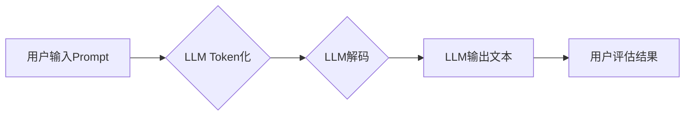

                 

## 1. 背景介绍

在人工智能领域，Prompt的设计与效果至关重要。Prompt可以被理解为与大型语言模型 (LLM) 交互的指令或提示，它直接影响着模型的输出结果。随着LLM技术的快速发展，Prompt工程逐渐成为一个独立的领域，并受到越来越多的关注。

传统的软件开发模式依赖于明确的代码指令，而LLM则更像一个强大的文本理解和生成引擎，需要通过精心设计的Prompt来引导其行为。一个好的Prompt能够有效地传达用户意图，引导模型生成高质量、符合预期结果的文本。反之，一个糟糕的Prompt可能会导致模型产生错误、模糊或不相关的输出。

## 2. 核心概念与联系

### 2.1  Prompt工程

Prompt工程是指设计、优化和评估与LLM交互的Prompt的过程。它是一个多学科交叉的领域，涉及自然语言处理、机器学习、软件工程等多个方面。

### 2.2  LLM的运作机制

LLM的工作原理是基于Transformer架构，通过学习海量文本数据，掌握语言的语法、语义和上下文关系。当用户输入一个Prompt时，LLM会将其分解成一系列的tokens，并根据其训练得到的知识和模式，预测下一个token，最终生成一段完整的文本。

### 2.3  Prompt与LLM交互流程



## 3. 核心算法原理 & 具体操作步骤

### 3.1  算法原理概述

Prompt工程的核心算法原理是基于自然语言处理和机器学习的知识。它利用语言模型的文本生成能力，通过设计不同的Prompt结构和策略，引导模型生成符合用户需求的文本。

### 3.2  算法步骤详解

1. **明确用户需求:** 首先要明确用户想要从LLM中获取什么信息或完成什么任务。
2. **设计Prompt结构:** 根据用户需求，设计一个清晰、简洁、易懂的Prompt结构。
3. **选择合适的LLM:** 选择一个适合任务类型的LLM模型。
4. **进行Prompt优化:** 通过调整Prompt的结构、内容和参数，不断优化模型的输出结果。
5. **评估Prompt效果:** 使用评估指标，例如BLEU、ROUGE等，评估Prompt的效果。

### 3.3  算法优缺点

**优点:**

* **灵活性:** Prompt工程可以灵活地调整Prompt结构和内容，以适应不同的任务需求。
* **可解释性:** Prompt的设计相对容易理解，可以帮助用户更好地理解模型的运作机制。
* **易于迭代:** Prompt工程是一个迭代的过程，可以通过不断调整Prompt来提高模型的性能。

**缺点:**

* **人工成本:** 设计和优化Prompt需要一定的专业知识和经验，人工成本较高。
* **模型依赖:** Prompt工程的性能很大程度上依赖于所选择的LLM模型。
* **黑盒问题:** 尽管Prompt的设计相对容易理解，但LLM的内部运作机制仍然是一个黑盒，难以完全解释模型的输出结果。

### 3.4  算法应用领域

Prompt工程在各个领域都有广泛的应用，例如：

* **自然语言生成:** 文本摘要、机器翻译、对话系统等。
* **代码生成:** 代码补全、代码翻译、代码注释等。
* **数据分析:** 文本分类、情感分析、主题提取等。
* **创意写作:** 故事创作、诗歌生成、剧本写作等。

## 4. 数学模型和公式 & 详细讲解 & 举例说明

### 4.1  数学模型构建

Prompt工程可以抽象为一个输入-输出映射关系，其中输入是Prompt，输出是LLM生成的文本。我们可以用数学模型来描述这个映射关系，例如：

$$
y = f(x; \theta)
$$

其中：

* $y$ 是LLM生成的文本
* $x$ 是输入的Prompt
* $f$ 是LLM的文本生成函数
* $\theta$ 是LLM模型的参数

### 4.2  公式推导过程

LLM的文本生成函数通常基于Transformer架构，其核心是自注意力机制和多头注意力机制。这些机制通过计算词之间的相关性，学习语言的上下文关系，从而生成更准确、更流畅的文本。

### 4.3  案例分析与讲解

例如，在机器翻译任务中，我们可以将源语言文本作为Prompt输入到LLM中，LLM会根据其训练得到的语言模型，将源语言文本翻译成目标语言文本。

## 5. 项目实践：代码实例和详细解释说明

### 5.1  开发环境搭建

为了进行Prompt工程实践，我们需要搭建一个开发环境，包括：

* **编程语言:** Python
* **深度学习框架:** TensorFlow或PyTorch
* **LLM模型库:** HuggingFace Transformers

### 5.2  源代码详细实现

```python
from transformers import pipeline

# 加载预训练的机器翻译模型
translator = pipeline("translation_en_to_fr", model="Helsinki-NLP/opus-mt-en-fr")

# 输入Prompt
prompt = "Hello, world!"

# 调用模型进行翻译
translation = translator(prompt)

# 打印翻译结果
print(translation[0]['translation_text'])
```

### 5.3  代码解读与分析

这段代码首先加载了一个预训练的英文到法文的机器翻译模型。然后，将"Hello, world!"作为Prompt输入到模型中，模型会根据其训练得到的知识，将英文文本翻译成法文文本。最后，打印翻译结果。

### 5.4  运行结果展示

```
Bonjour le monde!
```

## 6. 实际应用场景

Prompt工程在各个领域都有广泛的应用场景，例如：

### 6.1  聊天机器人

Prompt可以引导聊天机器人生成更自然、更符合用户意图的回复。

### 6.2  搜索引擎

Prompt可以帮助搜索引擎更好地理解用户搜索意图，并返回更相关的搜索结果。

### 6.3  教育领域

Prompt可以用于生成个性化的学习内容，帮助学生更好地理解知识。

### 6.4  未来应用展望

随着LLM技术的不断发展，Prompt工程的应用场景将会更加广泛，例如：

* **自动写作:** 生成新闻报道、小说、诗歌等各种类型的文本。
* **代码自动生成:** 根据用户需求自动生成代码。
* **个性化推荐:** 根据用户的喜好生成个性化的产品推荐。

## 7. 工具和资源推荐

### 7.1  学习资源推荐

* **书籍:**

    * "Prompt Engineering for Large Language Models" by  Bryan Catanzaro
    * "The Alignment Problem: Machine Learning and Human Values" by  Brian Christian

* **在线课程:**

    * Coursera: "Natural Language Processing Specialization"
    * edX: "Deep Learning"

### 7.2  开发工具推荐

* **HuggingFace Transformers:** 一个开源的LLM模型库，提供各种预训练模型和工具。
* **OpenAI API:** OpenAI提供了一个API，可以访问其强大的LLM模型，例如GPT-3。

### 7.3  相关论文推荐

* "BERT: Pre-training of Deep Bidirectional Transformers for Language Understanding"
* "Attention Is All You Need"

## 8. 总结：未来发展趋势与挑战

### 8.1  研究成果总结

Prompt工程是一个快速发展的领域，取得了显著的成果。通过精心设计的Prompt，可以有效地引导LLM生成高质量的文本，并将其应用于各个领域。

### 8.2  未来发展趋势

未来，Prompt工程的发展趋势包括：

* **自动化Prompt设计:** 开发自动化工具，帮助用户自动设计有效的Prompt。
* **跨模态Prompt:** 设计跨模态的Prompt，例如将文本、图像、音频等多种模态信息结合起来。
* **可解释性增强:** 研究更可解释的Prompt设计方法，帮助用户更好地理解模型的运作机制。

### 8.3  面临的挑战

Prompt工程也面临着一些挑战，例如：

* **Prompt的通用性:** 如何设计一个通用的Prompt，适用于不同的任务和领域。
* **Prompt的安全性:** 如何防止Prompt被恶意利用，生成有害的文本。
* **Prompt的公平性:** 如何设计公平的Prompt，避免模型产生偏见。

### 8.4  研究展望

未来，Prompt工程的研究将继续深入，探索更有效的Prompt设计方法，并将其应用于更多领域，推动人工智能技术的进步。

## 9. 附录：常见问题与解答

### 9.1  如何设计一个好的Prompt？

设计一个好的Prompt需要考虑以下几个因素：

* **明确用户需求:** 首先要明确用户想要从LLM中获取什么信息或完成什么任务。
* **简洁明了:** Prompt应该简洁明了，避免使用过于复杂的语言或语法。
* **提供足够的上下文:** 如果任务需要理解上下文信息，则需要在Prompt中提供足够的上下文。
* **避免歧义:** Prompt应该避免歧义，确保模型能够准确理解用户的意图。

### 9.2  如何评估Prompt的效果？

Prompt的效果可以通过以下指标进行评估：

* **BLEU:** 用于评估机器翻译质量的指标。
* **ROUGE:** 用于评估文本摘要质量的指标。
* **准确率:** 用于评估分类任务的指标。
* **召回率:** 用于评估检索任务的指标。

### 9.3  有哪些常用的Prompt技巧？

一些常用的Prompt技巧包括：

* **Zero-shot Prompting:** 直接使用原始Prompt，无需任何示例。
* **Few-shot Prompting:** 提供几个示例，引导模型学习任务模式。
* **Chain-of-Thought Prompting:** 鼓励模型进行推理，逐步生成解决方案。
* **Prompt Chaining:** 将多个Prompt串联起来，完成复杂的任务。


作者：禅与计算机程序设计艺术 / Zen and the Art of Computer Programming 
<end_of_turn>

