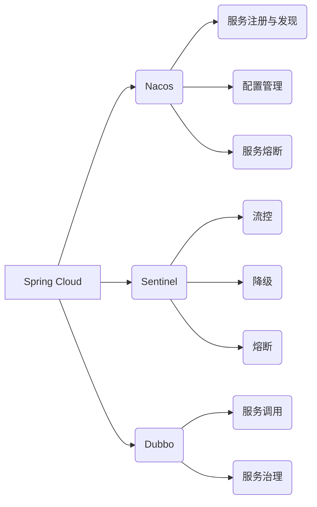

                 

## Spring Cloud Alibaba实践

> 关键词：Spring Cloud Alibaba, 微服务, 阿里巴巴, Nacos, Sentinel, Dubbo, Spring Boot

### 1. 背景介绍

随着互联网技术的快速发展，传统的单体架构已经难以满足现代应用的需求。微服务架构应运而生，它将大型应用程序拆分成多个小型、独立的服务，每个服务负责特定的业务功能。微服务架构具有高可扩展性、高可用性和高弹性等优点，但同时也带来了新的挑战，例如服务注册与发现、服务调用、服务治理等。

为了解决这些挑战，阿里巴巴推出了Spring Cloud Alibaba，这是一个基于Spring Cloud的微服务解决方案，它集成了阿里巴巴的成熟技术，例如Nacos、Sentinel、Dubbo等，帮助开发者快速构建和管理微服务应用。

### 2. 核心概念与联系

Spring Cloud Alibaba是一个基于Spring Cloud的微服务解决方案，它提供了丰富的组件和工具，帮助开发者构建和管理微服务应用。

#### 2.1 Spring Cloud

Spring Cloud是一个开源的微服务框架，它提供了丰富的组件和工具，帮助开发者快速构建和管理微服务应用。

#### 2.2 阿里巴巴技术

阿里巴巴拥有丰富的微服务实践经验，积累了大量的技术成果。Spring Cloud Alibaba将阿里巴巴的技术与Spring Cloud框架结合，提供了更完善的微服务解决方案。

#### 2.3 核心组件

Spring Cloud Alibaba主要包含以下核心组件：

* **Nacos:** 服务注册与发现、配置管理、服务熔断等功能。
* **Sentinel:** 流控、降级、熔断等功能。
* **Dubbo:** 服务调用、服务治理等功能。

**核心组件关系图:**



### 3. 核心算法原理 & 具体操作步骤

#### 3.1 算法原理概述

Spring Cloud Alibaba的核心算法原理主要体现在以下几个方面：

* **服务注册与发现:** Nacos使用一致性哈希算法将服务实例映射到不同的节点上，并提供服务发现机制，帮助客户端快速找到目标服务。
* **服务熔断:** Sentinel使用熔断算法，当服务出现故障时，会自动将请求流量熔断，防止服务链路崩溃。
* **服务调用:** Dubbo使用远程调用框架，提供服务调用、服务治理等功能。

#### 3.2 算法步骤详解

* **服务注册与发现:**

1. 服务提供者将自身信息注册到Nacos注册中心。
2. 服务消费者从Nacos注册中心获取目标服务信息。
3. 服务消费者根据服务信息连接到目标服务提供者。

* **服务熔断:**

1. Sentinel监控服务健康状态。
2. 当服务出现故障时，Sentinel会触发熔断机制。
3. 熔断机制会阻止请求流量流向故障服务，并返回熔断提示信息。

* **服务调用:**

1. 服务消费者调用目标服务接口。
2. Dubbo框架负责将请求转发到目标服务提供者。
3. 服务提供者处理请求并返回结果。

#### 3.3 算法优缺点

* **服务注册与发现:**

    * **优点:** 简化服务发现过程，提高服务可用性。
    * **缺点:** 需要依赖注册中心，存在单点故障风险。

* **服务熔断:**

    * **优点:** 防止服务链路崩溃，提高系统稳定性。
    * **缺点:** 可能导致部分请求被拒绝，影响用户体验。

* **服务调用:**

    * **优点:** 简化服务调用过程，提高开发效率。
    * **缺点:** 需要依赖Dubbo框架，增加系统复杂度。

#### 3.4 算法应用领域

Spring Cloud Alibaba的算法原理和组件广泛应用于以下领域：

* **电商平台:** 商品推荐、订单处理、支付系统等。
* **金融系统:** 交易处理、风险控制、用户管理等。
* **社交平台:** 用户关系维护、消息推送、内容推荐等。

### 4. 数学模型和公式 & 详细讲解 & 举例说明

#### 4.1 数学模型构建

Nacos的服务注册与发现机制可以抽象为一个图论模型，其中服务实例作为节点，服务之间的依赖关系作为边。

#### 4.2 公式推导过程

一致性哈希算法可以用于将服务实例映射到不同的节点上，其核心公式如下：

```latex
h(key) = hash(key) % N
```

其中：

* `key` 是服务实例的唯一标识符。
* `hash(key)` 是哈希函数的结果。
* `N` 是节点总数。

#### 4.3 案例分析与讲解

假设有三个服务实例A、B、C，以及两个节点N1、N2。

使用一致性哈希算法，可以将服务实例映射到节点上，例如：

* `h(A) = 1`，因此A映射到N1。
* `h(B) = 3`，因此B映射到N2。
* `h(C) = 2`，因此C映射到N1。

### 5. 项目实践：代码实例和详细解释说明

#### 5.1 开发环境搭建

* JDK 8 或以上
* Maven 或 Gradle
* Spring Boot 2.x

#### 5.2 源代码详细实现

```java
// Nacos服务注册配置
@Configuration
public class NacosConfig {

    @Bean
    public DiscoveryClientConfig discoveryClientConfig() {
        return new DiscoveryClientConfig();
    }
}

// 服务提供者
@Service
public class MyService {

    @Value("${server.port}")
    private String port;

    public String hello(String name) {
        return "Hello " + name + ", from port: " + port;
    }
}

// 服务消费者
@Service
public class MyConsumer {

    @Autowired
    private DiscoveryClient discoveryClient;

    public String callService(String name) {
        List<ServiceInstance> instances = discoveryClient.getInstances("my-service");
        if (instances.isEmpty()) {
            return "Service not found";
        }
        ServiceInstance instance = instances.get(0);
        String url = "http://" + instance.getHost() + ":" + instance.getPort() + "/hello";
        RestTemplate restTemplate = new RestTemplate();
        return restTemplate.getForObject(url, String.class, name);
    }
}
```

#### 5.3 代码解读与分析

* Nacos服务注册配置：使用`DiscoveryClientConfig`配置Nacos服务注册中心。
* 服务提供者：使用`@Service`注解标记服务类，并提供`hello`方法。
* 服务消费者：使用`DiscoveryClient`获取服务实例列表，并调用服务提供者的`hello`方法。

#### 5.4 运行结果展示

启动服务提供者和服务消费者，使用服务消费者调用服务提供者的`hello`方法，即可看到服务调用成功的结果。

### 6. 实际应用场景

Spring Cloud Alibaba在实际应用场景中具有广泛的应用价值，例如：

* **电商平台:**

    * 商品推荐系统：使用Nacos注册商品服务，并通过Sentinel进行流控和熔断，保证推荐系统的稳定性和可用性。
    * 订单处理系统：使用Dubbo进行服务调用，实现订单创建、支付、发货等业务流程的协同处理。

* **金融系统:**

    * 交易处理系统：使用Sentinel进行流控和熔断，防止交易系统出现异常情况。
    * 风险控制系统：使用Nacos进行配置管理，方便快速调整风险控制策略。

### 7. 工具和资源推荐

#### 7.1 学习资源推荐

* Spring Cloud Alibaba官方文档：https://spring.io/projects/spring-cloud-alibaba
* Spring Cloud Alibaba GitHub仓库：https://github.com/spring-cloud/spring-cloud-alibaba

#### 7.2 开发工具推荐

* IntelliJ IDEA
* Eclipse

#### 7.3 相关论文推荐

* Spring Cloud Alibaba: A Microservices Solution Based on Spring Cloud
* Nacos: A Service Discovery and Configuration Management Platform

### 8. 总结：未来发展趋势与挑战

#### 8.1 研究成果总结

Spring Cloud Alibaba是一个成熟的微服务解决方案，它集成了阿里巴巴的丰富技术经验，为开发者提供了便捷的微服务构建和管理工具。

#### 8.2 未来发展趋势

* **更完善的微服务治理:** Spring Cloud Alibaba将继续加强微服务治理功能，例如服务监控、服务日志、服务追踪等。
* **更强大的安全防护:** Spring Cloud Alibaba将加强微服务安全防护功能，例如身份认证、权限控制、数据加密等。
* **更丰富的生态系统:** Spring Cloud Alibaba将继续吸引更多开发者和生态伙伴，构建更丰富的微服务生态系统。

#### 8.3 面临的挑战

* **技术复杂性:** 微服务架构本身具有较高的技术复杂性，需要开发者具备较强的技术能力。
* **运维成本:** 微服务架构的运维成本较高，需要专业的运维团队进行管理。
* **跨团队协作:** 微服务架构需要多个团队协同开发和维护，需要加强跨团队协作机制。

#### 8.4 研究展望

未来，Spring Cloud Alibaba将继续朝着更完善、更强大的方向发展，为开发者提供更便捷、更安全的微服务解决方案。


### 9. 附录：常见问题与解答

#### 9.1 如何配置Nacos服务注册中心？

#### 9.2 如何使用Sentinel进行流控和熔断？

#### 9.3 如何使用Dubbo进行服务调用？


作者：禅与计算机程序设计艺术 / Zen and the Art of Computer Programming 
<end_of_turn>

