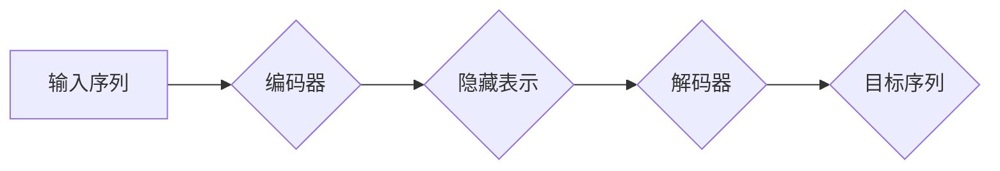

                 

## Transformer架构：GPT-2模型剖析

> 关键词：Transformer, GPT-2, 自然语言处理, 序列到序列, self-attention,  BERT, 预训练语言模型

## 1. 背景介绍

近年来，深度学习在自然语言处理 (NLP) 领域取得了显著进展。传统的循环神经网络 (RNN) 在处理长序列文本时存在效率和梯度消失问题。为了克服这些限制，Google于2017年提出了 Transformer 架构，它彻底改变了 NLP 的发展方向。Transformer 摒弃了 RNN 的循环结构，采用了一种全新的注意力机制 (Attention) 来捕捉序列中的长距离依赖关系。

GPT-2 是由 OpenAI 在 2019 年发布的基于 Transformer 架构的强大预训练语言模型。它在文本生成、机器翻译、问答系统等任务上表现出色，并展现了预训练语言模型在 NLP 领域巨大的潜力。

## 2. 核心概念与联系

### 2.1 Transformer 架构

Transformer 架构由编码器 (Encoder) 和解码器 (Decoder) 两部分组成。

* **编码器:** 用于将输入序列映射到一个隐藏表示。它由多个相同的 Transformer 块堆叠而成，每个 Transformer 块包含多头自注意力 (Multi-Head Self-Attention) 和前馈神经网络 (Feed-Forward Network)。
* **解码器:** 用于根据编码器的输出生成目标序列。它也由多个 Transformer 块堆叠而成，每个 Transformer 块包含多头自注意力和跨注意力 (Multi-Head Cross-Attention) 机制。

### 2.2  注意力机制

注意力机制是 Transformer 架构的核心，它允许模型关注输入序列中与当前任务最相关的部分。

* **自注意力 (Self-Attention):**  计算每个词与所有其他词之间的相关性，并生成一个加权表示，突出重要的信息。
* **跨注意力 (Cross-Attention):** 计算编码器输出与解码器输入之间的相关性，帮助解码器理解上下文信息。

### 2.3 Mermaid 流程图



## 3. 核心算法原理 & 具体操作步骤

### 3.1 算法原理概述

Transformer 的核心算法是基于注意力机制的多头自注意力和跨注意力机制。

* **多头自注意力:** 将自注意力机制扩展到多个头，每个头学习不同的方面的信息，并通过拼接和线性变换得到最终的输出。
* **跨注意力:**  允许解码器关注编码器输出中的所有信息，从而更好地理解上下文。

### 3.2 算法步骤详解

1. **词嵌入:** 将输入序列中的每个词转换为稠密的向量表示。
2. **多头自注意力:** 对每个词进行多头自注意力计算，得到每个词与所有其他词之间的相关性。
3. **前馈神经网络:** 对每个词的注意力输出进行非线性变换，得到更丰富的特征表示。
4. **位置编码:**  由于 Transformer 忽略了词的顺序信息，需要添加位置编码来恢复词的顺序信息。
5. **跨注意力:** 解码器使用跨注意力机制关注编码器输出，理解上下文信息。
6. **解码器输出:** 解码器生成目标序列，每个词的输出是所有词的注意力加权和。

### 3.3 算法优缺点

**优点:**

* 能够有效捕捉长距离依赖关系。
* 并行计算能力强，训练速度快。
* 在各种 NLP 任务上表现出色。

**缺点:**

* 参数量大，需要大量的计算资源。
* 对训练数据要求较高。

### 3.4 算法应用领域

* 文本生成
* 机器翻译
* 问答系统
* 文本摘要
* 代码生成

## 4. 数学模型和公式 & 详细讲解 & 举例说明

### 4.1 数学模型构建

Transformer 的核心是多头自注意力机制和跨注意力机制。

**4.1.1 多头自注意力机制**

多头自注意力机制可以看作是多个头自注意力机制的并行组合。每个头学习不同的方面的信息，并通过拼接和线性变换得到最终的输出。

**公式:**

$$
Attention(Q, K, V) = softmax(\frac{QK^T}{\sqrt{d_k}})V
$$

其中：

* $Q$：查询矩阵
* $K$：键矩阵
* $V$：值矩阵
* $d_k$：键向量的维度
* $softmax$：softmax 函数

**4.1.2 跨注意力机制**

跨注意力机制允许解码器关注编码器输出中的所有信息。

**公式:**

$$
Attention(Q, K, V) = softmax(\frac{Q K^T}{\sqrt{d_k}})V
$$

其中：

* $Q$：解码器输出的查询矩阵
* $K$：编码器输出的键矩阵
* $V$：编码器输出的值矩阵

**4.1.3 多头机制**

多头机制将多个头自注意力机制并行组合，并通过拼接和线性变换得到最终的输出。

**公式:**

$$
MultiHead(Q, K, V) = Concat(head_1, head_2, ..., head_h)W^O
$$

其中：

* $head_1, head_2, ..., head_h$：多个头自注意力机制的输出
* $W^O$：线性变换矩阵

### 4.2 公式推导过程

公式推导过程可以参考 Transformer 原文论文。

### 4.3 案例分析与讲解

可以以 GPT-2 在文本生成任务上的应用为例，分析 Transformer 架构和注意力机制如何工作。

## 5. 项目实践：代码实例和详细解释说明

### 5.1 开发环境搭建

使用 Python 3.6 或更高版本，安装 TensorFlow 或 PyTorch 等深度学习框架。

### 5.2 源代码详细实现

可以使用 HuggingFace 库加载预训练的 GPT-2 模型，并进行文本生成任务。

```python
from transformers import GPT2LMHeadModel, GPT2Tokenizer

# 加载预训练模型和词典
model_name = "gpt2"
tokenizer = GPT2Tokenizer.from_pretrained(model_name)
model = GPT2LMHeadModel.from_pretrained(model_name)

# 输入文本
input_text = "The quick brown fox jumps over the"

# Token化输入文本
input_ids = tokenizer.encode(input_text, return_tensors="pt")

# 生成文本
output = model.generate(input_ids, max_length=50)

# 解码输出文本
generated_text = tokenizer.decode(output[0], skip_special_tokens=True)

# 打印生成文本
print(generated_text)
```

### 5.3 代码解读与分析

* 使用 HuggingFace 库加载预训练模型和词典。
* Token化输入文本，将文本转换为模型可以理解的格式。
* 使用 `model.generate()` 函数生成文本。
* 解码输出文本，将模型输出的 token 转换为人类可读的文本。

### 5.4 运行结果展示

运行代码后，将输出一个基于输入文本生成的续写文本。

## 6. 实际应用场景

GPT-2 在各种实际应用场景中取得了成功，例如：

* **文本生成:**  生成小说、诗歌、剧本等创意文本。
* **机器翻译:**  将文本从一种语言翻译成另一种语言。
* **问答系统:**  根据给定的问题生成相应的答案。
* **文本摘要:**  生成文本的简短摘要。
* **代码生成:**  根据自然语言描述生成代码。

### 6.4 未来应用展望

GPT-2 的未来应用前景广阔，例如：

* **个性化教育:**  根据学生的学习进度和风格定制个性化学习内容。
* **智能客服:**  提供更智能、更人性化的客户服务体验。
* **创意写作辅助:**  帮助作家克服写作瓶颈，激发创作灵感。

## 7. 工具和资源推荐

### 7.1 学习资源推荐

* **Transformer 原文论文:** https://arxiv.org/abs/1706.03762
* **HuggingFace 库文档:** https://huggingface.co/docs/transformers/index

### 7.2 开发工具推荐

* **TensorFlow:** https://www.tensorflow.org/
* **PyTorch:** https://pytorch.org/

### 7.3 相关论文推荐

* **BERT:** https://arxiv.org/abs/1810.04805
* **XLNet:** https://arxiv.org/abs/1906.08237

## 8. 总结：未来发展趋势与挑战

### 8.1 研究成果总结

Transformer 架构和预训练语言模型在 NLP 领域取得了巨大进展，为自然语言理解和生成提供了新的思路和方法。

### 8.2 未来发展趋势

* **模型规模更大:** 预训练模型的规模将继续扩大，从而提升模型的性能。
* **多模态学习:** 预训练模型将融合文本、图像、音频等多模态数据，实现更全面的理解和生成。
* **可解释性增强:** 研究如何提高预训练模型的可解释性，帮助人们更好地理解模型的决策过程。

### 8.3 面临的挑战

* **计算资源需求:** 大型预训练模型的训练和部署需要大量的计算资源，这对于资源有限的机构和个人来说是一个挑战。
* **数据偏见:** 预训练模型的训练数据可能存在偏见，导致模型输出存在偏差。
* **伦理问题:** 预训练模型的应用可能引发一些伦理问题，例如信息操纵、隐私泄露等。

### 8.4 研究展望

未来研究将集中在解决上述挑战，并探索预训练模型在更多领域的新应用。

## 9. 附录：常见问题与解答

* **Transformer 和 RNN 的区别是什么？**

Transformer 摒弃了 RNN 的循环结构，采用注意力机制来捕捉序列中的长距离依赖关系，具有更快的训练速度和更好的并行计算能力。

* **GPT-2 是如何训练的？**

GPT-2 使用无监督学习方法，在大量的文本数据上进行预训练。

* **如何使用 GPT-2 进行文本生成？**

可以使用 HuggingFace 库加载预训练的 GPT-2 模型，并使用 `model.generate()` 函数进行文本生成。


作者：禅与计算机程序设计艺术 / Zen and the Art of Computer Programming 
<end_of_turn>

