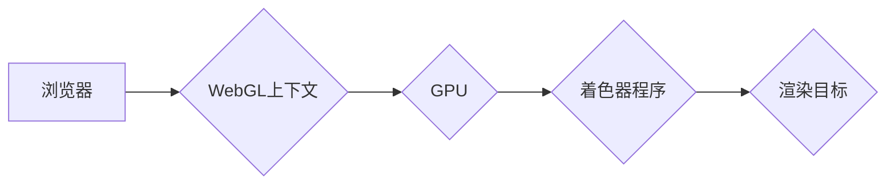

                 

## WebGL：浏览器中的3D图形渲染

> 关键词：WebGL, 3D图形渲染, 浏览器, GPU, shaders, OpenGL ES, WebAssembly

## 1. 背景介绍

随着互联网技术的不断发展，网页不再仅仅局限于静态文本和图片，而是逐渐向更具交互性和沉浸感的体验方向演进。3D图形渲染技术作为一种重要的视觉表现形式，为网页带来了全新的可能性。然而，传统的3D图形渲染引擎通常依赖于独立的应用程序，难以直接嵌入到网页环境中。

WebGL（Web Graphics Library）应运而生，它是一种基于浏览器的3D图形渲染API，允许网页开发者利用浏览器自带的GPU（图形处理单元）进行3D图形的绘制和交互。WebGL的出现，极大地降低了网页开发3D图形的难度，为网页游戏、虚拟现实、增强现实等领域提供了强大的技术支持。

## 2. 核心概念与联系

WebGL的核心概念是将OpenGL ES（OpenGL Embedded Systems）的3D图形渲染功能封装成一个JavaScript API，使得网页开发者能够直接调用OpenGL ES的函数，控制GPU进行图形渲染。

**WebGL架构**



**核心概念解释:**

* **浏览器:** WebGL运行在用户的浏览器环境中，负责提供WebGL上下文和与GPU的通信桥梁。
* **WebGL上下文:** WebGL上下文是WebGL程序运行的入口，开发者通过它来访问GPU资源和控制渲染过程。
* **GPU:** 图形处理单元，负责执行WebGL程序中的着色器程序，并最终将图形渲染到屏幕上。
* **着色器程序:** WebGL程序的核心，由开发者编写，负责计算每个像素的颜色和属性。
* **渲染目标:** WebGL程序渲染的目标，可以是屏幕、纹理、帧缓冲区等。

## 3. 核心算法原理 & 具体操作步骤

### 3.1  算法原理概述

WebGL的3D图形渲染基于**管线模型**，将图形渲染过程分为多个阶段，每个阶段执行特定的算法。

**管线模型阶段:**

1. **顶点着色:** 将顶点坐标、颜色等属性进行变换和处理。
2. **裁剪:** 将超出视窗范围的顶点剔除。
3. **投影:** 将3D空间中的顶点投影到2D平面上。
4. **片段着色:** 计算每个像素的颜色和属性。
5. **混合:** 将渲染结果与之前渲染的图像进行混合。
6. **输出:** 将最终渲染结果输出到屏幕上。

### 3.2  算法步骤详解

**顶点着色:**

1. 将顶点坐标从世界坐标系变换到模型坐标系。
2. 将顶点坐标从模型坐标系变换到相机坐标系。
3. 将顶点坐标从相机坐标系变换到屏幕坐标系。
4. 计算顶点颜色和纹理坐标。

**片段着色:**

1. 计算每个像素的颜色和属性。
2. 根据混合模式与之前渲染的图像进行混合。

### 3.3  算法优缺点

**优点:**

* **高效:** 利用GPU的并行计算能力，可以快速渲染大量图形。
* **灵活:** 提供丰富的API，可以实现各种复杂的图形效果。
* **开源:** WebGL是一个开源标准，可以被任何浏览器支持。

**缺点:**

* **学习曲线陡峭:** WebGL的API比较复杂，需要一定的编程基础和图形学知识。
* **性能受限:** WebGL的性能受限于浏览器和GPU的硬件能力。

### 3.4  算法应用领域

* **网页游戏:** WebGL可以用于开发各种类型的网页游戏，例如3D射击游戏、角色扮演游戏等。
* **虚拟现实:** WebGL可以用于构建虚拟现实体验，例如360度全景视频、虚拟旅游等。
* **增强现实:** WebGL可以用于增强现实体验，例如将虚拟物体叠加到现实世界中。
* **数据可视化:** WebGL可以用于创建交互式的3D数据可视化，例如地图、图表等。

## 4. 数学模型和公式 & 详细讲解 & 举例说明

### 4.1  数学模型构建

WebGL的3D图形渲染基于**矩阵变换**和**向量运算**。

**矩阵变换:**

* **模型变换:** 将物体从世界坐标系变换到模型坐标系。
* **视图变换:** 将物体从模型坐标系变换到相机坐标系。
* **投影变换:** 将物体从相机坐标系变换到屏幕坐标系。

**向量运算:**

* **点积:** 计算两个向量的点积。
* **叉积:** 计算两个向量的叉积。
* **向量加减:** 对向量进行加减运算。

### 4.2  公式推导过程

**模型变换矩阵:**

```latex
M = \begin{bmatrix}
s_x & 0 & 0 & t_x \\
0 & s_y & 0 & t_y \\
0 & 0 & s_z & t_z \\
0 & 0 & 0 & 1
\end{bmatrix}
```

其中，$s_x$, $s_y$, $s_z$ 分别为物体在x、y、z轴上的缩放因子，$t_x$, $t_y$, $t_z$ 分别为物体在x、y、z轴上的平移量。

**视图变换矩阵:**

```latex
V = \begin{bmatrix}
1 & 0 & 0 & 0 \\
0 & 1 & 0 & 0 \\
0 & 0 & 1 & 0 \\
0 & 0 & 0 & 1
\end{bmatrix}
```

其中，$V$ 是一个单位矩阵，表示物体在相机坐标系下的位置不变。

**投影变换矩阵:**

```latex
P = \begin{bmatrix}
2/w & 0 & 0 & 0 \\
0 & 2/h & 0 & 0 \\
0 & 0 & -2/d & 0 \\
0 & 0 & -1 & 1
\end{bmatrix}
```

其中，$w$ 和 $h$ 分别为屏幕的宽度和高度，$d$ 为视椎体的深度。

### 4.3  案例分析与讲解

**示例:**

假设有一个物体在世界坐标系中位于(1, 2, 3)处，需要将其渲染到屏幕上。

1. **模型变换:** 使用模型变换矩阵将物体从世界坐标系变换到模型坐标系。
2. **视图变换:** 使用视图变换矩阵将物体从模型坐标系变换到相机坐标系。
3. **投影变换:** 使用投影变换矩阵将物体从相机坐标系变换到屏幕坐标系。
4. **顶点着色:** 将变换后的顶点坐标传递给顶点着色器程序，进行颜色和纹理坐标的计算。
5. **片段着色:** 将片段着色器程序计算出的颜色和属性传递给片段着色器程序，最终渲染到屏幕上。

## 5. 项目实践：代码实例和详细解释说明

### 5.1  开发环境搭建

* **浏览器:** 支持WebGL的现代浏览器，例如Chrome、Firefox、Safari等。
* **代码编辑器:** 任何支持JavaScript的代码编辑器，例如VS Code、Sublime Text等。

### 5.2  源代码详细实现

```javascript
// 获取WebGL上下文
const canvas = document.getElementById('canvas');
const gl = canvas.getContext('webgl');

// 设置清除颜色
gl.clearColor(0.0, 0.0, 0.0, 1.0);

// 清除屏幕
gl.clear(gl.COLOR_BUFFER_BIT);

// ... 其他代码 ...
```

### 5.3  代码解读与分析

* `canvas.getContext('webgl')`: 获取WebGL上下文，用于控制GPU渲染。
* `gl.clearColor(0.0, 0.0, 0.0, 1.0)`: 设置清除颜色为黑色。
* `gl.clear(gl.COLOR_BUFFER_BIT)`: 清除屏幕，将屏幕颜色设置为黑色。

### 5.4  运行结果展示

运行上述代码，将显示一个黑色的屏幕。

## 6. 实际应用场景

### 6.1  网页游戏

WebGL可以用于开发各种类型的网页游戏，例如3D射击游戏、角色扮演游戏等。

### 6.2  虚拟现实

WebGL可以用于构建虚拟现实体验，例如360度全景视频、虚拟旅游等。

### 6.3  增强现实

WebGL可以用于增强现实体验，例如将虚拟物体叠加到现实世界中。

### 6.4  未来应用展望

随着WebAssembly的出现，WebGL的性能将得到进一步提升，未来将有更多更复杂的3D图形应用场景。

## 7. 工具和资源推荐

### 7.1  学习资源推荐

* **WebGL官方文档:** https://www.khronos.org/registry/webgl/specs/latest/
* **Mozilla Developer Network (MDN) WebGL教程:** https://developer.mozilla.org/en-US/docs/Web/API/WebGL_API
* **WebGL Fundamentals:** https://webglfundamentals.org/

### 7.2  开发工具推荐

* **Three.js:** https://threejs.org/
* **Babylon.js:** https://www.babylonjs.com/

### 7.3  相关论文推荐

* **WebGL: A 3D Graphics API for the Web:** https://www.khronos.org/registry/webgl/specs/latest/webgl.pdf

## 8. 总结：未来发展趋势与挑战

### 8.1  研究成果总结

WebGL已经成为一种成熟的3D图形渲染技术，为网页开发带来了强大的功能和可能性。

### 8.2  未来发展趋势

* **性能提升:** WebAssembly的引入将进一步提升WebGL的性能。
* **更丰富的功能:** WebGL标准将不断完善，添加更多新的功能和特性。
* **更广泛的应用:** WebGL将应用于更多领域，例如教育、医疗、设计等。

### 8.3  面临的挑战

* **学习曲线:** WebGL的API比较复杂，需要一定的编程基础和图形学知识。
* **浏览器兼容性:** 不同浏览器的WebGL实现可能存在差异，需要进行兼容性测试。
* **硬件限制:** WebGL的性能受限于浏览器和GPU的硬件能力。

### 8.4  研究展望

未来，WebGL的研究方向将集中在提升性能、完善功能、降低学习门槛等方面。


## 9. 附录：常见问题与解答

* **Q: WebGL是否需要安装额外的软件？**

A: 不需要，WebGL是基于浏览器的API，无需安装任何额外的软件。

* **Q: WebGL的性能如何？**

A: WebGL的性能受限于浏览器和GPU的硬件能力，但已经可以实现相当复杂的3D图形渲染。

* **Q: 如何学习WebGL？**

A: 可以参考WebGL官方文档、Mozilla Developer Network (MDN) WebGL教程、WebGL Fundamentals等资源。


作者：禅与计算机程序设计艺术 / Zen and the Art of Computer Programming 
<end_of_turn>

