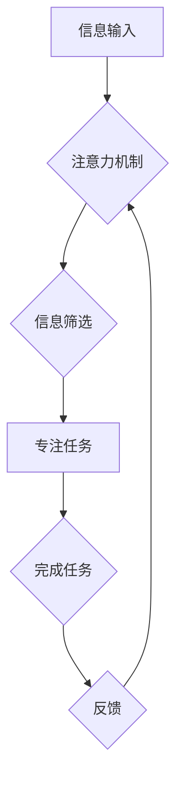

                 

## 人类注意力增强：提升专注力和减少分心

> 关键词：注意力、专注力、分心、深度学习、神经网络、脑机接口、增强现实、虚拟现实

## 1. 背景介绍

在当今信息爆炸的时代，人类面临着前所未有的注意力挑战。来自社交媒体、电子邮件、新闻推送等各种信息源的不断干扰，使得我们难以集中精力完成任务，学习新知识，甚至享受生活。注意力力的下降不仅影响个人效率和生活质量，也对社会生产力和创新能力造成负面影响。

注意力增强技术旨在通过技术手段帮助人们提升专注力，减少分心，从而提高工作效率和生活质量。近年来，随着人工智能、脑科学、生物工程等领域的快速发展，注意力增强技术取得了显著进展。

## 2. 核心概念与联系

### 2.1 注意力机制

注意力机制是深度学习领域的重要组成部分，它能够帮助模型聚焦于输入数据中最重要的部分，从而提高学习效率和准确性。注意力机制的灵感来源于人类的注意力机制，它能够根据任务需求和上下文信息，选择性地关注输入数据中的特定信息。

### 2.2 人脑注意力

人类的注意力是一个复杂的神经过程，涉及多个脑区协同工作。前额叶皮层、顶叶皮层、颞叶皮层等脑区都参与到注意力机制的调节和控制中。

### 2.3 注意力增强技术

注意力增强技术通过模拟或增强人类的注意力机制，帮助人们提升专注力。常见的注意力增强技术包括：

* **软件辅助:** 利用软件工具屏蔽干扰信息，提供专注时间管理功能，帮助用户集中注意力。
* **硬件辅助:** 利用脑机接口技术，实时监测用户的脑电波，根据脑电信号的变化调整环境刺激，帮助用户保持专注状态。
* **生物反馈训练:** 通过生物反馈技术，帮助用户了解自己的注意力状态，并通过训练提高注意力控制能力。

**Mermaid 流程图**



## 3. 核心算法原理 & 具体操作步骤

### 3.1 算法原理概述

注意力机制的核心原理是通过一个加权机制，将输入数据中的不同部分赋予不同的权重，从而突出重要信息。常见的注意力机制类型包括：

* **自注意力机制:**  用于处理序列数据，能够捕捉序列中不同元素之间的关系。
* **交叉注意力机制:** 用于处理多个序列数据，能够捕捉不同序列之间的关系。

### 3.2 算法步骤详解

1. **输入数据:** 将需要处理的数据输入到注意力机制中。
2. **查询、键、值矩阵:** 将输入数据转换为查询 (query)、键 (key) 和值 (value) 三个矩阵。
3. **注意力权重计算:** 计算查询矩阵与键矩阵之间的相似度，得到注意力权重。
4. **加权求和:** 将值矩阵与注意力权重进行加权求和，得到输出结果。

### 3.3 算法优缺点

**优点:**

* 能够有效地捕捉输入数据中的重要信息。
* 能够处理长序列数据。
* 能够并行计算，提高效率。

**缺点:**

* 计算复杂度较高。
* 训练数据量较大。

### 3.4 算法应用领域

注意力机制广泛应用于自然语言处理、计算机视觉、语音识别等领域。例如，在机器翻译中，注意力机制可以帮助模型关注源语言和目标语言之间的关键信息，提高翻译质量。

## 4. 数学模型和公式 & 详细讲解 & 举例说明

### 4.1 数学模型构建

注意力机制的数学模型可以表示为以下公式：

$$
\text{Attention}(Q, K, V) = \text{softmax}\left(\frac{Q K^T}{\sqrt{d_k}}\right) V
$$

其中：

* $Q$：查询矩阵
* $K$：键矩阵
* $V$：值矩阵
* $d_k$：键向量的维度
* $\text{softmax}$：softmax函数，用于将注意力权重归一化

### 4.2 公式推导过程

注意力权重计算公式的推导过程如下：

1. 计算查询矩阵 $Q$ 与键矩阵 $K$ 的点积：

$$
QK^T
$$

2. 对点积结果进行缩放，以防止梯度爆炸：

$$
\frac{QK^T}{\sqrt{d_k}}
$$

3. 应用 softmax 函数对缩放后的结果进行归一化，得到注意力权重：

$$
\text{softmax}\left(\frac{QK^T}{\sqrt{d_k}}\right)
$$

4. 将注意力权重与值矩阵 $V$ 进行加权求和，得到输出结果：

$$
\text{Attention}(Q, K, V) = \text{softmax}\left(\frac{QK^T}{\sqrt{d_k}}\right) V
$$

### 4.3 案例分析与讲解

假设我们有一个句子 "我爱学习编程"，我们想要使用注意力机制来找出句子中最重要的词语。

我们可以将句子中的每个词语作为一个向量，并将其转换为查询矩阵 $Q$、键矩阵 $K$ 和值矩阵 $V$。然后，我们可以使用注意力机制计算每个词语的注意力权重，并根据权重加权求和得到输出结果。

通过分析注意力权重，我们可以发现 "学习" 和 "编程" 两个词语的注意力权重较高，说明它们是句子中最重要的词语。

## 5. 项目实践：代码实例和详细解释说明

### 5.1 开发环境搭建

* Python 3.7+
* TensorFlow 2.0+
* PyTorch 1.0+

### 5.2 源代码详细实现

```python
import tensorflow as tf

# 定义注意力机制
def attention_mechanism(query, key, value, mask=None):
    # 计算注意力权重
    attention_weights = tf.matmul(query, key, transpose_b=True) / tf.math.sqrt(tf.cast(key.shape[-1], tf.float32))
    if mask is not None:
        attention_weights = attention_weights + (1 - mask) * -1e9
    attention_weights = tf.nn.softmax(attention_weights, axis=-1)
    # 计算加权求和
    output = tf.matmul(attention_weights, value)
    return output, attention_weights

# 示例代码
query = tf.random.normal([32, 10, 64])
key = tf.random.normal([32, 10, 64])
value = tf.random.normal([32, 10, 128])

output, attention_weights = attention_mechanism(query, key, value)
print(output.shape)
print(attention_weights.shape)
```

### 5.3 代码解读与分析

* `attention_mechanism()` 函数定义了注意力机制的核心逻辑。
* `tf.matmul()` 函数用于计算矩阵乘法。
* `tf.math.sqrt()` 函数用于计算平方根。
* `tf.nn.softmax()` 函数用于计算 softmax 函数。
* `mask` 参数用于屏蔽不需要关注的信息。

### 5.4 运行结果展示

运行上述代码后，会输出注意力机制的输出结果和注意力权重。

## 6. 实际应用场景

### 6.1  学习场景

注意力增强技术可以帮助学生集中注意力，提高学习效率。例如，一些学习软件可以利用注意力机制屏蔽干扰信息，提供专注时间管理功能，帮助学生更好地理解和记忆知识。

### 6.2  工作场景

注意力增强技术可以帮助职场人士提高工作效率，减少分心。例如，一些办公软件可以利用注意力机制屏蔽通知和邮件，帮助用户专注于当前的任务。

### 6.3  游戏场景

注意力增强技术可以提升游戏体验，增强玩家的沉浸感。例如，一些游戏可以使用注意力机制来调整游戏画面和音效，根据玩家的注意力状态提供不同的游戏体验。

### 6.4  未来应用展望

注意力增强技术在未来将有更广泛的应用场景，例如：

* **医疗保健:** 帮助患者集中注意力，提高治疗效果。
* **教育:** 个性化学习，提高学习效率。
* **交通安全:** 帮助驾驶员集中注意力，减少交通事故。

## 7. 工具和资源推荐

### 7.1 学习资源推荐

* **书籍:**
    * 《深度学习》
    * 《注意力机制》
* **在线课程:**
    * Coursera: 深度学习
    * Udacity: 自然语言处理

### 7.2 开发工具推荐

* **TensorFlow:** 开源深度学习框架
* **PyTorch:** 开源深度学习框架
* **Keras:** 高级深度学习API

### 7.3 相关论文推荐

* 《Attention Is All You Need》
* 《BERT: Pre-training of Deep Bidirectional Transformers for Language Understanding》

## 8. 总结：未来发展趋势与挑战

### 8.1 研究成果总结

注意力机制在人工智能领域取得了显著进展，并在自然语言处理、计算机视觉等领域取得了优异的性能。

### 8.2 未来发展趋势

* **更有效的注意力机制:** 研究更有效的注意力机制，提高注意力机制的效率和准确性。
* **跨模态注意力机制:** 研究跨模态注意力机制，能够处理不同模态的数据，例如文本、图像、音频等。
* **可解释性注意力机制:** 研究可解释性注意力机制，能够解释注意力机制是如何工作的，提高用户对注意力机制的理解和信任。

### 8.3 面临的挑战

* **计算复杂度:** 现有的注意力机制计算复杂度较高，难以应用于大规模数据处理。
* **数据依赖性:** 注意力机制的性能依赖于训练数据的质量，缺乏高质量训练数据的限制了注意力机制的应用。
* **伦理问题:** 注意力增强技术可能被用于操纵用户行为，需要关注其伦理问题。

### 8.4 研究展望

未来，注意力增强技术将继续发展，并应用于更多领域。研究人员将致力于开发更有效的、更可解释的、更安全的注意力增强技术，帮助人们更好地集中注意力，提高生活和工作效率。

## 9. 附录：常见问题与解答

**Q1: 注意力增强技术有哪些风险？**

**A1:** 注意力增强技术可能被用于操纵用户行为，例如，通过不断推送信息，让人们沉迷于网络，无法专注于现实生活。此外，过度使用注意力增强技术可能会导致注意力疲劳，降低用户的注意力能力。

**Q2: 如何选择合适的注意力增强技术？**

**A2:** 选择合适的注意力增强技术需要根据用户的需求和场景进行选择。例如，对于学生来说，可以考虑使用屏蔽干扰信息、提供专注时间管理功能的学习软件；对于职场人士来说，可以考虑使用屏蔽通知和邮件、帮助用户专注于当前任务的办公软件。

**Q3: 注意力增强技术的发展前景如何？**

**A3:** 注意力增强技术的发展前景广阔，未来将应用于更多领域，例如医疗保健、教育、交通安全等。随着人工智能、脑科学等领域的不断发展，注意力增强技术将更加智能化、个性化、安全可靠。


作者：禅与计算机程序设计艺术 / Zen and the Art of Computer Programming 
<end_of_turn>

