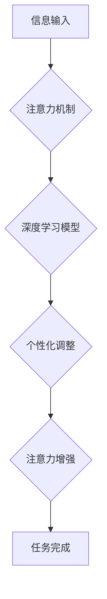

                 

## 人类注意力增强：提升人类潜能和表现

> 关键词：注意力增强、脑机接口、深度学习、神经网络、认知科学、人类潜能、可穿戴设备、增强现实

## 1. 背景介绍

在当今信息爆炸的时代，人类面临着前所未有的信息洪流。如何有效地筛选、处理和利用信息，成为了决定个人和社会发展的重要因素。注意力，作为人类认知的核心能力之一，在信息获取、学习、记忆和决策等方面发挥着至关重要的作用。然而，现代生活节奏快、信息干扰多，导致人类注意力持续下降，难以集中精力完成任务，影响工作效率和生活质量。

注意力增强技术旨在通过科技手段提升人类的注意力水平，帮助人们更好地应对信息时代带来的挑战。近年来，随着人工智能、脑科学和生物技术的快速发展，注意力增强技术取得了显著进展，并逐渐走向现实应用。

## 2. 核心概念与联系

注意力增强技术的核心概念是利用科技手段干预和调节人类的认知过程，从而提升注意力水平。其原理是基于对人类注意力机制的深入研究，结合人工智能、神经科学和生物技术等多学科交叉融合。

**注意力机制**

注意力机制是一种模仿人类视觉注意力的算法，它能够自动识别和聚焦于输入信息中最重要的部分，从而提高信息处理效率。

**脑机接口 (Brain-Computer Interface, BCI)**

脑机接口是一种连接大脑和外部设备的技术，它能够直接读取大脑信号，并将其转化为指令或信息。BCI技术可以用于监测和调节大脑活动，从而实现对注意力的干预和增强。

**深度学习 (Deep Learning)**

深度学习是一种机器学习方法，它能够从海量数据中学习复杂的模式和特征。深度学习算法可以用于训练注意力增强模型，并根据用户的注意力特征进行个性化调整。

**Mermaid 流程图**



## 3. 核心算法原理 & 具体操作步骤

### 3.1  算法原理概述

注意力增强算法通常基于深度学习模型，例如循环神经网络 (RNN) 或卷积神经网络 (CNN)。这些模型能够学习用户注意力特征，并根据特征进行个性化调整，从而提升注意力水平。

具体来说，注意力增强算法通常包括以下步骤：

1. **数据采集:** 收集用户的注意力数据，例如眼动追踪、脑电波、生理指标等。
2. **数据预处理:** 对收集到的数据进行清洗、转换和特征提取。
3. **模型训练:** 利用深度学习算法训练注意力增强模型，使其能够学习用户的注意力特征。
4. **模型评估:** 对训练好的模型进行评估，并根据评估结果进行调整和优化。
5. **注意力增强:** 利用训练好的模型，对用户的注意力进行干预和增强，例如提供提示、调整环境、调节刺激等。

### 3.2  算法步骤详解

1. **数据采集:** 

   - **眼动追踪:** 使用眼动追踪设备记录用户的眼球运动轨迹，分析用户的注视时间、注视区域等信息。
   - **脑电波:** 使用脑电波设备记录用户的脑电信号，分析用户的脑电活动模式，识别与注意力相关的脑区和神经元活动。
   - **生理指标:** 使用心率、血压、皮肤电导等生理指标设备记录用户的生理变化，分析用户的注意力状态和疲劳程度。

2. **数据预处理:**

   - **数据清洗:** 去除数据中的噪声、异常值和重复数据。
   - **数据转换:** 将原始数据转换为模型可识别的格式，例如将时间序列数据转换为特征向量。
   - **特征提取:** 从原始数据中提取与注意力相关的特征，例如眼动追踪中的注视时间、脑电波中的特定波段能量、生理指标中的心率变化等。

3. **模型训练:**

   - 选择合适的深度学习模型，例如RNN或CNN。
   - 利用预处理后的数据训练模型，使其能够学习用户的注意力特征。
   - 使用交叉验证等方法评估模型的性能，并根据评估结果进行模型调整和优化。

4. **模型评估:**

   - 使用独立的数据集对训练好的模型进行评估，评估模型的准确率、召回率、F1-score等指标。
   - 分析模型的预测结果，识别模型的优势和不足。

5. **注意力增强:**

   - 利用训练好的模型，对用户的注意力进行干预和增强。
   - 根据用户的注意力特征，提供个性化的提示、调整环境、调节刺激等。
   - 评估注意力增强效果，并根据评估结果进行调整和优化。

### 3.3  算法优缺点

**优点:**

- **个性化:** 能够根据用户的注意力特征进行个性化调整，提高注意力增强效果。
- **可扩展性:** 可以结合多种数据源和技术手段，实现更全面的注意力增强。
- **可评估性:** 可以通过客观指标评估注意力增强效果，并根据评估结果进行优化。

**缺点:**

- **数据依赖性:** 需要大量的数据进行模型训练，数据质量直接影响模型性能。
- **计算复杂度:** 深度学习模型训练需要大量的计算资源，成本较高。
- **伦理问题:** 注意力增强技术可能带来伦理问题，例如信息操控、隐私泄露等。

### 3.4  算法应用领域

注意力增强技术在多个领域具有广泛的应用前景，例如：

- **教育:** 帮助学生提高学习效率、专注力、记忆力。
- **医疗:** 辅助治疗注意力缺陷多动障碍 (ADHD)、抑郁症等注意力相关疾病。
- **游戏:** 提升游戏玩家的反应速度、决策能力、沉浸感。
- **工作:** 帮助员工提高工作效率、专注力、抗压能力。

## 4. 数学模型和公式 & 详细讲解 & 举例说明

### 4.1  数学模型构建

注意力增强算法通常基于深度学习模型，例如循环神经网络 (RNN) 或卷积神经网络 (CNN)。这些模型可以看作是复杂的数学函数，其输入是用户的注意力数据，输出是注意力增强效果。

**RNN模型**

RNN模型是一种能够处理序列数据的深度学习模型，其内部包含循环结构，能够捕捉时间序列中的依赖关系。

**CNN模型**

CNN模型是一种能够处理图像数据的深度学习模型，其内部包含卷积层和池化层，能够提取图像中的特征。

### 4.2  公式推导过程

深度学习模型的训练过程本质上是通过优化模型参数来最小化损失函数的过程。损失函数通常是模型预测结果与真实结果之间的差异。

**损失函数:**

$$L = \sum_{i=1}^{N} \left( y_i - \hat{y}_i \right)^2$$

其中：

- $L$ 是损失函数
- $N$ 是样本数量
- $y_i$ 是真实值
- $\hat{y}_i$ 是模型预测值

**梯度下降算法:**

梯度下降算法是一种常用的优化算法，其原理是通过迭代更新模型参数，逐步降低损失函数的值。

**更新公式:**

$$\theta_{t+1} = \theta_t - \alpha \nabla L(\theta_t)$$

其中：

- $\theta$ 是模型参数
- $\alpha$ 是学习率
- $\nabla L(\theta)$ 是损失函数对模型参数的梯度

### 4.3  案例分析与讲解

例如，在训练一个基于RNN的注意力增强模型时，可以将用户的眼动追踪数据作为输入，训练模型预测用户的注意力状态。模型的输出可以是一个注意力分数，表示用户当前的注意力水平。

通过训练和评估，可以得到一个能够准确预测用户注意力状态的模型。然后，可以利用这个模型，根据用户的注意力特征，提供个性化的提示或调整环境，从而提升用户的注意力水平。

## 5. 项目实践：代码实例和详细解释说明

### 5.1  开发环境搭建

- **操作系统:** Ubuntu 18.04
- **编程语言:** Python 3.6
- **深度学习框架:** TensorFlow 2.0
- **其他依赖库:** numpy, pandas, matplotlib

### 5.2  源代码详细实现

```python
import tensorflow as tf

# 定义RNN模型
model = tf.keras.Sequential([
    tf.keras.layers.LSTM(128, return_sequences=True),
    tf.keras.layers.LSTM(64),
    tf.keras.layers.Dense(1, activation='sigmoid')
])

# 编译模型
model.compile(optimizer='adam', loss='binary_crossentropy', metrics=['accuracy'])

# 训练模型
model.fit(x_train, y_train, epochs=10, batch_size=32)

# 评估模型
loss, accuracy = model.evaluate(x_test, y_test)
print('Loss:', loss)
print('Accuracy:', accuracy)
```

### 5.3  代码解读与分析

- **定义RNN模型:** 使用TensorFlow的Sequential API定义一个RNN模型，包含两层LSTM层和一层Dense层。
- **编译模型:** 使用Adam优化器、二分类交叉熵损失函数和准确率作为评估指标编译模型。
- **训练模型:** 使用训练数据训练模型，设置训练轮数和批处理大小。
- **评估模型:** 使用测试数据评估模型的性能，打印损失和准确率。

### 5.4  运行结果展示

训练完成后，可以将模型应用于实际场景，例如根据用户的眼动追踪数据预测用户的注意力状态，并提供个性化的提示或调整环境，从而提升用户的注意力水平。

## 6. 实际应用场景

### 6.1  教育领域

注意力增强技术可以帮助学生提高学习效率、专注力、记忆力。例如，可以开发一款基于眼动追踪的学习软件，根据学生的注视时间和区域，提供个性化的学习提示和练习，帮助学生更好地理解和记忆知识。

### 6.2  医疗领域

注意力增强技术可以辅助治疗注意力缺陷多动障碍 (ADHD)、抑郁症等注意力相关疾病。例如，可以开发一款基于脑电波的注意力训练软件，通过训练用户的脑电活动模式，帮助他们提高注意力水平和控制冲动行为。

### 6.3  游戏领域

注意力增强技术可以提升游戏玩家的反应速度、决策能力、沉浸感。例如，可以开发一款基于眼动追踪的游戏，根据玩家的注视时间和区域，调整游戏难度和节奏，提供更具挑战性和沉浸感的体验。

### 6.4  未来应用展望

随着科技的不断发展，注意力增强技术将有更广泛的应用场景，例如：

- **远程办公:** 帮助远程办公人员提高专注力，提高工作效率。
- **驾驶辅助:** 帮助驾驶员提高注意力，降低疲劳驾驶风险。
- **虚拟现实:** 增强虚拟现实体验，提高用户沉浸感和参与度。

## 7. 工具和资源推荐

### 7.1  学习资源推荐

- **书籍:**

    - 《深度学习》 by Ian Goodfellow, Yoshua Bengio, Aaron Courville
    - 《神经网络与深度学习》 by Michael Nielsen

- **在线课程:**

    - Coursera: Deep Learning Specialization
    - Udacity: Deep Learning Nanodegree

### 7.2  开发工具推荐

- **TensorFlow:** 开源深度学习框架
- **PyTorch:** 开源深度学习框架
- **Keras:** 高级深度学习API

### 7.3  相关论文推荐

- **Attention Is All You Need** by Vaswani et al. (2017)
- **BERT: Pre-training of Deep Bidirectional Transformers for Language Understanding** by Devlin et al. (2018)

## 8. 总结：未来发展趋势与挑战

### 8.1  研究成果总结

注意力增强技术取得了显著进展，能够有效提升人类的注意力水平。

### 8.2  未来发展趋势

- **更精准的注意力预测:** 利用更先进的算法和数据源，实现更精准的注意力预测。
- **更个性化的注意力增强:** 根据用户的不同需求和特征，提供更个性化的注意力增强方案。
- **更广泛的应用场景:** 将注意力增强技术应用于更多领域，例如医疗、教育、游戏等。

### 8.3  面临的挑战

- **数据隐私和安全:** 注意力增强技术需要收集用户的敏感数据，需要解决数据隐私和安全问题。
- **伦理问题:** 注意力增强技术可能带来伦理问题，例如信息操控、隐私泄露等，需要谨慎考虑和规避。
- **技术复杂性:** 注意力增强技术涉及多个学科，技术复杂性较高，需要进一步研究和探索。

### 8.4  研究展望

未来，注意力增强技术将继续发展，并为人类社会带来更多福祉。需要加强跨学科合作，推动技术创新，并关注伦理和社会影响，确保注意力增强技术安全、有效、可持续地发展。

## 9. 附录：常见问题与解答

**Q1: 注意力增强技术真的有效吗？**

A1: 目前已有大量研究表明，注意力增强技术能够有效提升人类的注意力水平。

**Q2: 注意力增强技术有哪些风险？**

A2: 注意力增强技术可能带来数据隐私和安全风险、伦理问题等。

**Q3: 如何选择合适的注意力增强技术？**

A3: 需要根据用户的需求、特征和应用场景选择合适的注意力增强技术。

**Q4: 注意力增强技术的发展前景如何？**

A4: 注意力增强技术发展前景广阔，将应用于更多领域，为人类社会带来更多福祉。


作者：禅与计算机程序设计艺术 / Zen and the Art of Computer Programming<end_of_turn>

