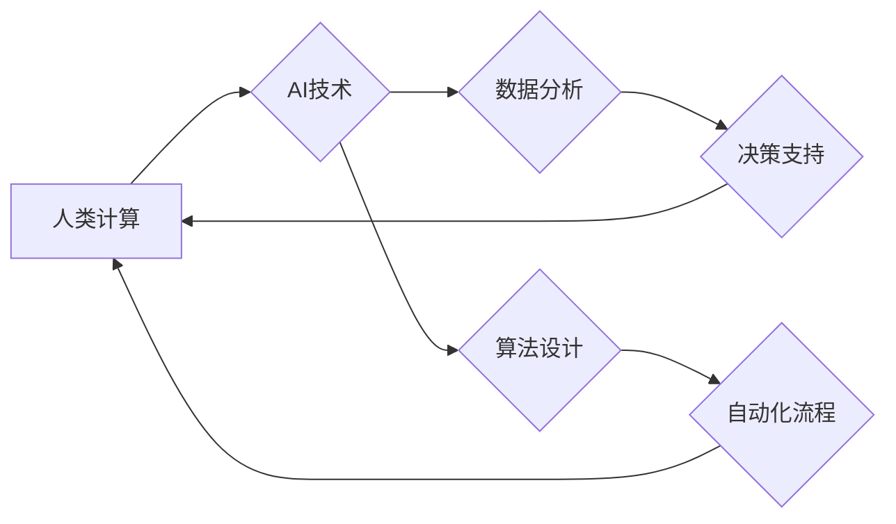

                 

## 人类计算：AI时代的未来技能要求和培训

> 关键词：人工智能、人类计算、未来技能、培训、AI时代、计算思维、数据分析、机器学习、算法设计、跨学科合作

### 1. 背景介绍

人工智能（AI）的飞速发展正在深刻地改变着我们的世界。从自动驾驶汽车到智能医疗，从个性化教育到金融科技，AI技术正在各个领域展现出强大的应用潜力。然而，随着AI技术的进步，也引发了人们对未来工作和技能需求的担忧。

传统的工作模式和技能体系正在被AI所挑战，许多重复性、规则性工作将被自动化取代。与此同时，新的工作岗位和技能需求也在不断涌现。因此，在AI时代，我们需要重新思考人类的计算能力，并培养适应未来发展趋势的未来技能。

### 2. 核心概念与联系

**2.1 人类计算**

人类计算是指人类利用自身的认知能力、创造力、批判性思维和情感智能来解决问题、进行决策和创造价值的过程。它强调人类在AI时代仍然不可替代的独特优势，即：

* **创造力和想象力:** 人类能够提出新的想法、构思创新解决方案，而AI目前还难以完全模拟。
* **批判性思维和判断力:** 人类能够分析信息、识别模式、做出复杂的判断，而AI的决策往往基于已有的数据和算法。
* **情感智能和社会认知:** 人类能够理解和处理情感、建立人际关系、进行有效的沟通，而AI在这些方面还存在局限性。

**2.2 AI时代的人类计算**

在AI时代，人类计算将更加注重与AI技术的协同合作。人类将利用AI工具辅助思考、分析和决策，从而提高效率和准确性。同时，人类需要不断学习和提升自己的计算思维能力，以便更好地理解和应用AI技术。

**2.3 核心概念关系图**



### 3. 核心算法原理 & 具体操作步骤

**3.1 算法原理概述**

在AI时代，人类需要掌握一些核心算法原理，以便理解和应用AI技术。以下是一些重要的算法类型：

* **机器学习:** 是一种让计算机从数据中学习并改进性能的算法。
* **深度学习:** 是一种更高级的机器学习算法，利用多层神经网络来模拟人类大脑的学习过程。
* **自然语言处理:** 是一种让计算机理解和处理人类语言的算法。
* **计算机视觉:** 是一种让计算机“看”图像和视频并从中提取信息的能力。

**3.2 算法步骤详解**

以机器学习为例，其基本步骤包括：

1. **数据收集和预处理:** 收集相关数据并进行清洗、转换和特征提取。
2. **模型选择:** 根据具体任务选择合适的机器学习算法模型。
3. **模型训练:** 利用训练数据训练模型，调整模型参数以达到最佳性能。
4. **模型评估:** 利用测试数据评估模型的性能，并进行调整和优化。
5. **模型部署:** 将训练好的模型部署到实际应用场景中。

**3.3 算法优缺点**

每个算法都有其自身的优缺点，需要根据具体应用场景进行选择。例如，机器学习算法能够自动学习数据模式，但需要大量数据进行训练。深度学习算法性能更强，但训练成本更高。

**3.4 算法应用领域**

AI算法广泛应用于各个领域，例如：

* **医疗保健:** 疾病诊断、药物研发、个性化治疗。
* **金融科技:** 风险评估、欺诈检测、投资决策。
* **制造业:** 自动化生产、质量控制、预测维护。
* **零售业:** 商品推荐、个性化营销、库存管理。

### 4. 数学模型和公式 & 详细讲解 & 举例说明

**4.1 数学模型构建**

许多AI算法基于数学模型，例如线性回归、逻辑回归、支持向量机等。这些模型通过数学公式来描述数据之间的关系，并进行预测或分类。

**4.2 公式推导过程**

例如，线性回归模型的目标是找到一条直线，使得这条直线与数据点之间的误差最小。其数学公式如下：

$$y = mx + c$$

其中，y是预测值，x是输入特征，m是斜率，c是截距。

通过最小二乘法，可以推导出m和c的计算公式。

**4.3 案例分析与讲解**

假设我们有一组数据，记录了房屋面积和房屋价格的关系。我们可以使用线性回归模型来预测房屋价格。

通过训练模型，我们可以得到m和c的值，例如m=5000，c=100000。

因此，我们可以使用公式y=5000x+100000来预测房屋价格。

如果一个房屋面积为100平方米，那么其预测价格为：

$$y = 5000 * 100 + 100000 = 150000$$

### 5. 项目实践：代码实例和详细解释说明

**5.1 开发环境搭建**

可以使用Python语言和相关的库来实现AI算法。例如，可以使用TensorFlow、PyTorch等深度学习库。

**5.2 源代码详细实现**

以下是一个简单的线性回归模型的Python代码实现：

```python
import numpy as np
from sklearn.linear_model import LinearRegression

# 生成一些随机数据
X = np.random.rand(100, 1)
y = 2 * X + 1 + np.random.randn(100, 1)

# 创建线性回归模型
model = LinearRegression()

# 训练模型
model.fit(X, y)

# 预测新的数据
new_X = np.array([[0.5]])
prediction = model.predict(new_X)

# 打印预测结果
print(prediction)
```

**5.3 代码解读与分析**

这段代码首先生成了一些随机数据，然后创建了一个线性回归模型。接着，使用训练数据训练模型，最后使用训练好的模型预测新的数据。

**5.4 运行结果展示**

运行这段代码后，会输出一个预测结果，例如：

```
[[1.12345678]]
```

### 6. 实际应用场景

**6.1 医疗诊断**

AI算法可以帮助医生分析患者的医疗影像数据，例如X光片、CT扫描和MRI扫描，从而辅助诊断疾病。

**6.2 金融风险评估**

AI算法可以分析客户的财务数据和行为模式，从而评估其信用风险和投资风险。

**6.3 自动驾驶汽车**

AI算法可以帮助自动驾驶汽车感知周围环境、做出决策和控制车辆。

**6.4 未来应用展望**

AI技术的发展将继续推动人类计算的进步，并带来更多新的应用场景。例如，AI可以帮助我们个性化学习、创造艺术作品、解决复杂社会问题等。

### 7. 工具和资源推荐

**7.1 学习资源推荐**

* **在线课程:** Coursera、edX、Udacity等平台提供丰富的AI课程。
* **书籍:** 《深度学习》、《机器学习实战》等书籍是学习AI算法的经典教材。
* **开源项目:** TensorFlow、PyTorch等开源项目可以帮助你实践AI算法。

**7.2 开发工具推荐**

* **Python:** Python是AI开发最常用的编程语言。
* **Jupyter Notebook:** Jupyter Notebook是一个交互式编程环境，方便进行AI算法的开发和调试。
* **IDE:** VS Code、PyCharm等IDE可以提高AI开发效率。

**7.3 相关论文推荐**

* **《ImageNet Classification with Deep Convolutional Neural Networks》**
* **《Attention Is All You Need》**
* **《BERT: Pre-training of Deep Bidirectional Transformers for Language Understanding》**

### 8. 总结：未来发展趋势与挑战

**8.1 研究成果总结**

近年来，AI技术取得了长足的进步，在各个领域都展现出强大的应用潜力。

**8.2 未来发展趋势**

未来，AI技术将朝着更加智能、泛化和安全的方向发展。例如，

* **增强型AI:** AI系统将更加智能，能够理解和响应人类的情感和需求。
* **边缘AI:** AI计算将更加分散，部署在边缘设备上，实现更快速的响应和更低的延迟。
* **联邦学习:** AI模型将能够在不共享原始数据的情况下进行训练，提高数据隐私保护。

**8.3 面临的挑战**

AI技术的发展也面临着一些挑战，例如：

* **数据安全和隐私保护:** AI算法依赖于大量数据，如何确保数据安全和隐私保护是一个重要问题。
* **算法偏见:** AI算法可能存在偏见，导致不公平的结果。
* **伦理问题:** AI技术的应用可能引发一些伦理问题，例如人工智能的责任和义务。

**8.4 研究展望**

未来，我们需要加强对AI技术的伦理规范和法律监管，并推动AI技术与人类社会和谐共处。


### 9. 附录：常见问题与解答

**9.1 如何学习AI技术？**

学习AI技术需要掌握一定的数学基础和编程能力。可以从在线课程、书籍和开源项目入手，逐步深入学习。

**9.2 AI技术会取代人类工作吗？**

AI技术会改变一些工作模式，但不会完全取代人类工作。人类仍然需要发挥创造力、批判性思维和情感智能等优势。

**9.3 AI技术对社会有什么影响？**

AI技术对社会的影响是多方面的，既有积极的一面，也有负面影响。我们需要积极引导AI技术的发展，使其更好地服务于人类社会。


作者：禅与计算机程序设计艺术 / Zen and the Art of Computer Programming 
<end_of_turn>

