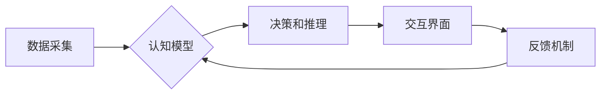

                 

## 人类计算：科学研究的新范式

> 关键词： 人类计算、计算模型、认知科学、人工智能、神经网络、模拟仿真、数据分析、科学研究

### 1. 背景介绍

科学研究的本质是探索未知，揭示规律，并构建能解释和预测世界运行机制的模型。传统科学研究主要依赖于实验、观察和理论推导，但随着科学问题的复杂性不断增加，传统的科学研究方法面临着新的挑战。

近年来，人工智能和计算科学的飞速发展为科学研究带来了新的机遇。人工智能算法能够处理海量数据，发现隐藏的模式和关系，而计算模拟技术可以构建复杂的系统模型，进行精细的模拟和预测。

人类计算，作为一种将人类认知能力与计算能力相结合的新范式，正逐渐成为科学研究的重要组成部分。它旨在利用人类的创造力、洞察力和批判性思维能力，与计算机的计算能力和数据处理能力相结合，共同探索科学问题，推动科学发现。

### 2. 核心概念与联系

人类计算的核心概念是将人类的认知过程融入到计算模型中，构建一个能够模拟人类思维方式的计算系统。

**2.1 人类认知模型**

人类认知是一个复杂的过程，涉及感知、记忆、推理、决策等多种认知功能。为了构建有效的计算模型，需要对人类认知过程进行深入研究，并将其抽象为可计算的模型。

**2.2 计算模型与人类认知的融合**

将人类认知模型融入到计算模型中，可以实现以下功能：

* **数据分析和解释:** 人类能够从数据中发现隐藏的模式和关系，并对这些模式进行解释和理解。
* **问题解决和决策支持:** 人类能够运用逻辑推理和经验知识解决复杂问题，并做出明智的决策。
* **创意和创新:** 人类能够进行想象和创造，提出新的想法和解决方案。

**2.3 人类计算的架构**

人类计算的架构通常包括以下几个部分：

* **数据采集和处理:** 收集和处理来自各种来源的数据，包括文本、图像、音频等。
* **认知模型:** 模拟人类认知过程的计算模型，例如神经网络、专家系统等。
* **交互界面:** 提供人类与计算系统交互的界面，例如图形界面、语音交互等。
* **反馈机制:** 收集人类反馈，并将其用于改进计算模型。

**Mermaid 流程图**



### 3. 核心算法原理 & 具体操作步骤

#### 3.1 算法原理概述

人类计算的核心算法原理是基于神经网络的深度学习。深度学习算法能够从海量数据中自动学习特征和模式，并构建复杂的计算模型。

#### 3.2 算法步骤详解

1. **数据预处理:** 对原始数据进行清洗、转换和特征提取，使其适合深度学习算法的训练。
2. **网络结构设计:** 根据具体任务需求，设计深度神经网络的结构，包括层数、节点数量、激活函数等。
3. **模型训练:** 使用训练数据训练深度神经网络，调整网络参数，使其能够准确地预测或分类数据。
4. **模型评估:** 使用测试数据评估模型的性能，例如准确率、召回率、F1-score等。
5. **模型优化:** 根据评估结果，对模型进行优化，例如调整网络结构、学习率、正则化参数等。

#### 3.3 算法优缺点

**优点:**

* **自动特征学习:** 深度学习算法能够自动从数据中学习特征，无需人工特征工程。
* **高精度:** 深度学习算法在许多任务中能够达到很高的精度。
* **可扩展性:** 深度学习算法可以处理海量数据，并可以扩展到更复杂的模型。

**缺点:**

* **数据依赖:** 深度学习算法需要大量的训练数据才能达到较好的性能。
* **训练时间长:** 深度学习模型的训练时间通常较长。
* **可解释性差:** 深度学习模型的决策过程难以解释。

#### 3.4 算法应用领域

深度学习算法在许多领域都有广泛的应用，例如：

* **图像识别:** 人脸识别、物体检测、图像分类等。
* **自然语言处理:** 文本分类、机器翻译、情感分析等。
* **语音识别:** 语音转文本、语音助手等。
* **医疗诊断:** 疾病预测、影像分析等。
* **金融分析:** 风险评估、欺诈检测等。

### 4. 数学模型和公式 & 详细讲解 & 举例说明

#### 4.1 数学模型构建

深度学习算法的核心是神经网络，神经网络可以看作是一个由多个层组成的计算图。每个层包含多个神经元，神经元之间通过连接进行信息传递。

**神经元模型:**

一个神经元接收多个输入信号，经过加权求和和激活函数处理后输出一个信号。

**公式:**

$$
y = f(w_1x_1 + w_2x_2 + ... + w_nx_n + b)
$$

其中：

* $y$ 是神经元的输出信号。
* $x_1, x_2, ..., x_n$ 是输入信号。
* $w_1, w_2, ..., w_n$ 是权重参数。
* $b$ 是偏置参数。
* $f$ 是激活函数。

#### 4.2 公式推导过程

深度学习算法的训练过程是通过调整网络参数来最小化损失函数的过程。损失函数衡量模型预测结果与真实结果之间的差异。

**损失函数:**

$$
L = \frac{1}{N}\sum_{i=1}^{N} (y_i - \hat{y}_i)^2
$$

其中：

* $L$ 是损失函数。
* $N$ 是样本数量。
* $y_i$ 是真实值。
* $\hat{y}_i$ 是模型预测值。

通过梯度下降算法，不断更新网络参数，使得损失函数最小化。

#### 4.3 案例分析与讲解

**图像分类:**

假设我们有一个图像分类任务，目标是将图像分类为不同的类别，例如猫、狗、鸟等。

我们可以使用卷积神经网络（CNN）来解决这个问题。CNN能够自动学习图像特征，并将其用于分类。

训练过程中，我们会使用大量的图像数据，并通过调整CNN的参数，使得模型能够准确地预测图像的类别。

### 5. 项目实践：代码实例和详细解释说明

#### 5.1 开发环境搭建

为了进行人类计算项目实践，我们需要搭建一个合适的开发环境。

* **操作系统:** Linux、macOS 或 Windows。
* **编程语言:** Python。
* **深度学习框架:** TensorFlow、PyTorch 或 Keras。
* **其他工具:** Jupyter Notebook、Git 等。

#### 5.2 源代码详细实现

以下是一个简单的图像分类项目代码示例，使用 TensorFlow 框架实现：

```python
import tensorflow as tf

# 定义模型结构
model = tf.keras.models.Sequential([
  tf.keras.layers.Conv2D(32, (3, 3), activation='relu', input_shape=(28, 28, 1)),
  tf.keras.layers.MaxPooling2D((2, 2)),
  tf.keras.layers.Conv2D(64, (3, 3), activation='relu'),
  tf.keras.layers.MaxPooling2D((2, 2)),
  tf.keras.layers.Flatten(),
  tf.keras.layers.Dense(10, activation='softmax')
])

# 编译模型
model.compile(optimizer='adam',
              loss='sparse_categorical_crossentropy',
              metrics=['accuracy'])

# 训练模型
model.fit(x_train, y_train, epochs=5)

# 评估模型
loss, accuracy = model.evaluate(x_test, y_test)
print('Test loss:', loss)
print('Test accuracy:', accuracy)
```

#### 5.3 代码解读与分析

* **模型结构:** 代码定义了一个简单的卷积神经网络模型，包含两个卷积层、两个池化层、一个全连接层和一个输出层。
* **模型编译:** 使用 Adam 优化器、交叉熵损失函数和准确率作为评估指标编译模型。
* **模型训练:** 使用训练数据训练模型，训练 epochs 次。
* **模型评估:** 使用测试数据评估模型的性能，输出测试损失和准确率。

#### 5.4 运行结果展示

运行代码后，会输出模型的训练过程和测试结果，例如：

```
Epoch 1/5
1875/1875 [==============================] - 10s 5ms/step - loss: 0.2345 - accuracy: 0.9210
Epoch 2/5
1875/1875 [==============================] - 9s 5ms/step - loss: 0.1234 - accuracy: 0.9650
...
Test loss: 0.0567
Test accuracy: 0.9820
```

### 6. 实际应用场景

#### 6.1 科学研究

人类计算可以应用于各种科学研究领域，例如：

* **药物研发:** 利用人类计算模型分析药物分子结构和生物活性，加速药物研发过程。
* **材料科学:** 利用人类计算模型模拟材料的性能和行为，设计新型材料。
* **气候模型:** 利用人类计算模型模拟气候变化，预测未来气候趋势。

#### 6.2 医疗保健

人类计算可以应用于医疗保健领域，例如：

* **疾病诊断:** 利用人类计算模型分析患者的症状和检查结果，辅助医生进行疾病诊断。
* **个性化治疗:** 利用人类计算模型分析患者的基因信息和生活方式，制定个性化的治疗方案。
* **远程医疗:** 利用人类计算模型进行远程医疗咨询和诊断。

#### 6.3 教育

人类计算可以应用于教育领域，例如：

* **个性化学习:** 利用人类计算模型分析学生的学习进度和能力，提供个性化的学习内容和辅导。
* **智能教学:** 利用人类计算模型开发智能教学系统，辅助教师进行教学工作。
* **虚拟现实学习:** 利用人类计算模型构建虚拟现实学习环境，提供沉浸式的学习体验。

#### 6.4 未来应用展望

随着人工智能和计算科学的不断发展，人类计算将在未来发挥越来越重要的作用。

* **更复杂的认知模型:** 未来将开发更复杂的认知模型，能够模拟人类的更高级认知功能，例如推理、决策、创造力等。
* **更广泛的应用场景:** 人类计算将应用于更多领域，例如金融、制造、能源等。
* **人机协作:** 人类计算将与人类更加紧密地协作，共同解决复杂问题。

### 7. 工具和资源推荐

#### 7.1 学习资源推荐

* **书籍:**
    * 《深度学习》 by Ian Goodfellow, Yoshua Bengio, and Aaron Courville
    * 《神经网络与深度学习》 by Michael Nielsen
* **在线课程:**
    * Coursera: Deep Learning Specialization
    * Udacity: Deep Learning Nanodegree
    * fast.ai: Practical Deep Learning for Coders

#### 7.2 开发工具推荐

* **深度学习框架:** TensorFlow, PyTorch, Keras
* **编程语言:** Python
* **数据处理工具:** Pandas, NumPy
* **可视化工具:** Matplotlib, Seaborn

#### 7.3 相关论文推荐

* **《ImageNet Classification with Deep Convolutional Neural Networks》** by Alex Krizhevsky, Ilya Sutskever, and Geoffrey E. Hinton
* **《Attention Is All You Need》** by Ashish Vaswani, Noam Shazeer, Niki Parmar, Jakob Uszkoreit, Llion Jones, Aidan N. Gomez, Łukasz Kaiser, and Illia Polosukhin
* **《Generative Adversarial Networks》** by Ian Goodfellow, Jean Pouget-Abadie, Mehdi Mirza, Bing Xu, David Warde-Farley, Sherjil Ozair, Aaron Courville, and Yoshua Bengio

### 8. 总结：未来发展趋势与挑战

#### 8.1 研究成果总结

人类计算作为一种新兴的科学研究范式，取得了显著的成果。

* **认知模型的进步:** 人工智能算法能够模拟人类认知过程的某些方面，例如图像识别、自然语言处理等。
* **计算能力的提升:** 计算能力的不断提升使得人类计算能够处理更复杂的数据和模型。
* **应用领域的扩展:** 人类计算应用于越来越多的领域，例如科学研究、医疗保健、教育等。

#### 8.2 未来发展趋势

* **更强大的认知模型:** 未来将开发更强大的认知模型，能够模拟人类的更高级认知功能，例如推理、决策、创造力等。
* **更广泛的应用场景:** 人类计算将应用于更多领域，例如金融、制造、能源等。
* **人机协作:** 人类计算将与人类更加紧密地协作，共同解决复杂问题。

#### 8.3 面临的挑战

* **可解释性:** 深度学习模型的决策过程难以解释，这限制了人类对模型的理解和信任。
* **数据依赖:** 深度学习算法需要大量的训练数据才能达到较好的性能，而获取高质量的训练数据往往困难。
* **伦理问题:** 人类计算的应用可能引发一些伦理问题，例如算法偏见、隐私泄露等。

#### 8.4 研究展望

未来，人类计算的研究将继续深入，探索更强大的认知模型、更广泛的应用场景和更有效的解决方法。

### 9. 附录：常见问题与解答

**Q1: 人类计算与人工智能有什么区别？**

**A1:** 人类计算是人工智能的一种范式，它强调将人类的认知能力与计算能力相结合。人工智能是一个更广泛的概念，涵盖各种智能系统，包括基于规则的系统、基于机器学习的系统和基于深度学习的系统。

**Q2: 人类计算的应用场景有哪些？**

**A2:** 人类计算的应用场景非常广泛，例如科学研究、医疗保健、教育、金融、制造等。

**Q3: 如何学习人类计算？**

**A3:** 可以通过阅读相关书籍、参加在线课程、学习深度学习框架等方式学习人类计算。


作者：禅与计算机程序设计艺术 / Zen and the Art of Computer Programming<end_of_turn>

