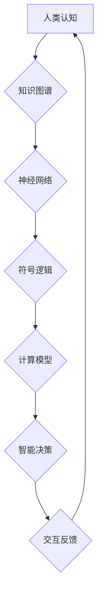

                 

## 人类计算：连接人与技术的纽带

> 关键词：人工智能、计算模型、人类认知、交互设计、未来趋势

### 1. 背景介绍

人类文明的发展离不开对信息的处理和利用。从古老的记账工具到现代的超级计算机，我们一直在探索更有效、更智能的方式来处理信息。随着人工智能技术的飞速发展，人类计算的概念逐渐成为一个重要的研究领域。

人类计算是指将人类的认知能力与计算机技术相结合，以实现更强大的计算能力和更智能的决策。它超越了传统的计算机计算范式，强调了人机协作和交互的重要性。

### 2. 核心概念与联系

#### 2.1 人类计算的本质

人类计算的核心在于将人类的智慧和创造力与计算机的计算能力相融合。它不仅仅是利用计算机辅助人类进行计算，而是更深层次地探索如何将人类的认知模式、决策机制和创造力融入到计算系统中。

#### 2.2 人机交互的演变

从早期的命令行界面到现在的图形用户界面，再到未来的自然语言交互，人机交互方式一直在不断演进。人类计算强调更加自然、直观、人性化的交互方式，以更好地激发人类的创造力和智能。

#### 2.3 计算模型的扩展

传统的计算模型主要基于逻辑和算法，而人类计算则需要扩展到更复杂的认知模型，例如神经网络、知识图谱和符号逻辑等。这些模型能够更好地模拟人类的思维方式，从而实现更智能的计算。

**Mermaid 流程图**



### 3. 核心算法原理 & 具体操作步骤

#### 3.1 算法原理概述

人类计算的核心算法原理是将人类的认知能力抽象成可计算的模型，并通过算法实现这些模型的功能。例如，自然语言处理算法可以模拟人类理解和生成语言的能力，而机器学习算法可以模拟人类学习和决策的能力。

#### 3.2 算法步骤详解

具体操作步骤取决于所使用的算法类型。例如，一个简单的机器学习算法，例如线性回归，其步骤如下：

1. **数据收集和预处理:** 收集相关数据并进行清洗、转换和特征工程等预处理操作。
2. **模型选择:** 选择合适的机器学习模型，例如线性回归。
3. **模型训练:** 使用训练数据训练模型，调整模型参数以最小化预测误差。
4. **模型评估:** 使用测试数据评估模型的性能，例如计算准确率、召回率等指标。
5. **模型部署:** 将训练好的模型部署到实际应用场景中，用于进行预测或决策。

#### 3.3 算法优缺点

不同的算法具有不同的优缺点。例如，线性回归算法简单易懂，但对于复杂的数据关系可能无法很好地建模。而深度学习算法能够学习更复杂的模式，但训练时间较长，需要大量的计算资源。

#### 3.4 算法应用领域

人类计算算法广泛应用于各个领域，例如：

* **自然语言处理:** 语音识别、机器翻译、文本摘要等。
* **计算机视觉:** 图像识别、物体检测、图像分割等。
* **推荐系统:** 商品推荐、内容推荐、个性化服务等。
* **医疗诊断:** 病症诊断、影像分析、药物研发等。
* **金融分析:** 风险评估、欺诈检测、投资决策等。

### 4. 数学模型和公式 & 详细讲解 & 举例说明

#### 4.1 数学模型构建

人类计算的数学模型通常基于概率论、统计学和信息论等学科。例如，神经网络模型可以看作是一个复杂的概率图模型，其参数通过最大似然估计或贝叶斯推理进行优化。

#### 4.2 公式推导过程

例如，线性回归模型的损失函数为均方误差，其公式如下：

$$
L(\theta) = \frac{1}{n} \sum_{i=1}^{n} (y_i - \hat{y}_i)^2
$$

其中，$\theta$ 为模型参数，$y_i$ 为真实值，$\hat{y}_i$ 为预测值，$n$ 为样本数量。

通过最小化损失函数，可以得到模型参数的最佳值。

#### 4.3 案例分析与讲解

例如，在图像识别任务中，可以使用卷积神经网络模型进行图像分类。卷积神经网络模型通过多个卷积层和池化层提取图像特征，并通过全连接层进行分类。

$$
\hat{y} = softmax(W^T \cdot h)
$$

其中，$\hat{y}$ 为预测类别概率分布，$W$ 为全连接层的权重矩阵，$h$ 为卷积层和池化层提取的特征向量。

### 5. 项目实践：代码实例和详细解释说明

#### 5.1 开发环境搭建

可以使用Python语言和相关的机器学习库，例如TensorFlow或PyTorch，进行人类计算项目开发。

#### 5.2 源代码详细实现

以下是一个简单的线性回归模型的Python代码实现：

```python
import numpy as np
from sklearn.linear_model import LinearRegression

# 生成训练数据
X = np.array([[1], [2], [3], [4], [5]])
y = np.array([2, 4, 5, 4, 5])

# 创建线性回归模型
model = LinearRegression()

# 训练模型
model.fit(X, y)

# 预测新数据
new_data = np.array([[6]])
prediction = model.predict(new_data)

# 打印预测结果
print(prediction)
```

#### 5.3 代码解读与分析

这段代码首先生成了一些训练数据，然后创建了一个线性回归模型，并使用训练数据训练模型。最后，使用训练好的模型预测新数据，并打印预测结果。

#### 5.4 运行结果展示

运行这段代码后，会输出预测结果，例如：

```
[5.8]
```

这表示模型预测新数据为6时，对应的y值约为5.8。

### 6. 实际应用场景

#### 6.1 人工智能助手

人类计算可以用于开发更智能的人工智能助手，例如Siri、Alexa等。这些助手能够理解自然语言指令，并提供更精准、更人性化的服务。

#### 6.2 个性化教育

人类计算可以用于开发个性化教育系统，根据学生的学习进度和特点，提供定制化的学习内容和教学方法。

#### 6.3 医疗辅助诊断

人类计算可以用于辅助医生进行医疗诊断，例如分析医学影像、预测疾病风险等，提高诊断的准确性和效率。

#### 6.4 未来应用展望

随着人工智能技术的不断发展，人类计算将在更多领域得到应用，例如：

* **自动驾驶:** 人类计算可以帮助自动驾驶系统更好地理解道路环境和交通规则，提高驾驶安全性和效率。
* **机器人交互:** 人类计算可以使机器人能够更好地理解人类语言和行为，实现更自然、更流畅的人机交互。
* **科学研究:** 人类计算可以帮助科学家分析海量数据，发现新的科学规律和知识。

### 7. 工具和资源推荐

#### 7.1 学习资源推荐

* **书籍:**
    * 《深度学习》
    * 《人工智能：一种现代方法》
    * 《机器学习》
* **在线课程:**
    * Coursera
    * edX
    * Udacity

#### 7.2 开发工具推荐

* **Python:** 
    * TensorFlow
    * PyTorch
    * scikit-learn
* **其他语言:**
    * Java
    * C++
    * R

#### 7.3 相关论文推荐

* **Nature:**
    * "Deep learning"
    * "Artificial intelligence: A modern approach"
* **Science:**
    * "Machine learning"
    * "The promise and peril of artificial intelligence"

### 8. 总结：未来发展趋势与挑战

#### 8.1 研究成果总结

人类计算是一个充满挑战和机遇的领域。近年来，人工智能技术的飞速发展为人类计算提供了强大的技术支撑。

#### 8.2 未来发展趋势

未来，人类计算将朝着以下几个方向发展：

* **更智能的计算模型:** 研究更复杂的认知模型，例如图神经网络、强化学习等，以实现更智能的计算。
* **更自然的人机交互:** 开发更自然、更直观的交互方式，例如语音交互、脑机接口等，以更好地连接人与技术。
* **更广泛的应用场景:** 将人类计算技术应用于更多领域，例如医疗、教育、金融等，以解决更现实的问题。

#### 8.3 面临的挑战

人类计算也面临着一些挑战：

* **数据隐私和安全:** 人类计算需要处理大量的个人数据，如何保证数据隐私和安全是一个重要的挑战。
* **算法偏见:** 人工智能算法可能存在偏见，导致不公平的结果。如何解决算法偏见是一个重要的研究课题。
* **伦理问题:** 人类计算的应用可能会引发一些伦理问题，例如人工智能的责任和义务、工作岗位的替代等，需要进行深入的探讨和伦理规范的制定。

#### 8.4 研究展望

尽管面临着挑战，但人类计算仍然是一个充满希望的领域。相信随着技术的不断发展和社会各界的共同努力，人类计算将为人类社会带来更多福祉。

### 9. 附录：常见问题与解答

#### 9.1 什么是人类计算？

人类计算是指将人类的认知能力与计算机技术相结合，以实现更强大的计算能力和更智能的决策。

#### 9.2 人类计算有哪些应用场景？

人类计算的应用场景非常广泛，例如人工智能助手、个性化教育、医疗辅助诊断等。

#### 9.3 人类计算有哪些挑战？

人类计算面临着数据隐私和安全、算法偏见、伦理问题等挑战。

#### 9.4 如何学习人类计算？

可以通过阅读相关书籍、参加在线课程、学习编程等方式学习人类计算。


作者：禅与计算机程序设计艺术 / Zen and the Art of Computer Programming 
<end_of_turn>

