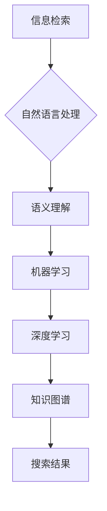

                 

## 企业级AI搜索解决方案

> 关键词：AI搜索、企业搜索、自然语言处理、信息检索、机器学习、深度学习、知识图谱、推荐系统

## 1. 背景介绍

在信息爆炸的时代，海量数据无处不在，企业内部信息也呈指数级增长。传统的基于关键词的搜索引擎已经难以满足企业对信息快速、精准、智能获取的需求。企业级AI搜索解决方案应运而生，它利用人工智能技术，例如自然语言处理（NLP）、机器学习（ML）和深度学习（DL），对企业内部数据进行理解、分析和组织，提供更智能、更人性化的搜索体验。

### 1.1  传统搜索引擎的局限性

传统的搜索引擎主要依赖于关键词匹配，其局限性体现在以下几个方面：

* **语义理解能力差:** 无法理解用户搜索意图背后的深层含义，只能匹配关键词本身。
* **结果排序不精准:** 无法区分搜索结果的 relevance 和 authority，可能出现与用户需求不符的结果。
* **缺乏个性化:** 搜索结果缺乏针对性，无法根据用户的历史搜索记录、偏好和角色提供个性化推荐。
* **维护成本高:** 需要不断更新索引和算法，才能适应不断变化的数据和用户需求。

### 1.2  企业级AI搜索解决方案的优势

企业级AI搜索解决方案可以克服传统搜索引擎的局限性，带来以下优势：

* **更精准的搜索结果:** 利用NLP技术理解用户搜索意图，提供更精准、更相关的搜索结果。
* **更智能的搜索体验:** 支持自然语言查询、语音搜索、图像搜索等多种交互方式，提供更智能、更人性化的搜索体验。
* **更个性化的推荐:** 根据用户的历史搜索记录、偏好和角色，提供个性化的搜索结果和推荐。
* **更低的维护成本:** 利用机器学习算法自动更新索引和算法，降低维护成本。

## 2. 核心概念与联系

企业级AI搜索解决方案的核心概念包括：

* **信息检索:**  从海量数据中找到满足用户查询的文档或信息。
* **自然语言处理:**  理解和处理人类语言，例如文本分析、语义理解、文本生成等。
* **机器学习:**  利用算法从数据中学习，提高搜索结果的精准度和个性化程度。
* **深度学习:**  一种更高级的机器学习方法，可以学习更复杂的模式和关系。
* **知识图谱:**  一种结构化的知识表示形式，可以存储和推理各种知识。

这些概念相互关联，共同构成了企业级AI搜索解决方案的架构。



## 3. 核心算法原理 & 具体操作步骤

### 3.1  算法原理概述

企业级AI搜索解决方案的核心算法包括：

* **TF-IDF算法:**  用于计算文档中词语的重要性，衡量词语在整个语料库中的稀有度和重要性。
* **BM25算法:**  一种改进的TF-IDF算法，考虑了文档长度和查询词的权重，提高了搜索结果的精准度。
* **Word2Vec算法:**  一种深度学习算法，可以将词语映射到一个低维向量空间，捕捉词语之间的语义关系。
* **BERT算法:**  一种基于Transformer的预训练语言模型，可以理解更复杂的语义关系，提高搜索结果的准确性和相关性。

### 3.2  算法步骤详解

以BERT算法为例，其具体操作步骤如下：

1. **预训练:**  BERT模型在大量的文本数据上进行预训练，学习到词语之间的语义关系和上下文信息。
2. **微调:**  将预训练的BERT模型微调到特定的搜索任务上，例如文档分类、信息抽取等。
3. **查询处理:**  将用户的查询语句转换为BERT模型可以理解的格式，例如将句子转换为词向量。
4. **文档匹配:**  将查询语句的词向量与文档的词向量进行比较，计算它们的相似度。
5. **结果排序:**  根据文档与查询语句的相似度进行排序，将最相关的文档排在前面。

### 3.3  算法优缺点

**优点:**

* **语义理解能力强:**  可以理解用户的搜索意图背后的深层含义。
* **搜索结果精准:**  可以提供更精准、更相关的搜索结果。
* **个性化推荐:**  可以根据用户的历史搜索记录、偏好和角色提供个性化的推荐。

**缺点:**

* **计算资源消耗大:**  训练和使用BERT模型需要大量的计算资源。
* **模型参数量大:**  BERT模型的参数量很大，需要较大的存储空间。
* **数据依赖性强:**  BERT模型的性能取决于训练数据的质量和数量。

### 3.4  算法应用领域

BERT算法广泛应用于各种搜索任务，例如：

* **企业搜索:**  帮助企业员工快速、精准地找到所需信息。
* **电商搜索:**  帮助用户找到最符合需求的商品。
* **学术搜索:**  帮助学者找到相关文献和研究成果。
* **问答系统:**  帮助用户找到问题的答案。

## 4. 数学模型和公式 & 详细讲解 & 举例说明

### 4.1  数学模型构建

BERT模型基于Transformer架构，其核心是注意力机制。注意力机制可以学习到句子中不同词语之间的关系，并赋予每个词语不同的权重。

### 4.2  公式推导过程

BERT模型的注意力机制使用以下公式计算词语之间的权重：

$$
\text{Attention}(Q, K, V) = \text{softmax}\left(\frac{QK^T}{\sqrt{d_k}}\right)V
$$

其中：

* $Q$：查询矩阵
* $K$：键矩阵
* $V$：值矩阵
* $d_k$：键向量的维度
* $\text{softmax}$：softmax函数，用于将权重归一化

### 4.3  案例分析与讲解

假设我们有一个句子：“The cat sat on the mat”。BERT模型会将每个词语转换为一个词向量，然后使用注意力机制计算每个词语之间的权重。例如，对于“cat”和“sat”这两个词语，它们的注意力权重可能较高，因为它们在语义上密切相关。

## 5. 项目实践：代码实例和详细解释说明

### 5.1  开发环境搭建

* Python 3.6+
* TensorFlow 2.0+
* PyTorch 1.0+
* CUDA Toolkit 10.0+

### 5.2  源代码详细实现

```python
# 使用BERT模型进行文本分类
from transformers import BertTokenizer, BertForSequenceClassification

# 加载预训练的BERT模型和词典
tokenizer = BertTokenizer.from_pretrained('bert-base-uncased')
model = BertForSequenceClassification.from_pretrained('bert-base-uncased', num_labels=2)

# 对文本进行预处理
text = "This is a sample text."
inputs = tokenizer(text, return_tensors="pt")

# 将文本输入到模型中进行预测
outputs = model(**inputs)
predicted_class = outputs.logits.argmax().item()

# 打印预测结果
print(predicted_class)
```

### 5.3  代码解读与分析

* 该代码示例使用HuggingFace Transformers库加载预训练的BERT模型和词典。
* `tokenizer`用于将文本转换为模型可以理解的格式。
* `model`用于对文本进行分类预测。
* `inputs`包含文本的token化结果和其他必要信息。
* `outputs`包含模型的预测结果，包括logits和预测类标签。

### 5.4  运行结果展示

运行该代码示例后，会输出预测的类标签。例如，如果文本属于正类，则输出结果为1；如果属于负类，则输出结果为0。

## 6. 实际应用场景

企业级AI搜索解决方案在各个行业都有广泛的应用场景：

### 6.1  人力资源管理

* **招聘搜索:**  帮助招聘人员快速找到符合职位要求的候选人。
* **员工知识库:**  帮助员工查找公司内部的政策、流程和知识文档。
* **绩效管理:**  帮助管理人员查找员工的绩效评估报告和工作记录。

### 6.2  客户关系管理

* **客户服务:**  帮助客服人员快速找到客户的订单信息、服务记录和常见问题解答。
* **市场营销:**  帮助营销人员分析客户数据，进行精准营销。
* **销售管理:**  帮助销售人员查找客户信息、产品报价和销售记录。

### 6.3  金融行业

* **风险管理:**  帮助金融机构分析客户数据，识别潜在的风险。
* **投资分析:**  帮助投资人员查找市场信息、公司财务数据和行业分析报告。
* **欺诈检测:**  帮助金融机构识别和预防欺诈行为。

### 6.4  未来应用展望

随着人工智能技术的不断发展，企业级AI搜索解决方案将更加智能、更加个性化。未来，AI搜索将能够：

* **理解更复杂的查询:**  例如，能够理解用户的隐含意图和上下文信息。
* **提供更精准的推荐:**  例如，能够根据用户的历史搜索记录、偏好和角色，提供更个性化的推荐。
* **支持多模态搜索:**  例如，能够支持文本、图像、音频等多种数据类型的搜索。


## 7. 工具和资源推荐

### 7.1  学习资源推荐

* **书籍:**
    * 《深度学习》 - Ian Goodfellow, Yoshua Bengio, Aaron Courville
    * 《自然语言处理》 - Jurafsky, Martin
* **在线课程:**
    * Coursera: 自然语言处理
    * edX: 深度学习
* **博客和网站:**
    * HuggingFace: https://huggingface.co/
    * TensorFlow: https://www.tensorflow.org/
    * PyTorch: https://pytorch.org/

### 7.2  开发工具推荐

* **Python:**  用于开发AI搜索解决方案的编程语言。
* **TensorFlow:**  用于构建和训练深度学习模型的开源框架。
* **PyTorch:**  另一种流行的深度学习框架。
* **HuggingFace Transformers:**  用于加载和使用预训练的BERT模型和其他自然语言处理模型的库。

### 7.3  相关论文推荐

* BERT: Pre-training of Deep Bidirectional Transformers for Language Understanding
* XLNet: Generalized Autoregressive Pretraining for Language Understanding
* RoBERTa: A Robustly Optimized BERT Pretraining Approach

## 8. 总结：未来发展趋势与挑战

### 8.1  研究成果总结

企业级AI搜索解决方案已经取得了显著的成果，能够提供更智能、更精准、更个性化的搜索体验。

### 8.2  未来发展趋势

* **更强大的模型:**  未来将出现更强大的AI模型，能够理解更复杂的语义关系和上下文信息。
* **多模态搜索:**  AI搜索将支持多种数据类型的搜索，例如文本、图像、音频等。
* **个性化推荐:**  AI搜索将更加个性化，能够根据用户的历史搜索记录、偏好和角色提供更精准的推荐。

### 8.3  面临的挑战

* **数据质量:**  AI模型的性能取决于训练数据的质量和数量。
* **计算资源:**  训练和使用大型AI模型需要大量的计算资源。
* **伦理问题:**  AI搜索可能会存在一些伦理问题，例如数据隐私和算法偏见。

### 8.4  研究展望

未来，AI搜索将继续朝着更智能、更个性化、更安全的方向发展。研究者将继续探索新的算法和模型，以解决当前面临的挑战，并为用户提供更优质的搜索体验。

## 9. 附录：常见问题与解答

### 9.1  Q: 如何选择合适的AI搜索解决方案？

**A:** 选择合适的AI搜索解决方案需要考虑以下因素：

* **企业规模:**  不同规模的企业对搜索解决方案的需求不同。
* **数据类型:**  企业的数据类型包括文本、图像、音频等，需要选择支持相应数据类型的解决方案。
* **预算:**  AI搜索解决方案的成本不同，需要根据企业的预算选择合适的方案。

### 9.2  Q: 如何评估AI搜索解决方案的性能？

**A:** 可以使用以下指标评估AI搜索解决方案的性能：

* **准确率:**  搜索结果与用户查询的匹配度。
* **召回率:**  搜索结果包含所有相关文档的比例。
* **平均检索时间:**  用户获取搜索结果所需的时间。
* **用户满意度:**  用户对搜索结果的满意程度。

### 9.3  Q: 如何维护AI搜索解决方案？

**A:**  需要定期更新索引和算法，以适应不断变化的数据和用户需求。

作者：禅与计算机程序设计艺术 / Zen and the Art of Computer Programming 


<end_of_turn>

