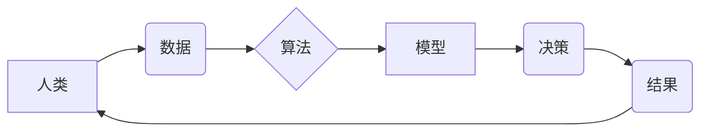

                 

## 伦理困境：探讨人类计算带来的挑战

> 关键词：人工智能、伦理困境、人类计算、算法偏见、数据隐私、透明度、可解释性、责任归属

### 1. 背景介绍

人类计算正以惊人的速度发展，从自动驾驶汽车到医疗诊断，从个性化教育到金融风险评估，人工智能（AI）正在深刻地改变着我们的生活。然而，这种飞速发展也带来了前所未有的伦理困境，这些困境迫使我们认真思考人类计算的本质、边界和潜在风险。

随着算法的日益复杂化，其决策过程往往难以被人类理解，这导致了“黑箱”问题，即我们无法解释算法是如何得出结论的。这种缺乏透明度引发了对算法偏见、数据隐私和责任归属的担忧。

### 2. 核心概念与联系

**2.1 人类计算的定义**

人类计算是指利用计算机技术辅助人类进行计算和决策，并最终由人类进行最终判断和决策的过程。它涵盖了从数据分析和模式识别到预测和规划等多个领域。

**2.2 核心概念**

* **人工智能（AI）：**指模拟人类智能的计算机系统，包括机器学习、深度学习等技术。
* **算法：**是一系列用于解决特定问题的指令或规则。
* **数据：**是算法运行的基础，包括结构化数据、非结构化数据和半结构化数据。
* **模型：**是算法训练后形成的知识表示，用于预测和决策。

**2.3 核心概念关系图**



### 3. 核心算法原理 & 具体操作步骤

**3.1 算法原理概述**

机器学习算法的核心原理是通过学习数据中的模式和规律，自动构建模型，并用于预测和决策。常见的机器学习算法包括：

* **监督学习：**利用标记数据训练模型，例如分类和回归问题。
* **无监督学习：**利用未标记数据发现数据中的潜在结构和模式，例如聚类和降维。
* **强化学习：**通过试错学习，在环境中获得最大奖励。

**3.2 算法步骤详解**

1. **数据收集和预处理：**收集相关数据，并进行清洗、转换和特征工程等预处理操作。
2. **模型选择：**根据具体问题选择合适的机器学习算法。
3. **模型训练：**利用训练数据训练模型，调整模型参数，使其能够准确地预测或决策。
4. **模型评估：**利用测试数据评估模型的性能，例如准确率、召回率和F1-score等指标。
5. **模型部署：**将训练好的模型部署到实际应用场景中，用于预测和决策。

**3.3 算法优缺点**

* **优点：**
    * 自动化决策，提高效率和准确性。
    * 能够发现人类难以察觉的模式和规律。
    * 可持续学习和改进，随着数据量的增加，模型性能不断提升。
* **缺点：**
    * 算法偏见：如果训练数据存在偏差，算法也会产生偏见。
    * 数据隐私：机器学习算法需要大量数据进行训练，这可能会侵犯个人隐私。
    * 透明度和可解释性：许多机器学习算法的决策过程难以被人类理解，缺乏透明度和可解释性。

**3.4 算法应用领域**

* **医疗诊断：**辅助医生诊断疾病，提高诊断准确率。
* **金融风险评估：**评估客户的信用风险，帮助金融机构做出更明智的贷款决策。
* **个性化教育：**根据学生的学习情况，提供个性化的学习内容和建议。
* **自动驾驶汽车：**感知周围环境，做出驾驶决策。

### 4. 数学模型和公式 & 详细讲解 & 举例说明

**4.1 数学模型构建**

机器学习算法通常使用数学模型来表示数据之间的关系和模式。常见的数学模型包括线性回归、逻辑回归、支持向量机等。

**4.2 公式推导过程**

例如，线性回归模型的目标是找到一条直线，使得这条直线与数据点之间的距离最小。

假设我们有n个数据点，每个数据点都有一个输入特征x和一个输出特征y。线性回归模型的公式如下：

$$y = wx + b$$

其中，w和b分别是模型的参数，需要通过训练数据进行学习。

**4.3 案例分析与讲解**

假设我们想预测房价，输入特征是房屋面积，输出特征是房价。我们可以使用线性回归模型来建立房价预测模型。

通过训练数据，我们可以找到最佳的w和b值，使得模型能够准确地预测房价。

### 5. 项目实践：代码实例和详细解释说明

**5.1 开发环境搭建**

可以使用Python语言和相关的机器学习库，例如scikit-learn，来实现机器学习项目。

**5.2 源代码详细实现**

```python
from sklearn.linear_model import LinearRegression
from sklearn.model_selection import train_test_split
import numpy as np

# 假设我们有以下数据
X = np.array([[100], [150], [200], [250], [300]])  # 房屋面积
y = np.array([200000, 300000, 400000, 500000, 600000])  # 房价

# 将数据分成训练集和测试集
X_train, X_test, y_train, y_test = train_test_split(X, y, test_size=0.2)

# 创建线性回归模型
model = LinearRegression()

# 训练模型
model.fit(X_train, y_train)

# 使用模型预测房价
y_pred = model.predict(X_test)

# 打印预测结果
print(y_pred)
```

**5.3 代码解读与分析**

这段代码首先定义了房屋面积和房价的数据，然后将数据分成训练集和测试集。接着，创建了一个线性回归模型，并使用训练数据训练模型。最后，使用训练好的模型预测测试集的房价，并打印预测结果。

**5.4 运行结果展示**

运行这段代码后，会输出测试集房价的预测结果。

### 6. 实际应用场景

**6.1 医疗诊断**

机器学习算法可以分析患者的医疗影像、病历和基因信息，辅助医生诊断疾病，例如癌症、心血管疾病等。

**6.2 金融风险评估**

金融机构可以使用机器学习算法分析客户的信用记录、收入和支出等信息，评估客户的信用风险，帮助银行和贷款机构做出更明智的贷款决策。

**6.3 个性化教育**

机器学习算法可以根据学生的学习情况、兴趣和学习风格，提供个性化的学习内容和建议，提高学生的学习效率和兴趣。

**6.4 未来应用展望**

随着人工智能技术的不断发展，人类计算将在更多领域得到应用，例如自动驾驶汽车、机器人技术、智能家居等。

### 7. 工具和资源推荐

**7.1 学习资源推荐**

* **在线课程：**Coursera、edX、Udacity等平台提供丰富的机器学习课程。
* **书籍：**《深入理解机器学习》、《Python机器学习实践》等书籍对机器学习有深入的讲解。
* **开源项目：**TensorFlow、PyTorch等开源项目提供了丰富的机器学习工具和资源。

**7.2 开发工具推荐**

* **Python：**Python是一种流行的编程语言，广泛用于机器学习开发。
* **scikit-learn：**scikit-learn是一个强大的机器学习库，提供了各种机器学习算法和工具。
* **TensorFlow：**TensorFlow是一个开源的机器学习框架，支持深度学习和分布式训练。

**7.3 相关论文推荐**

* **《机器学习》** by Tom Mitchell
* **《深度学习》** by Ian Goodfellow, Yoshua Bengio, and Aaron Courville

### 8. 总结：未来发展趋势与挑战

**8.1 研究成果总结**

人类计算取得了显著的进展，在医疗诊断、金融风险评估、个性化教育等领域取得了成功应用。

**8.2 未来发展趋势**

* **更强大的算法：**研究人员将继续开发更强大的机器学习算法，例如强化学习、迁移学习等。
* **更丰富的应用场景：**人类计算将应用于更多领域，例如自动驾驶汽车、机器人技术、智能家居等。
* **更注重伦理和可解释性：**随着人类计算的应用越来越广泛，伦理和可解释性将成为研究的重点。

**8.3 面临的挑战**

* **算法偏见：**机器学习算法可能会继承训练数据的偏见，导致不公平的结果。
* **数据隐私：**机器学习算法需要大量数据进行训练，这可能会侵犯个人隐私。
* **透明度和可解释性：**许多机器学习算法的决策过程难以被人类理解，缺乏透明度和可解释性。

**8.4 研究展望**

未来研究将重点关注解决算法偏见、数据隐私和透明度等伦理问题，并开发更安全、更可靠的人类计算系统。

### 9. 附录：常见问题与解答

**9.1 如何解决算法偏见？**

* 使用更公平的训练数据。
* 开发算法去偏见的方法。
* 对算法进行定期评估和监控。

**9.2 如何保护数据隐私？**

* 使用匿名化技术处理数据。
* 采用联邦学习等隐私保护技术。
* 明确数据使用规则和隐私政策。


作者：禅与计算机程序设计艺术 / Zen and the Art of Computer Programming 
<end_of_turn>

