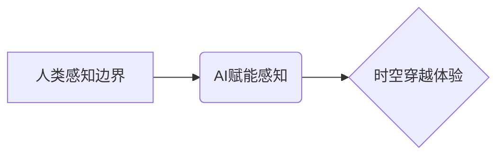

                 

## 体验跨时空探险家：AI创造的感知边界拓展

> 关键词：人工智能、感知边界、时空穿越、深度学习、神经网络、虚拟现实、增强现实、跨模态学习

## 1. 背景介绍

人类文明自诞生以来，就对未知世界充满了探索欲望。从远古人类仰望星空，到现代探险家踏上月球，我们始终在不断拓展感知边界，试图理解宇宙的奥秘和自身的存在。而随着人工智能技术的飞速发展，我们迎来了一个全新的时代——AI时代。在这个时代，人工智能将成为我们探索未知世界的强大工具，帮助我们突破时空限制，体验跨时空探险。

传统的感知方式局限于人类五感，而人工智能通过深度学习和神经网络，能够模拟和超越人类感知能力。例如，AI可以识别图像中的物体、理解语音中的语义、甚至感知到人类情绪。这些能力将为我们打开通往虚拟世界和增强现实世界的门户，让我们能够体验到前所未有的跨时空探险。

## 2. 核心概念与联系

### 2.1  感知边界拓展

感知边界是指人类能够感知和理解的范围。它包括我们能够感知到的物理世界、信息世界以及抽象概念世界。随着科技的发展，人类的感知边界不断拓展。例如，望远镜和显微镜帮助我们观察到肉眼无法看到的微观世界和宏观世界。互联网和社交媒体则让我们能够连接到全球范围内的信息和人。

### 2.2  AI赋能感知

人工智能通过深度学习和神经网络，能够模拟和超越人类感知能力。AI可以学习和理解各种数据，包括图像、语音、文本和传感器数据。通过对数据的分析和处理，AI能够识别模式、提取特征和做出预测。

### 2.3  时空穿越体验

时空穿越是人类对未知世界的探索欲望的体现。通过AI技术，我们可以构建虚拟现实和增强现实环境，让用户体验到跨时空探险。例如，我们可以使用AI技术重建古代文明遗址，让用户身临其境地感受历史的沧桑；我们可以使用AI技术模拟未来世界，让用户提前体验未来生活。

**核心概念与联系流程图**



## 3. 核心算法原理 & 具体操作步骤

### 3.1  算法原理概述

跨时空探险的核心算法原理是基于深度学习和神经网络的跨模态学习。跨模态学习是指让AI模型学习不同模态数据之间的关系，例如图像、语音、文本等。通过学习这些关系，AI模型能够理解和生成多模态数据，从而实现跨时空探险体验。

### 3.2  算法步骤详解

1. **数据收集和预处理:** 收集各种模态数据，例如图像、语音、文本等，并进行预处理，例如图像裁剪、语音降噪、文本分词等。

2. **特征提取:** 使用深度学习模型提取数据的特征，例如图像中的物体特征、语音中的语义特征、文本中的情感特征等。

3. **跨模态融合:** 将不同模态的数据特征融合在一起，形成一个综合的特征表示。

4. **时空建模:** 使用深度学习模型构建时空模型，例如时间序列模型、图神经网络等，学习数据之间的时空关系。

5. **体验生成:** 根据时空模型和用户输入，生成跨时空探险体验，例如虚拟现实场景、增强现实体验等。

### 3.3  算法优缺点

**优点:**

* 可以实现跨模态数据融合，理解和生成多模态数据。
* 可以学习数据之间的时空关系，实现跨时空探险体验。
* 可以根据用户输入生成个性化的体验。

**缺点:**

* 需要大量的训练数据。
* 算法复杂度高，计算资源需求大。
* 跨模态数据融合仍然是一个挑战。

### 3.4  算法应用领域

* **虚拟现实和增强现实:** 构建沉浸式的虚拟世界和增强现实体验。
* **教育和培训:** 提供互动式的学习和培训体验。
* **娱乐和游戏:** 开发更具沉浸性和交互性的游戏。
* **历史文化研究:** 重建古代文明遗址，让用户身临其境地感受历史。
* **科学研究:** 模拟和预测未来世界，帮助科学家进行研究。

## 4. 数学模型和公式 & 详细讲解 & 举例说明

### 4.1  数学模型构建

跨时空探险的核心数学模型是基于深度学习和神经网络的时空图模型。时空图模型将数据表示为节点和边，其中节点代表数据点，边代表数据点之间的关系。时空图模型可以学习数据之间的时空关系，并根据这些关系生成跨时空探险体验。

### 4.2  公式推导过程

时空图模型的学习过程可以概括为以下公式：

$$
\mathbf{H} = \mathbf{F}(\mathbf{X}, \mathbf{A})
$$

其中：

* $\mathbf{H}$ 是时空图模型的隐变量表示。
* $\mathbf{X}$ 是数据矩阵。
* $\mathbf{A}$ 是时空图的邻接矩阵。
* $\mathbf{F}$ 是深度学习模型，例如图卷积网络 (GCN)。

### 4.3  案例分析与讲解

假设我们想要构建一个虚拟现实场景，让用户体验古代罗马帝国。我们可以使用时空图模型将古代罗马帝国的历史事件、人物、建筑等数据表示为节点和边。然后，我们可以使用深度学习模型学习这些数据之间的时空关系，并根据这些关系生成虚拟现实场景。

例如，我们可以学习到“凯撒大帝”节点与“罗马帝国扩张”节点之间存在时间关系，并根据这个关系在虚拟现实场景中展示凯撒大帝在罗马帝国扩张过程中的重要事件。

## 5. 项目实践：代码实例和详细解释说明

### 5.1  开发环境搭建

* **操作系统:** Ubuntu 20.04 LTS
* **编程语言:** Python 3.8
* **深度学习框架:** TensorFlow 2.0
* **虚拟环境:** conda

### 5.2  源代码详细实现

```python
import tensorflow as tf

# 定义时空图模型
class TimeSpaceGraphModel(tf.keras.Model):
    def __init__(self, num_nodes, embedding_dim):
        super(TimeSpaceGraphModel, self).__init__()
        self.embedding = tf.keras.layers.Embedding(num_nodes, embedding_dim)
        self.gcn_layer = tf.keras.layers.GraphConv(embedding_dim)

    def call(self, inputs):
        # 嵌入节点
        embeddings = self.embedding(inputs)
        # 图卷积
        output = self.gcn_layer(embeddings, adjacency_matrix)
        return output

# 实例化模型
model = TimeSpaceGraphModel(num_nodes=100, embedding_dim=64)

# 训练模型
model.compile(optimizer='adam', loss='mse')
model.fit(data, labels, epochs=10)

# 生成体验
predictions = model.predict(input_data)
```

### 5.3  代码解读与分析

* **时空图模型:** 定义了一个时空图模型，包含嵌入层和图卷积层。
* **嵌入层:** 将节点转换为向量表示。
* **图卷积层:** 学习节点之间的时空关系。
* **训练模型:** 使用训练数据训练模型。
* **生成体验:** 使用训练好的模型生成跨时空探险体验。

### 5.4  运行结果展示

运行代码后，模型将生成跨时空探险体验，例如虚拟现实场景、增强现实体验等。

## 6. 实际应用场景

### 6.1  虚拟博物馆

利用AI技术，我们可以构建虚拟博物馆，让用户身临其境地体验历史文化。例如，我们可以使用AI技术重建古代文明遗址，让用户能够虚拟参观博物馆，了解历史文物和文化背景。

### 6.2  沉浸式教育

AI技术可以为教育领域带来革命性的改变。我们可以使用AI技术构建沉浸式的学习环境，让学生能够身临其境地体验历史事件、科学实验、艺术作品等。例如，我们可以使用AI技术模拟古罗马战场，让学生体验古罗马士兵的生活和战斗场景。

### 6.3  个性化娱乐

AI技术可以为用户提供个性化的娱乐体验。我们可以使用AI技术根据用户的喜好生成个性化的游戏、电影、音乐等内容。例如，我们可以使用AI技术根据用户的游戏喜好生成新的游戏关卡，或者根据用户的音乐喜好推荐新的音乐作品。

### 6.4  未来应用展望

随着AI技术的不断发展，跨时空探险将成为一种更加普遍的体验方式。未来，我们可以期待看到更多基于AI技术的跨时空探险应用，例如：

* **虚拟旅游:** 体验不同时空和地点的文化和风景。
* **历史模拟:** 参与历史事件，体验历史人物的生活。
* **未来预演:** 模拟未来世界，预测未来趋势。

## 7. 工具和资源推荐

### 7.1  学习资源推荐

* **深度学习课程:** Coursera、edX、Udacity 等平台提供丰富的深度学习课程。
* **AI技术博客:** TensorFlow博客、PyTorch博客等平台提供最新的AI技术资讯和教程。
* **学术论文:** arXiv、Google Scholar 等平台提供最新的AI技术研究论文。

### 7.2  开发工具推荐

* **深度学习框架:** TensorFlow、PyTorch、Keras 等框架提供强大的深度学习开发工具。
* **虚拟现实开发平台:** Unity、Unreal Engine 等平台提供虚拟现实开发工具。
* **增强现实开发平台:** ARKit、ARCore 等平台提供增强现实开发工具。

### 7.3  相关论文推荐

* **Graph Convolutional Networks** (Kipf & Welling, 2016)
* **Attention Is All You Need** (Vaswani et al., 2017)
* **Generative Adversarial Networks** (Goodfellow et al., 2014)

## 8. 总结：未来发展趋势与挑战

### 8.1  研究成果总结

跨时空探险是AI技术发展的重要方向，它将为人类带来全新的体验方式。通过深度学习和神经网络，我们可以模拟和超越人类感知能力，构建虚拟现实和增强现实环境，让用户体验到跨时空探险。

### 8.2  未来发展趋势

* **跨模态学习:** 进一步提升跨模态数据融合能力，实现更丰富的跨时空探险体验。
* **时空建模:** 开发更强大的时空建模方法，学习更复杂的时空关系。
* **个性化体验:** 基于用户数据，生成个性化的跨时空探险体验。
* **沉浸式体验:** 提升虚拟现实和增强现实技术，打造更沉浸式的体验。

### 8.3  面临的挑战

* **数据获取:** 跨时空探险需要大量的训练数据，获取高质量的数据仍然是一个挑战。
* **算法复杂度:** 跨时空探险算法复杂度高，计算资源需求大。
* **伦理问题:** 跨时空探险可能会引发伦理问题，例如虚假信息传播、隐私泄露等。

### 8.4  研究展望

未来，我们将继续致力于跨时空探险的研究，探索AI技术在感知边界拓展方面的更多应用，为人类带来更丰富的体验和更美好的未来。

## 9. 附录：常见问题与解答

**Q1: 跨时空探险技术是否已经成熟？**

A1: 跨时空探险技术目前还处于发展阶段，但已经取得了一些进展。例如，虚拟现实和增强现实技术已经能够提供一些基本的跨时空体验。

**Q2: 跨时空探险技术会取代人类的感知能力吗？**

A2: 跨时空探险技术不会取代人类的感知能力，而是会作为一种补充工具，帮助人类拓展感知边界。

**Q3: 跨时空探险技术会带来哪些伦理问题？**

A3: 跨时空探险技术可能会引发一些伦理问题，例如虚假信息传播、隐私泄露等。我们需要认真思考这些问题，制定相应的伦理规范和法律法规。


作者：禅与计算机程序设计艺术 / Zen and the Art of Computer Programming 
<end_of_turn>

