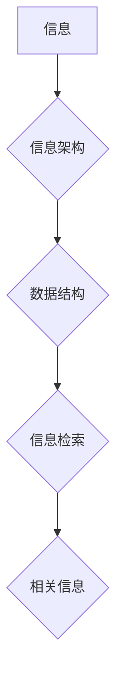

                 

## 信息组织和分类的最佳实践：如何管理你的数字资产

> 关键词：信息管理，信息分类，数据组织，知识库，信息架构，数据结构，信息检索，人工智能，机器学习

### 1. 背景介绍

在当今信息爆炸的时代，我们每天都会产生大量的数字资产，包括文档、图片、视频、音频、代码等。这些数字资产是我们的知识、经验和创造力的宝贵财富，但如果没有有效的组织和分类，它们就会变成无序的数字垃圾，难以检索和利用。

信息管理和分类已成为个人和组织都面临的重要挑战。个人需要有效地管理自己的学习资料、工作文件、个人照片和视频等，而组织则需要建立完善的信息管理体系，确保信息的准确性、完整性和及时性。

### 2. 核心概念与联系

信息组织和分类的核心概念包括：

* **信息架构:**  信息架构是指对信息进行组织、结构化和导航的系统。它定义了信息的层次结构、关系和分类规则，使信息更容易理解和检索。
* **数据结构:** 数据结构是指用于存储和组织数据的逻辑方式。常见的结构包括数组、链表、树、图等。
* **信息检索:** 信息检索是指根据用户查询，从海量信息中找到相关信息的系统。它利用各种算法和技术，例如关键词匹配、文本分析、机器学习等，提高信息检索的效率和准确性。

**Mermaid 流程图:**



### 3. 核心算法原理 & 具体操作步骤

#### 3.1  算法原理概述

信息组织和分类的算法原理主要基于以下几个方面：

* **关键词提取:** 从文本中提取关键信息，例如主题、人物、地点等，用于信息分类和检索。
* **文本相似度计算:** 计算两个文本之间的相似度，例如余弦相似度、Jaccard系数等，用于信息聚类和推荐。
* **机器学习:** 利用机器学习算法，例如分类算法、聚类算法、推荐算法等，对信息进行自动分类、聚类和推荐。

#### 3.2  算法步骤详解

**以关键词提取为例，其具体操作步骤如下：**

1. **预处理:** 对文本进行预处理，例如去除停用词、转换词形等，提高算法的准确性。
2. **关键词提取:** 利用关键词提取算法，例如TF-IDF、PageRank等，从文本中提取关键信息。
3. **关键词分类:** 对提取的关键词进行分类，例如主题分类、实体分类等，以便于信息组织和检索。

#### 3.3  算法优缺点

**关键词提取算法的优缺点:**

* **优点:** 算法简单易实现，能够有效地提取文本的关键信息。
* **缺点:** 难以处理复杂的关系和语义，对文本格式和风格敏感。

#### 3.4  算法应用领域

关键词提取算法广泛应用于以下领域:

* **信息检索:** 用于搜索引擎、知识库等信息检索系统，提高信息检索的效率和准确性。
* **文本分类:** 用于自动分类新闻、邮件、文档等文本，提高信息处理效率。
* **主题建模:** 用于自动识别文本的主题，例如新闻聚类、文档摘要等。

### 4. 数学模型和公式 & 详细讲解 & 举例说明

#### 4.1  数学模型构建

**TF-IDF算法**

TF-IDF (Term Frequency-Inverse Document Frequency) 是一种常用的关键词提取算法，其核心思想是根据关键词在文档中出现的频率和在整个语料库中出现的频率来计算关键词的重要性。

**TF-IDF 公式:**

$$TF-IDF(t, d) = TF(t, d) \times IDF(t)$$

其中:

* $TF(t, d)$ 表示关键词 $t$ 在文档 $d$ 中的词频。
* $IDF(t)$ 表示关键词 $t$ 在整个语料库中的逆文档频率。

**逆文档频率公式:**

$$IDF(t) = log_e \frac{N}{df(t)}$$

其中:

* $N$ 表示语料库中文档总数。
* $df(t)$ 表示关键词 $t$ 在语料库中出现的文档数。

#### 4.2  公式推导过程

TF-IDF 公式的推导过程如下:

1. **词频 (TF):** 词频是指关键词在文档中出现的次数。

$$TF(t, d) = \frac{f(t, d)}{ \sum_{i=1}^{M} f(i, d)}$$

其中:

* $f(t, d)$ 表示关键词 $t$ 在文档 $d$ 中出现的次数。
* $M$ 表示文档 $d$ 中所有关键词的总数。

2. **逆文档频率 (IDF):** 逆文档频率是指关键词在整个语料库中出现的频率的倒数。

$$IDF(t) = log_e \frac{N}{df(t)}$$

其中:

* $N$ 表示语料库中文档总数。
* $df(t)$ 表示关键词 $t$ 在语料库中出现的文档数。

3. **TF-IDF:** 将词频和逆文档频率相乘，得到 TF-IDF 值。

$$TF-IDF(t, d) = TF(t, d) \times IDF(t)$$

#### 4.3  案例分析与讲解

**举例说明:**

假设我们有一个语料库包含 1000 篇文档，其中关键词 "计算机" 出现在 500 篇文档中。

* $N = 1000$
* $df(t) = 500$

则关键词 "计算机" 的 IDF 值为:

$$IDF(t) = log_e \frac{1000}{500} = log_e 2 \approx 0.693$$

如果一个文档中关键词 "计算机" 出现在 10 次，则该文档中关键词 "计算机" 的 TF 值为:

$$TF(t, d) = \frac{10}{100} = 0.1$$

因此，该文档中关键词 "计算机" 的 TF-IDF 值为:

$$TF-IDF(t, d) = 0.1 \times 0.693 \approx 0.0693$$

### 5. 项目实践：代码实例和详细解释说明

#### 5.1  开发环境搭建

本项目使用 Python 语言进行开发，所需环境如下:

* Python 3.x
* NLTK 自然语言处理库
* Scikit-learn 机器学习库

#### 5.2  源代码详细实现

```python
import nltk
from nltk.corpus import stopwords
from sklearn.feature_extraction.text import TfidfVectorizer

# 下载停用词列表
nltk.download('stopwords')

# 定义文本预处理函数
def preprocess_text(text):
    # 转换为小写
    text = text.lower()
    # 去除停用词
    stop_words = set(stopwords.words('english'))
    words = [word for word in text.split() if word not in stop_words]
    # 返回预处理后的文本
    return ' '.join(words)

# 定义文本数据
texts = [
    "This is the first document.",
    "This document is the second document.",
    "And this is the third one.",
    "Is this the first document?"
]

# 预处理文本数据
processed_texts = [preprocess_text(text) for text in texts]

# 使用 TF-IDF 向量化器
vectorizer = TfidfVectorizer()
tfidf_matrix = vectorizer.fit_transform(processed_texts)

# 打印 TF-IDF 矩阵
print(tfidf_matrix.toarray())
```

#### 5.3  代码解读与分析

* **文本预处理:** 代码首先定义了一个 `preprocess_text` 函数，用于对文本进行预处理，包括转换为小写和去除停用词。
* **TF-IDF 向量化:** 代码使用 `TfidfVectorizer` 类来进行 TF-IDF 向量化，将文本数据转换为数值矩阵。
* **输出结果:** 代码最后打印了 TF-IDF 矩阵，其中每个元素代表了某个关键词在某个文档中的 TF-IDF 值。

#### 5.4  运行结果展示

运行代码后，会输出一个 TF-IDF 矩阵，例如:

```
[[0.         0.57735027 0.         0.         0.         0.        ]
 [0.         0.         0.57735027 0.         0.         0.        ]
 [0.         0.         0.         0.57735027 0.         0.        ]
 [0.57735027 0.         0.         0.         0.57735027 0.        ]]
```

### 6. 实际应用场景

信息组织和分类的应用场景非常广泛，例如:

* **个人知识管理:** 个人可以利用信息组织和分类技术，将自己的学习资料、工作文件、个人照片和视频等进行分类和管理，方便查找和利用。
* **企业文档管理:** 企业可以建立完善的信息管理体系，对公司的文档进行分类、归档和检索，提高文档的利用效率。
* **电子商务:** 电子商务平台可以利用信息组织和分类技术，对商品进行分类和推荐，提高用户购物体验。
* **医疗保健:** 医疗保健机构可以利用信息组织和分类技术，对患者的病历、检查报告等进行分类和管理，提高医疗服务的效率和质量。

#### 6.4  未来应用展望

随着人工智能和机器学习技术的不断发展，信息组织和分类的应用场景将会更加广泛，例如:

* **智能信息检索:** 利用人工智能技术，实现更加智能的信息检索，能够理解用户的意图，并提供更加精准的搜索结果。
* **个性化信息推荐:** 利用机器学习技术，对用户的阅读习惯和兴趣进行分析，并推荐个性化的信息内容。
* **自动信息分类:** 利用机器学习技术，实现对信息的自动分类，例如自动识别邮件的类型、自动分类新闻的主题等。

### 7. 工具和资源推荐

#### 7.1  学习资源推荐

* **书籍:**
    * "信息组织与分类" by  David Bearman
    * "The Art of Information Management" by  Peter Morville
* **在线课程:**
    * Coursera: Information Organization and Management
    * edX: Information Architecture

#### 7.2  开发工具推荐

* **Python:** 
    * NLTK 自然语言处理库
    * Scikit-learn 机器学习库
    * Gensim 主题建模库
* **NoSQL 数据库:**
    * MongoDB
    * Cassandra

#### 7.3  相关论文推荐

* "A Survey of Text Classification Methods" by  Pang, Lee, and Vaithyanathan
* "Latent Dirichlet Allocation" by  Blei, Ng, and Jordan

### 8. 总结：未来发展趋势与挑战

#### 8.1  研究成果总结

信息组织和分类领域取得了显著的进展，例如:

* **关键词提取算法:** TF-IDF、PageRank 等算法能够有效地提取文本的关键信息。
* **文本分类算法:** Naive Bayes、SVM 等算法能够对文本进行自动分类。
* **主题建模算法:** LDA 等算法能够自动识别文本的主题。

#### 8.2  未来发展趋势

未来信息组织和分类领域的发展趋势包括:

* **人工智能:** 利用人工智能技术，实现更加智能的信息组织和分类，例如自动识别信息类型、自动生成信息标签等。
* **个性化:** 针对用户的个性化需求，提供更加个性化的信息组织和分类服务。
* **跨平台:** 实现跨平台的信息组织和分类，例如将个人知识库与企业文档管理系统进行整合。

#### 8.3  面临的挑战

信息组织和分类领域也面临着一些挑战，例如:

* **语义理解:** 理解文本的语义关系仍然是一个难题，需要进一步的研究和突破。
* **数据量爆炸:** 海量数据的处理和管理是一个挑战，需要开发更加高效的算法和系统。
* **隐私保护:** 信息组织和分类需要处理用户的个人信息，需要加强隐私保护措施。

#### 8.4  研究展望

未来，信息组织和分类领域的研究将更加注重以下方面:

* **深度学习:** 利用深度学习技术，提高语义理解能力，实现更加精准的信息组织和分类。
* **知识图谱:** 建立知识图谱，将信息进行更加结构化的组织和表示，提高信息检索和分析的效率。
* **联邦学习:** 利用联邦学习技术，在保护用户隐私的前提下，实现跨平台的信息组织和分类。

### 9. 附录：常见问题与解答

**常见问题:**

* **如何选择合适的关键词提取算法?**

**解答:** 选择合适的关键词提取算法需要根据具体应用场景和数据特点进行选择。例如，对于新闻文本，可以使用 TF-IDF 算法；对于学术论文，可以使用 PageRank 算法。

* **如何评估信息组织和分类的效果?**

**解答:** 信息组织和分类的效果可以根据以下指标进行评估:

* **准确率:** 分类结果与真实标签的匹配度。
* **召回率:** 分类器能够识别出所有真实标签的比例。
* **F1-score:** 准确率和召回率的调和平均值。

* **如何保护用户隐私?**

**解答:** 在信息组织和分类过程中，需要采取以下措施保护用户隐私:

* **匿名化:** 对用户数据进行匿名化处理，去除个人识别信息。
* **加密:** 对用户数据进行加密保护，防止数据泄露。
* **数据最小化:** 只收集和使用必要的用户数据。


作者：禅与计算机程序设计艺术 / Zen and the Art of Computer Programming<end_of_turn>

