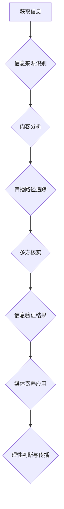

                 

## 信息验证和媒体素养教育：为假新闻、媒体操纵和错误信息时代做好准备

> 关键词：信息验证、媒体素养、假新闻、深度学习、自然语言处理、信息安全、网络安全、人工智能

### 1. 背景介绍

在当今信息爆炸的时代，我们每天都被海量的信息淹没。从社交媒体到新闻网站，从搜索引擎到电子邮件，信息无处不在。然而，这庞大的信息量也带来了新的挑战：假新闻、媒体操纵和错误信息的泛滥。这些虚假信息不仅会误导公众，影响人们的判断，还会加剧社会分化，甚至威胁国家安全。

面对这一严峻形势，信息验证和媒体素养教育显得尤为重要。信息验证是指通过多种手段，对信息来源、内容和传播路径进行核实，以判断信息的真实性和可靠性。媒体素养则是指人们对媒体内容进行批判性思考、分析和评价的能力，能够识别和抵制虚假信息。

### 2. 核心概念与联系

**2.1 信息验证的流程**

信息验证是一个多步骤的过程，通常包括以下几个环节：

* **信息来源识别:** 首先要确定信息的来源，例如新闻网站、社交媒体账号、个人博客等。不同的信息来源具有不同的可信度，需要根据来源进行判断。
* **内容分析:** 对信息的具体内容进行分析，例如事实性、逻辑性、情感性等。可以通过查证事实、寻找逻辑漏洞、识别情感煽动等方式进行分析。
* **传播路径追踪:** 追踪信息的传播路径，例如转发次数、传播速度、传播渠道等。可以帮助判断信息的传播范围和影响力，以及是否存在恶意传播行为。
* **多方核实:** 通过多种渠道进行信息核实，例如官方网站、权威机构、专业人士等。多方核实可以提高信息的可靠性。

**2.2 媒体素养的要素**

媒体素养是一个复杂的综合能力，包括以下几个要素：

* **信息获取:** 能够从各种媒体渠道获取信息，并了解不同媒体的特性和局限性。
* **信息筛选:** 能够对获取的信息进行筛选，识别重要信息和无关信息。
* **信息理解:** 能够理解信息的含义，并将其与已有的知识和经验进行关联。
* **信息评价:** 能够对信息的真实性、准确性、客观性等进行评价，并识别潜在的偏见和误导。
* **信息传播:** 能够理性地传播信息，并注意信息来源和传播路径。

**2.3 信息验证与媒体素养的联系**

信息验证和媒体素养是相互关联、相互促进的。信息验证提供了一种方法来识别和抵制虚假信息，而媒体素养则为人们提供了批判性思考和判断的能力，能够更好地运用信息验证的方法。

**Mermaid 流程图**



### 3. 核心算法原理 & 具体操作步骤

**3.1 算法原理概述**

信息验证算法通常基于自然语言处理（NLP）和机器学习（ML）技术，通过分析文本内容、结构和语义特征，识别虚假信息和潜在的操纵行为。常见的算法包括：

* **文本分类算法:** 将文本分类为真实、虚假或可疑，例如支持向量机（SVM）、随机森林（RF）、深度神经网络（DNN）。
* **情感分析算法:** 分析文本的情感倾向，识别情感煽动和恶意传播。
* **谣言传播模型:** 模拟谣言的传播过程，预测谣言的传播速度和影响范围。
* **反向搜索算法:** 通过搜索引擎反向搜索文本内容，识别信息来源和传播路径。

**3.2 算法步骤详解**

以文本分类算法为例，其具体操作步骤如下：

1. **数据预处理:** 对文本数据进行清洗、分词、词性标注等预处理，以便算法更好地理解文本内容。
2. **特征提取:** 从预处理后的文本数据中提取特征，例如词频、词向量、语法结构等。
3. **模型训练:** 使用训练数据训练文本分类模型，例如 SVM、RF 或 DNN。
4. **模型评估:** 使用测试数据评估模型的性能，例如准确率、召回率、F1-score 等。
5. **模型部署:** 将训练好的模型部署到实际应用场景中，例如网站、应用程序等。

**3.3 算法优缺点**

**优点:**

* **自动化:** 可以自动化地识别和分类虚假信息，提高效率。
* **精准度:** 使用深度学习算法可以实现较高的识别精准度。
* **可扩展性:** 可以根据需要扩展算法功能，例如识别特定类型的虚假信息。

**缺点:**

* **数据依赖:** 算法的性能取决于训练数据的质量和数量。
* **误判风险:** 算法可能存在误判风险，将真实信息误判为虚假信息。
* **对抗攻击:** 攻击者可以利用对抗样本攻击算法，使其产生错误判断。

**3.4 算法应用领域**

信息验证算法广泛应用于以下领域：

* **新闻媒体:** 识别和过滤假新闻，维护新闻的真实性和可靠性。
* **社交媒体:** 识别和删除虚假信息和恶意传播，维护社交平台的健康发展。
* **搜索引擎:** 排除虚假信息，提高搜索结果的质量和准确性。
* **政府机构:** 识别和应对网络谣言和信息攻击，维护国家安全和社会稳定。

### 4. 数学模型和公式 & 详细讲解 & 举例说明

**4.1 数学模型构建**

信息验证算法通常基于概率模型，例如贝叶斯网络或隐马尔可夫模型。这些模型可以用来计算信息真实性的概率，并根据概率阈值进行判断。

**4.2 公式推导过程**

例如，使用贝叶斯定理可以计算信息真实性的概率：

$$P(真实|证据) = \frac{P(证据|真实) * P(真实)}{P(证据)}$$

其中：

* $P(真实|证据)$ 是信息真实性的后验概率。
* $P(证据|真实)$ 是给定信息真实的情况下观察到证据的先验概率。
* $P(真实)$ 是信息真实性的先验概率。
* $P(证据)$ 是观察到证据的总概率。

**4.3 案例分析与讲解**

假设我们有一个信息，其内容是“某明星在某地举办演唱会”。我们可以使用贝叶斯定理来计算该信息的真实性概率。

* $P(证据|真实)$ 可以通过查询明星的官方网站、社交媒体账号等渠道获取。
* $P(真实)$ 可以通过查询明星的以往活动记录、媒体报道等渠道获取。
* $P(证据)$ 可以通过查询所有关于该明星演唱会的相关信息获取。

通过计算上述概率值，我们可以得到该信息的真实性概率，并根据概率阈值进行判断。

### 5. 项目实践：代码实例和详细解释说明

**5.1 开发环境搭建**

* 操作系统：Linux 或 macOS
* Python 版本：3.6 或更高版本
* 必要的库：NLTK、Scikit-learn、TensorFlow 或 PyTorch

**5.2 源代码详细实现**

以下是一个简单的文本分类算法的代码示例，使用 Scikit-learn 库实现：

```python
from sklearn.feature_extraction.text import TfidfVectorizer
from sklearn.linear_model import LogisticRegression
from sklearn.model_selection import train_test_split

# 数据加载
data = [
    ("这是真实信息", "真实"),
    ("这是虚假信息", "虚假"),
    # ...
]

# 数据预处理
X = [text for text, label in data]
y = [label for text, label in data]

# 特征提取
vectorizer = TfidfVectorizer()
X = vectorizer.fit_transform(X)

# 模型训练
model = LogisticRegression()
model.fit(X, y)

# 模型评估
# ...

# 模型部署
# ...
```

**5.3 代码解读与分析**

* 代码首先加载数据，并进行文本预处理和特征提取。
* 然后使用 LogisticRegression 模型训练分类器。
* 最后可以评估模型性能，并将其部署到实际应用场景中。

**5.4 运行结果展示**

运行上述代码后，可以得到模型的训练结果和评估指标，例如准确率、召回率、F1-score 等。

### 6. 实际应用场景

信息验证技术在多个领域都有着广泛的应用场景：

* **新闻媒体:** 识别和过滤假新闻，维护新闻的真实性和可靠性。
* **社交媒体:** 识别和删除虚假信息和恶意传播，维护社交平台的健康发展。
* **搜索引擎:** 排除虚假信息，提高搜索结果的质量和准确性。
* **政府机构:** 识别和应对网络谣言和信息攻击，维护国家安全和社会稳定。
* **教育领域:** 培养学生的信息素养，帮助他们辨别真假信息。

**6.4 未来应用展望**

随着人工智能技术的不断发展，信息验证技术将更加智能化、自动化和精准化。未来，信息验证技术可能应用于以下领域：

* **个性化信息验证:** 根据用户的兴趣、偏好和背景，提供个性化的信息验证服务。
* **跨语言信息验证:** 支持多种语言的信息验证，打破语言障碍。
* **多模态信息验证:** 结合文本、图像、音频等多模态信息进行验证，提高验证的准确性和可靠性。

### 7. 工具和资源推荐

**7.1 学习资源推荐**

* **书籍:**
    * 《信息论与编码》
    * 《自然语言处理》
    * 《机器学习》
* **在线课程:**
    * Coursera: 自然语言处理
    * edX: 机器学习
    * Udacity: 深度学习

**7.2 开发工具推荐**

* **Python:** 广泛应用于信息验证领域，拥有丰富的库和工具。
* **NLTK:** 自然语言处理工具包，提供文本预处理、词性标注、语义分析等功能。
* **Scikit-learn:** 机器学习库，提供各种分类、回归、聚类等算法。
* **TensorFlow 或 PyTorch:** 深度学习框架，用于训练复杂的深度学习模型。

**7.3 相关论文推荐**

* **Detecting Fake News with Deep Learning**
* **A Survey of Fake News Detection Methods**
* **Combating Fake News with Natural Language Processing**

### 8. 总结：未来发展趋势与挑战

**8.1 研究成果总结**

近年来，信息验证技术取得了显著进展，特别是深度学习算法的应用，使得信息验证的准确率和效率得到了大幅提升。

**8.2 未来发展趋势**

未来，信息验证技术将朝着以下方向发展：

* **更加智能化:** 利用人工智能技术，实现更加智能化的信息验证，例如自动识别虚假信息类型、预测虚假信息的传播路径等。
* **更加个性化:** 根据用户的需求和偏好，提供更加个性化的信息验证服务。
* **更加跨领域:** 将信息验证技术应用于更多领域，例如医疗、金融、教育等。

**8.3 面临的挑战**

信息验证技术也面临着一些挑战：

* **数据质量:** 虚假信息往往具有多样性和复杂性，需要不断收集和更新高质量的训练数据。
* **对抗攻击:** 攻击者可能会利用对抗样本攻击信息验证算法，使其产生错误判断。
* **伦理问题:** 信息验证技术可能会涉及到隐私、言论自由等伦理问题，需要谨慎考虑和解决。

**8.4 研究展望**

未来，我们需要继续加强对信息验证技术的研发，探索新的算法和方法，提高信息验证的准确性和可靠性。同时，还需要加强与社会各界的合作，共同构建一个更加健康、安全的网络环境。

### 9. 附录：常见问题与解答

**常见问题:**

* 如何判断信息真实性？
* 如何识别虚假信息？
* 如何保护自己免受虚假信息的影响？

**解答:**

* 信息真实性可以通过多方核实、查证事实、识别情感煽动等方式判断。
* 虚假信息通常具有以下特征：标题耸动、内容夸大、缺乏证据、来源不可靠等。
* 要保护自己免受虚假信息的影响，可以提高信息素养，学会批判性思考，多方核实信息来源，避免盲目转发。


作者：禅与计算机程序设计艺术 / Zen and the Art of Computer Programming<end_of_turn>

