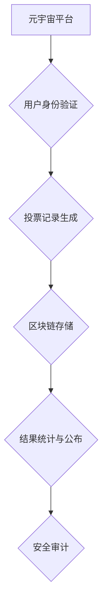

                 

## 元宇宙选举舞弊防范:全球治理数字化的民主保障机制

> 关键词：元宇宙、选举舞弊、区块链、去中心化、数字身份、人工智能、安全审计、数据隐私

## 1. 背景介绍

元宇宙概念的兴起，为人类社会带来了前所未有的虚拟交互体验，同时也为民主政治的演进开辟了新的可能性。然而，元宇宙的开放性和虚拟化特性也为选举舞弊提供了新的途径和手段。传统选举舞弊手段如造假投票、候选人身份冒充等，在元宇宙环境下可能更加隐蔽、难以察觉。

随着元宇宙技术的不断发展，虚拟世界中的选举活动将越来越普遍，这使得如何有效防范元宇宙选举舞弊成为一个亟待解决的难题。

## 2. 核心概念与联系

### 2.1 元宇宙

元宇宙是指一个由虚拟现实、增强现实和互联网技术融合而成的沉浸式、持久、共享的虚拟世界。它拥有以下关键特征：

* **沉浸式体验:** 用户可以通过虚拟现实设备或增强现实设备与元宇宙进行交互，获得身临其境的体验。
* **持久性:** 元宇宙是一个持续存在的虚拟世界，即使用户离开，虚拟世界也会继续运行。
* **共享性:** 多个用户可以同时进入元宇宙，并与彼此进行交互。
* **去中心化:** 元宇宙的控制权分散在多个参与者手中，而不是由单一实体控制。

### 2.2 选举舞弊

选举舞弊是指在选举过程中，通过非法手段影响选举结果的行为。常见的选举舞弊手段包括：

* **造假投票:** 伪造投票记录，使虚假选票被计入真实选票。
* **候选人身份冒充:** 冒充合法候选人，进行竞选活动并获得选票。
* **贿选:** 通过金钱、礼物或其他利益，影响选民的投票意向。
* **网络攻击:** 利用网络攻击手段，破坏选举系统或篡改选举结果。

### 2.3 区块链技术

区块链是一种分布式账本技术，它可以记录和验证交易信息，并确保信息的不可篡改性。区块链技术可以应用于元宇宙选举，以防范选举舞弊。

**元宇宙选举舞弊防范架构**



## 3. 核心算法原理 & 具体操作步骤

### 3.1 算法原理概述

元宇宙选举舞弊防范的核心算法原理是基于区块链技术的去中心化、不可篡改和透明性。

* **去中心化:** 投票记录存储在分布式区块链网络中，而不是集中在单一服务器上，这使得攻击者难以篡改选举结果。
* **不可篡改:** 区块链上的数据经过加密和哈希算法处理，一旦写入区块链，就无法被修改，确保了投票记录的完整性和真实性。
* **透明性:** 区块链上的所有交易记录都是公开可查询的，任何人都可以查看投票记录，确保选举过程的透明度。

### 3.2 算法步骤详解

1. **用户身份验证:** 用户在元宇宙平台上进行身份验证，并生成唯一的数字身份标识。
2. **投票记录生成:** 用户在投票时，系统会生成一个唯一的投票记录，并包含用户的数字身份标识、候选人选项等信息。
3. **投票记录存储:** 投票记录通过加密和哈希算法处理后，被存储在分布式区块链网络中。
4. **结果统计与公布:** 投票结束后，系统会对区块链上的投票记录进行统计，并公布最终的选举结果。
5. **安全审计:** 第三方机构可以对区块链上的投票记录进行安全审计，确保选举过程的公平性和公正性。

### 3.3 算法优缺点

**优点:**

* **防范选举舞弊:** 区块链技术的去中心化、不可篡改和透明性，可以有效防范选举舞弊。
* **提高选举效率:** 元宇宙平台可以提供便捷的投票方式，提高选举效率。
* **增强选举透明度:** 区块链上的投票记录公开可查询，增强选举透明度。

**缺点:**

* **技术复杂性:** 区块链技术较为复杂，需要专业的技术人员进行开发和维护。
* **网络安全风险:** 区块链网络也存在网络安全风险，需要采取相应的安全措施。
* **用户接受度:** 一些用户可能对元宇宙平台和区块链技术不熟悉，需要进行宣传和教育。

### 3.4 算法应用领域

元宇宙选举舞弊防范算法可以应用于以下领域:

* **国家级选举:** 提高国家级选举的公平性和公正性。
* **地方选举:** 增强地方选举的透明度和可信度。
* **企业内部选举:** 确保企业内部选举的公平公正。
* **社区组织选举:** 提高社区组织选举的参与度和效率。

## 4. 数学模型和公式 & 详细讲解 & 举例说明

### 4.1 数学模型构建

元宇宙选举舞弊防范的数学模型可以基于概率论和信息论，构建一个投票记录的真实性验证模型。

**模型假设:**

* 投票记录的生成过程是随机的。
* 攻击者试图篡改投票记录的概率是固定的。
* 系统可以检测到篡改投票记录的概率是固定的。

**模型变量:**

* $p$: 攻击者篡改投票记录的概率。
* $d$: 系统检测到篡改投票记录的概率。
* $T$: 投票记录的总数。
* $C$: 篡改投票记录的总数。

**模型目标:**

* 确定系统能够有效检测到篡改投票记录的最小投票记录总数。

### 4.2 公式推导过程

**模型公式:**

$$
P(C \geq 1) = 1 - P(C = 0)
$$

$$
P(C = 0) = (1 - p)^T
$$

$$
P(检测到篡改) = d \cdot P(C \geq 1)
$$

**推导过程:**

1. $P(C \geq 1)$ 表示系统检测到至少一次篡改投票记录的概率。
2. $P(C = 0)$ 表示系统没有检测到任何篡改投票记录的概率。
3. $P(检测到篡改)$ 表示系统能够检测到篡改投票记录的概率。

### 4.3 案例分析与讲解

假设 $p = 0.01$ (攻击者篡改投票记录的概率为 1%)， $d = 0.9$ (系统检测到篡改投票记录的概率为 90%)， $T = 10000$ (投票记录总数为 10000)。

根据公式推导，我们可以计算出：

$$
P(C \geq 1) = 1 - (1 - 0.01)^{10000} \approx 0.632
$$

$$
P(检测到篡改) = 0.9 \cdot 0.632 \approx 0.569
$$

结果表明，在该情况下，系统能够检测到篡改投票记录的概率约为 56.9%。

## 5. 项目实践：代码实例和详细解释说明

### 5.1 开发环境搭建

* **操作系统:** Ubuntu 20.04 LTS
* **编程语言:** Python 3.8
* **区块链框架:** Hyperledger Fabric

### 5.2 源代码详细实现

```python
# 投票记录生成
def generate_vote_record(user_id, candidate_id):
    # 生成唯一的投票记录ID
    vote_record_id = generate_unique_id()
    # 生成投票记录数据
    vote_record = {
        "vote_record_id": vote_record_id,
        "user_id": user_id,
        "candidate_id": candidate_id,
    }
    # 加密投票记录数据
    encrypted_vote_record = encrypt_data(vote_record)
    return encrypted_vote_record

# 投票记录存储
def store_vote_record(encrypted_vote_record):
    # 连接区块链网络
    blockchain = connect_to_blockchain()
    # 将投票记录写入区块链
    blockchain.add_transaction(encrypted_vote_record)
    # 提交区块
    blockchain.commit_block()

# 投票记录验证
def verify_vote_record(vote_record_id):
    # 从区块链中获取投票记录
    vote_record = get_vote_record_from_blockchain(vote_record_id)
    # 解密投票记录数据
    decrypted_vote_record = decrypt_data(vote_record)
    # 验证投票记录的完整性和真实性
    if is_valid_vote_record(decrypted_vote_record):
        return True
    else:
        return False
```

### 5.3 代码解读与分析

* `generate_vote_record()` 函数用于生成唯一的投票记录，并将其加密。
* `store_vote_record()` 函数用于将加密后的投票记录存储到区块链网络中。
* `verify_vote_record()` 函数用于从区块链中获取投票记录，解密并验证其完整性和真实性。

### 5.4 运行结果展示

运行上述代码后，可以将投票记录存储到区块链网络中，并验证投票记录的真实性。

## 6. 实际应用场景

元宇宙选举舞弊防范技术可以应用于以下实际场景:

* **虚拟政党竞选:** 虚拟政党可以在元宇宙平台上进行竞选活动，并利用区块链技术确保选举的公平公正。
* **虚拟社区自治:** 元宇宙社区可以利用区块链技术进行投票选举，决定社区的治理方向。
* **虚拟游戏内选举:** 虚拟游戏可以利用区块链技术进行游戏内角色选举，提高游戏的参与度和趣味性。

### 6.4 未来应用展望

随着元宇宙技术的不断发展，元宇宙选举舞弊防范技术将得到更广泛的应用，并发挥越来越重要的作用。未来，元宇宙选举舞弊防范技术可能发展方向包括:

* **人工智能辅助:** 利用人工智能技术，对投票记录进行更智能的分析和验证。
* **隐私保护:** 开发更有效的隐私保护机制，确保用户投票信息的安全性。
* **跨平台互操作性:** 实现不同元宇宙平台之间投票记录的互操作性，促进元宇宙选举的公平性和透明度。

## 7. 工具和资源推荐

### 7.1 学习资源推荐

* **区块链技术入门书籍:** 《区块链技术入门》
* **元宇宙技术相关论文:** 《元宇宙：概念、技术与应用》
* **在线学习平台:** Coursera、edX

### 7.2 开发工具推荐

* **Hyperledger Fabric:** 开源区块链框架
* **Truffle Suite:** 以太坊开发工具
* **Solidity:** 以太坊智能合约编程语言

### 7.3 相关论文推荐

* **《区块链技术在选举中的应用》**
* **《元宇宙选举舞弊防范机制研究》**

## 8. 总结：未来发展趋势与挑战

### 8.1 研究成果总结

元宇宙选举舞弊防范技术是利用区块链技术、人工智能技术等，为元宇宙环境下的选举活动提供安全、可靠、透明的保障机制。

### 8.2 未来发展趋势

元宇宙选举舞弊防范技术将朝着以下方向发展:

* **更智能的算法:** 利用人工智能技术，开发更智能的算法，对投票记录进行更精准的分析和验证。
* **更完善的隐私保护机制:** 开发更有效的隐私保护机制，确保用户投票信息的安全性。
* **更广泛的应用场景:** 元宇宙选举舞弊防范技术将应用于更多元宇宙场景，例如虚拟政党竞选、虚拟社区自治等。

### 8.3 面临的挑战

元宇宙选举舞弊防范技术也面临着一些挑战:

* **技术复杂性:** 区块链技术和人工智能技术都比较复杂，需要专业的技术人员进行开发和维护。
* **用户接受度:** 一些用户可能对元宇宙平台和区块链技术不熟悉，需要进行宣传和教育。
* **监管政策:** 目前，元宇宙选举舞弊防范技术相关的监管政策还不完善，需要政府和行业共同努力，制定相应的法律法规。

### 8.4 研究展望

未来，我们将继续研究元宇宙选举舞弊防范技术，开发更安全、更可靠、更智能的解决方案，为元宇宙环境下的民主政治发展提供技术保障。

## 9. 附录：常见问题与解答

**Q1: 元宇宙选举舞弊防范技术是否能够完全杜绝选举舞弊?**

**A1:** 任何技术都无法完全杜绝所有类型的选举舞弊。元宇宙选举舞弊防范技术可以有效降低选举舞弊的风险，但不能保证完全杜绝。

**Q2: 元宇宙选举舞弊防范技术对用户隐私有什么保障?**

**A2:** 元宇宙选举舞弊防范技术会采用加密和匿名技术，保护用户的投票信息隐私。

**Q3: 元宇宙选举舞弊防范技术是否需要政府的监管?**

**A3:** 元宇宙选举舞弊防范技术需要政府的监管，以确保其公平公正、安全可靠。


作者：禅与计算机程序设计艺术 / Zen and the Art of Computer Programming 
<end_of_turn>

