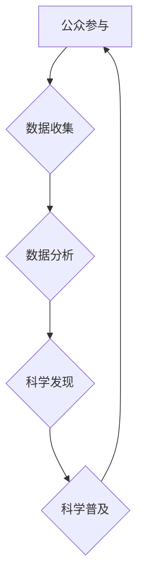

                 

## 公民科学：公众参与科学研究的新途径

> 关键词：公民科学、大众参与、科学研究、数据收集、人工智能、数据分析、科学普及

## 1. 背景介绍

科学研究，作为人类探索世界、理解自然规律的重要手段，历来依赖于专业科研人员的投入和努力。然而，随着科学研究的日益复杂化和数据量的爆炸式增长，传统的科研模式面临着新的挑战。如何更有效地收集、分析和利用海量数据，加速科学发现，成为一个亟待解决的问题。

公民科学（Citizen Science）应运而生，它倡导公众参与到科学研究中来，利用大众的力量，共同推动科学进步。公民科学的理念简单而有力：每个人都可以成为科学家，每个人都可以为科学研究做出贡献。

## 2. 核心概念与联系

公民科学的核心概念是将科学研究的各个环节，如数据收集、分析和解释，开放给公众参与。它打破了传统科学研究的壁垒，让公众能够直接参与到科学研究的各个环节，共同探索科学奥秘。

**公民科学的参与方式多种多样：**

* **数据收集：** 公众通过手机、相机、传感器等设备收集科学数据，例如记录鸟类迁徙路线、观察昆虫种类、测量空气质量等。
* **数据分析：** 公众利用在线平台和工具对收集到的数据进行分析，例如识别图像中的物体、分类文本信息、寻找数据中的模式等。
* **科学实验：** 公众参与到科学实验中，例如在家中进行简单的物理实验、参与在线模拟实验等。

**公民科学与人工智能的结合**

人工智能技术的快速发展为公民科学提供了强大的工具支持。人工智能可以帮助公民科学项目：

* **自动化数据处理：** 人工智能算法可以自动识别、分类和标记数据，提高数据处理效率。
* **数据分析和挖掘：** 人工智能可以帮助分析海量数据，发现隐藏的模式和规律，为科学研究提供新的见解。
* **个性化学习和互动：** 人工智能可以根据用户的兴趣和知识水平，提供个性化的学习内容和互动体验，提高公众参与的积极性。

**Mermaid 流程图：**



## 3. 核心算法原理 & 具体操作步骤

### 3.1  算法原理概述

公民科学项目中常用的算法包括：

* **机器学习算法：** 用于数据分析和挖掘，例如分类、回归、聚类等。
* **自然语言处理算法：** 用于处理文本数据，例如文本分类、情感分析、机器翻译等。
* **计算机视觉算法：** 用于处理图像数据，例如图像识别、物体检测、图像分割等。

这些算法的原理基于统计学、概率论和数学模型，通过训练和学习，能够从数据中提取有价值的信息。

### 3.2  算法步骤详解

以机器学习算法为例，其基本步骤包括：

1. **数据收集和预处理：** 收集相关数据，并进行清洗、转换、特征提取等预处理工作。
2. **模型选择：** 根据具体任务选择合适的机器学习模型，例如线性回归、逻辑回归、决策树、支持向量机等。
3. **模型训练：** 使用训练数据训练模型，调整模型参数，使模型能够准确地预测或分类数据。
4. **模型评估：** 使用测试数据评估模型的性能，例如准确率、召回率、F1-score等。
5. **模型部署：** 将训练好的模型部署到实际应用场景中，用于预测或分类新的数据。

### 3.3  算法优缺点

**优点：**

* **自动化数据处理：** 可以自动识别、分类和标记数据，提高数据处理效率。
* **数据分析和挖掘：** 可以帮助分析海量数据，发现隐藏的模式和规律，为科学研究提供新的见解。
* **个性化学习和互动：** 可以根据用户的兴趣和知识水平，提供个性化的学习内容和互动体验，提高公众参与的积极性。

**缺点：**

* **数据质量依赖：** 算法的性能依赖于数据质量，如果数据质量差，算法结果也会受到影响。
* **算法解释性：** 一些机器学习算法的内部机制比较复杂，难以解释其决策过程，这可能会导致公众对算法结果的信任度降低。
* **伦理问题：** 公众参与科学研究可能会涉及到隐私、数据安全等伦理问题，需要谨慎处理。

### 3.4  算法应用领域

公民科学项目中，机器学习算法、自然语言处理算法和计算机视觉算法广泛应用于以下领域：

* **生物学：** 识别鸟类、昆虫、植物等物种；分析基因序列；预测疾病传播。
* **环境科学：** 监测空气质量、水质、土壤污染；预测自然灾害；分析气候变化。
* **社会科学：** 分析社交媒体数据；预测选举结果；研究人口流动。

## 4. 数学模型和公式 & 详细讲解 & 举例说明

### 4.1  数学模型构建

在公民科学项目中，数学模型可以用来描述和预测科学现象，例如：

* **线性回归模型：** 用于预测连续变量，例如温度、气压等。
* **逻辑回归模型：** 用于预测分类变量，例如疾病诊断、物种识别等。
* **时间序列模型：** 用于预测时间序列数据，例如人口增长、股票价格等。

### 4.2  公式推导过程

以线性回归模型为例，其目标是找到一条直线，使得这条直线与数据点之间的距离最小。

**线性回归模型的公式：**

$$y = mx + c$$

其中：

* $y$ 是预测值
* $x$ 是自变量
* $m$ 是斜率
* $c$ 是截距

**最小二乘法：**

线性回归模型的参数 $m$ 和 $c$ 可以通过最小二乘法来估计。最小二乘法的目标是找到一条直线，使得所有数据点到直线的距离的平方和最小。

**公式推导：**

$$SSE = \sum_{i=1}^{n}(y_i - mx_i - c)^2$$

其中：

* $SSE$ 是误差平方和
* $n$ 是数据点的数量
* $y_i$ 是第 $i$ 个数据点的真实值
* $x_i$ 是第 $i$ 个数据点的自变量值

通过对 $SSE$ 的偏导数求零，可以得到 $m$ 和 $c$ 的估计值。

### 4.3  案例分析与讲解

**案例：**

使用线性回归模型预测房屋价格。

**数据：**

* 自变量：房屋面积
* 应变量：房屋价格

**分析：**

通过最小二乘法估计线性回归模型的参数，得到房屋价格预测公式：

$$Price = 5000 * Area + 100000$$

其中：

* $Price$ 是房屋价格
* $Area$ 是房屋面积

**解释：**

该公式表示，房屋面积每增加 1 平方米，房屋价格就会增加 5000 元。

## 5. 项目实践：代码实例和详细解释说明

### 5.1  开发环境搭建

* **操作系统：** Linux、macOS 或 Windows
* **编程语言：** Python
* **库和工具：** NumPy、Pandas、Scikit-learn、Matplotlib

### 5.2  源代码详细实现

```python
import pandas as pd
from sklearn.linear_model import LinearRegression

# 加载数据
data = pd.read_csv('house_data.csv')

# 准备数据
X = data[['Area']]
y = data['Price']

# 创建线性回归模型
model = LinearRegression()

# 训练模型
model.fit(X, y)

# 获取模型参数
slope = model.coef_[0]
intercept = model.intercept_

# 打印模型参数
print(f'Slope: {slope}')
print(f'Intercept: {intercept}')

# 使用模型预测房屋价格
new_area = 150
predicted_price = slope * new_area + intercept
print(f'Predicted price for an area of {new_area} square meters: {predicted_price}')
```

### 5.3  代码解读与分析

* **数据加载和准备：** 使用 Pandas 库加载数据，并分离自变量和应变量。
* **模型创建和训练：** 使用 Scikit-learn 库创建线性回归模型，并使用训练数据训练模型。
* **模型参数获取：** 获取模型的斜率和截距参数。
* **模型预测：** 使用训练好的模型预测新的数据。

### 5.4  运行结果展示

运行代码后，会输出模型参数和对新数据点的预测结果。

## 6. 实际应用场景

公民科学项目在各个领域都有着广泛的应用场景：

* **生物多样性监测：** 公众参与记录鸟类、昆虫、植物等物种的分布和数量，为生物多样性研究提供数据支持。
* **环境污染监测：** 公众参与监测空气质量、水质、土壤污染等环境指标，为环境保护提供数据支持。
* **疾病流行监测：** 公众参与报告疾病症状，为疾病流行监测提供数据支持。
* **天文观测：** 公众参与观测天体，为天文研究提供数据支持。

### 6.4  未来应用展望

随着人工智能技术的不断发展，公民科学项目将更加智能化、自动化和个性化。

* **智能数据分析：** 人工智能算法可以帮助分析海量公民科学数据，发现隐藏的模式和规律，为科学研究提供更深入的洞察。
* **个性化学习和互动：** 人工智能可以根据用户的兴趣和知识水平，提供个性化的学习内容和互动体验，提高公众参与的积极性。
* **虚拟现实和增强现实：** 虚拟现实和增强现实技术可以为公民科学项目提供更加沉浸式的体验，例如虚拟观测天体、虚拟参与科学实验等。

## 7. 工具和资源推荐

### 7.1  学习资源推荐

* **Citizen Science Association:** https://citizenscience.org/
* **Zooniverse:** https://www.zooniverse.org/
* **SciStarter:** https://scistarter.org/

### 7.2  开发工具推荐

* **Python:** https://www.python.org/
* **Pandas:** https://pandas.pydata.org/
* **Scikit-learn:** https://scikit-learn.org/stable/

### 7.3  相关论文推荐

* **Bonney, R., et al. (2014). Citizen science: A global phenomenon. Trends in Ecology & Evolution, 29(1), 39-47.**
* **Dickinson, A., et al. (2010). Citizen science as an effective tool for ecological research. Frontiers in Ecology and the Environment, 8(6), 291-296.**

## 8. 总结：未来发展趋势与挑战

### 8.1  研究成果总结

公民科学项目已经取得了显著的成果，为科学研究提供了大量的数据和见解，也提高了公众对科学的参与度和理解。

### 8.2  未来发展趋势

* **人工智能的深度融合：** 人工智能将更加深入地融入公民科学项目，提高数据分析能力、个性化学习体验和项目效率。
* **跨学科合作的加强：** 公民科学项目将更加注重跨学科合作，将不同领域的知识和资源整合起来，解决更复杂的问题。
* **数据共享和开放的推进：** 公民科学数据将更加开放共享，促进科学研究的协同发展。

### 8.3  面临的挑战

* **数据质量控制：** 公众收集的数据质量参差不齐，需要建立有效的质量控制机制。
* **算法解释性和透明度：** 一些人工智能算法的内部机制比较复杂，需要提高算法的解释性和透明度，增强公众的信任度。
* **伦理问题：** 公众参与科学研究可能会涉及到隐私、数据安全等伦理问题，需要制定相应的规范和制度。

### 8.4  研究展望

未来，公民科学项目将继续发展壮大，成为推动科学进步的重要力量。我们需要不断探索新的技术和方法，解决面临的挑战，让更多的人参与到科学研究中来，共同探索科学奥秘。

## 9. 附录：常见问题与解答

**常见问题：**

* **如何参与公民科学项目？**

可以通过在线平台，例如 Zooniverse、SciStarter 等，找到感兴趣的项目并参与。

* **公民科学项目的数据安全如何保障？**

公民科学项目通常会制定相应的隐私政策和数据安全措施，保护参与者的个人信息。

* **公民科学项目对科学研究有什么贡献？**

公民科学项目可以为科学研究提供大量的数据和见解，加速科学发现。

**作者：禅与计算机程序设计艺术 / Zen and the Art of Computer Programming**<end_of_turn>

