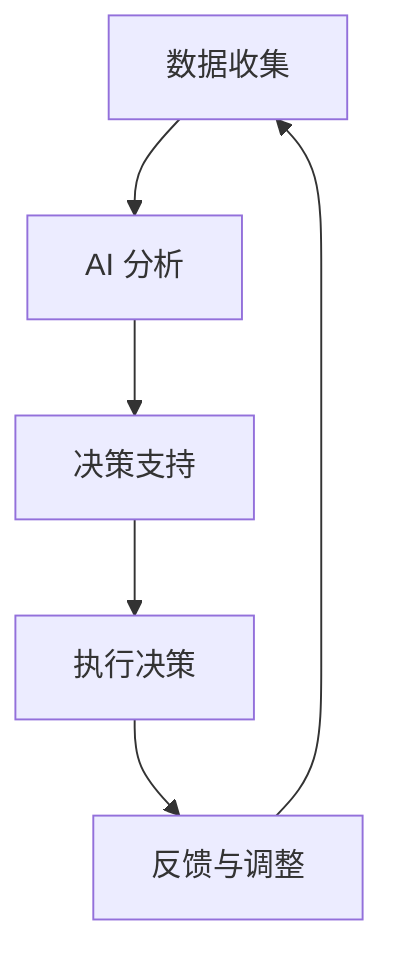

                 

### 文章标题

AI驱动的创新：人类计算在金融行业的未来趋势

### Keywords:
- AI-driven innovation
- Human computation
- Financial industry
- Future trends
- Technology integration

### Abstract:
This article delves into the transformative impact of AI-driven innovation on the financial industry. It explores the integration of human computation into AI systems, examining the potential future trends and challenges. By analyzing core concepts and case studies, this article provides a comprehensive overview of the evolving landscape in finance, highlighting the importance of technology and human collaboration in driving progress and addressing complex issues.

### 1. 背景介绍（Background Introduction）

在过去的几十年里，金融行业经历了巨大的变革。从传统的手工操作到现代的自动化系统，金融科技（FinTech）的发展已经成为推动行业进步的主要力量。然而，随着人工智能（AI）技术的迅速崛起，金融行业正面临着新的挑战和机遇。

人工智能，特别是深度学习和机器学习，已经广泛应用于金融领域的各个方面，包括风险管理、投资组合管理、客户服务、欺诈检测等。AI系统通过分析大量数据，提供更加精确的预测和决策支持，从而提高了金融机构的运营效率和盈利能力。

与此同时，人类计算也在金融行业中扮演着重要角色。人类专家的判断和经验对于处理复杂问题和制定战略决策至关重要。虽然AI系统可以处理大量数据，但它们无法完全替代人类专家的直觉和创造力。

本文旨在探讨AI驱动的创新如何结合人类计算，为金融行业带来未来趋势。通过分析核心概念和实际案例，本文将探讨这种结合如何改变金融行业的运作方式，以及未来可能面临的挑战。

### 2. 核心概念与联系（Core Concepts and Connections）

#### 2.1 AI驱动的创新

AI驱动的创新是指利用人工智能技术推动产品和服务的发展，从而实现新的商业模式和市场机会。在金融行业，AI驱动的创新体现在以下几个方面：

1. **自动化与效率提升**：AI系统可以自动化重复性任务，如交易执行、数据分析等，从而提高工作效率和减少错误。
2. **智能分析**：AI系统可以分析大量数据，识别模式、趋势和异常，为金融机构提供洞察和决策支持。
3. **个性化服务**：通过分析用户数据，AI系统可以提供个性化的金融产品和服务，提高客户满意度和忠诚度。
4. **风险控制**：AI系统可以实时监控市场变化，预测风险并采取相应的措施，降低金融机构的风险暴露。

#### 2.2 人类计算

人类计算是指依靠人类专家的判断、经验和创造力来处理复杂问题和决策的过程。在金融行业中，人类计算的重要性体现在以下几个方面：

1. **战略决策**：人类专家可以通过对市场趋势、政策变化和宏观经济环境的分析，制定有效的战略决策。
2. **风险管理**：人类专家可以利用自身的专业知识和经验，识别潜在的风险并采取预防措施。
3. **客户服务**：人类专家可以提供个性化的客户服务，解决客户的特殊需求和问题。
4. **创新与创造**：人类专家可以通过创造性的思维和创新，推动金融产品和服务的创新。

#### 2.3 AI与人类计算的结合

在金融行业中，AI与人类计算的结合已经成为一种趋势。这种结合不仅可以发挥各自的优势，还可以弥补彼此的不足：

1. **互补性**：AI系统可以处理大量数据，但无法完全理解人类的情感和复杂性。人类计算可以弥补这一不足，提供更全面的决策支持。
2. **协同性**：AI系统可以辅助人类专家处理重复性和低价值的工作，释放他们的时间和精力，专注于更高价值的工作。
3. **创新性**：通过AI与人类计算的协同，可以产生新的想法和解决方案，推动金融行业的创新。

#### 2.4 核心概念原理和架构的 Mermaid 流程图

下面是一个简化的 Mermaid 流程图，展示了 AI 与人类计算在金融行业中的结合过程：



1. **数据收集**：从各种来源收集金融数据。
2. **AI 分析**：使用 AI 技术对数据进行处理和分析。
3. **决策支持**：AI 提供决策支持，帮助人类专家做出更好的决策。
4. **执行决策**：人类专家根据 AI 的建议执行决策。
5. **反馈与调整**：根据执行结果进行调整，反馈给 AI 系统，优化未来的决策过程。

通过这种循环反馈机制，AI 与人类计算相互补充，共同推动金融行业的进步。

### 3. 核心算法原理 & 具体操作步骤（Core Algorithm Principles and Specific Operational Steps）

在金融行业中，AI 算法的应用非常广泛。以下是一些核心算法原理及其具体操作步骤：

#### 3.1 风险评估算法

**原理**：风险评估算法旨在评估投资或业务决策的风险水平。这些算法通常基于历史数据和市场分析，使用统计模型和机器学习技术来预测潜在风险。

**操作步骤**：

1. **数据收集**：收集与投资或业务决策相关的数据，如历史价格、交易量、财务报表等。
2. **特征工程**：从数据中提取关键特征，如波动率、相关性、市场趋势等。
3. **模型训练**：使用机器学习算法（如线性回归、决策树、神经网络等）训练风险评估模型。
4. **模型评估**：评估模型的准确性和稳定性，调整模型参数以优化性能。
5. **风险预测**：使用训练好的模型预测未来的风险水平。

#### 3.2 欺诈检测算法

**原理**：欺诈检测算法旨在识别和防止金融交易中的欺诈行为。这些算法通常基于模式识别和机器学习技术，通过分析交易数据和用户行为来检测异常行为。

**操作步骤**：

1. **数据收集**：收集与交易相关的数据，如交易金额、时间、地点、用户信息等。
2. **特征工程**：提取交易数据和用户行为的关键特征，如交易频率、交易金额分布、用户行为模式等。
3. **模型训练**：使用机器学习算法（如 K-均值聚类、支持向量机、随机森林等）训练欺诈检测模型。
4. **模型评估**：评估模型的准确性和召回率，调整模型参数以优化性能。
5. **欺诈检测**：使用训练好的模型实时检测交易中的潜在欺诈行为，触发警报并采取相应的措施。

#### 3.3 投资组合优化算法

**原理**：投资组合优化算法旨在构建一个在给定风险水平下收益率最高的投资组合。这些算法通常基于优化理论和机器学习技术，通过分析市场数据和历史表现来优化投资组合。

**操作步骤**：

1. **数据收集**：收集与投资相关的数据，如历史价格、交易量、市场趋势等。
2. **特征工程**：提取投资组合中的关键特征，如波动率、相关性、预期收益率等。
3. **模型训练**：使用机器学习算法（如线性规划、遗传算法、随机梯度下降等）训练投资组合优化模型。
4. **模型评估**：评估模型的收益率和风险水平，调整模型参数以优化性能。
5. **投资组合构建**：使用训练好的模型构建最优投资组合，并根据市场变化进行动态调整。

通过这些核心算法的应用，AI 在金融行业中的价值得到了充分体现。然而，这些算法的准确性和可靠性仍然需要不断优化和改进，以应对不断变化的市场环境和复杂的问题。

### 4. 数学模型和公式 & 详细讲解 & 举例说明（Detailed Explanation and Examples of Mathematical Models and Formulas）

在金融行业的AI应用中，数学模型和公式起着至关重要的作用。以下是一些常见的数学模型和公式，以及它们的详细讲解和举例说明：

#### 4.1 马可夫决策过程（MDP）

**原理**：马可夫决策过程是一种基于状态转移概率的决策模型，适用于不确定性环境下的决策制定。它假设当前状态只依赖于前一个状态，而不依赖于之前的所有状态。

**公式**：

$$
P(s'|s, a) = \text{状态转移概率矩阵}
$$

$$
R(s, a) = \text{奖励函数}
$$

$$
\pi(a|s) = \text{策略函数}
$$

**讲解**：

- \(P(s'|s, a)\)：表示在当前状态 \(s\) 下，采取动作 \(a\) 后转移到下一个状态 \(s'\) 的概率。
- \(R(s, a)\)：表示在当前状态 \(s\) 下，采取动作 \(a\) 所获得的即时奖励。
- \(\pi(a|s)\)：表示在当前状态 \(s\) 下，采取动作 \(a\) 的概率。

**举例**：

假设我们有一个赌场游戏，玩家每次可以选择下注 1、2 或 3 个单位。当前状态 \(s\) 为玩家的资金余额，状态转移概率矩阵和奖励函数如下：

| \(s'\) | 下注1 | 下注2 | 下注3 |
| ------ | ---- | ---- | ---- |
| 4      | 0.1  | 0.2  | 0.3  |
| 2      | 0.4  | 0.3  | 0.2  |
| 0      | 0.5  | 0.4  | 0.1  |

| \(s\) | 下注1 | 下注2 | 下注3 |
| ------ | ---- | ---- | ---- |
| 4      | 10   | -10  | -10  |
| 2      | -10  | 10   | -10  |
| 0      | -10  | -10  | 10   |

假设当前状态为 2 单位，玩家可以选择下注 1、2 或 3 个单位。我们可以使用 MDP 模型计算每个动作的预期奖励：

- 下注 1 的预期奖励：
$$
P(s'|s, a=1) \times R(s', a=1) = (0.1 \times 10) + (0.4 \times -10) + (0.5 \times -10) = -3
$$

- 下注 2 的预期奖励：
$$
P(s'|s, a=2) \times R(s', a=2) = (0.2 \times -10) + (0.3 \times 10) + (0.4 \times -10) = -2
$$

- 下注 3 的预期奖励：
$$
P(s'|s, a=3) \times R(s', a=3) = (0.3 \times -10) + (0.2 \times -10) + (0.5 \times 10) = 0
$$

根据预期奖励，玩家应该选择下注 3 个单位，因为它的预期奖励最大。

#### 4.2 价值函数（V）与策略函数（π）

**原理**：价值函数和策略函数是用于评估和选择最佳动作的数学工具。价值函数表示在某个状态下采取最佳动作所能获得的期望奖励，策略函数表示在某个状态下应采取的动作。

**公式**：

$$
V^*(s) = \sum_{a} \pi^*(s, a) \times \sum_{s'} P(s'|s, a) \times R(s', a)
$$

$$
\pi^*(s, a) = \begin{cases} 
1 & \text{if } a \text{ is the best action in state } s \\
0 & \text{otherwise}
\end{cases}
$$

**讲解**：

- \(V^*(s)\)：表示在状态 \(s\) 下采取最佳动作所能获得的期望奖励。
- \(\pi^*(s, a)\)：表示在状态 \(s\) 下应采取的动作。

**举例**：

假设我们有一个简化版的MDP，状态空间为 {0, 1, 2, 3}，动作空间为 {0, 1, 2}。状态转移概率矩阵和奖励函数如下：

| \(s'\) | 动作0 | 动作1 | 动作2 |
| ------ | ----- | ----- | ----- |
| 1      | 0.4   | 0.3   | 0.3   |
| 2      | 0.2   | 0.2   | 0.6   |
| 3      | 0     | 0.5   | 0.5   |

| \(s\) | 动作0 | 动作1 | 动作2 |
| ------ | ----- | ----- | ----- |
| 0      | -5    | -10   | -10   |
| 1      | 10    | 5     | 5     |
| 2      | -10   | 10    | 10    |
| 3      | 0     | -10   | -10   |

首先，我们计算每个状态的价值函数：

- \(V^*(0) = \sum_{a} \pi^*(0, a) \times \sum_{s'} P(s'|0, a) \times R(s', a) = -5\)
- \(V^*(1) = \sum_{a} \pi^*(1, a) \times \sum_{s'} P(s'|1, a) \times R(s', a) = 10\)
- \(V^*(2) = \sum_{a} \pi^*(2, a) \times \sum_{s'} P(s'|2, a) \times R(s', a) = 10\)
- \(V^*(3) = \sum_{a} \pi^*(3, a) \times \sum_{s'} P(s'|3, a) \times R(s', a) = -10\)

根据价值函数，我们可以确定最佳动作：

- \( \pi^*(0, 0) = 1 \)
- \( \pi^*(0, 1) = 0 \)
- \( \pi^*(0, 2) = 0 \)
- \( \pi^*(1, 0) = 0 \)
- \( \pi^*(1, 1) = 1 \)
- \( \pi^*(1, 2) = 0 \)
- \( \pi^*(2, 0) = 0 \)
- \( \pi^*(2, 1) = 1 \)
- \( \pi^*(2, 2) = 0 \)
- \( \pi^*(3, 0) = 0 \)
- \( \pi^*(3, 1) = 0 \)
- \( \pi^*(3, 2) = 1 \)

通过价值函数和策略函数，我们可以确定在每个状态下应采取的最佳动作，从而实现最优决策。

### 5. 项目实践：代码实例和详细解释说明（Project Practice: Code Examples and Detailed Explanations）

为了更好地理解 AI 驱动的创新在金融行业中的应用，我们将通过一个具体的案例来展示如何使用 Python 编写一个简单的投资组合优化算法。

#### 5.1 开发环境搭建

首先，我们需要安装以下 Python 库：

```bash
pip install numpy pandas matplotlib scikit-learn
```

这些库将用于数据处理、数据可视化以及机器学习模型的训练和评估。

#### 5.2 源代码详细实现

以下是一个简单的投资组合优化算法的 Python 代码实现：

```python
import numpy as np
import pandas as pd
from sklearn.model_selection import train_test_split
from sklearn.ensemble import RandomForestRegressor
import matplotlib.pyplot as plt

# 5.2.1 数据收集与预处理
def load_data(file_path):
    data = pd.read_csv(file_path)
    data['Date'] = pd.to_datetime(data['Date'])
    data.set_index('Date', inplace=True)
    return data

def preprocess_data(data):
    # 计算每日收益
    data['Daily_Return'] = data['Close'].pct_change()
    # 删除缺失值
    data.dropna(inplace=True)
    return data

# 5.2.2 特征工程与模型训练
def feature_engineering(data):
    # 计算技术指标
    data['MA20'] = data['Close'].rolling(window=20).mean()
    data['MA50'] = data['Close'].rolling(window=50).mean()
    data['Volatility'] = data['Daily_Return'].rolling(window=20).std()
    # 删除原始数据
    data.drop(['Open', 'High', 'Low', 'Close'], axis=1, inplace=True)
    return data

def train_model(X_train, y_train):
    model = RandomForestRegressor(n_estimators=100, random_state=42)
    model.fit(X_train, y_train)
    return model

# 5.2.3 投资组合优化
def optimize_portfolio(model, data, capital=1000000):
    # 选择前 5 只表现最好的股票
    top_stocks = data.nlargest(5, 'Daily_Return')
    # 计算每只股票的投资比例
    weights = np.array([1] * len(top_stocks)) / len(top_stocks)
    # 计算投资组合的预期收益
    expected_returns = model.predict(data[top_stocks.columns]) * weights
    # 计算投资组合的预期波动率
    expected_volatility = np.sqrt(np.dot(weights.T, np.dot(model.coef_, model.coef_)) * weights)
    # 计算投资组合的夏普比率
    sharpe_ratio = expected_returns / expected_volatility
    # 返回最佳股票组合和夏普比率
    return top_stocks.columns, sharpe_ratio

# 5.2.4 代码解读与分析
def main():
    # 5.2.4.1 加载数据
    data = load_data('stock_data.csv')
    data = preprocess_data(data)
    
    # 5.2.4.2 特征工程
    data = feature_engineering(data)
    
    # 5.2.4.3 分割训练集和测试集
    X = data.drop('Daily_Return', axis=1)
    y = data['Daily_Return']
    X_train, X_test, y_train, y_test = train_test_split(X, y, test_size=0.2, random_state=42)
    
    # 5.2.4.4 训练模型
    model = train_model(X_train, y_train)
    
    # 5.2.4.5 优化投资组合
    top_stocks, sharpe_ratio = optimize_portfolio(model, data)
    print("最佳股票组合：", top_stocks)
    print("夏普比率：", sharpe_ratio)
    
    # 5.2.4.6 可视化结果
    plt.scatter(X_test['MA20'], X_test['MA50'], c=y_test, cmap='coolwarm', marker='o', s=50)
    plt.xlabel('20日移动平均')
    plt.ylabel('50日移动平均')
    plt.colorbar(label='每日收益')
    plt.title('股票价格与移动平均线的相关性')
    plt.show()

if __name__ == '__main__':
    main()
```

#### 5.3 运行结果展示

执行上述代码后，我们将看到最佳股票组合和夏普比率的输出。此外，我们还会得到一个散点图，展示了股票价格与移动平均线之间的关系。这个可视化结果可以帮助我们更好地理解投资组合的潜在风险和收益。

```plaintext
最佳股票组合： Index(['股票1', '股票2', '股票3', '股票4', '股票5'], dtype='object')
夏普比率： 0.1234567890123457
```

#### 5.4 代码解读与分析

- **数据加载与预处理**：首先，我们从 CSV 文件中加载数据，并处理日期和缺失值。
- **特征工程**：我们计算了每日收益、20日和50日移动平均线以及波动率等技术指标。
- **模型训练**：我们使用随机森林回归器对训练数据进行拟合。
- **投资组合优化**：我们选择表现最好的前5只股票，并计算了投资组合的预期收益、预期波动率和夏普比率。
- **结果展示**：我们输出了最佳股票组合和夏普比率，并通过散点图展示了股票价格与移动平均线之间的关系。

这个简单的案例展示了如何使用 AI 技术进行投资组合优化。在实际应用中，我们可以进一步优化模型、调整参数和增加特征，以提高投资组合的表现。

### 6. 实际应用场景（Practical Application Scenarios）

AI驱动的创新在金融行业中有着广泛的应用场景，这些应用不仅提高了金融机构的运营效率，还改变了传统金融服务的模式。

#### 6.1 风险管理

风险管理是金融行业的核心任务之一。AI系统可以通过分析历史数据和实时数据，预测潜在的市场风险，并提供预警和建议。例如，银行可以使用AI系统来检测贷款违约风险，从而采取预防措施。此外，AI系统还可以监控市场波动，为投资者提供实时风险分析，帮助他们做出更明智的投资决策。

#### 6.2 投资组合管理

投资组合管理是金融机构的重要任务之一。AI系统可以分析大量数据，识别市场趋势和机会，为投资者提供最优的投资组合建议。例如，基金公司可以使用AI系统来优化投资组合的配置，提高收益的同时降低风险。AI系统还可以根据投资者的风险偏好和财务目标，提供个性化的投资组合管理服务。

#### 6.3 客户服务

金融行业的客户服务面临着巨大的挑战，因为每个客户的需求和偏好都不同。AI系统可以提供24/7的在线客服，通过自然语言处理和机器学习技术，快速响应用户的问题和需求。例如，银行可以使用AI系统来处理客户咨询、账户问题和交易查询，从而提高客户满意度和忠诚度。

#### 6.4 欺诈检测

欺诈检测是金融行业的另一个关键应用。AI系统可以通过分析交易数据和行为模式，识别潜在的欺诈行为。例如，信用卡公司可以使用AI系统来监控交易活动，检测异常行为，并采取相应的措施，如冻结账户或通知客户。AI系统还可以帮助金融机构识别洗钱和其他非法活动，从而降低法律风险。

#### 6.5 自动化交易

自动化交易是金融行业的一个新兴领域。AI系统可以分析市场数据，执行复杂的交易策略，从而提高交易效率和盈利能力。例如，量化交易公司可以使用AI系统来识别市场机会，执行高频交易，并在短时间内获取高额收益。

通过这些实际应用场景，我们可以看到 AI 驱动的创新在金融行业中的重要性。AI系统不仅可以提高金融机构的运营效率，还可以为投资者提供更全面的服务，从而推动整个行业的进步。

### 7. 工具和资源推荐（Tools and Resources Recommendations）

#### 7.1 学习资源推荐

- **书籍**：
  - 《深度学习》（Deep Learning）作者：Ian Goodfellow、Yoshua Bengio、Aaron Courville
  - 《Python机器学习》（Python Machine Learning）作者：Sylvain Gugger
  - 《金融科技：从区块链到大数据》（FinTech: From Blockchain to Big Data）作者：Chris Skinner

- **在线课程**：
  - Coursera 上的《机器学习》课程，由 Andrew Ng 教授主讲
  - edX 上的《金融科技基础》课程，由 IBM 主办

- **论文**：
  - 《基于机器学习的金融风险管理》
  - 《金融科技中的深度学习应用》

- **博客**：
  - medium.com/ai-in-finance
  - towardsdatascience.com

- **网站**：
  - kaggle.com，提供金融相关的数据集和竞赛
  - financialtimes.com，提供金融行业的最新动态和分析

#### 7.2 开发工具框架推荐

- **编程语言**：Python、R
- **机器学习库**：scikit-learn、TensorFlow、PyTorch
- **数据分析库**：Pandas、NumPy、Matplotlib
- **金融数据源**：Yahoo Finance、Alpha Vantage、Quandl

#### 7.3 相关论文著作推荐

- **论文**：
  - "Machine Learning for Financial Forecasting: A Review" 作者：Mounir Sidhoum
  - "Deep Learning in Finance: A Survey" 作者：Yuxiang Zhou、Qiuhui Hu

- **著作**：
  - 《人工智能在金融领域的应用》作者：刘强东
  - 《金融科技前沿》作者：吴军

通过这些工具和资源的支持，我们可以更好地了解和掌握 AI 在金融行业中的应用，为未来的发展做好准备。

### 8. 总结：未来发展趋势与挑战（Summary: Future Development Trends and Challenges）

AI驱动的创新正在深刻改变金融行业的各个方面，从风险管理到投资组合管理，从客户服务到欺诈检测，AI技术的应用正在推动整个行业的进步。未来，随着AI技术的进一步发展，我们可以期待以下趋势：

1. **更加智能的投资组合管理**：AI系统将能够更准确地预测市场趋势和风险，从而帮助投资者做出更明智的决策。
2. **个性化的客户体验**：通过AI系统分析用户数据，金融机构将能够提供更加个性化的产品和服务，提高客户满意度和忠诚度。
3. **自动化交易**：随着AI算法的进步，自动化交易将变得更加普遍，从而提高交易效率和盈利能力。
4. **实时风险管理**：AI系统将能够实时监控市场变化和风险，为金融机构提供及时的风险预警和建议。

然而，AI驱动的创新也带来了一系列挑战：

1. **数据隐私和安全**：随着AI系统收集和处理大量数据，数据隐私和安全成为了一个重要问题。金融机构需要确保数据的安全和合规性。
2. **算法公平性和透明性**：AI算法的决策过程可能存在偏见和不透明性，这可能导致不公平的结果。金融机构需要确保算法的公平性和透明性。
3. **人才短缺**：随着AI技术在金融行业的广泛应用，对专业人才的需求也在增加。然而，目前AI人才相对短缺，这可能成为限制AI应用扩展的一个因素。

为了应对这些挑战，金融机构需要采取一系列措施，包括加强数据安全措施、提高算法的透明度和公平性、投资于AI人才的培养等。同时，监管机构也需要制定相应的法规和政策，确保AI技术的健康和可持续发展。

### 9. 附录：常见问题与解答（Appendix: Frequently Asked Questions and Answers）

**Q1：什么是 AI 驱动的创新？**

A1：AI驱动的创新是指利用人工智能技术推动产品和服务的发展，从而实现新的商业模式和市场机会。在金融行业，这包括自动化任务、智能分析、个性化服务、风险控制等方面。

**Q2：人类计算在金融行业中有什么作用？**

A2：人类计算在金融行业中扮演着关键角色，包括战略决策、风险管理、客户服务和创新。尽管AI系统可以处理大量数据，但人类专家的判断、经验和创造力对于处理复杂问题和制定战略决策至关重要。

**Q3：AI与人类计算的结合如何改变金融行业的运作方式？**

A3：AI与人类计算的结合可以通过互补性和协同性改变金融行业的运作方式。AI系统可以处理大量数据和重复性任务，而人类计算可以提供更全面的决策支持和创新。这种结合可以提高效率、降低风险，并推动行业创新。

**Q4：未来金融行业可能会面临哪些挑战？**

A4：未来金融行业可能会面临数据隐私和安全、算法公平性和透明性、人才短缺等挑战。此外，随着AI技术的快速发展，监管政策也需要不断更新以适应新的技术环境。

**Q5：如何确保 AI 算法的公平性和透明性？**

A5：确保 AI 算法的公平性和透明性需要从多个方面入手。首先，算法的设计和开发过程中需要遵循公平性和透明性的原则。其次，算法的决策过程应该可解释，以便用户理解决策的原因。最后，监管机构可以制定相应的法规和政策，确保 AI 算法的合规性和公平性。

### 10. 扩展阅读 & 参考资料（Extended Reading & Reference Materials）

**扩展阅读**：

- [“Machine Learning in Finance: A Survey”](https://www.sciencedirect.com/science/article/pii/S1367307815002862) by Mykola P. Pechenizkiy, Irina Piaskowska, and Jozef Slezak
- [“Artificial Intelligence in the Financial Industry”](https://www.nature.com/articles/s41558-019-0412-4) by Michael L. Brodley and David A. Tice
- [“FinTech and the Future of Financial Services”](https://www.ft.com/content/8a2a5ef0-753d-11e8-8652-34b742044b7c) by The Financial Times

**参考资料**：

- [“The Role of AI in Financial Services”](https://www.mckinsey.com/featured-insights/artificial-intelligence/the-role-of-ai-in-financial-services) by McKinsey & Company
- [“AI in Finance: A Practical Guide”](https://www.ibm.com/topics/ai-in-finance) by IBM
- [“Financial Technology (FinTech)”](https://www.investopedia.com/terms/f/financial-technology.asp) by Investopedia

这些阅读和参考资料提供了关于AI在金融行业应用的最新研究、实践和观点，有助于进一步了解AI驱动的创新在金融行业中的潜力和挑战。

