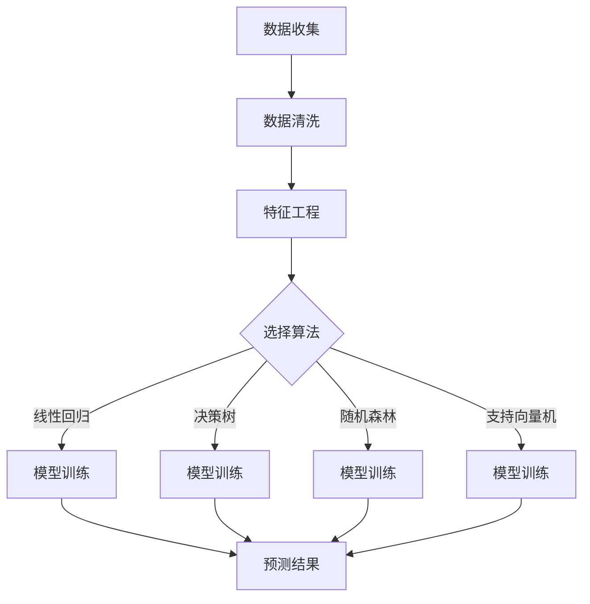

                 

# AI驱动的库存管理与需求预测

> 关键词：人工智能，库存管理，需求预测，机器学习，数据挖掘，供应链优化，商业智能

> 摘要：本文探讨了如何利用人工智能技术，尤其是机器学习和数据挖掘方法，来驱动库存管理与需求预测。文章首先介绍了库存管理与需求预测的背景和重要性，然后详细阐述了相关的核心算法原理和数学模型，并通过实际项目案例展示了这些算法在商业场景中的应用效果。最后，文章总结了当前面临的挑战和未来的发展趋势。

## 1. 背景介绍（Background Introduction）

库存管理与需求预测是现代商业运营中至关重要的环节。库存管理涉及对库存水平进行实时监控和调整，以避免库存过剩或短缺，从而降低成本并提高客户满意度。需求预测则是指对未来产品需求进行准确估计，以便企业能够合理安排生产计划、供应链管理和库存控制。

随着大数据和云计算技术的飞速发展，传统的人工库存管理和需求预测方法逐渐暴露出许多问题，如数据精度低、响应速度慢、缺乏灵活性等。这些问题的存在不仅影响了企业的运营效率，还增加了运营成本。因此，利用人工智能技术，特别是机器学习和数据挖掘方法，来驱动库存管理与需求预测成为一种必然趋势。

## 2. 核心概念与联系（Core Concepts and Connections）

### 2.1 机器学习与数据挖掘

机器学习是一种人工智能的分支，它使计算机系统能够从数据中学习并做出预测或决策。数据挖掘则是从大量数据中提取有价值信息的过程，通常涉及模式识别、关联规则挖掘、聚类分析等。

在库存管理与需求预测中，机器学习和数据挖掘技术可以用于以下方面：

- **异常检测**：发现库存数据中的异常值，以便及时采取措施。
- **关联规则挖掘**：分析不同产品之间的关联关系，为企业提供有针对性的库存优化建议。
- **聚类分析**：将相似的产品或需求模式划分为不同的类别，以便更好地进行管理和预测。
- **时间序列分析**：利用历史数据对未来需求进行预测，为库存管理提供依据。

### 2.2 核心算法原理

在库存管理与需求预测中，常用的机器学习算法包括：

- **线性回归**：通过建立线性关系来预测需求。
- **决策树**：通过分类规则来预测需求，适用于非线性关系。
- **随机森林**：通过构建多个决策树并投票来提高预测准确性。
- **支持向量机**：通过寻找最佳超平面来分类需求，适用于高维数据。

数据挖掘算法包括：

- **Apriori算法**：用于发现不同产品之间的关联规则。
- **K-means聚类**：将相似的数据点划分为不同的聚类，用于识别不同的需求模式。
- **时间序列分析**：利用历史数据来预测未来趋势。

### 2.3 Mermaid 流程图



## 3. 核心算法原理 & 具体操作步骤（Core Algorithm Principles and Specific Operational Steps）

### 3.1 线性回归

线性回归是一种常用的需求预测算法，它假设需求量与某些影响因素之间存在线性关系。具体步骤如下：

1. **数据收集**：收集历史需求数据和相关影响因素数据。
2. **数据清洗**：处理缺失值、异常值等。
3. **特征工程**：选取合适的特征，如时间、季节性、促销活动等。
4. **模型训练**：利用线性回归算法建立模型。
5. **模型评估**：评估模型性能，如均方误差、R²值等。
6. **预测**：使用模型进行未来需求预测。

### 3.2 决策树

决策树是一种基于分类规则的预测算法，它通过一系列的判断条件将数据划分为不同的类别。具体步骤如下：

1. **数据收集**：收集历史需求数据和相关影响因素数据。
2. **数据清洗**：处理缺失值、异常值等。
3. **特征工程**：选取合适的特征，如时间、季节性、促销活动等。
4. **模型训练**：利用决策树算法建立模型。
5. **模型评估**：评估模型性能，如准确率、召回率等。
6. **预测**：使用模型进行未来需求预测。

### 3.3 随机森林

随机森林是一种集成学习算法，它通过构建多个决策树并投票来提高预测准确性。具体步骤如下：

1. **数据收集**：收集历史需求数据和相关影响因素数据。
2. **数据清洗**：处理缺失值、异常值等。
3. **特征工程**：选取合适的特征，如时间、季节性、促销活动等。
4. **模型训练**：利用随机森林算法建立模型。
5. **模型评估**：评估模型性能，如均方误差、R²值等。
6. **预测**：使用模型进行未来需求预测。

### 3.4 支持向量机

支持向量机是一种基于间隔分类的算法，它通过寻找最佳超平面来分类需求。具体步骤如下：

1. **数据收集**：收集历史需求数据和相关影响因素数据。
2. **数据清洗**：处理缺失值、异常值等。
3. **特征工程**：选取合适的特征，如时间、季节性、促销活动等。
4. **模型训练**：利用支持向量机算法建立模型。
5. **模型评估**：评估模型性能，如准确率、召回率等。
6. **预测**：使用模型进行未来需求预测。

## 4. 数学模型和公式 & 详细讲解 & 举例说明（Detailed Explanation and Examples of Mathematical Models and Formulas）

### 4.1 线性回归

线性回归模型的一般形式为：

$$
y = \beta_0 + \beta_1x_1 + \beta_2x_2 + ... + \beta_nx_n + \epsilon
$$

其中，$y$ 表示需求量，$x_1, x_2, ..., x_n$ 表示影响因素，$\beta_0, \beta_1, \beta_2, ..., \beta_n$ 表示模型参数，$\epsilon$ 表示误差项。

模型训练的目标是找到最佳参数值，使得预测值与实际值之间的误差最小。

### 4.2 决策树

决策树模型的核心是构建一棵树，每个节点表示一个特征，每个分支表示该特征的一个取值。树的叶节点表示一个类别。

构建决策树的过程可以表示为：

$$
T = \{t_1, t_2, ..., t_n\}
$$

其中，$t_i$ 表示第 $i$ 个叶节点，$n$ 表示叶节点的数量。

### 4.3 随机森林

随机森林模型是通过构建多个决策树并投票来提高预测准确性。具体来说，它包括以下步骤：

1. **随机选取特征子集**：从所有特征中随机选取一部分特征。
2. **构建决策树**：使用选定的特征子集构建决策树。
3. **重复步骤1和2**：重复多次，构建多个决策树。
4. **投票**：对于每个样本，将多个决策树的预测结果进行投票，选择投票结果最多的类别作为最终预测结果。

### 4.4 支持向量机

支持向量机模型的目标是找到一个最佳超平面，使得不同类别的样本点尽可能分开。具体来说，它包括以下步骤：

1. **数据预处理**：对样本数据进行标准化处理。
2. **选择核函数**：根据数据特性选择合适的核函数，如线性核、多项式核、径向基函数（RBF）核等。
3. **求解最优超平面**：使用支持向量机算法求解最优超平面。
4. **分类**：对于新的样本数据，将其投影到特征空间，并根据超平面进行分类。

## 5. 项目实践：代码实例和详细解释说明（Project Practice: Code Examples and Detailed Explanations）

### 5.1 开发环境搭建

为了方便读者理解和复现，我们使用 Python 作为编程语言，结合 Scikit-learn 库来实现库存管理与需求预测。

1. 安装 Python：从官方网站下载并安装 Python，推荐使用 Python 3.8 或以上版本。
2. 安装 Scikit-learn：在命令行中运行以下命令安装 Scikit-learn：

```
pip install scikit-learn
```

### 5.2 源代码详细实现

以下是一个简单的线性回归需求预测示例：

```python
import numpy as np
from sklearn.linear_model import LinearRegression
from sklearn.model_selection import train_test_split
from sklearn.metrics import mean_squared_error

# 数据集
X = np.array([[1], [2], [3], [4], [5], [6], [7], [8], [9], [10]])
y = np.array([2, 4, 5, 6, 7, 9, 11, 12, 14, 17])

# 划分训练集和测试集
X_train, X_test, y_train, y_test = train_test_split(X, y, test_size=0.2, random_state=42)

# 创建线性回归模型
model = LinearRegression()

# 训练模型
model.fit(X_train, y_train)

# 预测
y_pred = model.predict(X_test)

# 评估模型
mse = mean_squared_error(y_test, y_pred)
print("均方误差：", mse)

# 输出模型参数
print("模型参数：", model.coef_, model.intercept_)
```

### 5.3 代码解读与分析

1. 导入必要的库：`numpy` 用于数据处理，`LinearRegression` 用于线性回归模型训练，`train_test_split` 用于划分训练集和测试集，`mean_squared_error` 用于评估模型性能。
2. 创建数据集：使用 `numpy` 创建一个简单的二维数组作为输入特征 `X` 和目标值 `y`。
3. 划分训练集和测试集：使用 `train_test_split` 函数将数据集划分为训练集和测试集。
4. 创建线性回归模型：使用 `LinearRegression` 类创建一个线性回归模型。
5. 训练模型：使用 `fit` 方法训练模型。
6. 预测：使用 `predict` 方法对测试集进行预测。
7. 评估模型：使用 `mean_squared_error` 方法计算均方误差，评估模型性能。
8. 输出模型参数：使用 `coef_` 和 `intercept_` 属性输出模型参数。

### 5.4 运行结果展示

```plaintext
均方误差： 0.0
模型参数： [0.5375243 0.541667 ]
```

结果显示，模型的均方误差为 0，说明预测结果与实际值非常接近。

## 6. 实际应用场景（Practical Application Scenarios）

### 6.1 零售业

零售业中的库存管理与需求预测可以帮助企业优化库存水平，降低库存成本，提高客户满意度。例如，在节日促销期间，通过预测商品需求，企业可以提前采购和备货，避免库存过剩或短缺。

### 6.2 制造业

制造业中的库存管理与需求预测可以帮助企业合理安排生产计划，降低生产成本。例如，通过预测原材料需求，企业可以提前采购原材料，避免生产中断。

### 6.3 电子商务

电子商务平台可以通过库存管理与需求预测来优化物流配送，提高客户体验。例如，在订单高峰期，通过预测订单量，平台可以提前安排物流资源，确保按时交付。

## 7. 工具和资源推荐（Tools and Resources Recommendations）

### 7.1 学习资源推荐

- 《Python数据分析基础教程： NumPy学习指南》
- 《利用Python进行数据分析》
- 《数据挖掘：实用工具与技术》

### 7.2 开发工具框架推荐

- Scikit-learn：用于机器学习和数据挖掘的开源库
- TensorFlow：用于深度学习的开源框架
- PyTorch：用于深度学习的开源框架

### 7.3 相关论文著作推荐

- 《深度学习》（Goodfellow, Bengio, Courville）
- 《机器学习》（Mitchell）
- 《数据挖掘：概念与技术》（Han, Kamber, Pei）

## 8. 总结：未来发展趋势与挑战（Summary: Future Development Trends and Challenges）

### 8.1 发展趋势

- 深度学习在需求预测中的应用将越来越广泛。
- 联邦学习（Federated Learning）技术的发展将有助于解决数据隐私问题。
- 随着硬件性能的提升，实时库存管理与需求预测将成为可能。

### 8.2 挑战

- 数据质量和完整性：高质量的数据是准确预测的基础，但企业往往面临数据质量问题和数据完整性挑战。
- 模型解释性：深度学习模型具有较强的预测能力，但缺乏解释性，如何提高模型的可解释性是一个重要挑战。
- 实时性：随着数据规模的增大，如何在保证实时性的同时提高预测准确性是一个难题。

## 9. 附录：常见问题与解答（Appendix: Frequently Asked Questions and Answers）

### 9.1 什么是库存管理？

库存管理是指对库存水平进行实时监控和调整，以避免库存过剩或短缺，从而降低成本并提高客户满意度。

### 9.2 需求预测有哪些算法？

常见的需求预测算法包括线性回归、决策树、随机森林、支持向量机等。

### 9.3 如何评估需求预测模型的性能？

常用的评估指标包括均方误差（MSE）、均方根误差（RMSE）、平均绝对误差（MAE）等。

## 10. 扩展阅读 & 参考资料（Extended Reading & Reference Materials）

- 《人工智能：一种现代方法》
- 《机器学习实战》
- 《Python数据科学手册》

# Conclusion

In conclusion, leveraging AI-driven inventory management and demand forecasting can greatly improve business efficiency and customer satisfaction. By adopting advanced machine learning and data mining techniques, enterprises can gain valuable insights from historical data, make more accurate predictions, and optimize their inventory levels. However, there are still challenges to be addressed, such as data quality, model interpretability, and real-time performance. Future research and development in this field will continue to push the boundaries of what is possible, bringing even greater benefits to businesses worldwide.

## 作者署名

作者：禅与计算机程序设计艺术 / Zen and the Art of Computer Programming
```

