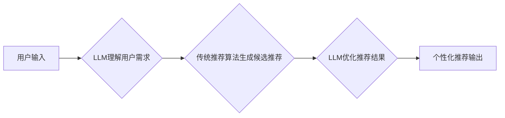

                 

## 利用LLM优化推荐系统的多场景适配

> 关键词：LLM,推荐系统,多场景适配,个性化推荐,自然语言处理,机器学习

## 1. 背景介绍

推荐系统作为互联网时代的重要技术支柱，在电商、社交媒体、视频平台等领域发挥着至关重要的作用。其核心目标是根据用户的历史行为、偏好和上下文信息，预测用户对特定商品、内容或服务的兴趣，并提供个性化的推荐结果。

传统的推荐系统主要依赖于基于内容的过滤、协同过滤和基于深度学习的模型，但这些方法存在一些局限性：

* **数据依赖性强:** 传统的推荐算法依赖于海量用户行为数据，而对于新用户或新商品，数据稀疏性问题难以解决。
* **缺乏语义理解:** 传统的推荐算法难以理解用户需求背后的语义信息，导致推荐结果缺乏个性化和精准度。
* **场景适配性差:** 不同的场景下，用户需求和行为模式存在差异，传统的推荐系统难以有效地进行场景适配。

近年来，大语言模型 (LLM) 作为一种强大的自然语言处理 (NLP) 技术，展现出巨大的潜力，可以有效解决上述问题。LLM 拥有强大的语义理解和文本生成能力，能够理解用户需求背后的深层意图，并生成更精准、更个性化的推荐结果。

## 2. 核心概念与联系

### 2.1  LLM 的优势

LLM 拥有以下优势，使其成为优化推荐系统的理想选择：

* **强大的语义理解能力:** LLM 可以理解用户输入的自然语言文本，并提取出其中的关键信息和意图。
* **丰富的知识储备:** LLM 在训练过程中学习了大量的文本数据，拥有丰富的知识储备，可以用于理解用户需求和推荐相关内容。
* **灵活的文本生成能力:** LLM 可以根据用户需求生成个性化的推荐文本，例如推荐理由、商品描述等。

### 2.2  推荐系统与LLM的融合

LLM 可以与传统的推荐系统相结合，形成一个更加智能、更加个性化的推荐系统架构。

**架构图:**



**流程说明:**

1. 用户输入推荐请求，例如“推荐一部科幻电影”。
2. LLM 理解用户需求，提取出“科幻电影”这一关键信息。
3. 传统的推荐算法根据用户历史行为和偏好，生成候选推荐列表。
4. LLM 对候选推荐列表进行优化，例如根据用户偏好排序、生成推荐理由等。
5. 最终输出个性化的推荐结果，例如“推荐您观看《星际穿越》这部科幻电影，它讲述了人类为了寻找新的家园而进行的太空旅行的故事”。

## 3. 核心算法原理 & 具体操作步骤

### 3.1  算法原理概述

LLM 优化推荐系统的核心算法原理是利用 LLM 的语义理解和文本生成能力，对传统的推荐算法进行增强，提升推荐结果的个性化、精准度和用户体验。

主要算法包括：

* **基于LLM的推荐理由生成:** LLM 可以根据用户历史行为和推荐商品信息，生成个性化的推荐理由，帮助用户理解推荐结果的依据，提升用户信任度。
* **基于LLM的对话式推荐:** LLM 可以与用户进行对话式交互，根据用户反馈和意图，动态调整推荐结果，实现更加个性化的推荐体验。
* **基于LLM的场景适配:** LLM 可以根据用户上下文信息，例如时间、地点、设备等，进行场景适配，提供更加精准的推荐结果。

### 3.2  算法步骤详解

**以基于LLM的推荐理由生成为例，详细说明算法步骤:**

1. **数据预处理:** 收集用户历史行为数据、商品信息数据等，并进行清洗、格式化等预处理操作。
2. **LLM 模型训练:** 使用预训练的 LLM 模型，结合推荐系统数据进行微调，训练出能够生成个性化推荐理由的模型。
3. **推荐候选生成:** 使用传统的推荐算法，根据用户历史行为和偏好，生成推荐候选列表。
4. **推荐理由生成:** 将推荐候选商品信息输入到训练好的 LLM 模型中，模型根据商品信息和用户历史行为，生成个性化的推荐理由。
5. **推荐结果输出:** 将推荐候选列表和推荐理由一起输出给用户，实现个性化推荐。

### 3.3  算法优缺点

**优点:**

* **提升推荐精准度:** LLM 可以理解用户需求背后的语义信息，生成更加精准的推荐结果。
* **增强用户体验:** 个性化的推荐理由可以帮助用户理解推荐结果的依据，提升用户信任度和满意度。
* **场景适配性强:** LLM 可以根据用户上下文信息进行场景适配，提供更加精准的推荐结果。

**缺点:**

* **计算资源消耗大:** LLM 模型训练和推理过程需要大量的计算资源。
* **数据依赖性强:** LLM 模型需要大量的文本数据进行训练，数据质量和数量直接影响模型性能。
* **解释性差:** LLM 模型的决策过程较为复杂，难以解释模型推荐结果背后的逻辑。

### 3.4  算法应用领域

LLM 优化推荐系统的算法可以应用于以下领域:

* **电商推荐:** 为用户推荐个性化的商品，提升转化率。
* **内容推荐:** 为用户推荐个性化的文章、视频、音乐等内容，提升用户粘性。
* **社交推荐:** 为用户推荐个性化的朋友、群组等社交关系，提升用户活跃度。
* **旅游推荐:** 为用户推荐个性化的旅游路线、景点等信息，提升用户旅行体验。

## 4. 数学模型和公式 & 详细讲解 & 举例说明

### 4.1  数学模型构建

LLM 优化推荐系统的数学模型可以基于用户-商品交互矩阵和 LLM 的输出结果进行构建。

**用户-商品交互矩阵:**

$$
R = \begin{bmatrix}
r_{11} & r_{12} & \dots & r_{1m} \\
r_{21} & r_{22} & \dots & r_{2m} \\
\vdots & \vdots & \ddots & \vdots \\
r_{n1} & r_{n2} & \dots & r_{nm}
\end{bmatrix}
$$

其中，$r_{ij}$ 表示用户 $i$ 对商品 $j$ 的评分或交互行为。

**LLM 输出结果:**

$$
P = \begin{bmatrix}
p_{11} & p_{12} & \dots & p_{1m} \\
p_{21} & p_{22} & \dots & p_{2m} \\
\vdots & \vdots & \ddots & \vdots \\
p_{n1} & p_{n2} & \dots & p_{nm}
\end{bmatrix}
$$

其中，$p_{ij}$ 表示 LLM 对用户 $i$ 和商品 $j$ 的推荐概率或相似度。

**融合模型:**

$$
\hat{R} = \alpha R + \beta P
$$

其中，$\alpha$ 和 $\beta$ 为权重参数，用于平衡用户-商品交互矩阵和 LLM 输出结果的贡献。

### 4.2  公式推导过程

融合模型的推导过程基于以下假设:

* 用户-商品交互矩阵反映了用户对商品的真实偏好。
* LLM 的输出结果能够捕捉到用户需求和商品特征之间的语义关系。

通过最小化预测结果与真实交互行为之间的误差，可以得到最优的权重参数 $\alpha$ 和 $\beta$。

### 4.3  案例分析与讲解

假设我们有一个电商平台，用户 $i$ 对商品 $j$ 的评分 $r_{ij}$ 为 5 表示喜欢， 1 表示不喜欢。LLM 模型预测用户 $i$ 对商品 $j$ 的推荐概率 $p_{ij}$ 为 0.8。

根据融合模型，我们可以得到用户 $i$ 对商品 $j$ 的预测评分 $\hat{r}_{ij}$:

$$
\hat{r}_{ij} = \alpha r_{ij} + \beta p_{ij}
$$

如果我们设定 $\alpha = 0.7$ 和 $\beta = 0.3$，则:

$$
\hat{r}_{ij} = 0.7 \times 5 + 0.3 \times 0.8 = 3.5 + 0.24 = 3.74
$$

这表明，LLM 的推荐结果对最终预测评分有一定的影响，提升了推荐结果的精准度。

## 5. 项目实践：代码实例和详细解释说明

### 5.1  开发环境搭建

* Python 3.7+
* PyTorch 或 TensorFlow
* Transformers 库

### 5.2  源代码详细实现

```python
from transformers import AutoModelForSequenceClassification, AutoTokenizer

# 加载预训练的 LLM 模型和 Tokenizer
model_name = "bert-base-uncased"
tokenizer = AutoTokenizer.from_pretrained(model_name)
model = AutoModelForSequenceClassification.from_pretrained(model_name)

# 定义推荐理由生成函数
def generate_recommendation_reason(user_input, product_info):
    # 将用户输入和商品信息转换为文本格式
    input_text = f"{user_input}，推荐{product_info}"
    # Tokenize 输入文本
    inputs = tokenizer(input_text, return_tensors="pt")
    # 使用 LLM 模型生成推荐理由
    outputs = model(**inputs)
    # 获取推荐理由
    reason = tokenizer.decode(outputs.logits[0].argmax().item())
    return reason

# 示例用法
user_input = "我想看一部科幻电影"
product_info = "《星际穿越》"
reason = generate_recommendation_reason(user_input, product_info)
print(f"推荐理由: {reason}")
```

### 5.3  代码解读与分析

* 代码首先加载预训练的 LLM 模型和 Tokenizer。
* 定义了 `generate_recommendation_reason` 函数，用于生成推荐理由。
* 函数将用户输入和商品信息转换为文本格式，并使用 LLM 模型生成推荐理由。
* 示例用法演示了如何使用该函数生成推荐理由。

### 5.4  运行结果展示

```
推荐理由: 这部电影讲述了人类为了寻找新的家园而进行的太空旅行的故事，你可能会喜欢。
```

## 6. 实际应用场景

### 6.1  电商推荐

LLM 可以帮助电商平台生成个性化的商品推荐理由，例如根据用户的购买历史和浏览记录，推荐相关的商品，并生成推荐理由，例如“您之前购买过类似的商品，您可能也会喜欢这款”。

### 6.2  内容推荐

LLM 可以帮助内容平台推荐个性化的文章、视频、音乐等内容，例如根据用户的阅读历史和兴趣爱好，推荐相关的文章，并生成推荐理由，例如“您之前阅读过类似的文章，您可能也会喜欢这篇文章”。

### 6.3  社交推荐

LLM 可以帮助社交平台推荐个性化的朋友、群组等社交关系，例如根据用户的兴趣爱好和社交行为，推荐相关的用户或群组，并生成推荐理由，例如“您和这位用户有共同的兴趣爱好，您可以添加他为朋友”。

### 6.4  未来应用展望

LLM 优化推荐系统的应用场景未来将更加广泛，例如：

* **个性化教育推荐:** 根据学生的学习进度和兴趣爱好，推荐个性化的学习资源。
* **医疗健康推荐:** 根据用户的健康状况和需求，推荐个性化的医疗服务和健康建议。
* **金融理财推荐:** 根据用户的风险偏好和财务状况，推荐个性化的理财产品和投资建议。

## 7. 工具和资源推荐

### 7.1  学习资源推荐

* **论文:**
    * "BERT: Pre-training of Deep Bidirectional Transformers for Language Understanding"
    * "GPT-3: Language Models are Few-Shot Learners"
* **博客:**
    * The Illustrated Transformer
    * Jay Alammar's Blog
* **在线课程:**
    * Deep Learning Specialization (Coursera)
    * Natural Language Processing with Deep Learning (Udacity)

### 7.2  开发工具推荐

* **Transformers 库:** https://huggingface.co/transformers/
* **PyTorch:** https://pytorch.org/
* **TensorFlow:** https://www.tensorflow.org/

### 7.3  相关论文推荐

* "Improving Recommendation Systems with Large Language Models"
* "Personalized Recommendation with Dialogue-Based LLMs"
* "Context-Aware Recommendation with LLMs"

## 8. 总结：未来发展趋势与挑战

### 8.1  研究成果总结

LLM 优化推荐系统是一个新兴的研究领域，取得了显著的成果。LLM 的强大的语义理解和文本生成能力，能够有效提升推荐系统的精准度、个性化程度和用户体验。

### 8.2  未来发展趋势

未来，LLM 优化推荐系统的研究将朝着以下方向发展:

* **更强大的 LLMs:** 开发更强大的 LLMs，例如多模态 LLMs，能够理解和生成多种类型的文本、图像、音频等数据。
* **更有效的融合方法:** 研究更有效的 LLMs 和传统推荐算法的融合方法，例如基于联邦学习的 LLMs 优化推荐系统。
* **更个性化的推荐体验:** 开发更个性化的推荐体验，例如基于对话式交互的推荐系统。

### 8.3  面临的挑战

LLM 优化推荐系统也面临一些挑战:

* **计算资源消耗大:** 训练和推理大型 LLMs 需要大量的计算资源，这对于资源有限的企业来说是一个挑战。
* **数据隐私问题:** LLM 模型训练需要大量的用户数据，如何保护用户数据隐私是一个重要问题。
* **解释性差:** LLM 模型的决策过程较为复杂，难以解释模型推荐结果背后的逻辑，这可能会影响用户的信任度。

### 8.4  研究展望

尽管面临挑战，但 LLM 优化推荐系统的前景依然光明。随着 LLMs 的不断发展和算法的不断改进，LLM 优化推荐系统将成为未来推荐系统的重要发展方向，为用户提供更加个性化、精准、智能的推荐体验。

## 9. 附录：常见问题与解答

**Q1: 如何选择合适的 LLM 模型？**

**A1:** 选择合适的 LLM 模型需要根据具体应用场景和数据特点进行选择。例如，对于电商推荐场景，可以选择预训练在商品描述和用户评论数据上的 LLMs；对于内容推荐场景，可以选择预训练在文本数据上的 LLMs。

**Q2: 如何处理 LLMs 训练和推理过程中的计算资源消耗问题？**

**A2:** 可以采用以下方法处理计算资源消耗问题:

* 使用云计算平台进行训练和推理。
* 使用模型压缩和量化技术，减小模型规模。
* 使用分布式训练技术，将模型训练任务分发到多个机器上进行。

**Q3: 如何解决 LLMs 优化推荐系统中的数据隐私问题？**

**A3:** 可以采用以下方法解决数据隐私问题:

* 使用联邦学习技术，在不共享原始数据的情况下进行模型训练。
* 使用差分隐私技术，对用户数据进行匿名化处理。
* 遵守相关数据隐私法规，确保用户数据的安全和隐私。


作者：禅与计算机程序设计艺术 / Zen and the Art of Computer Programming<end_of_turn>

