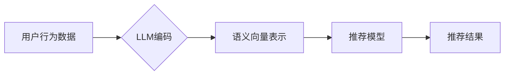

                 

## 利用LLM提升推荐系统的时序建模能力

> 关键词：LLM,推荐系统,时序建模,序列数据,自然语言处理,机器学习,深度学习

## 1. 背景介绍

推荐系统是互联网时代的重要组成部分，其核心目标是根据用户的历史行为、偏好等信息，预测用户对未来物品的兴趣，并提供个性化的推荐结果。传统的推荐系统主要依赖于协同过滤、内容过滤等方法，但这些方法在处理用户行为序列数据时存在局限性。

随着大数据时代的到来，用户行为数据呈现出越来越多的时序特征，例如用户的浏览历史、购买记录、点赞行为等。这些时序数据蕴含着丰富的用户兴趣和偏好信息，能够帮助推荐系统更精准地预测用户需求。因此，如何有效地利用时序数据提升推荐系统的性能成为一个重要的研究方向。

近年来，大规模语言模型（LLM）的快速发展为推荐系统带来了新的机遇。LLM 拥有强大的文本理解和生成能力，能够从用户行为序列中提取隐含的语义信息，并将其转化为推荐决策的输入。

## 2. 核心概念与联系

### 2.1 时序建模

时序建模是指利用时间序列数据来预测未来事件或趋势的方法。在推荐系统中，时序建模可以用于预测用户的下一个点击、购买或评分行为。

### 2.2 LLM

大规模语言模型（LLM）是指在海量文本数据上训练的深度学习模型，能够理解和生成人类语言。LLM 拥有强大的文本表示能力，可以将用户行为序列转化为语义向量，并捕捉其中的时间依赖关系。

### 2.3 核心架构

LLM 可以与传统的推荐系统架构相结合，形成一个新的推荐系统框架。



**图 1：LLM 提升推荐系统时序建模的架构**

## 3. 核心算法原理 & 具体操作步骤

### 3.1 算法原理概述

LLM 可以通过以下步骤提升推荐系统的时序建模能力：

1. **用户行为序列编码:** 将用户的历史行为序列转化为语义向量表示。
2. **时间依赖关系建模:** 利用 LLM 的自注意力机制捕捉用户行为序列中的时间依赖关系。
3. **推荐模型融合:** 将编码后的用户行为序列和时间依赖关系作为输入，训练推荐模型。

### 3.2 算法步骤详解

1. **数据预处理:** 收集用户行为数据，并进行清洗、格式化等预处理操作。
2. **用户行为序列编码:** 使用 LLM 将用户的历史行为序列转化为语义向量表示。例如，可以使用 BERT、RoBERTa 等预训练语言模型进行编码。
3. **时间依赖关系建模:** 利用 LLM 的自注意力机制捕捉用户行为序列中的时间依赖关系。自注意力机制可以学习到不同时间步长行为之间的相关性，从而更好地理解用户行为的演变趋势。
4. **推荐模型训练:** 将编码后的用户行为序列和时间依赖关系作为输入，训练推荐模型。可以采用传统的推荐算法，例如深度神经网络、树模型等，也可以结合 LLM 的能力进行改进。
5. **推荐结果生成:** 将训练好的推荐模型应用于新的用户行为数据，预测用户的下一个点击、购买或评分行为，并生成推荐结果。

### 3.3 算法优缺点

**优点:**

* 能够更好地捕捉用户行为序列中的时间依赖关系。
* 能够利用 LLM 的强大的文本理解能力，提取用户行为序列中的隐含语义信息。
* 能够提升推荐系统的精准度和个性化程度。

**缺点:**

* LLM 的训练成本较高，需要大量的计算资源和数据。
* LLM 的模型复杂度较高，需要专业的技术人员进行开发和维护。

### 3.4 算法应用领域

LLM 提升推荐系统时序建模能力的算法可以应用于以下领域：

* **电商推荐:** 预测用户的下一个购买行为，提供个性化的商品推荐。
* **内容推荐:** 预测用户的下一个浏览或点击行为，推荐相关的文章、视频等内容。
* **社交推荐:** 预测用户的下一个关注或点赞行为，推荐相关的用户或话题。

## 4. 数学模型和公式 & 详细讲解 & 举例说明

### 4.1 数学模型构建

假设用户 $u$ 的行为序列为 $S_u = (s_1, s_2, ..., s_T)$, 其中 $s_t$ 表示用户 $u$ 在时间步 $t$ 的行为。

LLM 可以将用户行为序列 $S_u$ 编码为一个固定长度的语义向量 $h_u = (h_{u1}, h_{u2}, ..., h_{uN})$, 其中 $h_{ui}$ 表示用户 $u$ 在时间步 $i$ 的行为对应的语义向量。

### 4.2 公式推导过程

LLM 的自注意力机制可以用来捕捉用户行为序列中的时间依赖关系。

自注意力机制的计算公式如下：

$$
Attention(Q, K, V) = softmax(\frac{QK^T}{\sqrt{d_k}})V
$$

其中：

* $Q$, $K$, $V$ 分别是查询矩阵、键矩阵和值矩阵。
* $d_k$ 是键向量的维度。

在推荐系统中，可以将用户行为序列的每个时间步的语义向量作为查询矩阵 $Q$, 键矩阵 $K$ 和值矩阵 $V$ 的输入，计算自注意力权重，从而捕捉不同时间步长行为之间的相关性。

### 4.3 案例分析与讲解

例如，假设用户 $u$ 的行为序列为 $(“购买手机”，“浏览耳机”，“购买充电宝”)$, 我们可以使用 LLM 的自注意力机制计算每个行为之间的相关性。

通过自注意力机制的计算，我们可以发现 “购买手机” 和 “购买充电宝” 两个行为之间的相关性较高，因为它们都是与电子产品相关的行为。而 “浏览耳机” 与其他两个行为的相关性较低。

## 5. 项目实践：代码实例和详细解释说明

### 5.1 开发环境搭建

* Python 3.7+
* PyTorch 1.7+
* Transformers 4.0+

### 5.2 源代码详细实现

```python
import torch
from transformers import BertModel, BertTokenizer

# 加载预训练模型和词典
model_name = "bert-base-uncased"
tokenizer = BertTokenizer.from_pretrained(model_name)
model = BertModel.from_pretrained(model_name)

# 用户行为序列编码
def encode_user_behavior(behavior_sequence):
    # 将行为序列转换为文本格式
    text = " ".join(behavior_sequence)
    # 使用预训练模型编码行为序列
    inputs = tokenizer(text, return_tensors="pt")
    outputs = model(**inputs)
    # 获取最后一个时间步的隐藏状态作为语义向量
    return outputs.last_hidden_state[:, 0, :]

# 推荐模型训练
# ...

# 推荐结果生成
# ...
```

### 5.3 代码解读与分析

* 代码首先加载预训练的 BERT 模型和词典。
* `encode_user_behavior` 函数将用户行为序列转换为文本格式，并使用 BERT 模型进行编码。
* 最后隐藏状态的第一个元素作为用户行为序列的语义向量。
* 推荐模型训练和推荐结果生成部分需要根据具体的推荐算法进行实现。

### 5.4 运行结果展示

* 运行结果展示需要根据具体的推荐算法和数据集进行评估。
* 可以使用指标如准确率、召回率、NDCG 等来评估推荐系统的性能。

## 6. 实际应用场景

### 6.1 电商推荐

LLM 可以用于提升电商平台的商品推荐精准度。例如，可以根据用户的浏览历史、购买记录等行为序列，预测用户对未来商品的兴趣，并提供个性化的商品推荐。

### 6.2 内容推荐

LLM 可以用于提升内容平台的推荐效果。例如，可以根据用户的阅读历史、点赞记录等行为序列，预测用户对未来文章、视频等内容的兴趣，并推荐相关的个性化内容。

### 6.3 社交推荐

LLM 可以用于提升社交平台的用户推荐效果。例如，可以根据用户的关注关系、互动记录等行为序列，预测用户对未来用户或话题的兴趣，并推荐相关的个性化用户或话题。

### 6.4 未来应用展望

随着 LLM 技术的不断发展，其在推荐系统中的应用场景将会更加广泛。例如，可以利用 LLM 的多模态能力，融合文本、图像、视频等多种数据类型，构建更全面的用户画像，从而提供更精准的推荐结果。

## 7. 工具和资源推荐

### 7.1 学习资源推荐

* **论文:**
    * Vaswani, A., Shazeer, N., Parmar, N., Uszkoreit, J., Jones, L., Gomez, A. N., ... & Polosukhin, I. (2017). Attention is all you need. Advances in neural information processing systems, 30.
    * Devlin, J., Chang, M. W., Lee, K., & Toutanova, K. (2018). Bert: Pre-training of deep bidirectional transformers for language understanding. arXiv preprint arXiv:1810.04805.
* **博客:**
    * https://huggingface.co/blog/
    * https://www.tensorflow.org/blog

### 7.2 开发工具推荐

* **PyTorch:** https://pytorch.org/
* **Transformers:** https://huggingface.co/docs/transformers/index

### 7.3 相关论文推荐

* **LLM in Recommender Systems:**
    * https://arxiv.org/abs/2206.06476
    * https://arxiv.org/abs/2301.05347

## 8. 总结：未来发展趋势与挑战

### 8.1 研究成果总结

LLM 能够有效地提升推荐系统的时序建模能力，并取得了显著的性能提升。

### 8.2 未来发展趋势

* **更强大的 LLMs:** 未来将会出现更强大的 LLMs，拥有更丰富的语义理解能力和生成能力，从而进一步提升推荐系统的性能。
* **多模态推荐:** 将 LLMs 与其他模态数据（例如图像、视频）融合，构建更全面的用户画像，实现多模态推荐。
* **个性化推荐:** 利用 LLMs 更好地理解用户的个性化需求，提供更精准的个性化推荐。

### 8.3 面临的挑战

* **数据隐私:** LLM 的训练需要大量的用户数据，如何保护用户数据隐私是一个重要的挑战。
* **模型可解释性:** LLM 的模型复杂度较高，其决策过程难以解释，如何提高模型的可解释性是一个重要的研究方向。
* **计算资源:** LLM 的训练成本较高，需要大量的计算资源，如何降低训练成本是一个重要的挑战。

### 8.4 研究展望

未来，LLM 在推荐系统领域的应用将会更加广泛，并带来更多创新。

## 9. 附录：常见问题与解答

* **Q1: LLM 的训练成本很高，如何降低训练成本？**

A1: 可以采用知识蒸馏等技术，将大型模型的知识迁移到小型模型中，从而降低训练成本。

* **Q2: 如何保证 LLM 在推荐系统中的公平性？**

A2: 可以采用公平性度量指标，并进行模型调优，以确保推荐结果的公平性。

* **Q3: 如何评估 LLM 在推荐系统中的性能？**

A3: 可以使用指标如准确率、召回率、NDCG 等来评估推荐系统的性能。


作者：禅与计算机程序设计艺术 / Zen and the Art of Computer Programming 
<end_of_turn>

