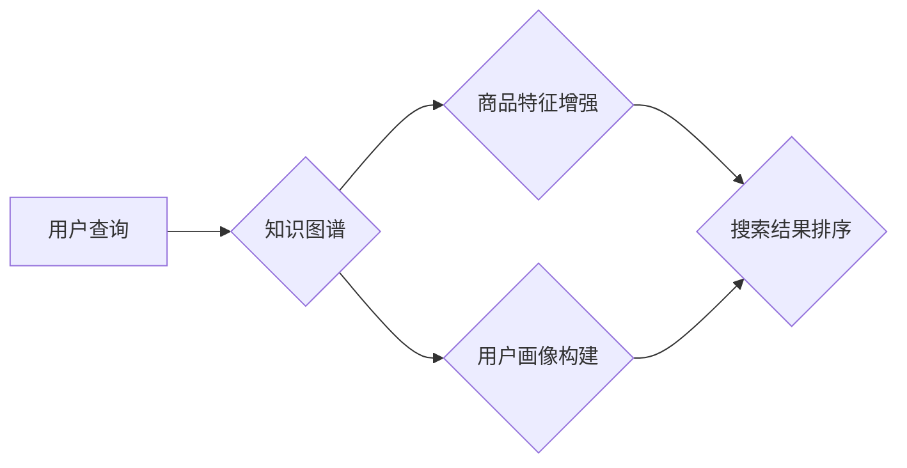

                 

## 图神经网络在电商搜索业务中的应用进展

> 关键词：图神经网络、电商搜索、推荐系统、知识图谱、用户画像、商品关联

## 1. 背景介绍

电商搜索作为电商平台的核心功能之一，直接影响着用户体验和平台商业价值。传统的基于关键词匹配的搜索方式难以满足用户日益增长的个性化需求，搜索结果往往缺乏精准性和相关性。近年来，随着深度学习技术的快速发展，图神经网络（Graph Neural Networks，GNN）凭借其强大的表示学习能力和对复杂关系建模的优势，在电商搜索领域展现出巨大的潜力。

图神经网络是一种能够学习图结构数据表示的深度学习模型，它可以有效地捕捉商品、用户、品牌等实体之间的复杂关系，从而提升搜索结果的准确性和相关性。在电商搜索业务中，商品、用户、品牌、评论等信息可以构建成一个庞大的知识图谱，GNN 可以通过学习图结构信息，构建更精准的用户画像和商品特征，从而实现更个性化、更智能化的搜索体验。

## 2. 核心概念与联系

### 2.1 图神经网络概述

图神经网络（GNN）是一种专门用于处理图结构数据的深度学习模型。图结构数据以节点和边表示，节点代表实体，边代表实体之间的关系。GNN 通过在图结构上迭代传播信息，学习节点的特征表示，从而捕捉图结构中的复杂关系和模式。

### 2.2 电商搜索业务与图神经网络的联系

电商搜索业务的核心是将用户查询与商品进行匹配，并返回最相关的搜索结果。传统的搜索引擎主要依赖关键词匹配，但这种方法难以捕捉用户意图的复杂性和商品之间的关联关系。图神经网络可以将电商平台上的商品、用户、品牌、评论等信息构建成一个知识图谱，并通过学习图结构信息，实现以下功能：

* **用户画像构建:** GNN 可以学习用户浏览历史、购买记录、评价行为等信息，构建用户兴趣偏好、购买习惯等多维度的用户画像。
* **商品特征增强:** GNN 可以学习商品属性、用户评价、商品关联等信息，构建商品的丰富特征表示，提升商品的搜索匹配度。
* **关系挖掘:** GNN 可以挖掘商品之间的关联关系，例如同类商品、推荐商品、替代商品等，从而提供更精准的搜索结果和个性化推荐。

**Mermaid 流程图**



## 3. 核心算法原理 & 具体操作步骤

### 3.1 算法原理概述

图神经网络的核心算法原理是通过在图结构上迭代传播信息，学习节点的特征表示。常见的GNN算法包括：

* **Graph Convolutional Networks (GCN):** GCN 通过卷积操作学习节点的特征表示，并传播信息到相邻节点。
* **Graph Attention Networks (GAT):** GAT 引入了注意力机制，学习不同节点之间的重要性，并根据重要性权重传播信息。
* **GraphSAGE:** GraphSAGE 是一种基于邻居聚合的GNN算法，可以学习节点的特征表示，并对节点进行分类或预测。

### 3.2 算法步骤详解

以GCN为例，其算法步骤如下：

1. **初始化节点特征:** 将每个节点的初始特征表示设置为其属性向量。
2. **信息传播:** 迭代地传播信息到相邻节点，更新节点的特征表示。
3. **特征聚合:** 将相邻节点的信息聚合起来，更新节点的特征表示。
4. **输出预测:** 根据学习到的节点特征表示，进行预测任务，例如商品推荐、用户画像构建等。

### 3.3 算法优缺点

**优点:**

* 能够有效地捕捉图结构中的复杂关系和模式。
* 能够学习节点的低维特征表示，提升模型的表达能力。
* 适用于各种图结构数据，例如社交网络、知识图谱、电商平台数据等。

**缺点:**

* 训练过程复杂，需要大量的计算资源。
* 对于大型图数据，计算效率较低。
* 算法参数的选择对模型性能有较大影响。

### 3.4 算法应用领域

图神经网络在电商搜索领域具有广泛的应用场景，例如：

* **商品推荐:** 基于用户行为和商品关联关系，推荐用户可能感兴趣的商品。
* **搜索结果排序:** 根据用户查询和商品特征，排序搜索结果，提升搜索结果的精准度和相关性。
* **用户画像构建:** 学习用户浏览历史、购买记录、评价行为等信息，构建用户兴趣偏好、购买习惯等多维度的用户画像。
* **商品分类:** 基于商品属性和用户行为，对商品进行分类，提升商品的搜索匹配度。

## 4. 数学模型和公式 & 详细讲解 & 举例说明

### 4.1 数学模型构建

图神经网络的数学模型通常基于图卷积操作。假设图 $G = (V, E)$，其中 $V$ 是节点集合，$E$ 是边集合。每个节点 $v \in V$ 都有一个特征向量 $h_v \in \mathbb{R}^d$。

### 4.2 公式推导过程

GCN 的核心公式如下：

$$
h_v^{(l+1)} = \sigma(\sum_{u \in N(v)} \frac{e_{uv}}{\sqrt{d_{u}}} W^{(l)} h_u^{(l)})
$$

其中：

* $h_v^{(l+1)}$ 是节点 $v$ 在第 $(l+1)$ 层的特征表示。
* $h_u^{(l)}$ 是节点 $u$ 在第 $l$ 层的特征表示。
* $N(v)$ 是节点 $v$ 的邻居节点集合。
* $e_{uv}$ 是节点 $u$ 和 $v$ 之间的边权重。
* $d_u$ 是节点 $u$ 的度数。
* $W^{(l)}$ 是第 $l$ 层的权重矩阵。
* $\sigma$ 是激活函数。

### 4.3 案例分析与讲解

假设我们有一个电商平台的知识图谱，其中商品节点的特征表示包括商品名称、价格、类别等信息。我们可以使用 GCN 学习商品之间的关联关系，例如同类商品、推荐商品、替代商品等。通过学习这些关系，我们可以对用户查询进行更精准的匹配，并推荐更相关的商品。

## 5. 项目实践：代码实例和详细解释说明

### 5.1 开发环境搭建

* Python 3.6+
* TensorFlow/PyTorch
* NetworkX

### 5.2 源代码详细实现

```python
import tensorflow as tf
from tensorflow.keras.layers import Dense, Dropout
from tensorflow.keras.models import Model

# 定义 GCN 层
def gcn_layer(inputs, weights):
    # 计算邻居节点的特征加权和
    neighbors = tf.gather_nd(inputs, indices)
    weighted_sum = tf.reduce_sum(neighbors * weights, axis=1)
    # 应用激活函数
    return tf.nn.relu(weighted_sum)

# 定义 GCN 模型
def gcn_model(input_shape, num_classes):
    # 输入层
    inputs = tf.keras.Input(shape=input_shape)
    # GCN 层
    x = gcn_layer(inputs, weights=tf.Variable(tf.random.normal([input_shape, input_shape])))
    x = Dropout(0.5)(x)
    # 全连接层
    outputs = Dense(num_classes, activation='softmax')(x)
    # 返回模型
    return Model(inputs=inputs, outputs=outputs)

# 训练模型
model = gcn_model(input_shape=(10,), num_classes=5)
model.compile(optimizer='adam', loss='categorical_crossentropy', metrics=['accuracy'])
model.fit(x_train, y_train, epochs=10)
```

### 5.3 代码解读与分析

* 代码首先定义了 GCN 层和 GCN 模型。
* GCN 层计算邻居节点的特征加权和，并应用激活函数。
* GCN 模型包含输入层、GCN 层和全连接层。
* 训练模型时，使用 Adam 优化器、交叉熵损失函数和准确率作为评估指标。

### 5.4 运行结果展示

运行结果展示包括模型的训练曲线、测试准确率等指标。

## 6. 实际应用场景

### 6.1 商品推荐

基于用户行为和商品关联关系，推荐用户可能感兴趣的商品。例如，如果用户购买了手机，可以推荐相关的充电器、耳机等商品。

### 6.2 搜索结果排序

根据用户查询和商品特征，排序搜索结果，提升搜索结果的精准度和相关性。例如，如果用户查询了“苹果手机”，可以将苹果手机的搜索结果排在前面。

### 6.3 用户画像构建

学习用户浏览历史、购买记录、评价行为等信息，构建用户兴趣偏好、购买习惯等多维度的用户画像。例如，可以根据用户的购买记录，构建其喜欢的商品类别、价格范围等信息。

### 6.4 未来应用展望

* **个性化搜索:** 基于用户画像和商品关联关系，提供更个性化的搜索结果。
* **跨平台搜索:** 将不同平台的数据整合，实现跨平台的商品搜索。
* **多模态搜索:** 结合文本、图像、语音等多模态数据，实现更智能的商品搜索。

## 7. 工具和资源推荐

### 7.1 学习资源推荐

* **书籍:**
    * 《图神经网络》
    * 《深度学习》
* **在线课程:**
    * Coursera: Graph Neural Networks Specialization
    * Udacity: Deep Learning Nanodegree

### 7.2 开发工具推荐

* **TensorFlow:** 开源深度学习框架
* **PyTorch:** 开源深度学习框架
* **NetworkX:** 图数据处理库

### 7.3 相关论文推荐

* 《Graph Convolutional Networks》
* 《Attention Is All You Need》
* 《GraphSAGE: Inductive Representation Learning on Large Graphs》

## 8. 总结：未来发展趋势与挑战

### 8.1 研究成果总结

图神经网络在电商搜索领域取得了显著的成果，例如提高了商品推荐的准确率、提升了搜索结果的精准度和相关性。

### 8.2 未来发展趋势

* **模型复杂度提升:** 研究更复杂的图神经网络模型，例如Transformer-based GNN，提升模型的表达能力和泛化能力。
* **数据规模扩展:** 利用海量电商平台数据训练更强大的图神经网络模型。
* **算法效率优化:** 研究更高效的图神经网络算法，降低模型训练和推理的计算成本。

### 8.3 面临的挑战

* **数据稀疏性:** 电商平台数据往往存在节点和边的稀疏性，需要采用有效的处理方法。
* **负样本生成:** 图神经网络的训练需要大量的负样本，负样本的生成方法需要进一步研究。
* **可解释性:** 图神经网络模型的决策过程难以解释，需要研究更可解释的图神经网络模型。

### 8.4 研究展望

未来，图神经网络在电商搜索领域将继续发挥重要作用，并推动电商搜索业务的智能化发展。


## 9. 附录：常见问题与解答

* **Q: 图神经网络与传统的机器学习模型相比有什么优势？**

* **A:** 图神经网络能够有效地捕捉图结构数据中的复杂关系和模式，而传统的机器学习模型难以处理这种结构化数据。

* **Q: 如何选择合适的图神经网络算法？**

* **A:** 选择合适的图神经网络算法需要根据具体应用场景和数据特点进行选择。例如，对于节点特征较少的数据，可以使用 GraphSAGE 算法；对于节点特征较多且关系复杂的数据，可以使用 GAT 算法。

* **Q: 图神经网络的训练过程复杂吗？**

* **A:** 图神经网络的训练过程确实比传统的机器学习模型复杂，需要更多的计算资源和专业知识。

* **Q: 图神经网络的应用场景有哪些？**

* **A:** 图神经网络的应用场景非常广泛，例如推荐系统、社交网络分析、知识图谱构建、药物研发等。


作者：禅与计算机程序设计艺术 / Zen and the Art of Computer Programming 
<end_of_turn>

