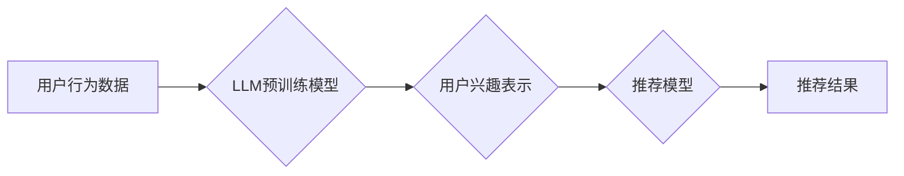

                 

## 基于LLM的推荐系统用户兴趣演化建模

> 关键词：LLM,推荐系统,用户兴趣演化,建模,自然语言处理,深度学习

## 1. 背景介绍

推荐系统作为信息过滤和个性化服务的重要组成部分，在电商、社交媒体、视频平台等领域发挥着越来越重要的作用。传统的推荐系统主要依赖于用户的历史行为数据，例如点击、购买、评分等，构建用户兴趣模型。然而，用户兴趣是动态变化的，传统的基于历史行为的模型难以捕捉用户兴趣的演化趋势。

近年来，大语言模型（LLM）的快速发展为推荐系统带来了新的机遇。LLM 拥有强大的文本理解和生成能力，能够从用户的文本数据中挖掘更深层的兴趣信息，并预测用户的未来行为。基于LLM的推荐系统能够更好地理解用户兴趣的复杂性和动态性，从而提供更精准、个性化的推荐服务。

## 2. 核心概念与联系

### 2.1 用户兴趣演化

用户兴趣演化是指用户兴趣随着时间推移而发生变化的现象。用户兴趣的演化可以受到多种因素的影响，例如：

* **时间因素:** 用户的兴趣会随着年龄、生活阶段、社会环境等因素的变化而发生改变。
* **环境因素:** 用户的兴趣会受到周围环境、社交圈、流行趋势等因素的影响。
* **体验因素:** 用户对产品的体验、评价、反馈等都会影响用户的兴趣。

### 2.2 LLM在推荐系统中的应用

LLM 可以通过以下方式应用于推荐系统：

* **用户兴趣建模:** LLM 可以从用户的文本数据中，例如评论、描述、对话等，提取用户兴趣相关的关键词、主题、情感等信息，构建更精准的用户兴趣模型。
* **推荐内容生成:** LLM 可以根据用户的兴趣模型，生成个性化的推荐内容，例如推荐商品、文章、视频等。
* **推荐解释:** LLM 可以解释推荐结果背后的逻辑，帮助用户理解推荐系统的推荐机制。

### 2.3 架构图



## 3. 核心算法原理 & 具体操作步骤

### 3.1 算法原理概述

基于LLM的推荐系统用户兴趣演化建模的核心算法原理是利用LLM的文本理解和生成能力，从用户的历史行为数据中学习用户兴趣的演化趋势，并预测用户的未来兴趣。

具体来说，该算法主要包括以下步骤：

1. **数据预处理:** 收集用户的历史行为数据，例如点击、购买、评分等，并进行文本化处理，例如将商品名称、用户评论等转换为文本格式。
2. **LLM预训练:** 利用大量的文本数据对LLM进行预训练，使其具备强大的文本理解和生成能力。
3. **用户兴趣表示:** 将用户的历史行为数据输入到预训练好的LLM中，通过LLM的文本编码和表示学习模块，将用户的行为数据转换为用户兴趣的向量表示。
4. **兴趣演化建模:** 利用用户的兴趣向量表示，构建一个兴趣演化模型，例如使用循环神经网络（RNN）或Transformer模型，学习用户兴趣随时间变化的趋势。
5. **未来兴趣预测:** 利用训练好的兴趣演化模型，预测用户的未来兴趣，并根据预测结果生成个性化的推荐内容。

### 3.2 算法步骤详解

1. **数据预处理:**

* **数据收集:** 从数据库或日志文件中收集用户的历史行为数据，例如点击记录、购买记录、评分记录等。
* **数据清洗:** 去除无效数据、重复数据和噪声数据，确保数据质量。
* **数据转换:** 将数据转换为文本格式，例如将商品ID转换为商品名称，将用户ID转换为用户昵称等。

2. **LLM预训练:**

* **选择预训练模型:** 选择合适的LLM预训练模型，例如BERT、GPT-3等。
* **数据准备:** 将收集到的文本数据进行分词、标记等预处理，并将其用于LLM的预训练。
* **训练模型:** 利用预训练数据训练LLM模型，使其具备强大的文本理解和生成能力。

3. **用户兴趣表示:**

* **文本编码:** 将用户的历史行为数据输入到预训练好的LLM模型中，利用LLM的文本编码模块将文本数据转换为向量表示。
* **兴趣聚合:** 对用户的多个行为数据进行聚合，例如将多个商品点击记录聚合为一个商品兴趣向量。

4. **兴趣演化建模:**

* **模型选择:** 选择合适的深度学习模型用于建模用户兴趣的演化趋势，例如RNN、Transformer等。
* **模型训练:** 利用用户的兴趣向量表示和时间戳信息，训练深度学习模型，学习用户兴趣随时间变化的规律。

5. **未来兴趣预测:**

* **输入新数据:** 将用户的最新行为数据输入到训练好的兴趣演化模型中。
* **预测兴趣:** 利用模型预测用户的未来兴趣，并根据预测结果生成个性化的推荐内容。

### 3.3 算法优缺点

**优点:**

* **更精准的用户兴趣建模:** LLM能够从用户的文本数据中挖掘更深层的兴趣信息，构建更精准的用户兴趣模型。
* **更好的捕捉用户兴趣演化:** LLM能够学习用户兴趣随时间变化的趋势，更好地捕捉用户兴趣的演化。
* **个性化推荐:** 基于用户兴趣演化的推荐结果更个性化，能够满足用户的个性化需求。

**缺点:**

* **数据依赖性强:** LLM的性能依赖于训练数据的质量和数量。
* **计算资源消耗大:** LLM的训练和推理过程需要大量的计算资源。
* **解释性差:** LLM的推荐结果难以解释，用户难以理解推荐背后的逻辑。

### 3.4 算法应用领域

基于LLM的推荐系统用户兴趣演化建模算法可以应用于以下领域:

* **电商推荐:** 推荐商品、优惠券、促销活动等。
* **内容推荐:** 推荐文章、视频、音乐等。
* **社交推荐:** 推荐好友、群组、话题等。
* **教育推荐:** 推荐课程、学习资源、辅导老师等。

## 4. 数学模型和公式 & 详细讲解 & 举例说明

### 4.1 数学模型构建

用户兴趣演化建模可以使用循环神经网络（RNN）或Transformer模型。

**RNN模型:**

RNN模型利用循环结构来捕捉时间序列数据中的依赖关系。用户兴趣演化建模可以使用RNN模型将用户的历史行为数据作为输入，学习用户兴趣随时间变化的趋势。

**Transformer模型:**

Transformer模型是一种更先进的序列建模方法，它利用注意力机制来捕捉序列数据中的长距离依赖关系。Transformer模型可以更好地学习用户兴趣的复杂演化趋势。

### 4.2 公式推导过程

**RNN模型:**

RNN模型的输出序列 $h_t$ 在时间步 $t$ 的计算公式如下:

$$h_t = f(W_{xh}x_t + W_{hh}h_{t-1} + b_h)$$

其中:

* $x_t$ 是时间步 $t$ 的输入向量。
* $h_{t-1}$ 是时间步 $t-1$ 的隐藏状态向量。
* $W_{xh}$ 和 $W_{hh}$ 是权重矩阵。
* $b_h$ 是偏置向量。
* $f$ 是激活函数。

**Transformer模型:**

Transformer模型的输出序列 $h_t$ 的计算公式更加复杂，涉及到多头注意力机制、前馈神经网络等模块。

### 4.3 案例分析与讲解

假设我们有一个电商平台，想要推荐商品给用户。我们可以使用基于LLM的推荐系统用户兴趣演化建模算法，从用户的历史购买记录、浏览记录、评论等文本数据中学习用户的兴趣演化趋势，并预测用户的未来兴趣。

例如，如果用户最近购买了运动鞋、运动服等商品，那么我们可以预测用户的未来兴趣可能仍然是运动类商品。我们可以利用LLM生成个性化的推荐结果，例如推荐用户购买运动耳机、运动手表等商品。

## 5. 项目实践：代码实例和详细解释说明

### 5.1 开发环境搭建

* **操作系统:** Linux/macOS/Windows
* **Python版本:** 3.7+
* **深度学习框架:** TensorFlow/PyTorch
* **LLM库:** HuggingFace Transformers

### 5.2 源代码详细实现

```python
# 导入必要的库
import torch
from transformers import AutoModelForSequenceClassification, AutoTokenizer

# 加载预训练模型和词典
model_name = "bert-base-uncased"
tokenizer = AutoTokenizer.from_pretrained(model_name)
model = AutoModelForSequenceClassification.from_pretrained(model_name)

# 数据预处理
def preprocess_data(text):
    inputs = tokenizer(text, return_tensors="pt")
    return inputs

# 用户兴趣表示
def get_user_interest_representation(user_history):
    # 将用户的历史行为数据转换为文本格式
    text = " ".join(user_history)
    # 使用LLM生成用户兴趣向量表示
    inputs = preprocess_data(text)
    outputs = model(**inputs)
    # 获取用户兴趣向量表示
    user_interest = outputs.logits

    return user_interest

# 兴趣演化建模
# 使用RNN或Transformer模型进行建模

# 未来兴趣预测
def predict_future_interest(user_interest, time_step):
    # 使用兴趣演化模型预测用户的未来兴趣
    # ...

# 生成推荐结果
def generate_recommendations(predicted_interest):
    # 根据预测的兴趣生成推荐结果
    # ...
```

### 5.3 代码解读与分析

* **数据预处理:** 将用户的历史行为数据转换为文本格式，并使用LLM的预处理方法进行处理。
* **用户兴趣表示:** 利用LLM将用户的历史行为数据转换为用户兴趣的向量表示。
* **兴趣演化建模:** 使用RNN或Transformer模型学习用户兴趣随时间变化的趋势。
* **未来兴趣预测:** 利用训练好的兴趣演化模型预测用户的未来兴趣。
* **生成推荐结果:** 根据预测的兴趣生成个性化的推荐结果。

### 5.4 运行结果展示

运行代码后，可以得到用户的未来兴趣预测结果，并根据预测结果生成个性化的推荐结果。

## 6. 实际应用场景

### 6.1 电商推荐

基于LLM的推荐系统可以帮助电商平台更精准地推荐商品给用户，提高用户转化率和销售额。例如，可以根据用户的浏览历史、购买记录、评论等文本数据，预测用户的未来兴趣，并推荐相关的商品。

### 6.2 内容推荐

基于LLM的推荐系统可以帮助内容平台更精准地推荐文章、视频、音乐等内容给用户，提高用户粘性和活跃度。例如，可以根据用户的阅读历史、观看记录、点赞等行为数据，预测用户的未来兴趣，并推荐相关的文章或视频。

### 6.3 社交推荐

基于LLM的推荐系统可以帮助社交平台更精准地推荐好友、群组、话题等内容给用户，提高用户社交体验。例如，可以根据用户的社交关系、兴趣爱好、行为数据，预测用户的未来社交兴趣，并推荐相关的用户、群组或话题。

### 6.4 未来应用展望

随着LLM技术的不断发展，基于LLM的推荐系统用户兴趣演化建模算法将有更广泛的应用场景，例如：

* **个性化教育推荐:** 根据学生的学习记录、兴趣爱好、学习风格等数据，推荐个性化的学习资源和辅导老师。
* **医疗健康推荐:** 根据患者的病史、症状、生活习惯等数据，推荐个性化的医疗方案和健康建议。
* **金融理财推荐:** 根据用户的投资目标、风险偏好、财务状况等数据，推荐个性化的理财产品和投资策略。

## 7. 工具和资源推荐

### 7.1 学习资源推荐

* **书籍:**
    * 《深度学习》 by Ian Goodfellow, Yoshua Bengio, and Aaron Courville
    * 《自然语言处理》 by Dan Jurafsky and James H. Martin
* **在线课程:**
    * Coursera: Deep Learning Specialization
    * Udacity: Natural Language Processing Nanodegree
* **博客和网站:**
    * HuggingFace Blog: https://huggingface.co/blog
    * OpenAI Blog: https://openai.com/blog

### 7.2 开发工具推荐

* **深度学习框架:** TensorFlow, PyTorch
* **LLM库:** HuggingFace Transformers
* **数据处理工具:** Pandas, NumPy

### 7.3 相关论文推荐

* **BERT: Pre-training of Deep Bidirectional Transformers for Language Understanding**
* **GPT-3: Language Models are Few-Shot Learners**
* **Transformer: Attention Is All You Need**

## 8. 总结：未来发展趋势与挑战

### 8.1 研究成果总结

基于LLM的推荐系统用户兴趣演化建模算法取得了显著的成果，能够更精准地捕捉用户兴趣的演化趋势，并生成更个性化的推荐结果。

### 8.2 未来发展趋势

* **更强大的LLM模型:** 随着LLM技术的不断发展，将会有更强大的LLM模型问世，能够更好地理解用户兴趣，生成更精准的推荐结果。
* **多模态推荐:** 将文本数据与其他模态数据，例如图像、音频、视频等，融合在一起，构建更全面的用户兴趣模型，实现多模态推荐。
* **可解释性增强:** 研究更有效的LLM模型解释方法，提高推荐结果的可解释性，帮助用户理解推荐背后的逻辑。

### 8.3 面临的挑战

* **数据隐私保护:** LLM模型的训练和应用需要大量的用户数据，如何保护用户数据隐私是一个重要的挑战。
* **模型可解释性:** LLM模型的决策过程较为复杂，难以解释，如何提高模型的可解释性是一个重要的研究方向。
* **计算资源消耗:** LLM模型的训练和推理过程需要大量的计算资源，如何降低模型的计算成本是一个重要的技术挑战。

### 8.4 研究展望

未来，基于LLM的推荐系统用户兴趣演化建模算法将继续发展，朝着更精准、个性化、可解释的方向发展。


## 9. 附录：常见问题与解答

**Q1: 如何选择合适的LLM模型？**

**A1:** 选择合适的LLM模型需要根据具体应用场景和数据特点进行选择。例如，对于电商推荐场景，可以考虑使用BERT等文本理解能力强的模型；对于内容推荐场景，可以考虑使用GPT-3等文本生成能力强的模型。

**Q2: 如何处理用户数据隐私问题？**

**A2:** 可以采用以下方法处理用户数据隐私问题：

* **数据脱敏:** 将用户数据中的敏感信息进行脱敏处理，例如替换用户的真实姓名、地址等信息。
* **联邦学习:** 利用联邦学习技术，在不共享原始数据的情况下，训练模型。
* **差分隐私:** 利用差分隐私技术，对用户数据进行扰动，保护用户隐私。

**Q3: 如何提高模型的可解释性？**

**A3:** 可以采用以下方法提高模型的可解释性：

* **注意力机制:** 利用注意力机制，分析模型对哪些输入特征更加关注，从而解释模型的决策过程。
* **局部解释方法:** 使用局部解释方法，例如LIME、SHAP等，解释单个预测结果背后的逻辑。
* **可解释模型:** 使用可解释模型，例如决策树、线性回归等，提高模型的可解释性。


作者：禅与计算机程序设计艺术 / Zen and the Art of Computer Programming<end_of_turn>

