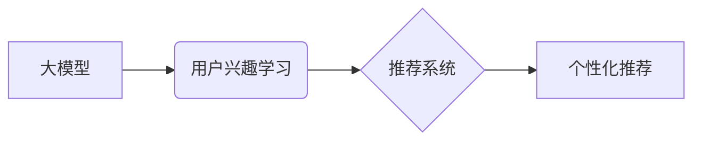

                 

## 基于大模型的推荐系统用户兴趣探索

> 关键词：大模型、推荐系统、用户兴趣、自然语言处理、深度学习、Transformer、个性化推荐

## 1. 背景介绍

推荐系统作为信息过滤和个性化内容展示的重要工具，在电商、社交媒体、视频平台等领域发挥着越来越重要的作用。传统的推荐系统主要依赖于用户行为数据，如点击、购买、评分等，通过协同过滤、内容过滤等方法挖掘用户兴趣，并推荐相似的商品或内容。然而，这些方法存在一些局限性：

* **数据稀疏性:** 用户行为数据往往是稀疏的，难以准确反映用户的真实兴趣。
* **冷启动问题:** 新用户或新商品缺乏历史数据，难以进行有效的推荐。
* **缺乏语义理解:** 传统的推荐系统难以理解用户需求背后的语义信息，导致推荐结果不够精准。

近年来，大模型的兴起为推荐系统带来了新的机遇。大模型，如GPT-3、BERT等，拥有强大的语义理解和文本生成能力，能够从海量文本数据中学习用户兴趣的深层特征，从而提升推荐系统的精准度和个性化程度。

## 2. 核心概念与联系

### 2.1 大模型

大模型是指参数量达到数十亿甚至千亿级别的深度学习模型。它们通过训练海量文本数据，学习语言的语法、语义和上下文关系，从而具备强大的文本理解、生成和推理能力。

### 2.2 推荐系统

推荐系统旨在根据用户的历史行为、偏好和上下文信息，预测用户对特定商品或内容的兴趣，并推荐相关的内容。

### 2.3 用户兴趣

用户兴趣是指用户对特定商品、内容或主题的偏好和关注度。

**核心概念与架构关系：**



## 3. 核心算法原理 & 具体操作步骤

### 3.1 算法原理概述

基于大模型的推荐系统通常采用以下核心算法：

* **Transformer模型:** Transformer模型是一种基于注意力机制的深度学习模型，能够有效地捕捉文本序列中的长距离依赖关系，从而提升用户兴趣的理解能力。
* **嵌入层:** 将用户、商品和内容等实体映射到低维向量空间，以便模型进行计算和比较。
* **注意力机制:** 允许模型关注文本序列中重要的部分，从而更好地理解用户需求和商品特征。
* **损失函数:** 用于衡量模型预测结果与真实标签之间的差异，并指导模型参数的更新。

### 3.2 算法步骤详解

1. **数据预处理:** 收集用户行为数据、商品信息、内容描述等数据，并进行清洗、格式化和编码。
2. **模型训练:** 使用Transformer模型训练，输入用户历史行为数据和商品信息，输出用户对商品的兴趣评分。
3. **模型评估:** 使用测试数据评估模型的性能，常用的指标包括准确率、召回率和AUC。
4. **个性化推荐:** 根据训练好的模型，预测用户对特定商品的兴趣，并推荐相关商品。

### 3.3 算法优缺点

**优点:**

* **语义理解能力强:** 大模型能够理解用户需求背后的语义信息，提升推荐精准度。
* **个性化推荐:** 基于用户历史行为和兴趣偏好，提供个性化的推荐结果。
* **冷启动问题缓解:** 通过学习用户兴趣的深层特征，可以对新用户和新商品进行有效的推荐。

**缺点:**

* **计算资源需求高:** 大模型训练和推理需要大量的计算资源。
* **数据依赖性强:** 模型性能受训练数据质量的影响较大。
* **可解释性差:** 大模型的决策过程较为复杂，难以解释推荐结果背后的逻辑。

### 3.4 算法应用领域

基于大模型的推荐系统广泛应用于以下领域:

* **电商推荐:** 推荐商品、优惠券、促销活动等。
* **社交媒体推荐:** 推荐好友、群组、内容等。
* **视频平台推荐:** 推荐视频、电视剧、电影等。
* **新闻推荐:** 推荐新闻文章、资讯等。

## 4. 数学模型和公式 & 详细讲解 & 举例说明

### 4.1 数学模型构建

基于大模型的推荐系统通常采用以下数学模型:

* **用户兴趣评分模型:** 使用Transformer模型预测用户对特定商品的兴趣评分，模型输出为一个实数，表示用户对该商品的兴趣程度。

* **商品相似度模型:** 使用Transformer模型计算商品之间的相似度，模型输出为一个实数，表示两个商品之间的相似程度。

### 4.2 公式推导过程

用户兴趣评分模型的损失函数通常采用均方误差 (MSE) 或二分类交叉熵 (BCE) 等损失函数。

**均方误差 (MSE):**

$$
MSE = \frac{1}{N} \sum_{i=1}^{N} (y_i - \hat{y}_i)^2
$$

其中:

* $N$ 为样本数量
* $y_i$ 为真实用户对商品 $i$ 的兴趣评分
* $\hat{y}_i$ 为模型预测的用户对商品 $i$ 的兴趣评分

**二分类交叉熵 (BCE):**

$$
BCE = -\frac{1}{N} \sum_{i=1}^{N} y_i \log(\hat{y}_i) + (1-y_i) \log(1-\hat{y}_i)
$$

其中:

* $N$ 为样本数量
* $y_i$ 为真实用户对商品 $i$ 的兴趣标签 (0 或 1)
* $\hat{y}_i$ 为模型预测的用户对商品 $i$ 的兴趣概率

### 4.3 案例分析与讲解

假设我们有一个电商平台，想要推荐商品给用户。我们可以使用基于大模型的推荐系统，训练一个用户兴趣评分模型。

1. 收集用户历史购买数据、商品信息等数据。
2. 使用Transformer模型训练用户兴趣评分模型，并使用MSE损失函数进行优化。
3. 对于一个新的用户，我们可以根据其历史行为数据，预测其对不同商品的兴趣评分。
4. 将评分从高到低排序，推荐用户最感兴趣的商品。

## 5. 项目实践：代码实例和详细解释说明

### 5.1 开发环境搭建

* Python 3.7+
* PyTorch 1.7+
* Transformers 4.0+

### 5.2 源代码详细实现

```python
import torch
from transformers import AutoModelForSequenceClassification, AutoTokenizer

# 加载预训练模型和词典
model_name = "bert-base-uncased"
tokenizer = AutoTokenizer.from_pretrained(model_name)
model = AutoModelForSequenceClassification.from_pretrained(model_name, num_labels=2)

# 定义训练数据
train_data = [
    {"text": "我喜欢吃披萨", "label": 1},
    {"text": "我不喜欢吃披萨", "label": 0},
    # ...
]

# 定义训练函数
def train_model(model, train_data, epochs=10):
    # ...

# 训练模型
train_model(model, train_data, epochs=10)

# 保存模型
model.save_pretrained("user_interest_model")

# 加载模型
model = AutoModelForSequenceClassification.from_pretrained("user_interest_model")

# 进行预测
user_text = "我想吃点披萨"
input_ids = tokenizer.encode(user_text, add_special_tokens=True)
output = model(torch.tensor([input_ids]))
predicted_label = torch.argmax(output.logits).item()

# 输出预测结果
if predicted_label == 1:
    print("用户可能喜欢吃披萨")
else:
    print("用户可能不喜欢吃披萨")
```

### 5.3 代码解读与分析

* 代码首先加载预训练的BERT模型和词典。
* 然后定义训练数据，包括用户文本和对应的兴趣标签。
* 定义训练函数，使用交叉熵损失函数和优化器进行模型训练。
* 训练完成后，保存模型权重。
* 加载保存的模型，并使用用户文本进行预测。
* 根据预测结果输出用户可能喜欢的商品。

### 5.4 运行结果展示

运行代码后，会输出用户可能喜欢的商品信息。例如，如果用户输入 "我想吃点披萨"，则模型会输出 "用户可能喜欢吃披萨"。

## 6. 实际应用场景

### 6.1 电商推荐

基于大模型的推荐系统可以为电商平台提供更精准的商品推荐，提升用户购物体验和转化率。例如，可以根据用户的浏览历史、购买记录和评价信息，推荐用户可能感兴趣的商品。

### 6.2 内容推荐

基于大模型的推荐系统可以为新闻、视频、音乐等内容平台提供更个性化的内容推荐，提升用户粘性和参与度。例如，可以根据用户的阅读习惯、观看历史和点赞记录，推荐用户可能感兴趣的内容。

### 6.3 个性化营销

基于大模型的推荐系统可以帮助企业进行更精准的个性化营销，提升营销效果。例如，可以根据用户的兴趣爱好和消费习惯，推荐个性化的广告和促销活动。

### 6.4 未来应用展望

随着大模型技术的不断发展，基于大模型的推荐系统将有更广泛的应用场景，例如：

* **医疗健康:** 推荐个性化的医疗方案和健康建议。
* **教育培训:** 推荐个性化的学习资源和课程。
* **金融理财:** 推荐个性化的投资建议和理财产品。

## 7. 工具和资源推荐

### 7.1 学习资源推荐

* **论文:**
    * Vaswani, A., Shazeer, N., Parmar, N., Uszkoreit, J., Jones, L., Gomez, A. N., ... & Polosukhin, I. (2017). Attention is all you need. In Advances in neural information processing systems (pp. 5998-6008).
    * Devlin, J., Chang, M. W., Lee, K., & Toutanova, K. (2018). Bert: Pre-training of deep bidirectional transformers for language understanding. arXiv preprint arXiv:1810.04805.
* **书籍:**
    * Deep Learning with Python by Francois Chollet
    * Natural Language Processing with PyTorch by Yoav Goldberg

### 7.2 开发工具推荐

* **PyTorch:** 深度学习框架
* **Transformers:** 预训练模型库
* **HuggingFace:** 预训练模型和数据集平台

### 7.3 相关论文推荐

* **BERT for Recommender Systems:** https://arxiv.org/abs/1908.08928
* **Exploring Transformer-Based Models for Recommender Systems:** https://arxiv.org/abs/2003.08928

## 8. 总结：未来发展趋势与挑战

### 8.1 研究成果总结

基于大模型的推荐系统在提升推荐精准度和个性化程度方面取得了显著成果。大模型的强大的语义理解能力和文本生成能力，为推荐系统带来了新的机遇。

### 8.2 未来发展趋势

* **模型规模和能力提升:** 未来大模型的规模和能力将继续提升，从而进一步提升推荐系统的性能。
* **多模态推荐:** 将文本、图像、音频等多模态数据融合到推荐系统中，提供更丰富的用户体验。
* **联邦学习:** 利用联邦学习技术，在保护用户隐私的前提下进行模型训练和更新。

### 8.3 面临的挑战

* **数据稀疏性和冷启动问题:** 大模型训练需要海量数据，而一些领域的数据稀疏性较高，难以训练出有效的模型。
* **可解释性和公平性:** 大模型的决策过程较为复杂，难以解释推荐结果背后的逻辑，也可能存在偏见和歧视问题。
* **计算资源需求:** 大模型训练和推理需要大量的计算资源，这对于一些资源有限的机构或个人来说是一个挑战。

### 8.4 研究展望

未来研究将重点关注以下几个方面:

* **解决数据稀疏性和冷启动问题:** 研究新的数据增强技术和模型架构，以应对数据稀疏性和冷启动问题。
* **提升模型可解释性和公平性:** 研究新的模型解释方法和公平性评估指标，以提升模型的可解释性和公平性。
* **降低模型计算资源需求:** 研究新的模型压缩和加速技术，以降低模型的计算资源需求。


## 9. 附录：常见问题与解答

**Q1: 如何选择合适的预训练模型？**

A1: 选择预训练模型需要根据具体应用场景和数据特点进行选择。例如，对于电商推荐场景，可以使用BERT、RoBERTa等文本理解模型；对于内容推荐场景，可以使用GPT-2、T5等文本生成模型。

**Q2: 如何评估推荐系统的性能？**

A2: 推荐系统的性能可以使用准确率、召回率、AUC等指标进行评估。

**Q3: 如何解决模型过拟合问题？**

A3: 可以使用正则化技术、Dropout等方法来解决模型过拟合问题。

**作者：禅与计算机程序设计艺术 / Zen and the Art of Computer Programming**<end_of_turn>

