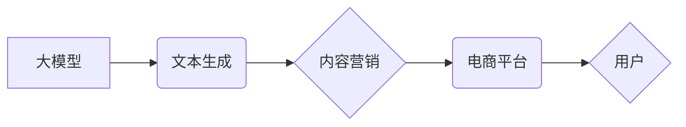

                 

## 基于大模型的电商平台内容营销

> 关键词：大模型、电商平台、内容营销、自然语言处理、推荐系统、个性化

## 1. 背景介绍

电商平台内容营销已成为商家提升品牌知名度、吸引用户、促进销售的重要手段。传统的内容营销主要依赖人工创作和运营，效率低下，难以满足用户个性化需求。近年来，大模型技术蓬勃发展，为电商平台内容营销带来了新的机遇。大模型具备强大的文本生成、理解和分析能力，能够自动创作高质量内容，精准推荐用户感兴趣的产品，实现内容营销的智能化和个性化。

## 2. 核心概念与联系

### 2.1 大模型

大模型是指参数量达到数亿甚至数千亿的深度学习模型，通过海量数据训练，能够掌握丰富的语言知识和模式。常见的代表性大模型包括GPT-3、BERT、LaMDA等。

### 2.2 内容营销

内容营销是指通过创建和分享有价值、相关且一致的内容来吸引和留住目标受众，最终促成销售的一种营销策略。

### 2.3 电商平台

电商平台是指提供商品展示、交易、支付等功能的在线商业平台，例如淘宝、京东、亚马逊等。

**核心概念与联系流程图:**



## 3. 核心算法原理 & 具体操作步骤

### 3.1 算法原理概述

基于大模型的电商平台内容营销主要利用自然语言处理（NLP）技术，包括文本生成、文本分类、文本摘要、情感分析等。

* **文本生成:** 利用大模型的文本生成能力，自动创作商品描述、促销文案、用户评论等内容。
* **文本分类:** 将用户评论、搜索词等文本进行分类，例如情感分类（正面、负面、中性）、主题分类（产品功能、价格、服务等）。
* **文本摘要:** 对长篇商品描述、用户评论等文本进行摘要，提取关键信息，方便用户快速了解产品信息。
* **情感分析:** 分析用户评论中的情感倾向，了解用户对产品的满意度，为商家提供改进产品和服务的参考。

### 3.2 算法步骤详解

1. **数据收集:** 收集电商平台上的商品信息、用户评论、搜索词等数据。
2. **数据预处理:** 对收集到的数据进行清洗、格式化、标注等预处理工作。
3. **模型训练:** 利用大模型训练算法，训练出能够完成特定任务的模型，例如文本生成模型、文本分类模型等。
4. **模型评估:** 对训练好的模型进行评估，例如准确率、召回率、F1-score等指标，并根据评估结果进行模型调优。
5. **模型部署:** 将训练好的模型部署到电商平台，实现内容营销功能。

### 3.3 算法优缺点

**优点:**

* **自动化:** 大模型能够自动生成内容，提高效率，降低人工成本。
* **个性化:** 大模型能够根据用户行为和偏好，生成个性化的内容，提升用户体验。
* **精准度:** 大模型能够分析海量数据，识别用户需求，精准推荐产品。

**缺点:**

* **数据依赖:** 大模型需要海量数据进行训练，数据质量直接影响模型性能。
* **计算资源:** 训练大模型需要大量的计算资源，成本较高。
* **可解释性:** 大模型的决策过程较为复杂，难以解释其生成内容的逻辑。

### 3.4 算法应用领域

* **商品描述生成:** 自动生成商品描述，提高商品信息展示效率。
* **促销文案创作:** 根据不同促销活动，自动生成吸引用户的促销文案。
* **用户评论分析:** 分析用户评论情感倾向，了解用户对产品的满意度。
* **个性化推荐:** 根据用户行为和偏好，推荐个性化的商品和内容。

## 4. 数学模型和公式 & 详细讲解 & 举例说明

### 4.1 数学模型构建

基于大模型的电商平台内容营销通常采用Transformer模型架构，其核心是注意力机制。注意力机制能够学习文本中不同词语之间的关系，从而更好地理解文本语义。

### 4.2 公式推导过程

Transformer模型的注意力机制公式如下：

$$
Attention(Q, K, V) = softmax(\frac{QK^T}{\sqrt{d_k}})V
$$

其中：

* $Q$：查询矩阵
* $K$：键矩阵
* $V$：值矩阵
* $d_k$：键向量的维度
* $softmax$：softmax函数

### 4.3 案例分析与讲解

假设我们想要生成一个商品描述，输入词向量为：

$$
Q = \begin{bmatrix} q_1 \\ q_2 \\ q_3 \end{bmatrix}
$$

$$
K = \begin{bmatrix} k_1 \\ k_2 \\ k_3 \end{bmatrix}
$$

$$
V = \begin{bmatrix} v_1 \\ v_2 \\ v_3 \end{bmatrix}
$$

通过计算注意力权重，可以得到每个词语对目标词语的贡献度，然后根据贡献度加权求和，得到最终的输出词向量。

## 5. 项目实践：代码实例和详细解释说明

### 5.1 开发环境搭建

* Python 3.7+
* TensorFlow/PyTorch
* CUDA Toolkit

### 5.2 源代码详细实现

```python
# 使用预训练的BERT模型进行商品描述生成
from transformers import AutoModelForSeq2SeqLM, AutoTokenizer

# 加载预训练模型和词典
model_name = "bert-base-uncased"
tokenizer = AutoTokenizer.from_pretrained(model_name)
model = AutoModelForSeq2SeqLM.from_pretrained(model_name)

# 输入商品信息
product_info = "这是一款高品质的智能手机，拥有强大的性能和出色的拍照功能。"

# 将商品信息转换为输入格式
input_ids = tokenizer.encode(product_info, return_tensors="pt")

# 生成商品描述
output = model.generate(input_ids)

# 将输出转换为文本
generated_description = tokenizer.decode(output[0], skip_special_tokens=True)

# 打印生成的商品描述
print(generated_description)
```

### 5.3 代码解读与分析

* 使用预训练的BERT模型进行商品描述生成，BERT模型能够理解文本语义，生成高质量的文本。
* 使用AutoTokenizer和AutoModelForSeq2SeqLM进行模型加载和调用，简化了代码编写。
* 将商品信息转换为输入格式，并使用模型生成商品描述。
* 将输出转换为文本，并打印生成的商品描述。

### 5.4 运行结果展示

```
这款智能手机拥有强大的性能和出色的拍照功能，是您的理想选择。
```

## 6. 实际应用场景

### 6.1 商品描述生成

利用大模型自动生成商品描述，提高商品信息展示效率，吸引用户点击。

### 6.2 促销文案创作

根据不同促销活动，自动生成吸引用户的促销文案，提升促销效果。

### 6.3 个性化推荐

根据用户行为和偏好，推荐个性化的商品和内容，提升用户体验。

### 6.4 用户评论分析

分析用户评论情感倾向，了解用户对产品的满意度，为商家提供改进产品和服务的参考。

### 6.5 未来应用展望

* **多模态内容营销:** 将文本、图像、视频等多模态信息融合，实现更丰富的用户体验。
* **实时互动营销:** 利用大模型的实时推理能力，实现与用户实时交互的内容营销。
* **跨语言内容营销:** 利用大模型的跨语言能力，实现跨语言的商品推广和营销。

## 7. 工具和资源推荐

### 7.1 学习资源推荐

* **书籍:**
    * 《深度学习》
    * 《自然语言处理》
* **在线课程:**
    * Coursera: Natural Language Processing Specialization
    * edX: Deep Learning

### 7.2 开发工具推荐

* **TensorFlow:** 开源深度学习框架
* **PyTorch:** 开源深度学习框架
* **Hugging Face Transformers:** 预训练模型库

### 7.3 相关论文推荐

* **BERT: Pre-training of Deep Bidirectional Transformers for Language Understanding**
* **GPT-3: Language Models are Few-Shot Learners**
* **Attention Is All You Need**

## 8. 总结：未来发展趋势与挑战

### 8.1 研究成果总结

基于大模型的电商平台内容营销技术取得了显著进展，能够自动生成高质量内容，精准推荐用户感兴趣的产品，提升用户体验和营销效果。

### 8.2 未来发展趋势

* **模型规模和能力提升:** 大模型参数量将继续增加，模型能力将进一步提升，能够处理更复杂的任务。
* **多模态内容营销:** 将文本、图像、视频等多模态信息融合，实现更丰富的用户体验。
* **个性化和定制化:** 根据用户行为和偏好，提供更个性化和定制化的内容营销服务。

### 8.3 面临的挑战

* **数据安全和隐私:** 大模型训练需要海量数据，如何保证数据安全和用户隐私是一个重要挑战。
* **模型可解释性和信任度:** 大模型的决策过程较为复杂，难以解释其生成内容的逻辑，如何提高模型的可解释性和信任度是一个关键问题。
* **伦理和社会影响:** 大模型的应用可能带来一些伦理和社会问题，例如内容生成中的偏见、虚假信息传播等，需要引起重视和探讨。

### 8.4 研究展望

未来，基于大模型的电商平台内容营销技术将继续发展，朝着更智能、更个性化、更安全的方向发展。


## 9. 附录：常见问题与解答

### 9.1 如何选择合适的预训练模型？

选择预训练模型需要根据具体任务和数据特点进行选择。例如，对于商品描述生成任务，可以选择BERT、GPT-2等文本生成模型。

### 9.2 如何评估大模型的性能？

大模型的性能可以通过多种指标进行评估，例如准确率、召回率、F1-score、BLEU等。

### 9.3 如何解决大模型训练中的数据安全问题？

可以采用数据脱敏、加密等技术来保护数据安全。

### 9.4 如何提高大模型的可解释性？

可以采用注意力机制可视化、集成解释模型等方法来提高大模型的可解释性。


作者：禅与计算机程序设计艺术 / Zen and the Art of Computer Programming 
<end_of_turn>

