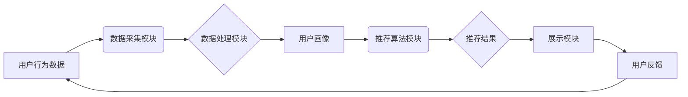

                 

## 大数据与AI 驱动的电商平台转型：搜索推荐系统是核心战略

> 关键词：电商平台、搜索推荐系统、大数据、人工智能、机器学习、深度学习、个性化推荐、转化率提升

## 1. 背景介绍

在当今数字化时代，电商平台已成为人们购物的首选方式。随着用户需求的不断变化和市场竞争的加剧，电商平台面临着前所未有的挑战。如何提升用户体验，提高转化率，增强用户粘性，成为电商平台发展的重要课题。

大数据和人工智能技术的快速发展为电商平台转型提供了新的机遇。大数据技术能够帮助电商平台收集、存储和分析海量用户数据，而人工智能技术则能够利用这些数据进行智能分析和预测，从而实现个性化推荐、精准营销等功能。

搜索推荐系统作为电商平台的核心功能之一，在提升用户体验、提高转化率方面发挥着至关重要的作用。传统的搜索推荐系统主要依赖于关键词匹配和商品属性规则，难以满足用户个性化需求。而基于大数据和人工智能的搜索推荐系统，能够通过对用户行为、偏好等数据的深度挖掘和分析，提供更精准、更个性化的商品推荐，从而提升用户购物体验和转化率。

## 2. 核心概念与联系

### 2.1  大数据

大数据是指规模庞大、结构复杂、速度快、多样化的数据。电商平台每天都会产生海量用户数据，包括用户浏览记录、购买历史、评价反馈、购物车内容等。这些数据蕴含着丰富的商业价值，但需要借助大数据技术进行处理和分析才能挖掘出来。

### 2.2  人工智能

人工智能是指模拟人类智能行为的计算机系统。在电商平台应用中，人工智能主要包括机器学习和深度学习等技术。机器学习算法能够从数据中学习模式和规律，并根据这些模式进行预测和决策。深度学习算法则是一种更高级的机器学习算法，能够处理更复杂的数据结构，并实现更精准的预测。

### 2.3  搜索推荐系统

搜索推荐系统是帮助用户发现感兴趣商品的系统。它通常由以下几个模块组成：

* **数据采集模块:** 收集用户行为数据、商品信息等数据。
* **数据处理模块:** 对收集到的数据进行清洗、转换、存储等处理。
* **推荐算法模块:** 利用机器学习和深度学习算法，对用户进行画像分析，并根据用户的兴趣和偏好推荐商品。
* **展示模块:** 将推荐结果以用户友好的方式展示给用户。

**核心概念与架构流程图**



## 3. 核心算法原理 & 具体操作步骤

### 3.1  算法原理概述

基于大数据和人工智能的搜索推荐系统通常采用以下几种核心算法：

* **协同过滤:** 这种算法基于用户的历史行为数据，推荐与用户兴趣相似的其他用户的商品。
* **内容过滤:** 这种算法基于商品的属性信息，推荐与用户过去浏览或购买的商品相似的商品。
* **混合推荐:** 这种算法结合协同过滤和内容过滤两种算法，以提高推荐的准确性和个性化程度。
* **深度学习推荐:** 这种算法利用深度神经网络，从用户行为数据中学习更复杂的特征，实现更精准的推荐。

### 3.2  算法步骤详解

以协同过滤算法为例，其具体操作步骤如下：

1. **数据收集:** 收集用户历史行为数据，例如用户对商品的评分、购买记录、浏览记录等。
2. **用户相似度计算:** 计算用户之间的相似度，可以使用余弦相似度、皮尔逊相关系数等方法。
3. **推荐商品:** 对于给定的用户，找到与该用户相似度最高的N个用户，并推荐这些用户购买过的商品。

### 3.3  算法优缺点

**协同过滤算法:**

* **优点:** 可以推荐用户可能感兴趣但从未接触过的商品，能够发现用户隐性需求。
* **缺点:** 数据稀疏性问题，当用户行为数据不足时，算法难以准确推荐商品。冷启动问题，对于新用户和新商品，算法难以进行推荐。

### 3.4  算法应用领域

协同过滤算法广泛应用于电商平台、音乐平台、电影平台等领域，用于推荐商品、音乐、电影等。

## 4. 数学模型和公式 & 详细讲解 & 举例说明

### 4.1  数学模型构建

协同过滤算法的核心是计算用户之间的相似度。常用的相似度度量方法之一是余弦相似度。

**余弦相似度公式:**

$$
\text{相似度} = \frac{\mathbf{u} \cdot \mathbf{v}}{\|\mathbf{u}\| \|\mathbf{v}\|}
$$

其中：

* $\mathbf{u}$ 和 $\mathbf{v}$ 是两个用户的向量表示，向量元素代表用户对商品的评分或偏好。
* $\mathbf{u} \cdot \mathbf{v}$ 是两个向量的点积。
* $\|\mathbf{u}\|$ 和 $\|\mathbf{v}\|$ 是两个向量的模长。

### 4.2  公式推导过程

余弦相似度的计算过程如下：

1. 将用户对商品的评分或偏好转换为向量表示。
2. 计算两个向量的点积。
3. 计算两个向量的模长。
4. 将点积除以两个向量的模长乘积，得到余弦相似度。

### 4.3  案例分析与讲解

假设有两个用户A和B，他们的评分向量分别为：

* $\mathbf{u}_A = [1, 2, 3, 4]$
* $\mathbf{u}_B = [2, 3, 4, 1]$

则它们的余弦相似度为：

$$
\text{相似度} = \frac{\mathbf{u}_A \cdot \mathbf{u}_B}{\|\mathbf{u}_A\| \|\mathbf{u}_B\|} = \frac{1\cdot2 + 2\cdot3 + 3\cdot4 + 4\cdot1}{\sqrt{1^2 + 2^2 + 3^2 + 4^2} \sqrt{2^2 + 3^2 + 4^2 + 1^2}} = \frac{26}{\sqrt{30} \sqrt{30}} = \frac{26}{30} = 0.87
$$

该结果表明用户A和B的兴趣相似度较高。

## 5. 项目实践：代码实例和详细解释说明

### 5.1  开发环境搭建

* **操作系统:** Linux/macOS/Windows
* **编程语言:** Python
* **库依赖:** pandas, numpy, scikit-learn

### 5.2  源代码详细实现

```python
import pandas as pd
from sklearn.metrics.pairwise import cosine_similarity

# 加载用户评分数据
ratings_data = pd.read_csv('ratings.csv')

# 计算用户之间的余弦相似度
user_similarity = cosine_similarity(ratings_data)

# 获取用户A和用户B之间的相似度
user_A_id = 1
user_B_id = 2
similarity_score = user_similarity[user_A_id, user_B_id]

# 打印相似度
print(f'用户{user_A_id}和用户{user_B_id}的相似度为: {similarity_score}')
```

### 5.3  代码解读与分析

* **数据加载:** 使用pandas库读取用户评分数据，并将数据存储在ratings_data数据框中。
* **相似度计算:** 使用scikit-learn库中的cosine_similarity函数计算用户之间的余弦相似度，并将结果存储在user_similarity矩阵中。
* **相似度获取:** 根据用户ID获取用户之间的相似度。
* **输出结果:** 打印用户A和用户B之间的相似度。

### 5.4  运行结果展示

运行上述代码后，将输出用户A和用户B之间的余弦相似度。

## 6. 实际应用场景

基于大数据和人工智能的搜索推荐系统已广泛应用于电商平台、社交媒体平台、音乐平台、电影平台等领域。

### 6.1  电商平台

* **商品推荐:** 根据用户的浏览历史、购买记录、购物车内容等数据，推荐用户可能感兴趣的商品。
* **个性化营销:** 根据用户的兴趣爱好、消费习惯等数据，进行个性化营销推广。
* **新品推荐:** 推出新商品，并根据用户的兴趣爱好进行推荐。

### 6.2  社交媒体平台

* **内容推荐:** 根据用户的浏览历史、点赞记录、评论内容等数据，推荐用户可能感兴趣的内容。
* **好友推荐:** 根据用户的兴趣爱好、社交关系等数据，推荐用户可能认识的朋友。

### 6.3  音乐平台

* **音乐推荐:** 根据用户的播放历史、收藏记录、评论内容等数据，推荐用户可能喜欢的音乐。
* **歌单推荐:** 根据用户的音乐偏好，推荐用户可能喜欢的歌单。

### 6.4  未来应用展望

随着大数据和人工智能技术的不断发展，搜索推荐系统将更加智能化、个性化。未来，搜索推荐系统将能够：

* 更精准地预测用户的需求。
* 提供更个性化的推荐结果。
* 与其他系统进行更紧密的集成，例如支付系统、物流系统等。

## 7. 工具和资源推荐

### 7.1  学习资源推荐

* **书籍:**
    * 《推荐系统实践》
    * 《机器学习》
    * 《深度学习》
* **在线课程:**
    * Coursera: 机器学习
    * edX: 深度学习
    * Udacity: 数据科学

### 7.2  开发工具推荐

* **Python:** 
    * pandas
    * numpy
    * scikit-learn
    * TensorFlow
    * PyTorch
* **数据库:**
    * MySQL
    * PostgreSQL
    * MongoDB

### 7.3  相关论文推荐

* **协同过滤算法:**
    * "Collaborative Filtering for Implicit Feedback Datasets"
    * "Matrix Factorization Techniques for Recommender Systems"
* **深度学习推荐:**
    * "Deep Learning Recommendations for Personalization and Search"
    * "Neural Collaborative Filtering"

## 8. 总结：未来发展趋势与挑战

### 8.1  研究成果总结

大数据和人工智能技术的应用，为电商平台的搜索推荐系统带来了革命性的变化。基于大数据和人工智能的搜索推荐系统能够提供更精准、更个性化的商品推荐，从而提升用户体验和转化率。

### 8.2  未来发展趋势

未来，搜索推荐系统将朝着以下几个方向发展：

* **更精准的推荐:** 利用更先进的机器学习和深度学习算法，实现更精准的推荐。
* **更个性化的推荐:** 更加深入地挖掘用户的兴趣爱好和需求，提供更个性化的推荐。
* **更智能的交互:** 与用户进行更智能的交互，例如语音交互、图像交互等。
* **跨平台推荐:** 将推荐结果扩展到多个平台，例如手机、电脑、智能电视等。

### 8.3  面临的挑战

尽管搜索推荐系统取得了显著的进展，但仍然面临着一些挑战：

* **数据质量问题:** 数据的准确性、完整性和及时性直接影响推荐系统的效果。
* **数据隐私问题:** 如何保护用户的隐私数据，是搜索推荐系统面临的重要挑战。
* **算法解释性问题:** 深度学习算法的“黑盒”特性，使得算法的决策难以解释，这可能会影响用户的信任度。

### 8.4  研究展望

未来，研究人员将继续致力于解决这些挑战，并探索新的搜索推荐系统技术，以更好地满足用户的需求。


## 9. 附录：常见问题与解答

### 9.1  问题1: 如何解决数据稀疏性问题？

**解答:** 数据稀疏性问题是协同过滤算法面临的常见挑战。一些常用的解决方案包括：

* **使用矩阵分解技术:** 将用户评分矩阵分解成两个低维矩阵，从而降低数据稀疏性。
* **使用混合推荐算法:** 将协同过滤算法与内容过滤算法相结合，利用商品属性信息进行推荐。
* **使用基于知识图谱的推荐算法:** 利用知识图谱中的语义关系，进行推荐。

### 9.2  问题2: 如何保护用户的隐私数据？

**解答:** 为了保护用户的隐私数据，搜索推荐系统可以采用以下措施：

* **数据匿名化:** 将用户的个人信息进行匿名化处理，例如使用用户ID代替真实姓名。
* **差分隐私:** 使用差分隐私技术，对用户数据进行加扰，保证数据的隐私性。
* **联邦学习:** 将模型训练分散到不同的设备上，避免将用户数据集中存储。


作者：禅与计算机程序设计艺术 / Zen and the Art of Computer Programming 
<end_of_turn>

