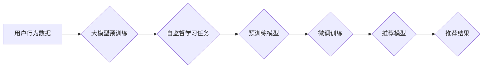

                 

## 大模型在推荐系统中的自监督学习应用

> 关键词：大模型、自监督学习、推荐系统、深度学习、用户行为预测、冷启动问题

## 1. 背景介绍

推荐系统作为互联网时代的重要组成部分，旨在根据用户的历史行为、偏好和上下文信息，预测用户可能感兴趣的内容，并将其推荐给用户。传统的推荐系统主要依赖于显性反馈（如用户评分、点赞）和隐性反馈（如用户点击、浏览记录），但这些数据往往存在稀疏性、冷启动问题等挑战。

近年来，深度学习技术的发展为推荐系统带来了新的机遇。大模型，尤其是基于Transformer架构的大模型，凭借其强大的语义理解能力和泛化能力，在推荐系统领域展现出巨大的潜力。自监督学习作为一种无需人工标注数据就能训练模型的学习方式，为大模型的训练提供了新的思路。

## 2. 核心概念与联系

### 2.1  推荐系统

推荐系统旨在根据用户的历史行为、偏好和上下文信息，预测用户可能感兴趣的内容，并将其推荐给用户。推荐系统可以分为基于内容的推荐、基于协同过滤的推荐和基于深度学习的推荐三大类。

* **基于内容的推荐:** 根据用户历史行为和物品特征进行相似性匹配，推荐与用户兴趣相符的物品。
* **基于协同过滤的推荐:** 根据用户之间的相似性或物品之间的相似性进行推荐。
* **基于深度学习的推荐:** 利用深度神经网络学习用户和物品的潜在特征，进行推荐。

### 2.2  大模型

大模型是指参数量巨大、训练数据量庞大的深度学习模型。大模型通常具有强大的泛化能力和语义理解能力，能够处理复杂的任务，例如自然语言处理、计算机视觉等。

### 2.3  自监督学习

自监督学习是一种无需人工标注数据就能训练模型的学习方式。它通过设计特殊的预训练任务，利用数据的内在结构进行学习，从而获得对数据的理解和表示。

### 2.4  核心概念联系

大模型在推荐系统中的自监督学习应用，是指利用大模型的强大能力和自监督学习的训练方式，构建能够有效预测用户行为的推荐模型。

**Mermaid 流程图**



## 3. 核心算法原理 & 具体操作步骤

### 3.1  算法原理概述

大模型在推荐系统中的自监督学习应用，通常采用以下步骤：

1. **大模型预训练:** 利用海量文本数据或多模态数据对大模型进行预训练，使其学习到丰富的语义表示和知识。
2. **自监督学习任务设计:** 设计与推荐任务相关的自监督学习任务，例如：
    * **下一跳预测:** 预测用户下一个点击的物品。
    * **物品关联预测:** 预测两个物品之间的相关性。
    * **用户兴趣聚类:** 将用户根据兴趣进行聚类。
3. **模型微调:** 将预训练好的大模型用于推荐任务的微调训练，优化模型参数，使其能够更好地预测用户行为。

### 3.2  算法步骤详解

1. **数据预处理:** 收集用户行为数据，例如点击记录、浏览记录、评分等，并进行清洗、格式化和特征提取。
2. **大模型预训练:** 选择合适的预训练模型，例如BERT、GPT、DALL-E等，并利用海量文本数据或多模态数据进行预训练。
3. **自监督学习任务设计:** 根据推荐任务的特点，设计相应的自监督学习任务，并构建相应的训练数据。
4. **模型微调:** 将预训练好的大模型作为基础模型，利用自监督学习任务的训练数据进行微调训练，优化模型参数。
5. **模型评估:** 利用测试数据评估模型的性能，例如准确率、召回率、NDCG等指标。

### 3.3  算法优缺点

**优点:**

* **无需人工标注数据:** 自监督学习可以利用数据的内在结构进行学习，无需人工标注数据，降低了数据标注成本。
* **强大的泛化能力:** 大模型具有强大的泛化能力，能够处理复杂的任务，并适用于不同的推荐场景。
* **提升推荐效果:** 自监督学习可以帮助模型学习到更丰富的用户和物品特征，从而提升推荐效果。

**缺点:**

* **任务设计难度:** 设计有效的自监督学习任务需要一定的专业知识和经验。
* **训练成本:** 大模型的训练成本较高，需要大量的计算资源和时间。
* **模型解释性:** 大模型的内部机制较为复杂，难以解释模型的决策过程。

### 3.4  算法应用领域

大模型在推荐系统中的自监督学习应用，可以应用于以下领域:

* **电商推荐:** 推荐商品、优惠券、促销活动等。
* **内容推荐:** 推荐新闻、视频、音乐、书籍等。
* **社交推荐:** 推荐好友、群组、话题等。
* **个性化教育:** 推荐学习资源、课程、辅导等。

## 4. 数学模型和公式 & 详细讲解 & 举例说明

### 4.1  数学模型构建

大模型在推荐系统中的自监督学习应用，通常采用以下数学模型:

* **Transformer网络:** Transformer网络是一种基于注意力机制的深度神经网络，能够有效学习用户和物品之间的关系。

* **自注意力机制:** 自注意力机制能够学习用户和物品之间的上下文信息，并赋予不同的词语不同的权重。

* **多头注意力机制:** 多头注意力机制能够学习多个不同的语义表示，从而提升模型的表达能力。

### 4.2  公式推导过程

Transformer网络的注意力机制的计算公式如下:

$$
Attention(Q, K, V) = softmax(\frac{QK^T}{\sqrt{d_k}})V
$$

其中:

* $Q$ 是查询矩阵
* $K$ 是键矩阵
* $V$ 是值矩阵
* $d_k$ 是键向量的维度
* $softmax$ 是softmax函数

### 4.3  案例分析与讲解

假设我们有一个推荐系统，需要推荐用户可能感兴趣的电影。我们可以利用大模型和自监督学习任务，例如下一跳预测，来构建推荐模型。

* **数据:** 收集用户观看电影的历史记录，例如用户观看过的电影、评分等。
* **模型:** 选择预训练好的Transformer网络作为基础模型，并进行微调训练。
* **任务:** 设计下一跳预测任务，预测用户下一个观看的电影。
* **训练:** 利用用户观看电影的历史记录进行训练，训练模型能够预测用户下一个观看的电影。
* **推荐:** 当用户观看了一部电影后，模型可以根据用户的观看历史和电影特征，预测用户可能感兴趣的下一部电影，并将其推荐给用户。

## 5. 项目实践：代码实例和详细解释说明

### 5.1  开发环境搭建

* **操作系统:** Linux
* **编程语言:** Python
* **深度学习框架:** TensorFlow 或 PyTorch
* **其他工具:** Git、Jupyter Notebook

### 5.2  源代码详细实现

```python
# 导入必要的库
import tensorflow as tf

# 定义Transformer网络模型
class Transformer(tf.keras.Model):
    def __init__(self, vocab_size, embedding_dim, num_heads, num_layers):
        super(Transformer, self).__init__()
        self.embedding = tf.keras.layers.Embedding(vocab_size, embedding_dim)
        self.transformer_layers = tf.keras.layers.StackedRNNCells([
            tf.keras.layers.MultiHeadAttention(num_heads=num_heads, key_dim=embedding_dim)
            for _ in range(num_layers)
        ])

    def call(self, inputs):
        # 将输入转换为嵌入向量
        embedded_inputs = self.embedding(inputs)
        # 通过Transformer层进行编码
        encoded_outputs = self.transformer_layers(embedded_inputs)
        return encoded_outputs

# 实例化Transformer模型
model = Transformer(vocab_size=10000, embedding_dim=128, num_heads=8, num_layers=6)

# 定义损失函数和优化器
loss_fn = tf.keras.losses.SparseCategoricalCrossentropy()
optimizer = tf.keras.optimizers.Adam(learning_rate=1e-3)

# 训练模型
# ...

# 评估模型
# ...
```

### 5.3  代码解读与分析

* **模型定义:** 代码定义了一个Transformer网络模型，包含嵌入层、多头注意力层和堆叠的RNN层。
* **数据处理:** 代码需要将用户行为数据转换为模型可以理解的格式，例如将电影标题转换为数字索引。
* **训练过程:** 代码需要使用训练数据训练模型，并使用损失函数和优化器进行模型更新。
* **评估过程:** 代码需要使用测试数据评估模型的性能，例如计算准确率、召回率等指标。

### 5.4  运行结果展示

训练完成后，可以将模型应用于实际场景，例如推荐电影给用户。

## 6. 实际应用场景

### 6.1  电商推荐

大模型在自监督学习的应用可以帮助电商平台推荐更精准的商品，提升用户购物体验。例如，可以利用用户浏览历史、购买记录、购物车内容等数据，预测用户可能感兴趣的商品，并将其推荐给用户。

### 6.2  内容推荐

大模型可以帮助内容平台推荐更相关的新闻、视频、音乐、书籍等内容，提升用户粘性和参与度。例如，可以利用用户阅读历史、点赞记录、评论内容等数据，预测用户可能感兴趣的内容，并将其推荐给用户。

### 6.3  个性化教育

大模型可以帮助教育平台推荐个性化的学习资源、课程、辅导等，提升用户学习效率和兴趣。例如，可以利用用户的学习记录、考试成绩、兴趣爱好等数据，预测用户可能需要的学习资源，并将其推荐给用户。

### 6.4  未来应用展望

随着大模型技术的发展，其在推荐系统中的应用将更加广泛和深入。例如，可以利用多模态数据，例如文本、图像、音频等，构建更全面的用户画像，并进行更精准的推荐。

## 7. 工具和资源推荐

### 7.1  学习资源推荐

* **书籍:**
    * 《深度学习》
    * 《自然语言处理》
    * 《推荐系统》
* **在线课程:**
    * Coursera
    * edX
    * Udacity

### 7.2  开发工具推荐

* **深度学习框架:** TensorFlow, PyTorch
* **数据处理工具:** Pandas, NumPy
* **云计算平台:** AWS, Azure, GCP

### 7.3  相关论文推荐

* **BERT:** Devlin et al. (2018)
* **GPT:** Radford et al. (2019)
* **DALL-E:** Rombach et al. (2021)

## 8. 总结：未来发展趋势与挑战

### 8.1  研究成果总结

大模型在推荐系统中的自监督学习应用取得了显著的成果，能够有效提升推荐效果，并解决传统推荐系统面临的挑战。

### 8.2  未来发展趋势

* **模型规模和能力提升:** 大模型的规模和能力将继续提升，能够学习到更丰富的知识和表示。
* **多模态学习:** 大模型将更加注重多模态数据的融合，例如文本、图像、音频等，构建更全面的用户画像。
* **个性化推荐:** 大模型将更加注重个性化推荐，根据用户的不同需求和偏好，提供更精准的推荐。

### 8.3  面临的挑战

* **数据隐私和安全:** 大模型的训练需要大量用户数据，如何保护用户隐私和数据安全是一个重要的挑战。
* **模型解释性和可控性:** 大模型的内部机制较为复杂，难以解释模型的决策过程，如何提升模型的解释性和可控性是一个重要的研究方向。
* **计算资源和成本:** 大模型的训练成本较高，需要大量的计算资源和时间，如何降低训练成本是一个重要的挑战。

### 8.4  研究展望

未来，大模型在推荐系统中的自监督学习应用将继续深入发展，为用户提供更精准、更个性化的推荐体验。


## 9. 附录：常见问题与解答

**Q1: 自监督学习和监督学习有什么区别？**

**A1:** 自监督学习和监督学习都是机器学习的范式，但它们的区别在于数据标注方式。监督学习需要人工标注数据，而自监督学习则不需要人工标注数据，而是通过设计特殊的预训练任务，利用数据的内在结构进行学习。

**Q2: 大模型的训练成本很高，如何降低训练成本？**

**A2:** 降低大模型的训练成本可以通过以下方式实现:

* **模型压缩:** 使用模型剪枝、量化等技术，减少模型参数量，从而降低训练成本。
* **分布式训练:** 将模型训练任务分发到多个机器上进行并行训练，从而缩短训练时间。
* **预训练模型迁移学习:** 利用预训练好的大模型，进行微调训练，从而降低训练成本。

**Q3: 大模型的解释性和可控性如何提升？**

**A3:** 提升大模型的解释性和可控性可以通过以下方式实现:

* **可解释性模型:** 研究和开发更可解释的模型，例如线性模型、决策树等。
* **注意力机制可视化:** 利用注意力机制的可视化技术，展示模型对输入数据的关注点，从而帮助理解模型的决策过程。
* **对抗训练:** 通过对抗训练，增强模型的鲁棒性，使其对输入数据的扰动更加鲁棒。


作者：禅与计算机程序设计艺术 / Zen and the Art of Computer Programming 
<end_of_turn>

