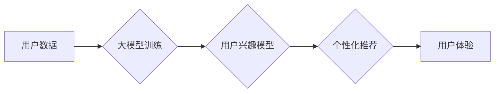

                 

## 大模型在用户兴趣探索中的应用

> 关键词：大模型、用户兴趣探索、推荐系统、自然语言处理、深度学习、Transformer、个性化体验

## 1. 背景介绍

在信息爆炸的时代，用户每天面临着海量的资讯和内容选择。如何帮助用户高效地发现并探索符合其兴趣的内容，是当前互联网行业面临的重要挑战。传统推荐系统主要依赖于用户历史行为和显性反馈，但这些方法往往难以捕捉用户潜在的兴趣和需求。近年来，大模型的兴起为用户兴趣探索带来了新的机遇。

大模型，指的是参数规模庞大、训练数据海量的人工智能模型。它们拥有强大的语义理解和文本生成能力，能够从海量文本数据中学习用户兴趣的隐含特征，并提供更精准、个性化的推荐。

## 2. 核心概念与联系

### 2.1 用户兴趣探索

用户兴趣探索是指帮助用户发现、理解和探索其潜在或未被识别的兴趣点，并提供个性化的内容推荐和体验。

### 2.2 大模型

大模型是指参数规模庞大、训练数据海量的人工智能模型。它们通常基于深度学习架构，例如 Transformer，能够学习复杂的语义关系和模式。

### 2.3 核心概念联系

大模型能够通过学习用户历史行为、阅读偏好、社交互动等数据，构建用户兴趣的语义表示。然后，结合大模型强大的文本生成能力，为用户提供个性化的内容推荐和探索路径。

**Mermaid 流程图**



## 3. 核心算法原理 & 具体操作步骤

### 3.1 算法原理概述

大模型在用户兴趣探索中的应用主要基于以下核心算法：

* **嵌入式表示学习:** 将用户和内容映射到低维向量空间，捕捉其潜在的语义关系。
* **自编码器:** 学习用户兴趣的隐含特征，并生成个性化的推荐内容。
* **生成对抗网络 (GAN):** 生成与用户兴趣相符的虚假内容，丰富推荐结果。

### 3.2 算法步骤详解

1. **数据收集和预处理:** 收集用户行为数据、内容信息等，并进行清洗、格式化等预处理。
2. **特征提取:** 从用户数据和内容数据中提取特征，例如用户年龄、性别、兴趣标签、内容标题、关键词等。
3. **嵌入式表示学习:** 使用 Word2Vec、GloVe 等模型，将用户和内容映射到低维向量空间。
4. **模型训练:** 使用自编码器、GAN 等模型，训练用户兴趣模型。
5. **个性化推荐:** 根据用户兴趣模型，为用户生成个性化的推荐内容。
6. **结果评估:** 使用准确率、召回率等指标，评估推荐系统的性能。

### 3.3 算法优缺点

**优点:**

* 能够捕捉用户潜在的兴趣和需求。
* 提供更精准、个性化的推荐。
* 能够生成新的内容，丰富推荐结果。

**缺点:**

* 需要海量数据进行训练。
* 模型训练复杂度高，计算资源消耗大。
* 存在数据偏差和公平性问题。

### 3.4 算法应用领域

* **电商推荐:** 为用户推荐个性化的商品。
* **内容推荐:** 为用户推荐个性化的文章、视频、音乐等内容。
* **社交推荐:** 为用户推荐新的朋友和兴趣小组。
* **教育推荐:** 为学生推荐个性化的学习资源。

## 4. 数学模型和公式 & 详细讲解 & 举例说明

### 4.1 数学模型构建

大模型在用户兴趣探索中的应用通常基于以下数学模型：

* **用户兴趣模型:** 使用神经网络模型，例如 Transformer，学习用户兴趣的隐含特征。

* **内容表示模型:** 使用 Word2Vec、GloVe 等模型，将内容映射到低维向量空间。

* **推荐模型:** 使用协同过滤、矩阵分解等模型，预测用户对内容的评分或点击概率。

### 4.2 公式推导过程

**用户兴趣模型:**

假设用户 $u$ 的兴趣向量为 $u_i$, 内容 $i$ 的表示向量为 $v_i$, 则用户对内容 $i$ 的兴趣评分可以表示为:

$$
score(u, i) = u_i \cdot v_i
$$

其中，$\cdot$ 表示点积运算。

**内容表示模型:**

Word2Vec 模型使用负采样方法训练词嵌入向量。目标函数为:

$$
L = -\sum_{i=1}^{N} \log P(w_i | context(w_i))
$$

其中，$N$ 为训练样本数量，$w_i$ 为目标词，$context(w_i)$ 为目标词的上下文词。

### 4.3 案例分析与讲解

假设我们有一个电商平台，需要为用户推荐商品。我们可以使用大模型构建用户兴趣模型和商品表示模型。

* **用户兴趣模型:** 使用 Transformer 模型，学习用户的历史购买记录、浏览记录、评价记录等数据，构建用户的兴趣向量。
* **商品表示模型:** 使用 Word2Vec 模型，将商品标题、描述、类别等信息映射到低维向量空间。

然后，我们可以使用协同过滤模型，根据用户的兴趣向量和商品表示向量，预测用户对商品的评分或点击概率，并为用户推荐个性化的商品。

## 5. 项目实践：代码实例和详细解释说明

### 5.1 开发环境搭建

* Python 3.7+
* TensorFlow 2.0+
* PyTorch 1.0+
* CUDA 10.0+ (可选)

### 5.2 源代码详细实现

```python
# 用户兴趣模型
class UserInterestModel(tf.keras.Model):
    def __init__(self, embedding_dim, num_heads):
        super(UserInterestModel, self).__init__()
        self.embedding = tf.keras.layers.Embedding(input_dim=vocab_size, output_dim=embedding_dim)
        self.transformer = tf.keras.layers.Transformer(num_heads=num_heads, d_model=embedding_dim)

    def call(self, inputs):
        embedded_inputs = self.embedding(inputs)
        output = self.transformer(embedded_inputs)
        return output

# 商品表示模型
class ItemRepresentationModel(tf.keras.layers.Layer):
    def __init__(self, embedding_dim):
        super(ItemRepresentationModel, self).__init__()
        self.embedding = tf.keras.layers.Embedding(input_dim=vocab_size, output_dim=embedding_dim)

    def call(self, inputs):
        return self.embedding(inputs)

# 推荐模型
class RecommendationModel(tf.keras.Model):
    def __init__(self, embedding_dim):
        super(RecommendationModel, self).__init__()
        self.user_model = UserInterestModel(embedding_dim, num_heads=8)
        self.item_model = ItemRepresentationModel(embedding_dim)
        self.dense = tf.keras.layers.Dense(1, activation='sigmoid')

    def call(self, user_inputs, item_inputs):
        user_embedding = self.user_model(user_inputs)
        item_embedding = self.item_model(item_inputs)
        combined_embedding = tf.keras.layers.Concatenate()([user_embedding, item_embedding])
        output = self.dense(combined_embedding)
        return output
```

### 5.3 代码解读与分析

* **用户兴趣模型:** 使用 Transformer 模型学习用户的兴趣特征。
* **商品表示模型:** 使用 Embedding 模型将商品信息映射到低维向量空间。
* **推荐模型:** 使用用户兴趣模型和商品表示模型的输出，预测用户对商品的评分或点击概率。

### 5.4 运行结果展示

通过训练模型并测试其性能，我们可以评估推荐系统的效果。

## 6. 实际应用场景

### 6.1 电商推荐

大模型可以帮助电商平台为用户推荐个性化的商品，提高转化率。例如，亚马逊、淘宝等电商平台都使用大模型进行商品推荐。

### 6.2 内容推荐

大模型可以帮助内容平台为用户推荐个性化的文章、视频、音乐等内容，提高用户粘性和参与度。例如，YouTube、Netflix、Spotify 等平台都使用大模型进行内容推荐。

### 6.3 社交推荐

大模型可以帮助社交平台为用户推荐新的朋友和兴趣小组，扩展用户社交圈。例如，Facebook、Twitter 等平台都使用大模型进行社交推荐。

### 6.4 未来应用展望

大模型在用户兴趣探索领域的应用前景广阔，未来可能应用于以下场景：

* **个性化教育:** 为学生推荐个性化的学习资源和学习路径。
* **医疗保健:** 为患者推荐个性化的医疗方案和健康建议。
* **金融服务:** 为用户推荐个性化的理财产品和投资建议。

## 7. 工具和资源推荐

### 7.1 学习资源推荐

* **书籍:**
    * 《深度学习》
    * 《自然语言处理》
    * 《大模型》

* **在线课程:**
    * Coursera: 深度学习
    * edX: 自然语言处理
    * fast.ai: 深度学习

### 7.2 开发工具推荐

* **TensorFlow:** 开源深度学习框架
* **PyTorch:** 开源深度学习框架
* **Hugging Face Transformers:** 大模型库

### 7.3 相关论文推荐

* **BERT: Pre-training of Deep Bidirectional Transformers for Language Understanding**
* **GPT-3: Language Models are Few-Shot Learners**
* **T5: Text-to-Text Transfer Transformer**

## 8. 总结：未来发展趋势与挑战

### 8.1 研究成果总结

大模型在用户兴趣探索领域取得了显著的成果，能够提供更精准、个性化的推荐，提升用户体验。

### 8.2 未来发展趋势

* **模型规模和能力提升:** 大模型的规模和能力将继续提升，能够学习更复杂的语义关系和模式。
* **多模态融合:** 大模型将融合文本、图像、音频等多模态数据，提供更丰富的用户体验。
* **可解释性增强:** 研究者将致力于提高大模型的可解释性，帮助用户理解推荐结果背后的逻辑。

### 8.3 面临的挑战

* **数据隐私和安全:** 大模型训练需要海量数据，如何保护用户隐私和数据安全是一个重要挑战。
* **公平性和偏见:** 大模型可能存在数据偏差和公平性问题，需要进行针对性的研究和改进。
* **计算资源消耗:** 大模型训练和部署需要大量的计算资源，如何降低计算成本是一个关键问题。

### 8.4 研究展望

未来，大模型在用户兴趣探索领域将继续发挥重要作用，为用户提供更个性化、更智能化的体验。研究者将继续探索大模型的潜力，解决其面临的挑战，推动该领域的发展。

## 9. 附录：常见问题与解答

* **Q1: 大模型的训练需要多少数据？**

A1: 大模型的训练需要海量数据，通常需要数十亿甚至数千亿个数据点。

* **Q2: 大模型的训练成本很高吗？**

A2: 是的，大模型的训练成本很高，需要大量的计算资源和时间。

* **Q3: 大模型的推荐结果是否准确？**

A3: 大模型的推荐结果通常比传统推荐系统更准确，但仍然存在一定的误差。

* **Q4: 如何评估大模型的性能？**

A4: 大模型的性能可以使用准确率、召回率、NDCG 等指标进行评估。


作者：禅与计算机程序设计艺术 / Zen and the Art of Computer Programming 
<end_of_turn>

