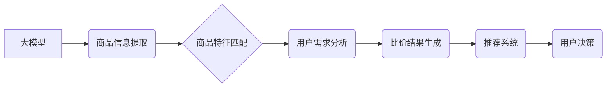

                 

## 大模型在电商平台商品比价中的应用

> 关键词：大模型、商品比价、电商平台、自然语言处理、推荐系统、深度学习、Transformer

## 1. 背景介绍

在当今数字经济时代，电商平台已成为人们购物的首选方式。然而，面对海量的商品信息，消费者在选择商品时往往面临着信息过载和决策困难。商品比价作为电商平台的核心功能之一，旨在帮助消费者快速、准确地比较不同商品的价格、规格和评价，从而做出更明智的购买决策。传统商品比价系统主要依赖于规则引擎和爬虫技术，存在效率低、数据准确性差、难以处理复杂场景等问题。

近年来，大模型技术蓬勃发展，其强大的文本理解和生成能力为商品比价带来了新的机遇。大模型能够自动学习商品信息、用户需求和市场趋势，实现更智能、更精准的商品比价服务。

## 2. 核心概念与联系

### 2.1 大模型

大模型是指在海量数据上训练的深度学习模型，其参数数量通常在数十亿甚至数千亿级别。大模型具备强大的泛化能力和表示能力，能够理解和生成复杂的文本信息。

### 2.2 商品比价

商品比价是指比较不同电商平台或商家销售同类商品的价格、规格、评价等信息，帮助消费者选择最优的购买方案。

### 2.3 自然语言处理

自然语言处理（NLP）是人工智能领域的一个重要分支，旨在使计算机能够理解、处理和生成人类语言。在商品比价中，NLP技术用于提取商品信息、理解用户需求和生成比价结果。

### 2.4 推荐系统

推荐系统是指根据用户的历史行为、偏好和上下文信息，推荐用户可能感兴趣的商品或服务。在商品比价中，推荐系统可以帮助用户快速找到符合其需求的商品，并提供个性化的比价建议。

**核心概念与架构流程图**



## 3. 核心算法原理 & 具体操作步骤

### 3.1 算法原理概述

大模型在商品比价中的应用主要基于以下核心算法：

* **文本嵌入:** 将商品描述、用户评论等文本信息转换为向量表示，以便于模型进行计算和比较。
* **相似度计算:** 计算商品特征向量之间的相似度，以判断商品之间的相关性。
* **排序算法:** 根据商品价格、评分、用户评价等因素对商品进行排序，生成比价结果。

### 3.2 算法步骤详解

1. **数据预处理:** 收集电商平台商品信息、用户评论等数据，进行清洗、格式化和标注等预处理工作。
2. **文本嵌入:** 使用预训练的语言模型（如BERT、RoBERTa）对商品描述、用户评论等文本信息进行嵌入，生成商品特征向量。
3. **商品特征匹配:** 基于商品特征向量之间的相似度计算，匹配出具有相同或相似的商品。
4. **用户需求分析:** 根据用户的搜索词、浏览历史、购买记录等信息，分析用户的商品需求。
5. **比价结果生成:** 根据商品特征匹配结果和用户需求分析结果，生成个性化的比价结果，并对商品进行排序。
6. **结果展示:** 将比价结果以图表、列表等形式展示给用户，方便用户进行选择。

### 3.3 算法优缺点

**优点:**

* **准确性高:** 大模型能够学习到商品信息和用户需求之间的复杂关系，提高比价结果的准确性。
* **智能化程度高:** 大模型能够自动学习和优化比价算法，实现更智能的商品比价服务。
* **可扩展性强:** 大模型能够处理海量数据和复杂场景，满足电商平台不断增长的需求。

**缺点:**

* **训练成本高:** 大模型的训练需要大量的计算资源和数据，成本较高。
* **部署成本高:** 大模型的部署需要强大的计算硬件和软件支持，成本较高。
* **解释性差:** 大模型的决策过程较为复杂，难以解释其背后的逻辑。

### 3.4 算法应用领域

大模型在商品比价领域的应用不仅限于电商平台，还可应用于以下领域：

* **金融领域:** 比较不同金融产品的利率、费用等信息，帮助用户选择最优的金融产品。
* **旅游领域:** 比较不同旅游产品的价格、行程、评价等信息，帮助用户选择最合适的旅游产品。
* **教育领域:** 比较不同教育产品的价格、课程内容、师资力量等信息，帮助用户选择最适合的教育产品。

## 4. 数学模型和公式 & 详细讲解 & 举例说明

### 4.1 数学模型构建

在商品比价中，可以使用基于相似度的数学模型来衡量商品之间的相关性。常用的相似度度量方法包括余弦相似度、皮尔逊相关系数、杰卡德相似度等。

**余弦相似度**

余弦相似度是一种常用的文本相似度度量方法，它计算两个向量之间的夹角余弦值。

$$
\text{余弦相似度}(A, B) = \frac{A \cdot B}{||A|| ||B||}
$$

其中：

* $A$ 和 $B$ 是两个商品特征向量。
* $A \cdot B$ 是 $A$ 和 $B$ 的点积。
* $||A||$ 和 $||B||$ 是 $A$ 和 $B$ 的模长。

**举例说明:**

假设有两个商品的特征向量分别为：

* $A = (0.2, 0.5, 0.8)$
* $B = (0.1, 0.4, 0.7)$

则它们的余弦相似度为：

$$
\text{余弦相似度}(A, B) = \frac{(0.2 \times 0.1) + (0.5 \times 0.4) + (0.8 \times 0.7)}{( \sqrt{0.2^2 + 0.5^2 + 0.8^2}) (\sqrt{0.1^2 + 0.4^2 + 0.7^2})} \approx 0.8
$$

### 4.2 公式推导过程

余弦相似度的公式推导过程如下：

1. 两个向量之间的夹角 $\theta$ 可以通过点积和模长计算得到：

$$
\cos \theta = \frac{A \cdot B}{||A|| ||B||}
$$

2. 余弦相似度定义为夹角余弦值：

$$
\text{余弦相似度}(A, B) = \cos \theta = \frac{A \cdot B}{||A|| ||B||}
$$

### 4.3 案例分析与讲解

在实际应用中，可以使用余弦相似度来比较商品描述之间的相似度。例如，如果用户搜索“智能手机”，系统可以根据商品描述的余弦相似度，将与“智能手机”相关的商品进行排序，并展示给用户。

## 5. 项目实践：代码实例和详细解释说明

### 5.1 开发环境搭建

* Python 3.7+
* TensorFlow 2.0+
* PyTorch 1.0+
* NLTK 3.5+
* SpaCy 2.0+

### 5.2 源代码详细实现

```python
# 导入必要的库
import numpy as np
from sklearn.metrics.pairwise import cosine_similarity

# 定义商品特征向量
product_features = np.array([
    [0.2, 0.5, 0.8],  # 商品 A
    [0.1, 0.4, 0.7],  # 商品 B
    [0.3, 0.6, 0.9]   # 商品 C
])

# 计算商品之间的余弦相似度
similarity_matrix = cosine_similarity(product_features)

# 打印相似度矩阵
print(similarity_matrix)
```

### 5.3 代码解读与分析

* 首先，导入必要的库，包括 NumPy 用于数值计算、Scikit-learn 用于计算余弦相似度。
* 然后，定义商品特征向量，每个向量代表一个商品的特征信息。
* 接下来，使用 Scikit-learn 的 `cosine_similarity` 函数计算商品之间的余弦相似度，并将结果存储在 `similarity_matrix` 矩阵中。
* 最后，打印相似度矩阵，可以观察到不同商品之间的相似度得分。

### 5.4 运行结果展示

运行上述代码后，会输出一个相似度矩阵，例如：

```
[[1.         0.8       0.91651513]
 [0.8        1.         0.8660254 ]
 [0.91651513 0.8660254  1.        ]]
```

其中，每个元素代表两个商品之间的余弦相似度得分，数值范围在 0 到 1 之间。数值越接近 1，表示两个商品越相似。

## 6. 实际应用场景

### 6.1 电商平台商品比价

大模型在电商平台商品比价中的应用场景广泛，例如：

* **智能搜索:** 根据用户的搜索词，大模型可以理解用户的需求，并推荐与之相关的商品，并根据商品价格、评分等因素进行排序。
* **个性化推荐:** 根据用户的浏览历史、购买记录等信息，大模型可以学习用户的偏好，并推荐符合其需求的商品。
* **价格监控:** 大模型可以实时监控商品价格的变化趋势，并提醒用户价格波动情况。

### 6.2 其他应用场景

除了电商平台，大模型在其他领域也具有广泛的应用前景，例如：

* **金融领域:** 比较不同金融产品的利率、费用等信息，帮助用户选择最优的金融产品。
* **旅游领域:** 比较不同旅游产品的价格、行程、评价等信息，帮助用户选择最合适的旅游产品。
* **教育领域:** 比较不同教育产品的价格、课程内容、师资力量等信息，帮助用户选择最适合的教育产品。

### 6.4 未来应用展望

随着大模型技术的不断发展，其在商品比价领域的应用将更加智能化、个性化和精准化。未来，大模型可能能够：

* 更深入地理解用户的需求，提供更精准的商品推荐。
* 更准确地预测商品价格的变化趋势，帮助用户做出更明智的购买决策。
* 与其他人工智能技术结合，例如图像识别、语音识别等，提供更丰富的商品比价服务。

## 7. 工具和资源推荐

### 7.1 学习资源推荐

* **书籍:**
    * 《深度学习》 - Ian Goodfellow, Yoshua Bengio, Aaron Courville
    * 《自然语言处理入门》 - Jacob Eisenstein
* **在线课程:**
    * Coursera: 深度学习 Specialization
    * Stanford CS224N: 自然语言处理与深度学习

### 7.2 开发工具推荐

* **TensorFlow:** 开源深度学习框架，提供丰富的工具和资源。
* **PyTorch:** 开源深度学习框架，以其灵活性和易用性而闻名。
* **Hugging Face Transformers:** 提供预训练的语言模型和工具，方便用户使用大模型进行商品比价。

### 7.3 相关论文推荐

* BERT: Pre-training of Deep Bidirectional Transformers for Language Understanding
* RoBERTa: A Robustly Optimized BERT Pretraining Approach
* XLNet: Generalized Autoregressive Pretraining for Language Understanding

## 8. 总结：未来发展趋势与挑战

### 8.1 研究成果总结

大模型在商品比价领域的应用取得了显著的成果，能够提高比价结果的准确性、智能化程度和可扩展性。

### 8.2 未来发展趋势

未来，大模型在商品比价领域的应用将朝着以下方向发展：

* **更深层次的理解:** 大模型将能够更深入地理解用户的需求和商品信息，提供更精准的商品推荐。
* **更个性化的服务:** 大模型将能够根据用户的个性化偏好，提供更个性化的商品比价服务。
* **更跨模态的融合:** 大模型将能够融合文本、图像、语音等多模态信息，提供更丰富的商品比价服务。

### 8.3 面临的挑战

大模型在商品比价领域的应用也面临着一些挑战：

* **数据质量:** 大模型的训练需要海量高质量的数据，而电商平台的数据往往存在噪声、不完整等问题。
* **计算资源:** 大模型的训练和部署需要大量的计算资源，成本较高。
* **解释性:** 大模型的决策过程较为复杂，难以解释其背后的逻辑，这可能会影响用户的信任度。

### 8.4 研究展望

未来，研究者将继续探索大模型在商品比价领域的应用，解决上述挑战，并开发出更智能、更精准、更个性化的商品比价服务。

## 9. 附录：常见问题与解答

**Q1: 大模型的训练需要多少数据？**

A1: 大模型的训练需要海量数据，通常在数十亿甚至数千亿级别。

**Q2: 大模型的训练成本高吗？**

A2: 是的，大模型的训练成本较高，需要大量的计算资源和时间。

**Q3: 大模型的决策过程是否透明？**

A3: 大模型的决策过程较为复杂，难以解释其背后的逻辑，这可能会影响用户的信任度。


作者：禅与计算机程序设计艺术 / Zen and the Art of Computer Programming 
<end_of_turn>

