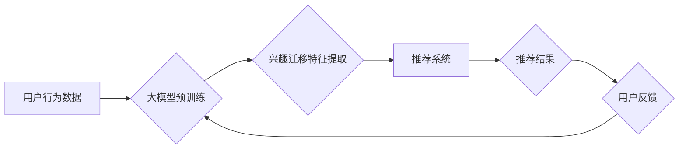

                 

## 大模型在电商平台用户兴趣迁移捕捉中的应用

> 关键词：大模型、用户兴趣迁移、电商平台、推荐系统、自然语言处理、深度学习、Transformer

## 1. 背景介绍

随着电商平台的蓬勃发展，用户兴趣的迁移和演变成为平台运营和商业发展的关键挑战。传统基于协同过滤和内容过滤的推荐系统难以有效捕捉用户兴趣的动态变化，导致推荐结果的精准度下降，用户体验受损。近年来，大模型技术在自然语言处理、计算机视觉等领域取得了突破性进展，为捕捉用户兴趣迁移提供了新的思路和方法。

大模型，是指参数规模庞大、训练数据海量的人工智能模型。其强大的学习能力和泛化能力使其能够从海量数据中学习到复杂的模式和关系，从而更精准地理解用户兴趣。在电商平台场景下，大模型可以用于捕捉用户行为、文本、画像等多模态数据中的兴趣迁移信号，并将其转化为可行动的推荐策略。

## 2. 核心概念与联系

### 2.1 用户兴趣迁移

用户兴趣迁移是指用户兴趣随着时间推移而发生变化的现象。这种变化可以是渐进的，也可以是突变的，受多种因素影响，例如用户年龄、生活阶段、社会环境、流行趋势等。

### 2.2 大模型在电商平台中的应用

大模型在电商平台中的应用场景广泛，包括：

* **商品推荐:** 基于用户历史行为、浏览记录、购买偏好等数据，推荐个性化商品。
* **搜索结果优化:** 理解用户搜索意图，提供更精准的搜索结果。
* **内容生成:** 生成商品描述、促销文案、用户评论等内容。
* **客服机器人:** 回答用户常见问题，提供智能客服服务。

### 2.3 核心架构

大模型在电商平台用户兴趣迁移捕捉中的应用，通常采用以下核心架构：



**流程说明:**

1. 收集用户行为数据，包括浏览记录、购买记录、评价信息等。
2. 将用户行为数据用于预训练大模型，使其具备对用户兴趣的理解能力。
3. 利用预训练好的大模型，提取用户兴趣迁移特征，例如用户偏好变化趋势、兴趣领域扩展等。
4. 将提取到的兴趣迁移特征输入推荐系统，优化推荐策略。
5. 根据用户对推荐结果的反馈，不断调整大模型和推荐系统，提升推荐精准度。

## 3. 核心算法原理 & 具体操作步骤

### 3.1 算法原理概述

大模型在用户兴趣迁移捕捉中的应用，主要依赖于以下核心算法：

* **Transformer模型:** Transformer模型是一种基于注意力机制的深度学习模型，能够有效捕捉文本序列中的长距离依赖关系，适用于理解用户行为背后的语义信息。
* **迁移学习:** 迁移学习是指利用预训练模型在特定任务上的学习能力，通过微调参数实现快速适应新任务。在电商平台场景下，可以利用预训练好的语言模型，将其微调到用户兴趣迁移捕捉任务上。
* **强化学习:** 强化学习是一种机器学习方法，通过奖励机制引导模型学习最优策略。可以将用户反馈作为奖励信号，训练强化学习模型，优化推荐策略。

### 3.2 算法步骤详解

1. **数据预处理:** 收集用户行为数据，进行清洗、格式化、编码等预处理操作。
2. **模型预训练:** 利用大规模文本数据预训练Transformer模型，使其具备对语言的理解能力。
3. **特征提取:** 将用户行为数据输入预训练好的Transformer模型，提取用户兴趣迁移特征，例如用户偏好变化趋势、兴趣领域扩展等。
4. **模型微调:** 利用提取到的特征，对预训练模型进行微调，使其能够更精准地捕捉用户兴趣迁移信号。
5. **推荐策略优化:** 将微调后的模型与推荐系统结合，优化推荐策略，提高推荐精准度。
6. **模型评估:** 利用用户反馈数据评估模型性能，并不断迭代优化模型参数和推荐策略。

### 3.3 算法优缺点

**优点:**

* **精准度提升:** 大模型能够捕捉用户兴趣的复杂变化，提升推荐精准度。
* **泛化能力强:** 预训练模型具备强大的泛化能力，能够适应不同类型的用户和商品。
* **个性化推荐:** 大模型可以根据用户的个性化需求，提供更精准的推荐结果。

**缺点:**

* **计算资源消耗大:** 大模型训练和部署需要大量的计算资源。
* **数据依赖性强:** 大模型的性能依赖于训练数据的质量和数量。
* **解释性差:** 大模型的决策过程较为复杂，难以解释其推荐结果背后的逻辑。

### 3.4 算法应用领域

大模型在用户兴趣迁移捕捉中的应用，不仅限于电商平台，还可应用于以下领域:

* **社交媒体:** 捕捉用户兴趣变化，推荐个性化内容和好友。
* **新闻推荐:** 理解用户新闻偏好，推荐相关新闻资讯。
* **教育平台:** 捕捉用户学习兴趣，推荐个性化学习资源。

## 4. 数学模型和公式 & 详细讲解 & 举例说明

### 4.1 数学模型构建

用户兴趣迁移捕捉模型可以构建为一个多层神经网络，其中每一层都负责提取不同层次的用户兴趣特征。

* **输入层:** 用户行为数据，例如浏览记录、购买记录、评价信息等。
* **隐藏层:** 利用Transformer模型提取用户兴趣特征，例如用户偏好变化趋势、兴趣领域扩展等。
* **输出层:** 输出用户兴趣迁移预测结果，例如用户未来可能感兴趣的商品类别、品牌等。

### 4.2 公式推导过程

Transformer模型的核心是注意力机制，其计算公式如下:

$$
Attention(Q, K, V) = \frac{exp(Q \cdot K^T / \sqrt{d_k})}{exp(Q \cdot K^T / \sqrt{d_k})} \cdot V
$$

其中:

* $Q$: 查询矩阵
* $K$: 键矩阵
* $V$: 值矩阵
* $d_k$: 键向量的维度

注意力机制能够捕捉文本序列中的长距离依赖关系，从而更精准地理解用户兴趣迁移信号。

### 4.3 案例分析与讲解

假设用户A在过去一个月内购买了以下商品:

* 手机
* 耳机
* 书籍

根据用户的购买记录，我们可以推测用户A可能对科技产品和文化娱乐感兴趣。

利用大模型，我们可以进一步分析用户的浏览记录、评价信息等数据，提取更细粒度的兴趣特征，例如用户可能对智能手机、蓝牙耳机、特定类型的书籍感兴趣。

## 5. 项目实践：代码实例和详细解释说明

### 5.1 开发环境搭建

* Python 3.7+
* PyTorch 1.7+
* Transformers 4.0+
* CUDA 11.0+

### 5.2 源代码详细实现

```python
import torch
from transformers import AutoModelForSequenceClassification, AutoTokenizer

# 加载预训练模型和词典
model_name = "bert-base-uncased"
tokenizer = AutoTokenizer.from_pretrained(model_name)
model = AutoModelForSequenceClassification.from_pretrained(model_name)

# 用户行为数据预处理
user_behavior_data = [
    "购买了手机",
    "浏览了耳机",
    "评价了书籍",
]

# 将用户行为数据转换为模型输入格式
inputs = tokenizer(user_behavior_data, return_tensors="pt")

# 利用预训练模型提取用户兴趣特征
outputs = model(**inputs)

# 获取用户兴趣迁移预测结果
predictions = outputs.logits.argmax(dim=1)

# 打印预测结果
print(predictions)
```

### 5.3 代码解读与分析

* 代码首先加载预训练的BERT模型和词典。
* 然后将用户行为数据转换为模型输入格式。
* 利用预训练模型提取用户兴趣特征。
* 最后获取用户兴趣迁移预测结果，并打印输出。

### 5.4 运行结果展示

运行结果将显示用户兴趣迁移预测结果，例如用户可能对科技产品和文化娱乐感兴趣。

## 6. 实际应用场景

### 6.1 个性化商品推荐

大模型可以根据用户的兴趣迁移趋势，推荐更符合用户当前需求的商品。例如，如果用户最近对智能家居产品感兴趣，大模型可以推荐相关的智能灯泡、智能音箱等商品。

### 6.2 动态广告投放

大模型可以根据用户的兴趣迁移变化，动态调整广告投放策略，提高广告精准度和转化率。例如，如果用户对某个品牌的服装产品表现出兴趣，大模型可以将该品牌的广告精准投放给用户。

### 6.3 内容推荐与个性化服务

大模型可以根据用户的兴趣迁移趋势，推荐个性化的内容和服务。例如，如果用户对旅游感兴趣，大模型可以推荐相关的旅游攻略、酒店预订、机票预订等服务。

### 6.4 未来应用展望

随着大模型技术的不断发展，其在电商平台用户兴趣迁移捕捉中的应用场景将更加广泛。例如:

* **多模态兴趣迁移捕捉:** 将文本、图像、视频等多模态数据融合，更精准地捕捉用户兴趣迁移信号。
* **实时兴趣迁移预测:** 利用实时数据流，实时预测用户兴趣迁移趋势，实现更动态的推荐策略。
* **用户兴趣迁移可视化:** 将用户兴趣迁移数据可视化，帮助用户更好地了解自己的兴趣变化趋势。

## 7. 工具和资源推荐

### 7.1 学习资源推荐

* **论文:**
    * Vaswani, A., Shazeer, N., Parmar, N., Uszkoreit, J., Jones, L., Gomez, A. N., ... & Polosukhin, I. (2017). Attention is all you need. In Advances in neural information processing systems (pp. 5998-6008).
    * Devlin, J., Chang, M. W., Lee, K., & Toutanova, K. (2018). Bert: Pre-training of deep bidirectional transformers for language understanding. arXiv preprint arXiv:1810.04805.
* **博客:**
    * https://huggingface.co/blog/transformers-tutorial
    * https://pytorch.org/tutorials/beginner/nlp/transformer_tutorial.html

### 7.2 开发工具推荐

* **PyTorch:** https://pytorch.org/
* **Transformers:** https://huggingface.co/transformers/

### 7.3 相关论文推荐

* **BERT for Recommendation:** https://arxiv.org/abs/1909.06045
* **Graph Neural Networks for Recommender Systems:** https://arxiv.org/abs/1906.00028

## 8. 总结：未来发展趋势与挑战

### 8.1 研究成果总结

大模型在电商平台用户兴趣迁移捕捉中的应用取得了显著成果，能够提升推荐精准度、个性化程度，并为用户提供更优质的购物体验。

### 8.2 未来发展趋势

* **模型规模和能力提升:** 随着计算资源的不断发展，大模型的规模和能力将进一步提升，能够捕捉更复杂的用户兴趣迁移信号。
* **多模态数据融合:** 将文本、图像、视频等多模态数据融合，构建更全面的用户兴趣模型。
* **实时兴趣迁移预测:** 利用实时数据流，实现更动态的兴趣迁移预测和推荐策略。

### 8.3 面临的挑战

* **数据隐私保护:** 大模型训练和应用需要大量用户数据，如何保护用户隐私是一个重要的挑战。
* **模型解释性:** 大模型的决策过程较为复杂，难以解释其推荐结果背后的逻辑，这可能会导致用户信任度下降。
* **计算资源消耗:** 大模型训练和部署需要大量的计算资源，这可能会导致成本较高。

### 8.4 研究展望

未来，大模型在电商平台用户兴趣迁移捕捉中的应用将更加深入和广泛，为用户提供更个性化、更智能的购物体验。


## 9. 附录：常见问题与解答

**Q1: 大模型训练需要多少数据？**

A1: 大模型训练需要海量数据，通常需要数十亿甚至上百亿条数据。

**Q2: 如何评估大模型的性能？**

A2: 大模型的性能可以评估指标，例如准确率、召回率、F1-score等。

**Q3: 如何解决大模型的解释性问题？**

A3: 可以利用可解释机器学习方法，例如LIME、SHAP等，解释大模型的决策过程。

**作者：禅与计算机程序设计艺术 / Zen and the Art of Computer Programming**<end_of_turn>

