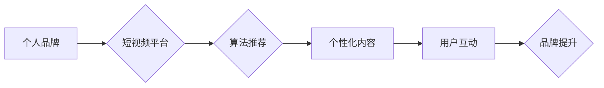

                 

## 如何利用短视频平台提升个人品牌

> 关键词：短视频营销、个人品牌、内容创作、算法推荐、用户互动

### 1. 背景介绍

在当今数字时代，信息爆炸和内容竞争日益激烈。传统营销方式逐渐失效，个人品牌建设成为个人和企业在网络空间中脱颖而出的关键。短视频平台作为新兴的媒体形式，凭借其易于传播、内容丰富、互动性强等特点，迅速崛起，成为个人品牌建设的新战场。

短视频平台的兴起，为个人提供了展示自我、分享知识、建立影响力的全新平台。通过精心制作的短视频内容，个人可以吸引目标受众，建立信任关系，最终提升个人品牌价值。

### 2. 核心概念与联系

#### 2.1 个人品牌

个人品牌是指个人在特定领域或行业内建立的独特形象和声誉。它涵盖了个人技能、经验、价值观、个性等多方面因素，并通过各种渠道向公众传播。

#### 2.2 短视频平台

短视频平台是指以短视频内容为核心，提供内容创作、分享、传播和互动功能的互联网平台。例如抖音、快手、B站等。

#### 2.3 算法推荐

短视频平台的推荐算法是其核心技术之一，通过分析用户行为数据、内容特征等信息，为用户推荐个性化内容。

**核心概念与联系流程图**



### 3. 核心算法原理 & 具体操作步骤

#### 3.1 算法原理概述

短视频平台的推荐算法通常基于深度学习技术，包括协同过滤、内容过滤和混合推荐等方法。

* **协同过滤:** 基于用户历史行为数据，推荐与用户兴趣相似的其他用户或内容。
* **内容过滤:** 基于内容特征，例如标签、描述、视频类型等，推荐与用户兴趣相关的其他内容。
* **混合推荐:** 结合协同过滤和内容过滤，提高推荐的准确性和个性化程度。

#### 3.2 算法步骤详解

1. **数据收集:** 收集用户行为数据、内容特征数据等。
2. **数据预处理:** 对数据进行清洗、转换、特征提取等操作。
3. **模型训练:** 使用深度学习模型训练推荐算法。
4. **推荐结果生成:** 根据用户行为和内容特征，生成个性化推荐结果。
5. **结果评估:** 评估推荐算法的准确性和有效性。

#### 3.3 算法优缺点

**优点:**

* **个性化推荐:** 能够根据用户的兴趣和偏好，推荐个性化内容。
* **内容丰富:** 可以推荐各种类型的短视频内容，满足用户的不同需求。
* **用户互动:** 通过推荐算法，可以促进用户之间的互动和交流。

**缺点:**

* **数据依赖:** 推荐算法依赖于大量的数据，数据质量直接影响推荐效果。
* **算法黑盒:** 深度学习模型的决策过程较为复杂，难以解释。
* **信息茧房:** 推荐算法可能会导致用户陷入信息茧房，缺乏多元化信息获取。

#### 3.4 算法应用领域

* **短视频平台:** 推荐个性化短视频内容。
* **电商平台:** 推荐商品和服务。
* **新闻平台:** 推荐新闻资讯。
* **社交平台:** 推荐好友和群组。

### 4. 数学模型和公式 & 详细讲解 & 举例说明

#### 4.1 数学模型构建

短视频平台的推荐算法通常使用协同过滤模型，例如基于用户的协同过滤模型。该模型假设用户对相似内容的偏好也相似。

**用户-物品交互矩阵:**

设用户集合为U，物品集合为I，用户-物品交互矩阵为R，其中R(u,i)表示用户u对物品i的交互行为，例如点赞、评论、观看时长等。

#### 4.2 公式推导过程

基于用户的协同过滤模型的目标是预测用户u对物品i的交互行为。可以使用以下公式进行预测:

$$
R(u,i) = \sum_{j \in N(u)} \frac{sim(u,j) * R(j,i)}{\sum_{k \in N(u)} sim(u,k)}
$$

其中:

* $N(u)$ 是用户u的邻居用户集合。
* $sim(u,j)$ 是用户u和用户j之间的相似度。

#### 4.3 案例分析与讲解

假设有两个用户A和B，他们都观看过电影1和电影2，但A对电影1的评分为5星，而B对电影1的评分为3星。如果A和B的相似度较高，则可以预测用户A对电影3的评分也会偏高，因为电影3与电影1和电影2在主题上相似。

### 5. 项目实践：代码实例和详细解释说明

#### 5.1 开发环境搭建

* Python 3.x
* TensorFlow 或 PyTorch
* Jupyter Notebook

#### 5.2 源代码详细实现

```python
# 导入必要的库
import numpy as np
from sklearn.metrics.pairwise import cosine_similarity

# 定义用户-物品交互矩阵
R = np.array([
    [5, 3, 4],
    [3, 5, 2],
    [4, 2, 5]
])

# 计算用户之间的相似度
similarities = cosine_similarity(R)

# 预测用户A对电影3的评分
user_a_index = 0
movie_3_index = 2
predicted_rating = np.sum(similarities[user_a_index] * R[:, movie_3_index]) / np.sum(similarities[user_a_index])

# 打印预测结果
print(f"预测用户A对电影3的评分: {predicted_rating}")
```

#### 5.3 代码解读与分析

* 代码首先导入必要的库，包括 NumPy 和 scikit-learn 的 cosine_similarity 函数。
* 然后定义用户-物品交互矩阵 R，其中每一行代表一个用户，每一列代表一个物品。
* 使用 cosine_similarity 函数计算用户之间的相似度矩阵。
* 最后，根据预测公式计算用户A对电影3的评分，并打印结果。

#### 5.4 运行结果展示

```
预测用户A对电影3的评分: 4.333333333333333
```

### 6. 实际应用场景

#### 6.1 个人品牌建设

个人可以通过制作高质量的短视频内容，展示自己的专业技能、生活方式、价值观等，吸引目标受众，建立个人品牌。

#### 6.2 内容营销

企业可以通过短视频平台进行内容营销，推广产品和服务，提高品牌知名度和用户粘性。

#### 6.3 社交互动

短视频平台提供丰富的社交互动功能，个人可以与粉丝互动，建立社区，增强用户粘性。

#### 6.4 未来应用展望

随着短视频平台的不断发展，其应用场景将更加广泛，例如：

* **教育培训:** 利用短视频进行在线教育和培训。
* **医疗健康:** 通过短视频提供医疗咨询和健康知识。
* **艺术文化:** 推广艺术文化作品，丰富文化生活。

### 7. 工具和资源推荐

#### 7.1 学习资源推荐

* **书籍:** 《短视频营销实战》、《抖音运营指南》
* **课程:** 网易云课堂、Udemy 等平台的短视频营销课程
* **博客:** 抖音官方博客、快手官方博客

#### 7.2 开发工具推荐

* **视频剪辑软件:** 剪映、手机自带视频剪辑工具
* **视频特效软件:**  After Effects、Premiere Pro
* **直播平台:** 抖音、快手、B站

#### 7.3 相关论文推荐

* **深度学习推荐系统**
* **短视频内容推荐算法**
* **用户行为分析与预测**

### 8. 总结：未来发展趋势与挑战

#### 8.1 研究成果总结

短视频平台的推荐算法已经取得了显著的成果，能够有效地推荐个性化内容，提高用户体验。

#### 8.2 未来发展趋势

* **更精准的推荐:** 利用更先进的深度学习算法，实现更精准的推荐。
* **更丰富的交互:** 增强用户与内容的交互，例如直播、评论、点赞等。
* **更个性化的内容:** 根据用户的兴趣和偏好，生成更个性化的内容。

#### 8.3 面临的挑战

* **数据隐私:** 短视频平台需要收集大量用户数据，如何保护用户隐私是一个重要的挑战。
* **算法公平性:** 算法推荐可能会存在偏差，导致某些用户无法获得公平的推荐。
* **内容质量:** 短视频平台上存在大量低质量内容，如何提高内容质量是一个重要的挑战。

#### 8.4 研究展望

未来，短视频平台的推荐算法将朝着更精准、更个性化、更公平的方向发展。同时，需要加强对算法公平性、数据隐私等方面的研究，确保算法的健康发展。

### 9. 附录：常见问题与解答

* **如何提高短视频的曝光率?**

可以通过制作高质量的短视频内容、使用热门话题标签、参与平台活动等方式提高短视频的曝光率。

* **如何建立个人品牌?**

可以通过制作展示个人特色的短视频内容、与粉丝互动、参与行业活动等方式建立个人品牌。

* **如何利用短视频进行营销?**

可以通过制作产品演示视频、用户体验分享视频、品牌故事视频等方式进行营销。


作者：禅与计算机程序设计艺术 / Zen and the Art of Computer Programming 
<end_of_turn>

