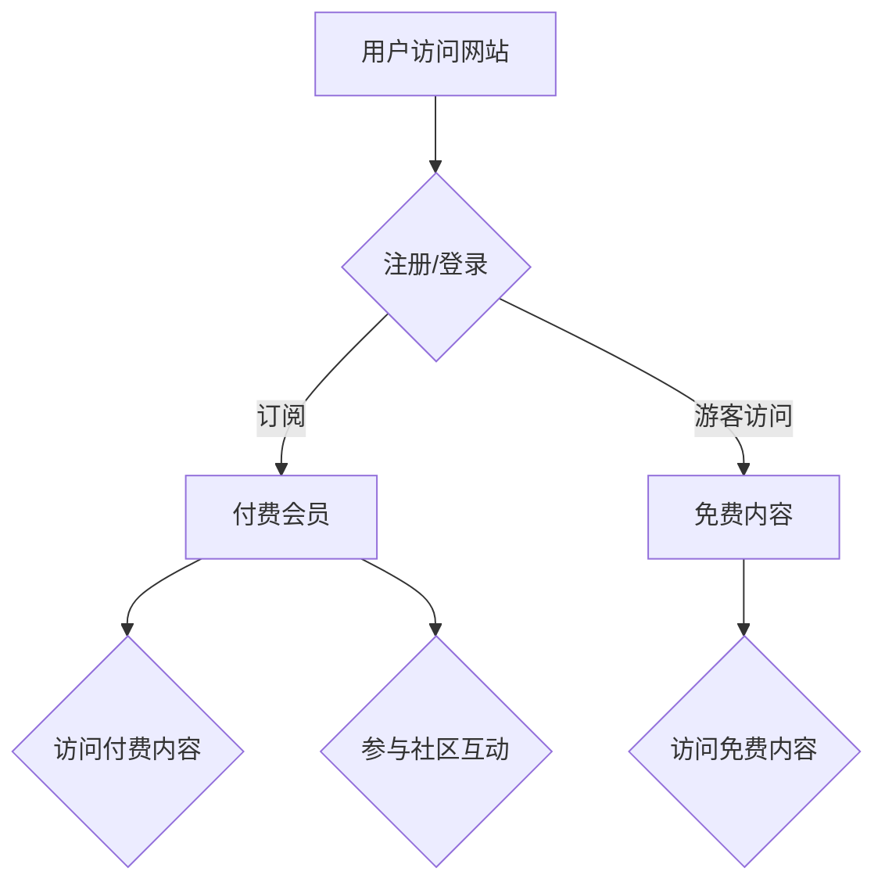

                 

## 如何将技术博客转化为付费会员制网站

> 关键词：技术博客、会员制网站、付费内容、社区建设、用户运营、订阅模型、内容策略、技术架构、支付平台

## 1. 背景介绍

在当今数字时代，技术博客已成为技术爱好者、开发者和企业家分享知识、建立个人品牌和拓展网络的重要平台。然而，单纯依靠广告收入或赞助难以实现可持续发展。越来越多的技术博客开始探索付费会员制模式，通过提供独家内容、社区互动和增值服务，为用户提供更优质的体验，并实现自身商业化。

## 2. 核心概念与联系

**2.1 会员制网站的核心概念**

会员制网站是指通过用户付费订阅获得网站内容和服务的商业模式。用户需要支付一定的费用，才能访问网站的全部内容和功能，享受会员特权。

**2.2 会员制网站与技术博客的联系**

技术博客可以通过会员制模式，将现有内容和服务升级为付费产品，吸引更多付费用户，实现可持续发展。

**2.3 会员制网站架构**

会员制网站通常包含以下核心组件：

* **内容管理系统 (CMS)**：用于创建、编辑和发布内容。
* **会员管理系统 (UMS)**：用于用户注册、登录、订阅和管理会员信息。
* **支付平台**：用于处理用户付费订阅。
* **社区平台**：用于用户互动和交流。

**Mermaid 流程图**



## 3. 核心算法原理 & 具体操作步骤

**3.1 算法原理概述**

会员制网站的核心算法原理在于用户行为分析和内容推荐。通过分析用户的阅读习惯、订阅行为和互动记录，推荐个性化内容，提高用户粘性和付费意愿。

**3.2 算法步骤详解**

1. **用户数据收集**: 收集用户访问记录、阅读偏好、订阅信息、互动行为等数据。
2. **数据分析**: 利用机器学习算法，分析用户行为数据，识别用户兴趣和需求。
3. **内容推荐**: 根据用户分析结果，推荐个性化内容，包括付费内容和免费内容。
4. **会员运营**: 通过邮件、推送等方式，与会员互动，提供专属服务和优惠活动。

**3.3 算法优缺点**

* **优点**: 提高用户粘性，提升付费转化率，实现可持续发展。
* **缺点**: 需要投入大量数据和计算资源，算法模型需要不断优化。

**3.4 算法应用领域**

* **新闻网站**: 推荐个性化新闻内容。
* **电商平台**: 推荐个性化商品和服务。
* **教育平台**: 推荐个性化学习资源。
* **技术博客**: 推荐个性化技术文章和教程。

## 4. 数学模型和公式 & 详细讲解 & 举例说明

**4.1 数学模型构建**

用户行为分析模型可以采用协同过滤算法，构建用户-物品交互矩阵，通过矩阵分解，预测用户对物品的评分或偏好。

**4.2 公式推导过程**

协同过滤算法的核心公式为：

$$
\hat{r}_{u,i} = \mathbf{p}_u^T \mathbf{q}_i
$$

其中：

* $\hat{r}_{u,i}$ 为预测用户 $u$ 对物品 $i$ 的评分。
* $\mathbf{p}_u$ 为用户 $u$ 的隐向量。
* $\mathbf{q}_i$ 为物品 $i$ 的隐向量。

**4.3 案例分析与讲解**

假设有一个技术博客，用户 $A$ 喜欢阅读 Python 编程文章，用户 $B$ 喜欢阅读机器学习文章。如果系统发现用户 $C$ 阅读了 Python 编程文章，并且用户 $C$ 和用户 $A$ 的兴趣相似度较高，那么系统可以预测用户 $C$ 也可能喜欢阅读机器学习文章，并推荐给用户 $C$。

## 5. 项目实践：代码实例和详细解释说明

**5.1 开发环境搭建**

* 操作系统：Linux/macOS/Windows
* 编程语言：Python
* 框架：Django/Flask
* 数据库：MySQL/PostgreSQL
* 支付平台：Stripe/PayPal

**5.2 源代码详细实现**

以下是一个使用 Django 框架实现会员制网站的简单代码示例：

```python
# models.py
from django.db import models

class User(models.Model):
    username = models.CharField(max_length=255)
    email = models.EmailField()
    password = models.CharField(max_length=255)
    is_member = models.BooleanField(default=False)

class Article(models.Model):
    title = models.CharField(max_length=255)
    content = models.TextField()
    is_paid = models.BooleanField(default=False)

# views.py
from django.shortcuts import render
from .models import Article

def home(request):
    articles = Article.objects.all()
    return render(request, 'home.html', {'articles': articles})

def member_area(request):
    if request.user.is_authenticated and request.user.is_member:
        articles = Article.objects.filter(is_paid=True)
        return render(request, 'member_area.html', {'articles': articles})
    else:
        return redirect('login')
```

**5.3 代码解读与分析**

* models.py 定义了用户和文章模型，其中 `is_member` 字段用于标识用户是否为付费会员，`is_paid` 字段用于标识文章是否为付费内容。
* views.py 定义了首页和会员区域视图，根据用户身份判断是否显示付费内容。

**5.4 运行结果展示**

* 非会员用户访问首页，可以查看所有免费文章。
* 会员用户访问会员区域，可以查看所有付费文章。

## 6. 实际应用场景

**6.1 技术博客会员制网站案例**

* **Hacker News**: 提供付费会员服务，获得独家内容和社区功能。
* **Stack Overflow**: 提供付费会员服务，获得高级功能和答疑服务。
* **Medium**: 提供付费会员服务，获得无广告阅读体验和作家支持。

**6.2 会员制网站的未来应用展望**

* **个性化内容推荐**: 利用人工智能技术，提供更精准的个性化内容推荐。
* **虚拟社区建设**: 建立虚拟社区，促进用户互动和交流。
* **增值服务**: 提供在线课程、咨询服务、线下活动等增值服务。

## 7. 工具和资源推荐

**7.1 学习资源推荐**

* **书籍**: 《会员制网站运营指南》、《内容营销实战》
* **网站**: 
    * **Stripe**: https://stripe.com/
    * **PayPal**: https://www.paypal.com/
    * **Django**: https://www.djangoproject.com/
    * **Flask**: https://flask.palletsprojects.com/

**7.2 开发工具推荐**

* **代码编辑器**: VS Code, Sublime Text
* **数据库管理工具**: MySQL Workbench, pgAdmin
* **版本控制系统**: Git

**7.3 相关论文推荐**

* **协同过滤算法**: "Collaborative Filtering: A User-Based Approach" by Goldberg et al. (1992)
* **内容推荐算法**: "Content-Based Recommendation Systems" by Ricci et al. (2011)

## 8. 总结：未来发展趋势与挑战

**8.1 研究成果总结**

会员制网站已成为技术博客发展的重要趋势，通过提供独家内容、社区互动和增值服务，吸引更多付费用户，实现可持续发展。

**8.2 未来发展趋势**

* **人工智能技术**: 利用人工智能技术，提供更精准的个性化内容推荐和用户运营。
* **虚拟现实技术**: 利用虚拟现实技术，构建沉浸式的虚拟社区，增强用户体验。
* **区块链技术**: 利用区块链技术，实现内容版权保护和用户数据安全。

**8.3 面临的挑战**

* **用户付费意愿**: 提高用户付费意愿，需要提供更有价值的内容和服务。
* **内容质量**: 保持高质量的内容输出，吸引和留住用户。
* **社区运营**: 建立活跃的社区，促进用户互动和交流。

**8.4 研究展望**

未来研究方向包括：

* **更精准的个性化内容推荐算法**
* **更沉浸式的虚拟社区体验**
* **更安全的区块链技术应用**

## 9. 附录：常见问题与解答

**9.1 如何设置会员价格？**

会员价格需要根据内容价值、服务水平和目标用户群体进行合理设置。

**9.2 如何推广会员服务？**

可以通过内容营销、社交媒体推广、邮件营销等方式推广会员服务。

**9.3 如何管理会员信息？**

可以使用会员管理系统 (UMS) 管理会员信息，包括注册、登录、订阅、续费等操作。


作者：禅与计算机程序设计艺术 / Zen and the Art of Computer Programming 
<end_of_turn>

