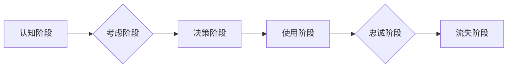

                 

## 如何进行有效的用户生命周期管理

> 关键词：用户生命周期管理，用户留存，用户增长，用户体验，数据分析，个性化推荐，营销自动化

### 1. 背景介绍

在当今数字化时代，用户生命周期管理 (Customer Lifecycle Management，CLM) 已成为企业核心竞争力的关键因素。CLM 旨在通过对用户在整个生命周期内的行为进行分析和理解，从而优化用户体验，提高用户留存率，促进用户增长，最终实现商业目标。

传统的营销模式往往侧重于用户获取，而忽略了用户在使用产品或服务后的持续运营和维护。随着互联网技术的不断发展，用户对产品和服务的期望也越来越高，企业需要更加注重用户体验，并提供个性化、定制化的服务，才能在激烈的市场竞争中脱颖而出。

### 2. 核心概念与联系

用户生命周期是指用户从首次接触企业产品或服务到最终离散的整个过程，可以分为以下几个阶段：

* **认知阶段 (Awareness):** 用户首次了解到企业或其产品/服务。
* **考虑阶段 (Consideration):** 用户开始对企业或其产品/服务进行深入了解和比较。
* **决策阶段 (Decision):** 用户最终决定购买或使用企业的产品/服务。
* **使用阶段 (Usage):** 用户开始使用企业的产品/服务。
* **忠诚阶段 (Loyalty):** 用户对企业或其产品/服务产生忠诚度，并成为长期客户。
* **流失阶段 (Churn):** 用户停止使用企业的产品/服务。

**用户生命周期管理流程图**



CLM 的核心目标是通过对每个阶段的用户行为进行分析和优化，从而提高用户留存率，促进用户增长，并最终提升企业的商业价值。

### 3. 核心算法原理 & 具体操作步骤

#### 3.1 算法原理概述

CLM 中常用的算法主要包括：

* **用户画像算法:** 通过分析用户行为数据，构建用户画像，以便更好地理解用户的需求和偏好。
* **用户留存预测算法:** 利用历史用户数据，预测用户未来是否会流失，以便及时采取措施挽留用户。
* **用户增长预测算法:** 分析用户获取渠道和行为数据，预测未来用户增长趋势，以便制定相应的营销策略。
* **个性化推荐算法:** 根据用户的兴趣和行为，推荐个性化的产品或服务，提高用户体验和转化率。

#### 3.2 算法步骤详解

以下以用户留存预测算法为例，详细说明其操作步骤：

1. **数据收集:** 收集用户行为数据，例如用户注册时间、登录时间、使用频率、购买记录等。
2. **数据预处理:** 对收集到的数据进行清洗、转换和特征工程，以便于算法训练。
3. **模型选择:** 选择合适的留存预测模型，例如 Logistic Regression、Survival Analysis 等。
4. **模型训练:** 使用预处理后的数据训练模型，并评估模型性能。
5. **模型部署:** 将训练好的模型部署到线上环境，实时预测用户留存概率。
6. **结果分析:** 分析预测结果，并根据预测结果采取相应的措施，例如发送提醒邮件、提供优惠活动等，以挽留潜在流失用户。

#### 3.3 算法优缺点

**优点:**

* 可以准确预测用户流失风险，帮助企业及时采取措施挽留用户。
* 可以根据用户留存情况，制定个性化的营销策略，提高营销效率。

**缺点:**

* 需要大量的用户行为数据进行训练，否则模型精度会降低。
* 模型预测结果存在一定的误差，需要结合其他因素进行判断。

#### 3.4 算法应用领域

用户留存预测算法广泛应用于以下领域：

* **电商平台:** 预测用户购买频率和忠诚度，制定个性化促销策略。
* **社交媒体:** 预测用户活跃度和流失率，优化用户体验和内容推荐。
* **游戏行业:** 预测用户游戏时长和付费意愿，提高游戏运营效率。
* **金融服务:** 预测用户流失风险，制定针对性的挽留策略。

### 4. 数学模型和公式 & 详细讲解 & 举例说明

#### 4.1 数学模型构建

用户留存率可以定义为在特定时间段内，仍然活跃的用户比例。

**留存率公式:**

$$
留存率 = \frac{活跃用户数}{总用户数}
$$

其中，活跃用户数是指在特定时间段内至少执行一次特定行为的用户数量，例如登录、购买、评论等。

#### 4.2 公式推导过程

留存率的计算过程可以分为以下几个步骤：

1. **定义时间窗口:** 确定需要计算留存率的时间窗口，例如 1 天、7 天、30 天等。
2. **统计活跃用户数:** 在指定时间窗口内，统计满足特定行为的用户数量。
3. **统计总用户数:** 统计在指定时间点的所有用户数量。
4. **计算留存率:** 将活跃用户数除以总用户数，即可得到留存率。

#### 4.3 案例分析与讲解

假设一个电商平台在 2023 年 1 月 1 日拥有 10000 个用户，在 2023 年 1 月 7 日，其中 7000 个用户至少进行了一次购买行为。那么，该平台在 2023 年 1 月 1 日到 2023 年 1 月 7 日的留存率为：

$$
留存率 = \frac{7000}{10000} = 0.7
$$

即 70% 的用户在 2023 年 1 月 7 日仍然活跃。

### 5. 项目实践：代码实例和详细解释说明

#### 5.1 开发环境搭建

* **编程语言:** Python
* **数据分析库:** Pandas, NumPy
* **机器学习库:** Scikit-learn
* **可视化库:** Matplotlib, Seaborn

#### 5.2 源代码详细实现

```python
import pandas as pd
from sklearn.model_selection import train_test_split
from sklearn.linear_model import LogisticRegression
from sklearn.metrics import accuracy_score

# 加载用户行为数据
data = pd.read_csv('user_behavior.csv')

# 提取特征和目标变量
features = ['login_frequency', 'purchase_frequency', 'average_order_value']
target = 'churn'

# 将数据划分为训练集和测试集
X_train, X_test, y_train, y_test = train_test_split(data[features], data[target], test_size=0.2)

# 训练逻辑回归模型
model = LogisticRegression()
model.fit(X_train, y_train)

# 对测试集进行预测
y_pred = model.predict(X_test)

# 计算模型准确率
accuracy = accuracy_score(y_test, y_pred)
print(f'模型准确率: {accuracy}')
```

#### 5.3 代码解读与分析

* 该代码首先加载用户行为数据，并提取特征和目标变量。
* 然后将数据划分为训练集和测试集，用于训练和评估模型。
* 接下来使用逻辑回归模型对训练集进行训练，并对测试集进行预测。
* 最后计算模型的准确率，评估模型性能。

#### 5.4 运行结果展示

运行结果会显示模型的准确率，例如：

```
模型准确率: 0.85
```

这表示模型能够准确预测用户流失风险的比例为 85%。

### 6. 实际应用场景

CLM 在各个行业都有广泛的应用场景：

* **电商平台:** 通过分析用户购买行为，推荐个性化商品，提高转化率。
* **社交媒体:** 通过分析用户活跃度，优化内容推荐，提高用户粘性。
* **游戏行业:** 通过分析用户游戏时长，制定游戏运营策略，提高用户留存率。
* **金融服务:** 通过分析用户交易行为，识别潜在风险，提高风控效率。

### 6.4 未来应用展望

随着人工智能和大数据技术的不断发展，CLM 将更加智能化和个性化。未来，CLM 将能够：

* 更准确地预测用户行为，提供更精准的个性化服务。
* 更有效地识别用户需求，提供更符合用户期望的产品和服务。
* 更智能地进行用户运营，提高用户体验和满意度。

### 7. 工具和资源推荐

#### 7.1 学习资源推荐

* **书籍:**
    * 《Customer Relationship Management: Concepts, Strategies, and Applications》
    * 《The Lean Startup》
* **在线课程:**
    * Coursera: Customer Relationship Management
    * Udemy: Customer Lifecycle Management

#### 7.2 开发工具推荐

* **数据分析工具:**
    * Google Analytics
    * Mixpanel
* **营销自动化工具:**
    * HubSpot
    * Marketo

#### 7.3 相关论文推荐

* **Customer Lifetime Value Prediction Using Machine Learning Techniques**
* **A Survey of Customer Churn Prediction Models**

### 8. 总结：未来发展趋势与挑战

#### 8.1 研究成果总结

CLM 已取得了显著的成果，帮助企业提高用户留存率、促进用户增长，并最终提升商业价值。

#### 8.2 未来发展趋势

CLM 将朝着更加智能化、个性化和自动化方向发展，并与人工智能、大数据等新兴技术深度融合。

#### 8.3 面临的挑战

CLM 面临的主要挑战包括：

* 数据质量问题：CLM 需要大量高质量的用户行为数据，而数据采集、清洗和整合仍然是一个难题。
* 模型准确性问题：CLM 模型的预测结果存在一定的误差，需要不断改进模型算法和训练方法。
* 用户隐私保护问题：CLM 需要收集和分析用户个人信息，因此需要加强用户隐私保护措施。

#### 8.4 研究展望

未来，CLM 研究将重点关注以下几个方面：

* 开发更准确、更鲁棒的预测模型。
* 探索更有效的用户个性化推荐方法。
* 研究CLM与人工智能、大数据等新兴技术的融合应用。
* 加强用户隐私保护，构建更加安全可靠的CLM系统。

### 9. 附录：常见问题与解答

* **什么是用户生命周期管理 (CLM)?**

CLM 旨在通过对用户在整个生命周期内的行为进行分析和理解，从而优化用户体验，提高用户留存率，促进用户增长，并最终提升企业的商业价值。

* **CLM 的核心目标是什么?**

CLM 的核心目标是通过对每个阶段的用户行为进行分析和优化，从而提高用户留存率，促进用户增长，并最终提升企业的商业价值。

* **CLM 如何应用于实际业务场景?**

CLM 可以应用于各个行业，例如电商平台、社交媒体、游戏行业、金融服务等，帮助企业提高用户体验、促进用户增长，并最终提升商业价值。


作者：禅与计算机程序设计艺术 / Zen and the Art of Computer Programming 
<end_of_turn>

