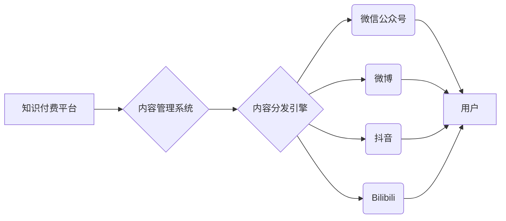

                 

## 如何进行知识付费的跨平台内容分发

> 关键词：知识付费、跨平台分发、内容管理、技术架构、数据分析、用户体验、内容营销

## 1. 背景介绍

知识付费已成为当今互联网经济的重要组成部分，越来越多的人选择通过付费的方式获取优质的知识和技能。然而，知识付费平台面临着内容分发、用户获取、用户留存等一系列挑战。传统的单平台模式难以满足用户多元化的需求，跨平台内容分发成为知识付费行业发展的重要趋势。

**1.1 知识付费现状与挑战**

* **内容碎片化:** 互联网信息爆炸，用户碎片化时间需求，导致知识付费内容难以集中呈现，用户难以获得完整的学习体验。
* **平台壁垒:** 各平台用户群体差异较大，知识付费平台难以突破平台壁垒，扩大用户触达范围。
* **用户粘性不足:** 用户付费后，缺乏持续的学习动力和互动体验，导致用户流失率高。

**1.2 跨平台内容分发的机遇与价值**

* **扩大用户触达:** 通过跨平台分发，知识付费平台可以触达更广泛的用户群体，提升用户获取效率。
* **提升用户粘性:** 多平台内容互动，可以增强用户参与度和学习兴趣，提升用户留存率。
* **丰富内容体验:** 跨平台分发可以将不同类型的知识付费内容整合，提供更丰富的学习体验。

## 2. 核心概念与联系

跨平台内容分发是指将知识付费内容发布到多个平台，实现内容的广泛传播和用户触达。

**2.1 核心概念**

* **知识付费:** 指通过付费的方式获取知识、技能或服务的商业模式。
* **跨平台:** 指内容能够在多个不同的平台上发布和传播。
* **内容分发:** 指将内容发布到目标平台的过程。

**2.2 架构原理**



**2.3 核心技术**

* **内容管理系统 (CMS):** 用于存储、管理和发布知识付费内容。
* **内容分发引擎:** 用于将内容分发到不同平台，并进行内容适配和格式转换。
* **API 接口:** 用于不同平台之间的数据交互和内容同步。

## 3. 核心算法原理 & 具体操作步骤

**3.1 算法原理概述**

跨平台内容分发的核心算法主要包括内容推荐算法、内容分发策略算法和用户行为分析算法。

* **内容推荐算法:** 根据用户的兴趣爱好和学习历史，推荐合适的知识付费内容。
* **内容分发策略算法:** 根据不同平台的特点和用户群体，制定不同的内容分发策略。
* **用户行为分析算法:** 分析用户的学习行为，例如阅读时长、点赞数、评论数等，以便优化内容分发策略。

**3.2 算法步骤详解**

1. **数据采集:** 收集用户行为数据、内容数据和平台数据。
2. **数据预处理:** 对数据进行清洗、转换和格式化。
3. **特征提取:** 从数据中提取用户特征、内容特征和平台特征。
4. **模型训练:** 使用机器学习算法训练内容推荐模型、内容分发策略模型和用户行为分析模型。
5. **模型预测:** 根据用户特征和内容特征，预测用户对不同内容的兴趣和点击率。
6. **内容分发:** 根据预测结果和平台策略，将内容分发到不同的平台。
7. **效果评估:** 评估内容分发效果，例如点击率、转化率和用户留存率。

**3.3 算法优缺点**

* **优点:** 能够根据用户需求和平台特点进行个性化内容分发，提升用户体验和内容传播效率。
* **缺点:** 需要大量的用户数据和平台数据进行训练，算法模型需要不断优化和更新。

**3.4 算法应用领域**

* **知识付费平台:** 推送个性化推荐内容，提高用户转化率和留存率。
* **电商平台:** 推送个性化商品推荐，提升用户购物体验和转化率。
* **新闻媒体:** 推送个性化新闻推荐，提升用户阅读量和互动率。

## 4. 数学模型和公式 & 详细讲解 & 举例说明

**4.1 数学模型构建**

假设我们有一个知识付费平台，包含N个用户和M个内容。用户i对内容j的兴趣度可以用一个分数表示，记为$r_{ij}$。

**4.2 公式推导过程**

我们可以使用协同过滤算法来预测用户对内容的兴趣度。协同过滤算法的基本思想是：如果用户A和用户B对某些内容的兴趣度相似，那么用户A可能也喜欢用户B喜欢的其他内容。

协同过滤算法的公式如下：

$$
\hat{r}_{ij} = \bar{r}_i + \frac{\sum_{k=1}^{N} (r_{ik} - \bar{r}_i)(r_{jk} - \bar{r}_j)}{\sum_{k=1}^{N} (r_{ik} - \bar{r}_i)^2}
$$

其中：

* $\hat{r}_{ij}$ 是用户i对内容j的预测兴趣度。
* $\bar{r}_i$ 是用户i的平均兴趣度。
* $\bar{r}_j$ 是内容j的平均兴趣度。
* $r_{ik}$ 是用户i对内容k的实际兴趣度。

**4.3 案例分析与讲解**

假设用户A和用户B都对内容1和内容2感兴趣，但用户A对内容3不感兴趣，而用户B对内容3很感兴趣。根据协同过滤算法，我们可以预测用户A可能也对内容3感兴趣。

## 5. 项目实践：代码实例和详细解释说明

**5.1 开发环境搭建**

* 语言: Python
* 框架: Django
* 数据库: MySQL

**5.2 源代码详细实现**

```python
# models.py
class Content(models.Model):
    title = models.CharField(max_length=255)
    description = models.TextField()
    # ...其他字段

class User(models.Model):
    username = models.CharField(max_length=255)
    # ...其他字段

# views.py
def recommend_content(request, user_id):
    user = User.objects.get(pk=user_id)
    # ...使用协同过滤算法获取推荐内容
    return render(request, 'recommend.html', {'recommended_content': recommended_content})
```

**5.3 代码解读与分析**

* `models.py` 定义了内容和用户模型。
* `views.py` 中的 `recommend_content` 函数接收用户ID作为参数，并使用协同过滤算法获取推荐内容。

**5.4 运行结果展示**

当用户访问推荐内容页面时，系统会根据用户的历史行为和兴趣爱好，推荐相关的知识付费内容。

## 6. 实际应用场景

**6.1 在线教育平台**

* 推荐个性化课程和学习资源。
* 根据用户学习进度和成绩，提供个性化学习建议。

**6.2 知识库平台**

* 推荐相关知识文章和文档。
* 根据用户搜索历史和阅读记录，提供个性化知识导航。

**6.3 社交媒体平台**

* 推荐相关话题和内容。
* 根据用户兴趣爱好，构建个性化兴趣圈。

**6.4 未来应用展望**

* **人工智能驱动的个性化推荐:** 利用深度学习算法，实现更精准的个性化推荐。
* **跨平台内容协同:** 打破平台壁垒，实现内容的无缝衔接和协同。
* **沉浸式学习体验:** 利用VR/AR技术，打造更沉浸式的知识付费体验。

## 7. 工具和资源推荐

**7.1 学习资源推荐**

* **书籍:**
    * 《推荐系统实践》
    * 《机器学习》
* **在线课程:**
    * Coursera: 机器学习
    * Udemy: 数据科学与机器学习

**7.2 开发工具推荐**

* **Python:** 强大的编程语言，广泛应用于数据科学和机器学习。
* **Django:** Python Web 开发框架，提供丰富的功能和工具。
* **TensorFlow:** 深度学习框架，用于构建和训练机器学习模型。

**7.3 相关论文推荐**

* **协同过滤算法:**
    * "Collaborative Filtering: A User-Based Approach"
    * "Memory-Based Collaborative Filtering"
* **推荐系统:**
    * "Recommender Systems: Methods and Applications"
    * "Survey on Recommender Systems"

## 8. 总结：未来发展趋势与挑战

**8.1 研究成果总结**

跨平台内容分发技术已取得显著进展，能够有效提升用户体验和内容传播效率。

**8.2 未来发展趋势**

* **人工智能驱动的个性化推荐:** 利用深度学习算法，实现更精准的个性化推荐。
* **跨平台内容协同:** 打破平台壁垒，实现内容的无缝衔接和协同。
* **沉浸式学习体验:** 利用VR/AR技术，打造更沉浸式的知识付费体验。

**8.3 面临的挑战**

* **数据隐私保护:** 跨平台内容分发需要收集和分析大量用户数据，如何保障用户隐私安全是一个重要挑战。
* **算法公平性:** 算法模型需要避免偏见和歧视，确保推荐结果公平公正。
* **平台生态建设:** 跨平台内容分发需要平台之间进行协作和合作，构建一个开放、共享的生态系统。

**8.4 研究展望**

未来研究将重点关注以下几个方面:

* **开发更精准、更个性化的推荐算法。**
* **构建更安全、更可靠的跨平台内容分发系统。**
* **探索新的跨平台内容分发模式和商业模式。**

## 9. 附录：常见问题与解答

**9.1 如何保证跨平台内容的质量？**

知识付费平台需要建立严格的内容审核机制，确保跨平台发布的内容质量和可靠性。

**9.2 如何解决跨平台内容的格式转换问题？**

知识付费平台可以利用API接口和内容转换工具，实现不同平台内容的格式转换和适配。

**9.3 如何提升跨平台内容的互动性？**

知识付费平台可以利用社交功能、评论功能和直播功能，提升跨平台内容的互动性。


作者：禅与计算机程序设计艺术 / Zen and the Art of Computer Programming 
<end_of_turn>

