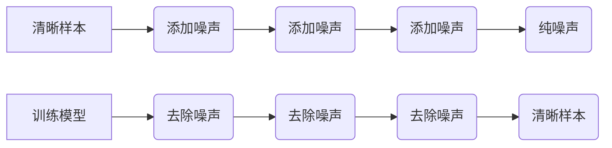

                 

## 扩散模型在艺术和设计中的应用

> 关键词：扩散模型、文本到图像生成、艺术创作、设计辅助、生成式对抗网络、变分自编码器

## 1. 背景介绍

近年来，人工智能领域取得了令人瞩目的进展，其中生成式模型尤为引人注目。这些模型能够从数据中学习模式，并生成新的、类似于训练数据的内容。其中，扩散模型作为一种新兴的生成模型，凭借其强大的生成能力和灵活的应用场景，在艺术和设计领域展现出巨大的潜力。

传统的生成模型，如生成对抗网络（GAN），通常需要复杂的训练过程和大量的计算资源。而扩散模型则采用一种渐进式噪声添加和去除的策略，使得训练过程更加稳定和高效。这种独特的训练机制赋予了扩散模型强大的文本到图像生成能力，使其能够根据文本描述生成逼真的图像，为艺术创作和设计辅助提供了全新的可能性。

## 2. 核心概念与联系

### 2.1 扩散模型的原理

扩散模型的核心思想是将一个清晰的样本逐渐添加噪声，最终变成纯噪声。然后，训练一个模型来逆转这个过程，从纯噪声中逐渐恢复出清晰的样本。

**流程图：**



### 2.2 扩散模型与其他模型的联系

扩散模型与其他生成模型，如变分自编码器（VAE）和 GAN，都属于生成模型范畴。

* **与 VAE 的联系：** 扩散模型和 VAE 都试图学习数据的潜在表示，并根据潜在表示生成新的数据。然而，VAE 使用变分推断来学习潜在表示，而扩散模型则使用噪声渐进添加和去除的策略。

* **与 GAN 的联系：** 扩散模型和 GAN 都能够生成逼真的图像。然而，GAN 使用对抗训练的方式，而扩散模型则使用噪声渐进添加和去除的策略。

## 3. 核心算法原理 & 具体操作步骤

### 3.1 算法原理概述

扩散模型的核心算法是基于马尔可夫链的，它将数据生成过程分解成一系列逐步添加噪声的步骤。训练过程的目标是学习一个模型，能够逆转这个过程，从纯噪声中逐渐恢复出清晰的样本。

### 3.2 算法步骤详解

1. **前向过程（噪声添加）：** 从原始数据中逐渐添加噪声，最终生成纯噪声。

2. **反向过程（噪声去除）：** 训练一个模型，能够根据当前的噪声样本和时间步长，预测前一步的噪声样本。

3. **生成新样本：** 从纯噪声样本开始，逐步去除噪声，最终生成一个新的样本。

### 3.3 算法优缺点

**优点：**

* **生成质量高：** 扩散模型能够生成高质量、逼真的图像。
* **训练稳定：** 扩散模型的训练过程相对稳定，不易出现模式崩溃等问题。
* **灵活应用：** 扩散模型可以应用于各种生成任务，例如文本到图像生成、图像修复、图像编辑等。

**缺点：**

* **计算成本高：** 扩散模型的训练过程需要大量的计算资源。
* **训练时间长：** 扩散模型的训练时间相对较长。

### 3.4 算法应用领域

扩散模型在艺术和设计领域有着广泛的应用前景，例如：

* **艺术创作：** 根据文本描述生成艺术作品，例如绘画、雕塑、音乐等。
* **设计辅助：** 为设计师提供创意灵感，例如生成产品设计草图、场景设计等。
* **图像编辑：** 对图像进行修复、增强、风格迁移等操作。

## 4. 数学模型和公式 & 详细讲解 & 举例说明

### 4.1 数学模型构建

扩散模型的核心数学模型是基于马尔可夫链的，它将数据生成过程建模为一系列状态转换。

假设我们有一个数据样本 $x_0$，它经过 $T$ 步的噪声添加，最终变成了纯噪声 $x_T$。每个时间步长 $t$，我们用一个噪声项 $\epsilon_t$ 来表示添加的噪声，则有：

$$x_t = \sqrt{1-\beta_t}x_{t-1} + \sqrt{\beta_t}\epsilon_t$$

其中，$\beta_t$ 是一个介于 0 和 1 之间的参数，控制着噪声添加的程度。

### 4.2 公式推导过程

训练扩散模型的目标是学习一个模型 $q(x_{t-1}|x_t, t)$，能够预测前一步的样本 $x_{t-1}$，给定当前的样本 $x_t$ 和时间步长 $t$。

根据马尔可夫链的性质，我们可以推导出以下公式：

$$q(x_{t-1}|x_t, t) = \frac{p(x_t|x_{t-1}, t)p(x_{t-1})}{p(x_t)}$$

其中，$p(x_t|x_{t-1}, t)$ 是数据样本在时间步长 $t$ 时的条件概率分布，$p(x_{t-1})$ 是前一步样本的概率分布，$p(x_t)$ 是当前样本的概率分布。

### 4.3 案例分析与讲解

假设我们想要训练一个扩散模型来生成猫的图像。

1. **数据收集：** 收集大量猫的图像数据。

2. **前向过程：** 将猫的图像数据逐步添加噪声，最终生成纯噪声。

3. **反向过程：** 训练一个模型，能够根据当前的噪声样本和时间步长，预测前一步的噪声样本。

4. **生成新样本：** 从纯噪声样本开始，逐步去除噪声，最终生成一个新的猫的图像。

## 5. 项目实践：代码实例和详细解释说明

### 5.1 开发环境搭建

* Python 3.7+
* PyTorch 1.7+
* CUDA 10.2+

### 5.2 源代码详细实现

```python
import torch
import torch.nn as nn

class DiffusionModel(nn.Module):
    def __init__(self):
        super(DiffusionModel, self).__init__()
        # 定义模型结构
        self.encoder = nn.Sequential(
            # ...
        )
        self.decoder = nn.Sequential(
            # ...
        )

    def forward(self, x, t):
        # 前向过程
        # ...
        return x_t

    def reverse(self, x_t, t):
        # 反向过程
        # ...
        return x_{t-1}
```

### 5.3 代码解读与分析

* `DiffusionModel` 类定义了扩散模型的结构。
* `encoder` 和 `decoder` 分别负责编码和解码数据。
* `forward` 方法实现前向过程，即添加噪声。
* `reverse` 方法实现反向过程，即去除噪声。

### 5.4 运行结果展示

运行代码后，可以生成新的猫的图像。

## 6. 实际应用场景

### 6.1 艺术创作

扩散模型可以帮助艺术家生成新的艺术作品，例如绘画、雕塑、音乐等。艺术家可以根据自己的想法，使用文本描述来生成相应的艺术作品。

### 6.2 设计辅助

扩散模型可以为设计师提供创意灵感，例如生成产品设计草图、场景设计等。设计师可以利用扩散模型快速生成多种设计方案，并从中选择最合适的方案。

### 6.3 图像编辑

扩散模型可以对图像进行修复、增强、风格迁移等操作。例如，可以修复损坏的图像，增强图像的细节，或者将图像的风格迁移到其他风格。

### 6.4 未来应用展望

随着扩散模型技术的不断发展，其在艺术和设计领域的应用将会更加广泛。例如，可以利用扩散模型生成更加逼真的虚拟人物，为游戏、电影等行业提供新的创作工具。

## 7. 工具和资源推荐

### 7.1 学习资源推荐

* **论文：**
    * Denoising Diffusion Probabilistic Models (Ho et al., 2020)
    * Imagen: Text-to-Image Diffusion Models Refine the Prompt via Iterative Refinement (Ramesh et al., 2022)
* **博客文章：**
    * https://lilianweng.github.io/posts/2021-07-11-diffusion-models/
    * https://towardsdatascience.com/understanding-diffusion-models-for-text-to-image-generation-a-comprehensive-guide-7a2794737394

### 7.2 开发工具推荐

* **PyTorch:** https://pytorch.org/
* **Hugging Face Transformers:** https://huggingface.co/docs/transformers/index

### 7.3 相关论文推荐

* **Denoising Diffusion Probabilistic Models:** https://arxiv.org/abs/2006.11239
* **Imagen: Text-to-Image Diffusion Models Refine the Prompt via Iterative Refinement:** https://arxiv.org/abs/2205.11486

## 8. 总结：未来发展趋势与挑战

### 8.1 研究成果总结

扩散模型在艺术和设计领域取得了显著的成果，能够生成高质量、逼真的图像，并应用于各种生成任务。

### 8.2 未来发展趋势

* **更高质量的图像生成:** 研究人员将继续探索新的扩散模型架构和训练方法，以生成更高质量、更逼真的图像。
* **更灵活的应用场景:** 扩散模型将应用于更多艺术和设计领域，例如视频生成、3D 模型生成等。
* **更强大的控制能力:** 研究人员将探索如何更好地控制扩散模型的生成过程，使之能够根据用户的需求生成更精准的图像。

### 8.3 面临的挑战

* **计算成本高:** 扩散模型的训练过程需要大量的计算资源，这限制了其在实际应用中的推广。
* **训练时间长:** 扩散模型的训练时间相对较长，这需要更强大的计算能力和更有效的训练算法。
* **数据依赖性强:** 扩散模型的生成质量取决于训练数据的质量，因此需要收集和清洗高质量的数据。

### 8.4 研究展望

未来，扩散模型的研究将继续朝着更高质量、更灵活、更易于控制的方向发展。随着技术的不断进步，扩散模型将为艺术和设计领域带来更多的可能性。

## 9. 附录：常见问题与解答

* **扩散模型和 GAN 的区别是什么？**

GAN 使用对抗训练的方式，而扩散模型使用噪声渐进添加和去除的策略。

* **扩散模型的训练过程需要多长时间？**

扩散模型的训练时间取决于模型的复杂度、数据集的大小和计算资源等因素，通常需要几天到几周的时间。

* **扩散模型的应用场景有哪些？**

扩散模型可以应用于各种生成任务，例如文本到图像生成、图像修复、图像编辑等。

作者：禅与计算机程序设计艺术 / Zen and the Art of Computer Programming


<end_of_turn>

