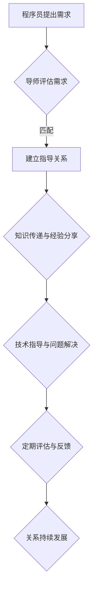

                 

## 技术mentoring：构建程序员成长加速器项目

> 关键词：技术mentoring, 程序员成长, 知识传递,  mentorship,  技术社区,  职业发展,  软件开发

## 1. 背景介绍

在当今科技日新月异的时代，程序员的需求量持续增长，而高质量的程序员人才却显得愈加稀缺。如何有效提升程序员的技能水平，加速他们的成长，成为软件行业面临的共同挑战。传统的培训方式往往缺乏针对性和互动性，难以满足程序员个性化的学习需求。技术mentoring，即技术指导，应运而生，成为解决这一问题的有效途径。

技术mentoring是指经验丰富的技术专家（mentor）与经验不足的程序员（mentee）建立一对一或小组指导关系，通过知识分享、经验交流、技术指导等方式，帮助mentee提升技术能力、解决工作难题、明确职业发展方向。

## 2. 核心概念与联系

技术mentoring的核心在于知识的传递和经验的积累。它建立在以下几个关键概念之上：

* **导师 (Mentor):** 拥有丰富技术经验和实践经验的专家，能够清晰地传授知识、提供指导和建议。
* **被指导者 (Mentee):** 渴望学习和成长的程序员，积极主动地寻求指导和帮助。
* **知识传递 (Knowledge Transfer):** 导师将自身的技术知识、经验和技能传授给被指导者，帮助其快速提升。
* **经验分享 (Experience Sharing):** 导师分享自身在工作中遇到的挑战和解决方法，帮助被指导者避免踩坑，积累经验。
* **技术指导 (Technical Guidance):** 导师针对被指导者的具体问题提供技术指导，帮助其解决技术难题。

**技术mentoring流程图:**



## 3. 核心算法原理 & 具体操作步骤

技术mentoring项目的核心算法并非传统意义上的算法，而是基于人际关系和知识传递的复杂系统。其核心在于构建高效的导师-被指导者匹配机制，并提供有效的知识传递和经验分享平台。

### 3.1  算法原理概述

技术mentoring项目的核心算法原理可以概括为以下几个方面：

* **匹配算法:** 根据导师和被指导者的技术背景、兴趣爱好、职业目标等信息，进行精准匹配，确保导师和被指导者之间存在有效的知识和经验互补性。
* **知识图谱构建:** 建立一个包含导师技能、经验、项目经验等信息的知识图谱，方便被指导者查找相关导师和资源。
* **互动平台:** 提供一个线上或线下的互动平台，方便导师和被指导者进行交流、分享和协作。

### 3.2  算法步骤详解

技术mentoring项目的具体操作步骤如下：

1. **用户注册:** 导师和被指导者分别注册系统，填写个人信息、技术技能、兴趣爱好、职业目标等信息。
2. **匹配算法:** 系统根据用户提供的个人信息，利用机器学习算法进行匹配，推荐合适的导师和被指导者。
3. **导师-被指导者沟通:** 导师和被指导者可以通过系统平台进行沟通，确认指导关系，制定指导计划。
4. **知识传递与经验分享:** 导师通过线上或线下方式，向被指导者传授技术知识、分享经验教训、提供技术指导。
5. **定期评估与反馈:** 导师和被指导者定期进行评估，反馈指导效果，并根据实际情况调整指导计划。
6. **关系持续发展:** 导师和被指导者之间建立长期合作关系，共同成长进步。

### 3.3  算法优缺点

**优点:**

* **精准匹配:** 利用算法进行匹配，提高导师和被指导者之间的匹配度，提升指导效果。
* **知识共享:** 建立知识图谱和互动平台，方便知识的共享和传播。
* **个性化指导:** 导师可以根据被指导者的具体需求，提供个性化的指导方案。

**缺点:**

* **算法依赖:** 算法的准确性直接影响匹配效果，需要不断优化和完善。
* **人际关系:** 技术mentoring的核心是人际关系，算法无法完全替代人与人之间的沟通和交流。
* **平台建设:** 需要投入大量资源建设完善的平台，才能提供良好的用户体验。

### 3.4  算法应用领域

技术mentoring算法的应用领域非常广泛，包括但不限于：

* **软件开发:** 帮助程序员提升技术技能、解决工作难题、明确职业发展方向。
* **数据科学:** 帮助数据科学家学习新技术、解决数据分析问题、提升模型构建能力。
* **人工智能:** 帮助人工智能工程师学习新算法、解决模型训练问题、提升应用开发能力。
* **教育培训:** 帮助学生学习编程、掌握技术技能、提升职业竞争力。

## 4. 数学模型和公式 & 详细讲解 & 举例说明

技术mentoring项目中，可以利用数学模型和公式来量化导师和被指导者的匹配度、指导效果、知识传递效率等指标。

### 4.1  数学模型构建

**导师-被指导者匹配度模型:**

可以利用余弦相似度来衡量导师和被指导者的技术背景和兴趣爱好之间的匹配度。

$$
similarity(mentor, mentee) = \frac{mentor \cdot mentee}{||mentor|| ||mentee||}
$$

其中：

* $mentor$ 和 $mentee$ 代表导师和被指导者的技术技能和兴趣爱好向量。
* $ \cdot $ 代表向量点积。
* $||mentor||$ 和 $||mentee||$ 代表导师和被指导者的向量长度。

**指导效果评估模型:**

可以利用线性回归模型来评估导师指导对被指导者技术水平提升的影响。

$$
y = \beta_0 + \beta_1 * x_1 + \beta_2 * x_2 + ... + \beta_n * x_n + \epsilon
$$

其中：

* $y$ 代表被指导者技术水平提升量。
* $x_1, x_2, ..., x_n$ 代表导师指导时长、指导频率、指导内容等因素。
* $\beta_0, \beta_1, ..., \beta_n$ 代表模型参数。
* $\epsilon$ 代表误差项。

### 4.2  公式推导过程

余弦相似度的推导过程如下：

1. 假设两个向量 $mentor$ 和 $mentee$ 的长度分别为 $||mentor||$ 和 $||mentee||$。
2. 向量点积 $mentor \cdot mentee$ 可以表示为两个向量的夹角的余弦值乘以两个向量的长度的乘积。
3. 因此，余弦相似度可以表示为：

$$
similarity(mentor, mentee) = \frac{mentor \cdot mentee}{||mentor|| ||mentee||}
$$

### 4.3  案例分析与讲解

假设有两个程序员，Alice 和 Bob，他们的技术技能向量分别为：

* Alice: [Python, Java, Web Development]
* Bob: [Python, C++, Data Science]

他们的余弦相似度为：

$$
similarity(Alice, Bob) = \frac{[Python, Java, Web Development] \cdot [Python, C++, Data Science]}{|| [Python, Java, Web Development] || || [Python, C++, Data Science] ||}
$$

通过计算，可以得到 Alice 和 Bob 的匹配度。

## 5. 项目实践：代码实例和详细解释说明

技术mentoring项目可以利用多种编程语言和框架进行开发，例如 Python、Java、Node.js 等。以下是一个使用 Python 和 Flask 框架开发技术mentoring平台的简单代码实例：

### 5.1  开发环境搭建

1. 安装 Python 3.x 及相关依赖包：pip install flask

### 5.2  源代码详细实现

```python
from flask import Flask, render_template, request

app = Flask(__name__)

# 模拟导师和被指导者数据
mentors = [
    {"name": "John Doe", "skills": ["Python", "Java", "Web Development"]},
    {"name": "Jane Smith", "skills": ["Python", "C++", "Data Science"]}
]

mentees = [
    {"name": "Alice", "skills": ["Python", "Web Development"]},
    {"name": "Bob", "skills": ["Java", "C++"]}
]

@app.route("/")
def index():
    return render_template("index.html")

@app.route("/match", methods=["POST"])
def match():
    mentee_skills = request.form.get("skills").split(",")
    matched_mentors = []
    for mentor in mentors:
        similarity = calculate_similarity(mentee_skills, mentor["skills"])
        if similarity > 0.7:
            matched_mentors.append(mentor)
    return render_template("match.html", matched_mentors=matched_mentors)

def calculate_similarity(skill1, skill2):
    # ... (实现余弦相似度计算)

if __name__ == "__main__":
    app.run(debug=True)
```

### 5.3  代码解读与分析

* **Flask框架:** 使用 Flask 框架构建了一个简单的 web 应用。
* **数据模拟:** 模拟了导师和被指导者的数据，包括姓名和技能。
* **匹配算法:** `calculate_similarity` 函数用于计算导师和被指导者的技能相似度。
* **路由:** `/` 路由渲染首页，`/match` 路由处理匹配请求。
* **表单提交:** 用户在首页填写技能信息，提交到 `/match` 路由进行匹配。
* **匹配结果:** 匹配结果渲染到 `match.html` 模板中。

### 5.4  运行结果展示

运行代码后，访问 `http://127.0.0.1:5000/`，即可看到首页。填写技能信息并提交，系统会根据算法进行匹配，并展示匹配结果。

## 6. 实际应用场景

技术mentoring项目在软件开发、数据科学、人工智能等领域都有广泛的应用场景。

### 6.1  软件开发

* **新员工培训:** 帮助新员工快速融入团队，学习公司技术规范和开发流程。
* **技术提升:** 帮助程序员学习新技术、提升代码质量、解决工作难题。
* **职业发展:** 帮助程序员明确职业目标，制定职业发展计划，获得晋升机会。

### 6.2  数据科学

* **算法学习:** 帮助数据科学家学习新算法、掌握模型构建技巧。
* **数据分析:** 帮助数据科学家解决数据分析问题，提升数据挖掘能力。
* **项目合作:** 帮助数据科学家与其他团队成员进行项目合作，共享经验和知识。

### 6.3  人工智能

* **模型训练:** 帮助人工智能工程师学习新模型训练方法，提升模型性能。
* **应用开发:** 帮助人工智能工程师学习新应用开发技术，将模型应用于实际场景。
* **技术交流:** 帮助人工智能工程师与其他专家进行技术交流，分享最新研究成果。

### 6.4  未来应用展望

未来，技术mentoring项目将更加智能化、个性化、平台化。

* **人工智能辅助:** 利用人工智能技术，自动匹配导师和被指导者，提供个性化的指导方案。
* **虚拟导师:** 开发虚拟导师系统，提供24小时在线指导服务。
* **跨地域合作:** 建立全球性的技术mentoring平台，促进跨地域的知识共享和人才培养。

## 7. 工具和资源推荐

### 7.1  学习资源推荐

* **书籍:**
    * 《The Pragmatic Programmer》
    * 《Clean Code》
    * 《Design Patterns: Elements of Reusable Object-Oriented Software》
* **在线课程:**
    * Coursera
    * edX
    * Udemy
* **技术博客:**
    * Hacker News
    * Stack Overflow
    * Medium

### 7.2  开发工具推荐

* **编程语言:** Python, Java, C++, JavaScript
* **框架:** Flask, Django, Spring Boot
* **数据库:** MySQL, PostgreSQL, MongoDB
* **云平台:** AWS, Azure, Google Cloud

### 7.3  相关论文推荐

* **Mentoring in Software Engineering:** A Systematic Literature Review
* **The Impact of Mentoring on Software Developers' Performance and Satisfaction**
* **A Framework for Building Effective Mentoring Programs in Software Engineering**

## 8. 总结：未来发展趋势与挑战

技术mentoring项目在推动程序员成长和提升软件开发效率方面具有重要意义。未来，技术mentoring项目将朝着智能化、个性化、平台化方向发展，并面临以下挑战：

### 8.1  研究成果总结

* 技术mentoring项目可以有效提升程序员的技能水平、解决工作难题、明确职业发展方向。
* 算法匹配、知识图谱构建、互动平台建设是技术mentoring项目的核心技术。
* 导师和被指导者之间的良好沟通和互动是技术mentoring项目成功的关键因素。

### 8.2  未来发展趋势

* **人工智能辅助:** 利用人工智能技术，自动匹配导师和被指导者，提供个性化的指导方案。
* **虚拟导师:** 开发虚拟导师系统，提供24小时在线指导服务。
* **跨地域合作:** 建立全球性的技术mentoring平台，促进跨地域的知识共享和人才培养。

### 8.3  面临的挑战

* **算法准确性:** 算法匹配的准确性直接影响指导效果，需要不断优化和完善。
* **导师资源:** 优质导师资源的获取和管理是技术mentoring项目面临的挑战。
* **平台建设:** 需要投入大量资源建设完善的平台，才能提供良好的用户体验。

### 8.4  研究展望

* 研究更精准的导师-被指导者匹配算法。
* 开发更智能的虚拟导师系统。
* 建立更完善的跨地域技术mentoring平台。


## 9. 附录：常见问题与解答

**Q1: 如何成为技术mentoring的导师？**

**A1:** 

* 拥有丰富的技术经验和实践经验。
* 具备良好的沟通和教学能力。
* 愿意分享知识和帮助他人成长。

**Q2: 如何寻找合适的技术mentoring导师？**

**A2:**

* 通过技术mentoring平台进行搜索。
* 参加技术交流活动，结识潜在导师。
* 向行业前辈咨询推荐。

**Q3: 技术mentoring的指导费用如何？**

**A3:**

* 部分平台提供免费的指导服务。
* 部分导师会收取指导费用，费用标准因导师经验和服务内容而异。


作者：禅与计算机程序设计艺术 / Zen and the Art of Computer Programming<end_of_turn>

