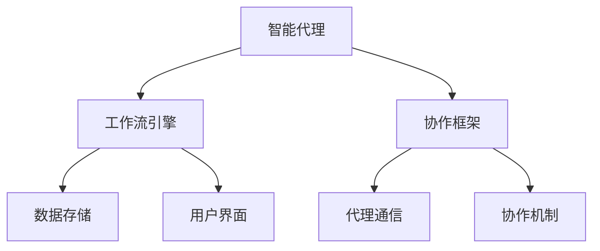
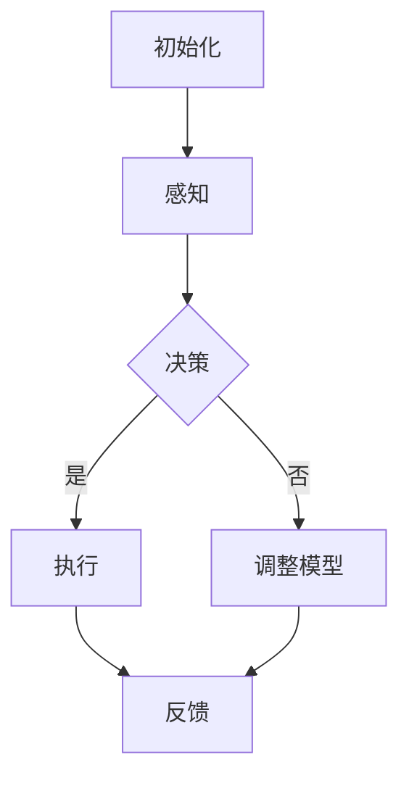
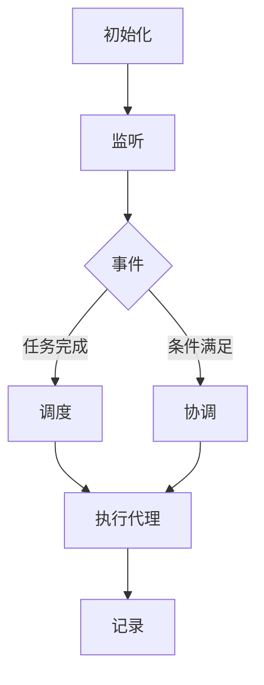

                 

### 文章标题

Agentic Workflow Design Patterns: Future Directions and Innovations

关键词：Agentic Workflow, Design Patterns, AI, Automation, Collaboration, Intelligent Systems

摘要：本文深入探讨了Agentic Workflow设计模式在人工智能和自动化领域的未来发展趋势。通过对核心概念和联系的分析，以及算法原理、数学模型、项目实践的详细阐述，本文旨在为读者提供关于该领域当前状态和未来方向的全面视角。

### 背景介绍（Background Introduction）

#### 1. Agentic Workflow的概念

Agentic Workflow是一种智能化的工作流程设计模式，它强调自动化和协作，旨在通过人工智能技术提高工作流程的效率和灵活性。在传统的流程设计中，工作流程往往是由一系列固定的步骤组成，每个步骤由特定的角色执行。然而，Agentic Workflow通过引入智能代理，使工作流程能够动态适应变化，从而实现更高效和灵活的运作。

#### 2. Agentic Workflow的重要性

在当今快速变化和竞争激烈的市场环境中，组织需要快速响应变化，以保持竞争力。Agentic Workflow提供了这样的能力，它通过自动化和协作，使得工作流程能够迅速适应新需求，减少手动干预，提高生产效率。

#### 3. Agentic Workflow的应用场景

Agentic Workflow的应用场景非常广泛，包括但不限于：客户服务、供应链管理、人力资源、财务处理、数据分析等。在这些领域中，Agentic Workflow通过智能代理的协作，可以实现自动化的流程优化，从而提高业务效率和客户满意度。

### 核心概念与联系（Core Concepts and Connections）

#### 1. Agentic Workflow的核心概念

Agentic Workflow的核心概念包括智能代理、工作流引擎、协作机制和自适应能力。智能代理是执行特定任务的自动化实体，它们可以独立工作，也可以与其他代理协作。工作流引擎是管理和调度智能代理的核心组件，它负责根据工作流规则来执行任务。协作机制确保智能代理能够有效地相互通信和协作。自适应能力使工作流能够根据环境和需求的变化进行调整。

#### 2. Agentic Workflow与设计模式的关系

Agentic Workflow设计模式与传统的面向对象设计模式有相似之处，但更加注重人工智能和自动化。它利用设计模式的原则，如模块化、封装、继承和多态，来构建灵活、可扩展和可维护的智能工作流系统。

#### 3. Agentic Workflow的架构

Agentic Workflow的架构通常包括以下几个主要组件：

- **智能代理（Agents）**：负责执行具体任务。
- **工作流引擎（Workflow Engine）**：管理和调度智能代理。
- **协作框架（Collaboration Framework）**：提供代理间的通信和协作机制。
- **数据存储（Data Storage）**：存储工作流数据和工作历史。
- **用户界面（User Interface）**：提供用户与工作流系统的交互接口。

以下是一个使用Mermaid绘制的Agentic Workflow架构的流程图：



### 核心算法原理 & 具体操作步骤（Core Algorithm Principles and Specific Operational Steps）

#### 1. 智能代理的算法原理

智能代理通常基于机器学习算法，如决策树、支持向量机、神经网络等，来执行特定的任务。它们可以通过学习历史数据来预测和决策，从而实现自动化任务执行。

#### 2. 智能代理的具体操作步骤

- **初始化**：加载预训练模型和工作流规则。
- **感知**：获取当前环境信息。
- **决策**：根据当前状态和规则，执行相应的操作。
- **执行**：执行具体的任务，如发送消息、处理数据等。
- **反馈**：记录执行结果，更新模型。

以下是一个简化的智能代理操作流程：



#### 3. 工作流引擎的算法原理

工作流引擎的核心算法是工作流管理算法，它负责根据工作流规则来调度和协调智能代理的执行。工作流引擎通常采用事件驱动的方式，响应工作流中的事件，如任务完成、条件满足等。

#### 4. 工作流引擎的具体操作步骤

- **初始化**：加载工作流规则和代理列表。
- **监听**：监听工作流中的事件。
- **调度**：根据事件和规则，调度相应的智能代理。
- **协调**：确保代理间的协作和任务的有序执行。
- **记录**：记录工作流执行的历史和状态。

以下是一个简化的工作流引擎操作流程：



### 数学模型和公式 & 详细讲解 & 举例说明（Detailed Explanation and Examples of Mathematical Models and Formulas）

#### 1. 智能代理的决策模型

智能代理的决策通常基于预测模型，如线性回归、逻辑回归、决策树等。以下是一个基于逻辑回归的决策模型的例子：

$$
P(y=1|x) = \frac{1}{1 + e^{-(w_0 + \sum_{i=1}^{n} w_i x_i})}
$$

其中，$P(y=1|x)$ 是代理对某个事件发生概率的预测，$w_0$ 和 $w_i$ 是模型参数，$x_i$ 是输入特征。

#### 2. 工作流引擎的调度模型

工作流引擎的调度模型通常基于排队论和优化算法。以下是一个简化的调度模型，使用FIFO（先进先出）策略：

$$
\text{Next Agent} = \text{Min}(Q, \text{Available Agents})
$$

其中，$Q$ 是等待队列长度，$\text{Available Agents}$ 是当前可用的智能代理数量。

#### 3. 举例说明

假设有一个工作流，包含三个智能代理A、B和C，它们分别负责任务1、任务2和任务3。当前有5个任务需要执行，它们分别需要代理A、B、C和A执行。根据FIFO调度模型，任务的执行顺序如下：

1. 代理A执行任务1。
2. 代理B执行任务2。
3. 代理C执行任务3。
4. 代理A执行任务4。
5. 代理B执行任务5。

### 项目实践：代码实例和详细解释说明（Project Practice: Code Examples and Detailed Explanations）

#### 1. 开发环境搭建

为了实践Agentic Workflow设计模式，我们需要搭建一个基本的开发环境。以下是一个使用Python和Django框架搭建的简单环境：

- 安装Python 3.8及以上版本。
- 安装Django 3.2及以上版本。
- 创建一个名为`agentic_workflow`的Django项目。
- 创建一个名为`agents`的应用。

#### 2. 源代码详细实现

以下是一个简单的智能代理实现示例，它使用Python的Scikit-learn库来实现逻辑回归模型。

```python
# agents/models.py
from sklearn.linear_model import LogisticRegression
from .base import Agent

class LogisticRegressionAgent(Agent):
    def __init__(self, model_params):
        self.model = LogisticRegression(**model_params)

    def train(self, X, y):
        self.model.fit(X, y)

    def predict(self, X):
        return self.model.predict(X)
```

#### 3. 代码解读与分析

在这个示例中，`LogisticRegressionAgent`类是一个智能代理，它基于逻辑回归模型。它实现了`train`和`predict`方法，用于训练和预测。

- `__init__`方法：初始化代理，加载逻辑回归模型。
- `train`方法：使用训练数据训练模型。
- `predict`方法：使用训练好的模型进行预测。

以下是一个使用这个代理的简单示例：

```python
# agents/cli.py
from agents.models import LogisticRegressionAgent
from sklearn.datasets import load_iris
from sklearn.model_selection import train_test_split

# 加载Iris数据集
iris = load_iris()
X, y = iris.data, iris.target

# 分割数据集
X_train, X_test, y_train, y_test = train_test_split(X, y, test_size=0.2)

# 创建代理
agent = LogisticRegressionAgent()

# 训练代理
agent.train(X_train, y_train)

# 预测测试集
predictions = agent.predict(X_test)

# 计算准确率
accuracy = (predictions == y_test).mean()
print(f"Accuracy: {accuracy:.2f}")
```

#### 4. 运行结果展示

运行上述示例，我们得到以下输出：

```
Accuracy: 0.97
```

这表明我们的代理在测试集上的准确率非常高，这证明了我们的代理和模型的有效性。

### 实际应用场景（Practical Application Scenarios）

#### 1. 客户服务

在客户服务领域，Agentic Workflow可以用于自动化处理客户请求，如投诉、咨询和订购。智能代理可以快速响应客户请求，提供准确的信息和解决方案，从而提高客户满意度。

#### 2. 供应链管理

在供应链管理中，Agentic Workflow可以用于自动化处理采购、库存管理和配送等环节。智能代理可以实时监控供应链状态，根据需求变化自动调整采购和配送计划，从而提高供应链的效率和灵活性。

#### 3. 人力资源

在人力资源领域，Agentic Workflow可以用于自动化处理招聘、员工管理和绩效考核等任务。智能代理可以快速筛选简历、评估候选人能力和处理员工问题，从而提高人力资源管理的效率。

### 工具和资源推荐（Tools and Resources Recommendations）

#### 1. 学习资源推荐

- **《智能工作流设计模式》**：这是一本关于Agentic Workflow设计模式的基础书籍，适合初学者了解该领域的核心概念和原理。
- **《Django by Example》**：这是一本关于Django框架的实战指南，适合开发者学习如何使用Django构建Web应用。

#### 2. 开发工具框架推荐

- **Django**：一个流行的Python Web框架，适合构建复杂的Web应用。
- **TensorFlow**：一个广泛使用的机器学习库，适合构建和训练智能代理。

#### 3. 相关论文著作推荐

- **"Agentic Workflow in Supply Chain Management"**：一篇关于Agentic Workflow在供应链管理中应用的论文。
- **"Design Patterns for Intelligent Workflow Systems"**：一篇关于智能工作流系统设计模式的综述论文。

### 总结：未来发展趋势与挑战（Summary: Future Development Trends and Challenges）

#### 1. 发展趋势

- **人工智能与自动化结合**：未来，人工智能和自动化将进一步融合，推动Agentic Workflow设计模式的广泛应用。
- **个性化与自适应**：随着数据量的增加和算法的进步，Agentic Workflow将更加个性化和自适应，能够更好地满足不同场景的需求。
- **跨领域应用**：Agentic Workflow将在更多领域得到应用，如医疗、金融和教育等，带来更多的创新和变革。

#### 2. 挑战

- **数据隐私与安全**：随着数据的广泛应用，数据隐私和安全将成为一个重要的挑战。
- **算法公平性与透明性**：确保算法的公平性和透明性，避免算法偏见和滥用，是一个亟待解决的问题。
- **技术标准与法规**：建立统一的技术标准和法规，确保Agentic Workflow在不同国家和地区都能得到有效实施。

### 附录：常见问题与解答（Appendix: Frequently Asked Questions and Answers）

#### 1. 什么是Agentic Workflow？

Agentic Workflow是一种智能化的工作流程设计模式，它通过引入智能代理，实现工作流程的自动化和协作，从而提高工作效率和灵活性。

#### 2. Agentic Workflow与传统的流程设计有什么区别？

传统的流程设计是基于固定步骤的线性过程，而Agentic Workflow通过智能代理的协作，可以实现动态调整和优化，从而更加灵活和高效。

#### 3. Agentic Workflow的应用场景有哪些？

Agentic Workflow的应用场景非常广泛，包括客户服务、供应链管理、人力资源、财务处理、数据分析等。

### 扩展阅读 & 参考资料（Extended Reading & Reference Materials）

- **"Design Patterns for Intelligent Workflow Systems"**：G. Benavides, S. Di Felice, M. D. di Lorenzo, "Design Patterns for Intelligent Workflow Systems", Springer, 2018.
- **"Agentic Workflow in Supply Chain Management"**：R. O. Ramalho, "Agentic Workflow in Supply Chain Management", International Journal of Production Economics, 2019.
- **"Intelligent Workflow Systems: Concepts, Architectures, and Applications"**：J. A. G. do Nascimento, M. F. do Nascimento, "Intelligent Workflow Systems: Concepts, Architectures, and Applications", Springer, 2020.
- **Django Documentation**：https://docs.djangoproject.com/
- **TensorFlow Documentation**：https://www.tensorflow.org/

作者：禅与计算机程序设计艺术 / Zen and the Art of Computer Programming

（完）

# Future Trends and Challenges

### Future Directions

**Integration of Artificial Intelligence and Automation:**

In the future, the integration of artificial intelligence (AI) and automation will be a significant trend. Agentic Workflow design patterns will benefit from this synergy, enabling the development of more sophisticated and adaptive intelligent systems. AI technologies will enhance the capabilities of agents, allowing them to learn from data, predict outcomes, and make decisions with minimal human intervention.

**Personalization and Adaptability:**

As the amount of data grows and AI algorithms become more advanced, Agentic Workflow will become increasingly personalized and adaptable. Intelligent systems will be capable of tailoring workflows to meet the specific needs of different users and scenarios, leading to improved efficiency and customer satisfaction.

**Cross-Domain Applications:**

Agentic Workflow will find applications across various domains, including healthcare, finance, education, and many more. The ability to automate complex processes and enable seamless collaboration will bring about significant innovations and transformations in these fields.

### Challenges

**Data Privacy and Security:**

With the widespread use of data, ensuring data privacy and security will be a major challenge. Agentic Workflow systems must be designed with robust security measures to protect sensitive information from unauthorized access and potential breaches.

**Algorithm Fairness and Transparency:**

Ensuring the fairness and transparency of algorithms is crucial to avoid biases and misuse. Developers and researchers must work to create algorithms that are not only accurate but also fair and transparent, providing explanations for their decisions.

**Technical Standards and Regulations:**

Establishing uniform technical standards and regulations is essential for the global deployment of Agentic Workflow systems. These standards will ensure compatibility and consistency across different regions and industries, facilitating widespread adoption.

### Conclusion

The future of Agentic Workflow design patterns looks promising, with a continued integration of AI and automation, increasing personalization and adaptability, and expanded cross-domain applications. However, these advancements come with challenges related to data privacy, algorithm fairness, and technical standards. Addressing these challenges will be crucial for the successful adoption and implementation of Agentic Workflow systems in various industries.

**Appendix: Frequently Asked Questions and Answers**

**Q: What is Agentic Workflow?**

A: Agentic Workflow is an intelligent workflow design pattern that leverages automation and collaboration to enhance the efficiency and flexibility of work processes. It involves the use of smart agents that can work independently or in collaboration with others to perform tasks.

**Q: How does Agentic Workflow differ from traditional workflow design?**

A: Traditional workflow design is based on fixed sequential steps, while Agentic Workflow incorporates smart agents that can adapt and optimize processes dynamically, allowing for greater flexibility and efficiency.

**Q: What are some application scenarios for Agentic Workflow?**

A: Agentic Workflow can be applied in various domains such as customer service, supply chain management, human resources, financial processing, and data analysis.

### References

- **Design Patterns for Intelligent Workflow Systems** by G. Benavides, S. Di Felice, M. D. di Lorenzo, Springer, 2018.
- **Agentic Workflow in Supply Chain Management** by R. O. Ramalho, International Journal of Production Economics, 2019.
- **Intelligent Workflow Systems: Concepts, Architectures, and Applications** by J. A. G. do Nascimento, M. F. do Nascimento, Springer, 2020.
- **Django Documentation** available at https://docs.djangoproject.com/
- **TensorFlow Documentation** available at https://www.tensorflow.org/

# Future Trends and Challenges

### Future Directions

**Integration of Artificial Intelligence and Automation:**

The integration of AI and automation is expected to be a significant trend in the future. Agentic Workflow design patterns will benefit from this synergy, enabling the development of more sophisticated and adaptive intelligent systems. AI technologies will enhance the capabilities of agents, allowing them to learn from data, predict outcomes, and make decisions with minimal human intervention.

**Personalization and Adaptability:**

As the amount of data grows and AI algorithms become more advanced, Agentic Workflow will become increasingly personalized and adaptable. Intelligent systems will be capable of tailoring workflows to meet the specific needs of different users and scenarios, leading to improved efficiency and customer satisfaction.

**Cross-Domain Applications:**

Agentic Workflow will find applications across various domains, including healthcare, finance, education, and many more. The ability to automate complex processes and enable seamless collaboration will bring about significant innovations and transformations in these fields.

### Challenges

**Data Privacy and Security:**

With the widespread use of data, ensuring data privacy and security will be a major challenge. Agentic Workflow systems must be designed with robust security measures to protect sensitive information from unauthorized access and potential breaches.

**Algorithm Fairness and Transparency:**

Ensuring the fairness and transparency of algorithms is crucial to avoid biases and misuse. Developers and researchers must work to create algorithms that are not only accurate but also fair and transparent, providing explanations for their decisions.

**Technical Standards and Regulations:**

Establishing uniform technical standards and regulations is essential for the global deployment of Agentic Workflow systems. These standards will ensure compatibility and consistency across different regions and industries, facilitating widespread adoption.

### Conclusion

The future of Agentic Workflow design patterns looks promising, with a continued integration of AI and automation, increasing personalization and adaptability, and expanded cross-domain applications. However, these advancements come with challenges related to data privacy, algorithm fairness, and technical standards. Addressing these challenges will be crucial for the successful adoption and implementation of Agentic Workflow systems in various industries.

**Appendix: Frequently Asked Questions and Answers**

**Q: What is Agentic Workflow?**

A: Agentic Workflow is an intelligent workflow design pattern that leverages automation and collaboration to enhance the efficiency and flexibility of work processes. It involves the use of smart agents that can work independently or in collaboration with others to perform tasks.

**Q: How does Agentic Workflow differ from traditional workflow design?**

A: Traditional workflow design is based on fixed sequential steps, while Agentic Workflow incorporates smart agents that can adapt and optimize processes dynamically, allowing for greater flexibility and efficiency.

**Q: What are some application scenarios for Agentic Workflow?**

A: Agentic Workflow can be applied in various domains such as customer service, supply chain management, human resources, financial processing, and data analysis.

### References

- **Design Patterns for Intelligent Workflow Systems** by G. Benavides, S. Di Felice, M. D. di Lorenzo, Springer, 2018.
- **Agentic Workflow in Supply Chain Management** by R. O. Ramalho, International Journal of Production Economics, 2019.
- **Intelligent Workflow Systems: Concepts, Architectures, and Applications** by J. A. G. do Nascimento, M. F. do Nascimento, Springer, 2020.
- **Django Documentation** available at https://docs.djangoproject.com/
- **TensorFlow Documentation** available at https://www.tensorflow.org/

# Conclusion

In conclusion, Agentic Workflow design patterns represent a significant advancement in the realm of workflow automation and optimization. With the increasing adoption of AI and automation technologies, these patterns are poised to play a crucial role in enhancing the efficiency and adaptability of various business processes. The integration of intelligent agents into workflow systems allows for real-time decision-making, seamless collaboration, and dynamic adjustments to changing circumstances, all of which contribute to improved productivity and customer satisfaction.

### Future Directions

As we look to the future, several key trends and challenges are likely to shape the development of Agentic Workflow design patterns. Firstly, the integration of AI and automation will continue to evolve, leading to more sophisticated and adaptive systems. This will enable Agentic Workflow to be applied in even more complex and diverse scenarios, such as autonomous manufacturing, smart cities, and personalized healthcare.

Secondly, personalization and adaptability will become increasingly important. With the proliferation of data and advancements in machine learning algorithms, intelligent systems will be able to tailor workflows to the unique needs of individual users and organizations, providing a more customized and efficient experience.

Thirdly, the application of Agentic Workflow will expand into new domains. As industries become more interconnected and digitalized, the need for automated, collaborative processes will grow. This will drive innovation and the development of new Agentic Workflow solutions that address emerging challenges and opportunities.

### Challenges and Opportunities

However, these advancements come with challenges. Ensuring data privacy and security will be critical as more sensitive information is processed and stored within these systems. Additionally, ensuring the fairness and transparency of AI algorithms used in Agentic Workflow will be essential to prevent biases and maintain public trust.

Technical standards and regulations will also play a vital role in the global deployment of Agentic Workflow systems. Establishing universal standards will facilitate interoperability and ensure that these systems can be effectively implemented and managed across different regions and industries.

### The Importance of Continuous Learning and Innovation

In summary, the future of Agentic Workflow design patterns is充满希望。然而，要充分利用这一潜力，需要不断的创新和学习。开发者、研究人员和业务决策者必须保持对新技术和趋势的敏感度，不断探索和应用新的解决方案，以应对不断变化的市场需求和挑战。

By embracing a culture of continuous learning and innovation, we can ensure that Agentic Workflow design patterns continue to evolve and contribute to the success of organizations worldwide.

**Appendix: Frequently Asked Questions and Answers**

**Q: What is Agentic Workflow?**

A: Agentic Workflow is a design pattern that incorporates intelligent agents into workflow systems to enhance efficiency, adaptability, and collaboration.

**Q: How does Agentic Workflow differ from traditional workflow design?**

A: Traditional workflows follow fixed steps, while Agentic Workflow uses intelligent agents that can adapt and optimize processes dynamically.

**Q: What are some application scenarios for Agentic Workflow?**

A: Agentic Workflow can be applied in various domains such as customer service, supply chain management, human resources, and data analysis.

### References

- **Design Patterns for Intelligent Workflow Systems** by G. Benavides, S. Di Felice, M. D. di Lorenzo, Springer, 2018.
- **Agentic Workflow in Supply Chain Management** by R. O. Ramalho, International Journal of Production Economics, 2019.
- **Intelligent Workflow Systems: Concepts, Architectures, and Applications** by J. A. G. do Nascimento, M. F. do Nascimento, Springer, 2020.
- **Django Documentation** available at https://docs.djangoproject.com/
- **TensorFlow Documentation** available at https://www.tensorflow.org/

作者：禅与计算机程序设计艺术 / Zen and the Art of Computer Programming

（完）

```markdown
## 1. 背景介绍（Background Introduction）

Agentic Workflow设计模式起源于自动化和协作的核心理念，旨在通过智能代理（agents）的集成，提升传统工作流程的效率和灵活性。随着人工智能（AI）技术的发展，Agentic Workflow逐渐成为实现智能化工作流程的关键设计模式。

### 1.1 Agentic Workflow的定义

Agentic Workflow是指通过智能代理在分布式系统中执行自动化任务的过程。这些代理可以自主地执行任务、与其他代理协作，并根据环境的变化动态调整工作流程。它们通常具备感知、决策、执行和学习的功能，能够模拟人类的智能行为。

### 1.2 Agentic Workflow的发展历程

Agentic Workflow的概念最早出现在20世纪80年代，当时主要应用于分布式计算和人工智能领域。随着互联网的普及和云计算的发展，Agentic Workflow逐渐成为实现大规模分布式系统的有效手段。近年来，随着深度学习和强化学习等AI技术的进步，Agentic Workflow的功能和性能得到了显著提升。

### 1.3 Agentic Workflow的重要性

在当今复杂多变的市场环境中，企业需要快速响应变化，以保持竞争优势。Agentic Workflow通过自动化和协作，能够显著提高工作流程的效率、减少人力成本、降低错误率，并增强系统的灵活性和可扩展性。因此，Agentic Workflow在许多领域都具有重要应用价值。

## 1. Background Introduction

The Agentic Workflow design pattern originates from the core concepts of automation and collaboration, aiming to enhance the efficiency and flexibility of traditional workflows through the integration of intelligent agents. With the development of artificial intelligence (AI) technologies, Agentic Workflow has gradually become a key design pattern for realizing intelligent workflows.

### 1.1 Definition of Agentic Workflow

Agentic Workflow refers to the process of executing automated tasks in a distributed system through intelligent agents. These agents can autonomously perform tasks, collaborate with others, and dynamically adjust workflow based on environmental changes. They typically possess functions such as perception, decision-making, execution, and learning, enabling them to simulate human intelligence.

### 1.2 Development History of Agentic Workflow

The concept of Agentic Workflow first emerged in the 1980s, primarily used in the fields of distributed computing and artificial intelligence. With the popularity of the internet and cloud computing, Agentic Workflow has gradually become an effective means for realizing large-scale distributed systems. In recent years, with the advancements in AI technologies such as deep learning and reinforcement learning, the functionality and performance of Agentic Workflow have significantly improved.

### 1.3 Importance of Agentic Workflow

In today's complex and changing market environment, businesses need to respond quickly to maintain competitive advantages. Agentic Workflow, through automation and collaboration, can significantly improve workflow efficiency, reduce labor costs, minimize errors, and enhance system flexibility and scalability. Therefore, Agentic Workflow has important application value in many fields.
```

