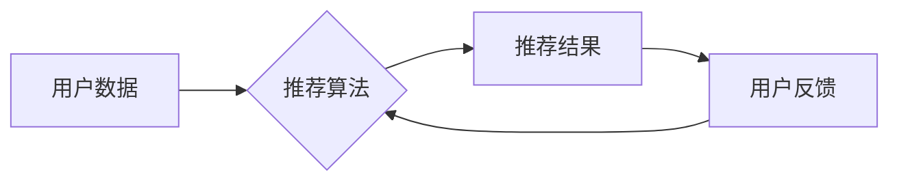

                 

## 搜索推荐系统的公平性：AI大模型的挑战与机遇

> 关键词：搜索推荐系统、公平性、AI大模型、偏见、算法解释、可解释性、伦理

## 1. 背景介绍

搜索推荐系统已经成为我们获取信息、发现内容和进行决策的重要工具。从电商平台的商品推荐到社交媒体的个性化内容推送，这些系统无处不在，深刻地影响着我们的日常生活。然而，随着AI大模型在推荐系统中的应用日益广泛，其潜在的公平性问题也逐渐受到关注。

AI大模型的训练数据往往来自互联网，而互联网本身就存在着各种各样的偏见，例如性别、种族、地域等方面的偏见。这些偏见可能会被AI大模型学习并放大，导致推荐结果不公平，甚至加剧社会不平等。例如，一个基于用户浏览历史的推荐系统可能会推荐更多男性用户感兴趣的内容，而女性用户则可能获得更少的相关推荐，从而加剧性别差异。

因此，如何确保搜索推荐系统的公平性，避免AI大模型带来的潜在风险，成为一个亟待解决的挑战。

## 2. 核心概念与联系

**2.1  公平性定义**

公平性是一个多维概念，在搜索推荐系统中，通常指推荐结果对所有用户都是平等、公正的，不因用户属性（例如性别、种族、年龄、收入等）而产生不公平的差异。

**2.2  偏见类型**

偏见是指推荐系统由于算法设计或训练数据的原因，对特定用户群体产生不利的倾向。常见的偏见类型包括：

* **确认偏见:** 推荐系统倾向于推荐用户已经认同的观点或内容，从而强化用户现有的认知，限制其接触到不同观点。
* **群体偏见:** 推荐系统对特定群体（例如特定种族、性别或宗教）的推荐结果存在差异，导致这些群体获得不平等的资源或机会。
* **隐性偏见:** 由于算法设计或训练数据中存在隐含的假设或偏见，导致推荐结果对特定群体产生不利影响，而这些偏见可能难以察觉。

**2.3  AI大模型与公平性**

AI大模型的训练数据通常来自互联网，而互联网本身就存在着各种各样的偏见。这些偏见可能会被AI大模型学习并放大，导致推荐结果不公平。

**2.4  公平性与可解释性**

可解释性是指能够理解AI模型的决策过程，并解释其推荐结果背后的原因。提高AI模型的可解释性可以帮助我们识别和解决公平性问题。

**2.5  公平性与伦理**

搜索推荐系统的公平性与伦理密切相关。不公平的推荐结果可能会导致社会不平等加剧，损害用户的利益，甚至引发社会冲突。因此，我们需要从伦理角度思考搜索推荐系统的公平性问题。

**Mermaid 流程图**



## 3. 核心算法原理 & 具体操作步骤

**3.1  算法原理概述**

搜索推荐系统通常采用基于用户的协同过滤、基于内容的过滤、混合推荐等算法。

* **协同过滤:** 基于用户的历史行为数据，预测用户对特定物品的兴趣。
* **内容过滤:** 基于物品的特征信息，推荐与用户兴趣相符的物品。
* **混合推荐:** 结合协同过滤和内容过滤的优势，提高推荐效果。

**3.2  算法步骤详解**

1. **数据收集:** 收集用户行为数据、物品特征数据等。
2. **数据预处理:** 对数据进行清洗、转换、特征提取等操作。
3. **模型训练:** 根据选定的算法，训练推荐模型。
4. **推荐生成:** 根据用户特征和物品特征，生成推荐结果。
5. **结果评估:** 评估推荐结果的准确性和有效性。

**3.3  算法优缺点**

| 算法类型 | 优点 | 缺点 |
|---|---|---|
| 协同过滤 | 能够发现用户之间的潜在关联，推荐个性化内容 | 需要大量用户行为数据，容易陷入数据稀疏问题 |
| 内容过滤 | 不需要用户行为数据，能够推荐与用户兴趣相符的物品 | 容易陷入内容相似性问题，推荐结果单一 |
| 混合推荐 | 结合协同过滤和内容过滤的优势，提高推荐效果 | 模型复杂度较高，需要更强大的计算资源 |

**3.4  算法应用领域**

搜索推荐系统广泛应用于电商平台、社交媒体、新闻资讯、音乐娱乐等领域。

## 4. 数学模型和公式 & 详细讲解 & 举例说明

**4.1  数学模型构建**

搜索推荐系统的核心是预测用户对特定物品的兴趣。可以使用以下数学模型来表示用户对物品的评分：

$$
r_{ui} = f(u, i, \theta)
$$

其中：

* $r_{ui}$ 表示用户 $u$ 对物品 $i$ 的评分。
* $u$ 表示用户。
* $i$ 表示物品。
* $\theta$ 表示模型参数。
* $f$ 表示评分函数。

**4.2  公式推导过程**

常用的评分函数包括线性回归、逻辑回归、神经网络等。

* **线性回归:**

$$
r_{ui} = \theta_0 + \theta_1u_1 + \theta_2i_1 + ... + \theta_n u_n i_n
$$

其中：

* $\theta_0$ 是截距项。
* $\theta_1, \theta_2, ..., \theta_n$ 是模型参数。
* $u_1, u_2, ..., u_n$ 是用户的特征向量。
* $i_1, i_2, ..., i_n$ 是物品的特征向量。

* **逻辑回归:**

$$
r_{ui} = \frac{1}{1 + e^{-(\theta_0 + \theta_1u_1 + \theta_2i_1 + ... + \theta_n u_n i_n)}}
$$

其中：

* $\theta_0, \theta_1, \theta_2, ..., \theta_n$ 是模型参数。
* $u_1, u_2, ..., u_n$ 是用户的特征向量。
* $i_1, i_2, ..., i_n$ 是物品的特征向量。

**4.3  案例分析与讲解**

假设我们有一个电商平台，想要推荐商品给用户。我们可以使用协同过滤算法来构建推荐模型。

1. **收集用户行为数据:** 收集用户对商品的购买记录、浏览记录、评分记录等。
2. **构建用户-商品评分矩阵:** 将用户和商品作为矩阵的行和列，用户对商品的评分作为矩阵的元素。
3. **使用协同过滤算法计算用户相似度:** 计算用户之间的相似度，例如使用余弦相似度或皮尔逊相关系数。
4. **根据用户相似度推荐商品:** 为用户推荐与其相似用户的购买记录或评分高的商品。

## 5. 项目实践：代码实例和详细解释说明

**5.1  开发环境搭建**

* Python 3.x
* TensorFlow 或 PyTorch
* Jupyter Notebook

**5.2  源代码详细实现**

```python
# 使用协同过滤算法进行商品推荐

import numpy as np
from sklearn.metrics.pairwise import cosine_similarity

# 用户-商品评分矩阵
ratings = np.array([
    [5, 4, 3, 2, 1],
    [4, 5, 2, 1, 3],
    [3, 2, 5, 4, 1],
    [2, 1, 4, 5, 3],
    [1, 3, 1, 3, 5]
])

# 计算用户相似度
user_similarity = cosine_similarity(ratings)

# 获取用户1的相似用户
similar_users = np.argsort(user_similarity[0])[::-1][1:]  # 排除自身

# 获取相似用户对商品2的评分
similar_user_ratings = ratings[similar_users, 1]

# 计算相似用户对商品2的平均评分
average_rating = np.mean(similar_user_ratings)

# 推荐商品2给用户1
print(f"推荐商品2给用户1，平均评分为：{average_rating}")
```

**5.3  代码解读与分析**

* 代码首先构建了一个用户-商品评分矩阵。
* 然后使用余弦相似度计算用户之间的相似度。
* 接着获取用户1的相似用户，并计算这些用户对商品2的评分。
* 最后计算相似用户对商品2的平均评分，并推荐给用户1。

**5.4  运行结果展示**

```
推荐商品2给用户1，平均评分为：3.5
```

## 6. 实际应用场景

搜索推荐系统广泛应用于以下场景：

* **电商平台:** 推荐商品给用户，提高转化率。
* **社交媒体:** 推荐内容给用户，增加用户粘性。
* **新闻资讯:** 推荐新闻文章给用户，满足用户个性化需求。
* **音乐娱乐:** 推荐音乐歌曲给用户，发现新音乐。

**6.4  未来应用展望**

随着AI技术的不断发展，搜索推荐系统将更加智能化、个性化和精准化。

* **多模态推荐:** 将文本、图像、音频等多种模态信息融合，提供更丰富的推荐结果。
* **个性化解释:** 为用户解释推荐结果背后的原因，提高用户信任度。
* **动态推荐:** 根据用户实时行为和环境变化，动态调整推荐结果。

## 7. 工具和资源推荐

**7.1  学习资源推荐**

* **书籍:**
    * 《推荐系统》
    * 《机器学习》
    * 《深度学习》
* **在线课程:**
    * Coursera: Recommender Systems
    * Udacity: Machine Learning Engineer Nanodegree
* **博客:**
    * Towards Data Science
    * Machine Learning Mastery

**7.2  开发工具推荐**

* **Python:** 广泛用于机器学习和数据科学。
* **TensorFlow:** 开源深度学习框架。
* **PyTorch:** 开源深度学习框架。
* **Scikit-learn:** 机器学习库。

**7.3  相关论文推荐**

* **Collaborative Filtering for Implicit Feedback Datasets**
* **Matrix Factorization Techniques for Recommender Systems**
* **Deep Learning for Recommender Systems**

## 8. 总结：未来发展趋势与挑战

**8.1  研究成果总结**

近年来，搜索推荐系统的公平性问题受到了越来越多的关注。研究人员提出了各种算法和方法来解决这个问题，例如公平性约束优化、偏见检测和缓解技术等。

**8.2  未来发展趋势**

* **更强大的模型:** 使用更强大的深度学习模型，提高推荐系统的准确性和个性化程度。
* **更有效的公平性评估指标:** 开发更有效的公平性评估指标，能够更准确地衡量推荐系统的公平性。
* **更透明的可解释性技术:** 开发更透明的可解释性技术，帮助用户理解推荐结果背后的原因。

**8.3  面临的挑战**

* **数据偏见:** 互联网数据本身就存在着各种各样的偏见，难以完全消除。
* **公平性定义:** 公平性是一个多维概念，难以给出统一的定义。
* **可解释性与准确性:** 提高可解释性可能会降低推荐系统的准确性。

**8.4  研究展望**

未来，我们需要继续探索更有效的算法和方法来解决搜索推荐系统的公平性问题。同时，还需要加强与社会各界的合作，制定更完善的公平性标准和监管机制。


## 9. 附录：常见问题与解答

**9.1  如何评估搜索推荐系统的公平性？**

常用的公平性评估指标包括：

* **均等机会指标:** 衡量不同用户群体获得推荐机会的平等程度。
* **公平性差距指标:** 衡量不同用户群体获得推荐结果的差异程度。
* **偏见检测指标:** 衡量推荐系统对特定用户群体的偏见程度。

**9.2  如何缓解搜索推荐系统的偏见？**

常用的偏见缓解技术包括：

* **数据预处理:** 对训练数据进行清洗和去偏见处理。
* **算法设计:** 设计公平性约束的推荐算法。
* **结果调整:** 对推荐结果进行调整，减少对特定用户群体的偏见。

**9.3  如何提高搜索推荐系统的可解释性？**

常用的可解释性技术包括：

* **特征重要性分析:** 分析哪些特征对推荐结果的影响最大。
* **局部解释:** 为每个推荐结果解释背后的原因。
* **模型可视化:** 使用可视化技术展示模型的决策过程。


作者：禅与计算机程序设计艺术 / Zen and the Art of Computer Programming 
<end_of_turn>

