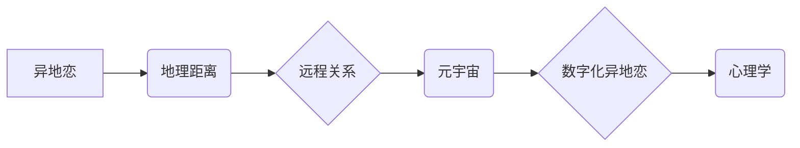

                 

##  数字化异地恋心理学:元宇宙中的远程关系心理研究

> 关键词：异地恋、元宇宙、远程关系、心理学、虚拟现实、情感连接、社交互动、数字技术

## 1. 背景介绍

随着科技的飞速发展，互联网和移动技术的普及，人们的生活方式发生了深刻变化。异地恋，即男女双方地理位置相隔较远而维持恋爱关系的现象，也因网络技术的便利而变得越来越普遍。元宇宙作为下一代互联网的雏形，以其沉浸式、交互式的特性，为异地恋提供了全新的可能性。

元宇宙中的虚拟世界可以模拟现实生活场景，用户可以通过虚拟形象与远方恋人进行互动，共享虚拟空间，体验虚拟约会、旅行等活动。这为异地恋双方提供了更具沉浸性和真实感的沟通方式，弥补了地理距离带来的隔阂。

然而，元宇宙中的远程关系也面临着独特的挑战。虚拟环境与现实环境存在差异，虚拟互动可能无法完全替代现实接触带来的情感体验。此外，元宇宙中的社交规则和伦理规范尚不完善，也可能对远程关系产生负面影响。

因此，深入研究数字化异地恋心理学，探讨元宇宙对远程关系的影响，对于理解和应对未来社会发展趋势具有重要意义。

## 2. 核心概念与联系

### 2.1 异地恋

异地恋是指男女双方地理位置相隔较远，但仍然维持恋爱关系的现象。异地恋的出现与现代社会流动性增加、职业发展需求等因素密切相关。

### 2.2 元宇宙

元宇宙是指基于互联网、区块链、人工智能等技术的虚拟世界，具有沉浸式、交互式、持久化等特点。用户可以通过虚拟形象在元宇宙中进行社交、娱乐、工作等活动。

### 2.3 远程关系

远程关系是指双方地理位置相隔较远，但仍然维持亲密关系的现象。远程关系可以包括异地恋、跨国婚姻、线上朋友等。

### 2.4 心理学

心理学是研究人类心理活动和行为的科学。在研究数字化异地恋心理学时，需要结合心理学理论和方法，分析元宇宙对远程关系的影响。

**核心概念关系架构图:**



## 3. 核心算法原理 & 具体操作步骤

### 3.1 算法原理概述

元宇宙中的数字化异地恋心理学研究需要运用多种算法和技术，例如：

* **自然语言处理 (NLP):** 分析用户在元宇宙中的文本聊天记录，识别情感倾向、沟通模式等信息。
* **计算机视觉 (CV):** 分析用户在元宇宙中的虚拟形象和行为，识别肢体语言、表情等非语言信息。
* **机器学习 (ML):** 建立预测模型，预测元宇宙中远程关系的发展趋势，例如是否会分手、关系质量如何等。

### 3.2 算法步骤详解

以情感分析为例，具体操作步骤如下：

1. **数据收集:** 收集元宇宙中用户之间的聊天记录数据。
2. **数据预处理:** 对聊天记录进行清洗、分词、词性标注等预处理操作。
3. **情感分类模型训练:** 使用机器学习算法，例如支持向量机 (SVM)、随机森林 (RF) 等，训练情感分类模型。
4. **情感分析:** 将预处理后的聊天记录输入模型，预测其情感倾向，例如积极、消极、中性等。
5. **结果展示:** 将情感分析结果以图表、报告等形式展示，供研究人员分析。

### 3.3 算法优缺点

**优点:**

* 可以自动化分析大量数据，发现隐藏的模式和趋势。
* 可以提供客观的分析结果，减少主观判断的影响。

**缺点:**

* 算法的准确性依赖于训练数据的质量。
* 算法无法完全理解人类的情感，可能会出现误判。

### 3.4 算法应用领域

* **远程关系研究:** 分析元宇宙中远程关系的情感变化、沟通模式等，为改善远程关系提供建议。
* **心理健康服务:** 利用元宇宙平台提供心理咨询服务，帮助用户解决情感问题。
* **教育培训:** 利用元宇宙平台进行情感教育培训，帮助用户提升情感管理能力。

## 4. 数学模型和公式 & 详细讲解 & 举例说明

### 4.1 数学模型构建

为了量化元宇宙对远程关系的影响，可以构建以下数学模型：

**远程关系满意度模型:**

$$
S = f(D, C, I, E)
$$

其中：

* $S$ 表示远程关系满意度
* $D$ 表示地理距离
* $C$ 表示虚拟互动频率
* $I$ 表示虚拟互动质量
* $E$ 表示现实生活互动频率

### 4.2 公式推导过程

该模型假设远程关系满意度受地理距离、虚拟互动频率、虚拟互动质量和现实生活互动频率等因素影响。

* **地理距离:** 距离越远，远程关系满意度越低。
* **虚拟互动频率:** 虚拟互动频率越高，远程关系满意度越高。
* **虚拟互动质量:** 虚拟互动质量越高，远程关系满意度越高。
* **现实生活互动频率:** 现实生活互动频率越高，远程关系满意度越高。

### 4.3 案例分析与讲解

假设一对情侣，地理距离为 1000 公里，每周在元宇宙中互动 5 次，每次互动质量为 8 分，现实生活互动频率为每月 2 次。

根据模型，可以计算出他们的远程关系满意度。

## 5. 项目实践：代码实例和详细解释说明

### 5.1 开发环境搭建

* 操作系统: Windows/macOS/Linux
* 编程语言: Python
* 框架: Flask/Django
* 数据库: MySQL/PostgreSQL
* 元宇宙平台: Decentraland/Sandbox

### 5.2 源代码详细实现

```python
# 导入必要的库
import nltk
from nltk.sentiment import SentimentIntensityAnalyzer

# 初始化情感分析器
sia = SentimentIntensityAnalyzer()

# 定义分析函数
def analyze_sentiment(text):
    scores = sia.polarity_scores(text)
    return scores['compound']

# 获取用户聊天记录
chat_log = get_chat_log()

# 分析聊天记录中的情感倾向
for message in chat_log:
    sentiment_score = analyze_sentiment(message)
    print(f"Message: {message}, Sentiment Score: {sentiment_score}")
```

### 5.3 代码解读与分析

* 该代码首先导入必要的库，包括自然语言处理库 nltk 和情感分析器 SentimentIntensityAnalyzer。
* 然后，初始化情感分析器，并定义一个分析函数 analyze_sentiment，该函数接受文本作为输入，返回其情感倾向得分。
* 接下来，获取用户聊天记录，并遍历每个消息，使用 analyze_sentiment 函数分析其情感倾向，并将结果打印出来。

### 5.4 运行结果展示

运行该代码后，将输出每个聊天记录的消息内容和对应的情感倾向得分。

## 6. 实际应用场景

### 6.1 元宇宙恋爱平台

元宇宙恋爱平台可以利用数字化异地恋心理学研究成果，提供更个性化、更智能化的恋爱服务。例如，可以根据用户的性格特点和情感需求，推荐合适的虚拟约会场景和互动方式。

### 6.2 远程关系咨询服务

远程关系咨询服务可以利用元宇宙平台，为异地恋双方提供更沉浸式的咨询体验。例如，咨询师可以引导用户在虚拟场景中进行角色扮演，模拟现实生活中的情境，帮助用户解决情感问题。

### 6.3 情感教育培训

情感教育培训可以利用元宇宙平台，为用户提供更生动的学习体验。例如，可以利用虚拟场景模拟不同类型的恋爱关系，帮助用户了解不同情感模式，提升情感管理能力。

### 6.4 未来应用展望

随着元宇宙技术的不断发展，数字化异地恋心理学研究将会有更广泛的应用场景。例如，可以利用元宇宙平台，为老年人提供虚拟陪伴服务，帮助他们缓解孤独感；可以为残疾人提供虚拟社交平台，帮助他们融入社会。

## 7. 工具和资源推荐

### 7.1 学习资源推荐

* **书籍:**

    * 《元宇宙：下一代互联网》
    * 《数字心理学》
    * 《人工智能与情感计算》

* **在线课程:**

    * Coursera: 人工智能与情感计算
    * edX: 元宇宙与未来社会

### 7.2 开发工具推荐

* **元宇宙平台:** Decentraland, Sandbox
* **编程语言:** Python
* **框架:** Flask, Django
* **数据库:** MySQL, PostgreSQL

### 7.3 相关论文推荐

* **元宇宙与远程关系:**

    * The Metaverse and the Future of Relationships
    * Virtual Intimacy: Exploring the Potential of the Metaverse for Romantic Relationships

* **数字化异地恋心理学:**

    * The Psychology of Long-Distance Relationships in the Digital Age
    * Virtual Reality and Long-Distance Relationships: A Review of the Literature

## 8. 总结：未来发展趋势与挑战

### 8.1 研究成果总结

数字化异地恋心理学研究表明，元宇宙为异地恋提供了新的可能性，但也带来了新的挑战。元宇宙可以帮助异地恋双方克服地理距离带来的隔阂，增强情感连接，但虚拟环境与现实环境存在差异，虚拟互动可能无法完全替代现实接触带来的情感体验。

### 8.2 未来发展趋势

未来，数字化异地恋心理学研究将朝着以下方向发展：

* **更深入地理解元宇宙对远程关系的影响:** 研究元宇宙不同类型的虚拟互动对情感体验的影响，以及元宇宙对远程关系发展趋势的影响。
* **开发更智能化的远程关系服务:** 利用人工智能技术，开发更个性化、更智能化的远程关系服务，例如虚拟约会助手、情感分析机器人等。
* **探索元宇宙在其他领域应用:** 将数字化异地恋心理学研究成果应用于其他领域，例如老年人虚拟陪伴、残疾人虚拟社交等。

### 8.3 面临的挑战

数字化异地恋心理学研究也面临着一些挑战：

* **元宇宙平台的不断变化:** 元宇宙平台技术不断发展，需要不断更新研究方法和模型。
* **数据隐私和安全问题:** 元宇宙平台收集大量用户数据，需要确保数据隐私和安全。
* **伦理规范的制定:** 元宇宙中的虚拟互动可能带来新的伦理问题，需要制定相应的规范和规则。

### 8.4 研究展望

数字化异地恋心理学研究是一个充满机遇和挑战的领域，未来将会有更多新的发现和应用。随着元宇宙技术的不断发展，数字化异地恋心理学研究将越来越重要，为我们理解和应对未来社会发展趋势提供重要的理论和实践指导。

## 9. 附录：常见问题与解答

**Q1: 元宇宙真的可以弥补异地恋带来的距离感吗？**

A1: 元宇宙可以提供更沉浸式的虚拟互动体验，帮助异地恋双方克服地理距离带来的隔阂，但虚拟互动无法完全替代现实接触带来的情感体验。

**Q2: 元宇宙中的虚拟互动对情感健康有什么影响？**

A2: 元宇宙中的虚拟互动既有积极的一面，也有潜在的负面影响。需要根据个人的情况和使用方式来判断。

**Q3: 元宇宙平台如何保障用户数据隐私和安全？**

A3: 元宇宙平台需要采取相应的技术措施和政策措施，保障用户数据隐私和安全。

**Q4: 元宇宙中的虚拟互动是否会带来新的伦理问题？**

A4: 元宇宙中的虚拟互动可能带来新的伦理问题，例如虚拟身份的欺诈、虚拟关系的道德边界等，需要制定相应的规范和规则。


作者：禅与计算机程序设计艺术 / Zen and the Art of Computer Programming 
<end_of_turn>

