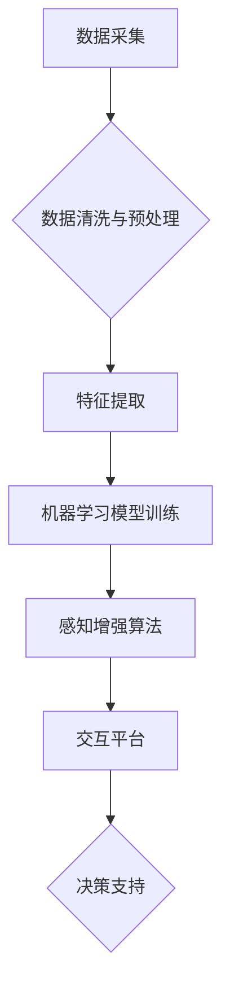

                 

## 数字化直觉：AI增强的第六感知觉

> 关键词：人工智能、数字化直觉、感知增强、机器学习、深度学习、数据分析、预测模型、未来趋势

## 1. 背景介绍

在信息爆炸的时代，人类面临着海量数据的冲击。传统的信息处理方式已经难以应对这种庞大的数据量和复杂性。人工智能（AI）的兴起为我们提供了新的解决方案，它能够从海量数据中提取有价值的信息，并帮助我们做出更明智的决策。

AI技术的发展，特别是深度学习的突破，使得机器具备了学习和理解数据的能力，甚至能够超越人类在某些特定领域的表现。然而，AI的应用仍然局限于特定的领域和任务，例如图像识别、语音识别、自然语言处理等。

我们渴望一种能够将AI技术与人类认知相融合的方式，从而提升人类的感知能力，帮助我们更好地理解和应对复杂的世界。这就是“数字化直觉”的概念。

数字化直觉是指通过AI技术增强人类感知能力，使其能够更快速、更准确地理解和处理信息，并做出更明智的决策。它就像人类的第六感，能够帮助我们洞察隐藏在数据背后的规律和趋势，并预判未来的发展方向。

## 2. 核心概念与联系

数字化直觉的核心概念是将AI技术与人类认知相融合。它需要以下几个关键要素：

* **数据采集和处理:**  收集来自各种来源的海量数据，并进行清洗、预处理和特征提取。
* **机器学习模型:**  利用深度学习等机器学习算法，训练模型能够从数据中学习和提取有价值的信息。
* **感知增强算法:**  设计算法，将机器学习模型的输出结果转化为人类能够理解的直观信息，例如图表、图形、文字等。
* **交互平台:**  构建交互平台，使人类能够与AI模型进行交互，并根据模型的输出结果做出决策。

**核心概念与联系流程图:**



## 3. 核心算法原理 & 具体操作步骤

### 3.1  算法原理概述

数字化直觉的核心算法原理是基于深度学习的**自编码器**和**生成对抗网络 (GAN)**。

* **自编码器:**  是一种无监督学习算法，它能够学习数据的潜在表示。自编码器由编码器和解码器两部分组成。编码器将输入数据压缩成低维的特征向量，解码器则将特征向量解码回原始数据。通过训练自编码器，我们可以学习到数据的本质特征，并将其用于感知增强。

* **生成对抗网络 (GAN):**  是一种生成式模型，它由生成器和鉴别器两部分组成。生成器试图生成与真实数据相似的样本，鉴别器则试图区分真实数据和生成数据。通过对抗训练，生成器能够学习到数据的分布规律，并生成逼真的样本。

### 3.2  算法步骤详解

1. **数据收集和预处理:**  收集来自各种来源的海量数据，并进行清洗、预处理和特征提取。
2. **自编码器训练:**  使用自编码器训练模型，学习数据的潜在表示。
3. **GAN训练:**  使用GAN训练模型，生成与真实数据相似的样本。
4. **感知增强算法:**  将自编码器和GAN的输出结果融合，设计算法将机器学习模型的输出转化为人类能够理解的直观信息。
5. **交互平台构建:**  构建交互平台，使人类能够与AI模型进行交互，并根据模型的输出结果做出决策。

### 3.3  算法优缺点

**优点:**

* **提升感知能力:**  能够帮助人类更快速、更准确地理解和处理信息。
* **洞察隐藏规律:**  能够帮助人类洞察隐藏在数据背后的规律和趋势。
* **预判未来发展:**  能够帮助人类预判未来的发展方向。

**缺点:**

* **数据依赖:**  算法的性能依赖于数据的质量和数量。
* **算法复杂:**  算法的训练和部署需要较高的技术水平。
* **伦理问题:**  AI技术的应用可能引发伦理问题，例如数据隐私、算法偏见等。

### 3.4  算法应用领域

数字化直觉的应用领域非常广泛，例如：

* **医疗诊断:**  帮助医生更快、更准确地诊断疾病。
* **金融风险管理:**  帮助金融机构识别和管理风险。
* **市场营销:**  帮助企业更好地了解客户需求，并进行精准营销。
* **科学研究:**  帮助科学家更快地发现新的知识。

## 4. 数学模型和公式 & 详细讲解 & 举例说明

### 4.1  数学模型构建

数字化直觉的核心数学模型是基于**概率论**和**统计学**的。

* **概率论:**  用于描述随机事件的发生概率。
* **统计学:**  用于分析和解释数据，并从中提取有价值的信息。

### 4.2  公式推导过程

自编码器和GAN的训练过程都涉及到**损失函数**的最小化。

* **自编码器损失函数:**  通常使用**均方误差 (MSE)**作为损失函数，衡量重建数据与原始数据的差异。

$$
L_{autoencoder} = \frac{1}{N} \sum_{i=1}^{N} ||x_i - \hat{x}_i||^2
$$

其中：

* $x_i$ 是原始数据
* $\hat{x}_i$ 是重建数据
* $N$ 是数据样本数量

* **GAN损失函数:**  通常使用**对抗损失函数**，衡量生成器生成的样本与真实数据的差异。

$$
L_{GAN} = V(D(x)) - V(D(G(z)))
$$

其中：

* $D(x)$ 是鉴别器对真实数据 $x$ 的判别概率
* $D(G(z))$ 是鉴别器对生成器生成的样本 $G(z)$ 的判别概率
* $V$ 是期望值

### 4.3  案例分析与讲解

例如，在医疗诊断领域，可以使用自编码器学习患者的病历数据，并生成患者的潜在特征向量。然后，可以使用GAN生成与真实患者数据相似的合成数据，用于训练鉴别器模型。鉴别器模型能够区分真实患者数据和合成数据，从而帮助医生识别潜在的疾病风险。

## 5. 项目实践：代码实例和详细解释说明

### 5.1  开发环境搭建

* **操作系统:**  Linux/macOS/Windows
* **编程语言:**  Python
* **深度学习框架:**  TensorFlow/PyTorch
* **其他工具:**  Jupyter Notebook、Git

### 5.2  源代码详细实现

以下是一个使用TensorFlow实现自编码器的简单代码示例：

```python
import tensorflow as tf

# 定义编码器模型
encoder = tf.keras.Sequential([
    tf.keras.layers.Dense(128, activation='relu'),
    tf.keras.layers.Dense(64, activation='relu'),
    tf.keras.layers.Dense(32, activation='relu')
])

# 定义解码器模型
decoder = tf.keras.Sequential([
    tf.keras.layers.Dense(64, activation='relu'),
    tf.keras.layers.Dense(128, activation='relu'),
    tf.keras.layers.Dense(784, activation='sigmoid')
])

# 定义自编码器模型
autoencoder = tf.keras.Model(inputs=encoder.input, outputs=decoder(encoder.output))

# 编译模型
autoencoder.compile(optimizer='adam', loss='mse')

# 训练模型
autoencoder.fit(x_train, x_train, epochs=10)
```

### 5.3  代码解读与分析

* **编码器:**  将输入数据压缩成低维的特征向量。
* **解码器:**  将特征向量解码回原始数据。
* **自编码器:**  将编码器和解码器组合在一起，形成一个完整的模型。
* **训练过程:**  使用训练数据训练自编码器模型，使其能够学习数据的潜在表示。

### 5.4  运行结果展示

训练完成后，可以使用自编码器对新的数据进行编码和解码，从而获得数据的潜在表示。

## 6. 实际应用场景

数字化直觉的应用场景非常广泛，例如：

### 6.1  医疗诊断

* **疾病预测:**  根据患者的病历数据、基因信息等，预测患者患病的风险。
* **影像分析:**  帮助医生识别医学影像中的异常区域，例如肿瘤、骨折等。
* **个性化治疗:**  根据患者的个体特征，制定个性化的治疗方案。

### 6.2  金融风险管理

* **欺诈检测:**  识别金融交易中的欺诈行为。
* **信用评估:**  评估客户的信用风险。
* **投资决策:**  根据市场数据和经济指标，进行投资决策。

### 6.3  市场营销

* **客户画像:**  构建客户的画像，了解客户的需求和偏好。
* **精准营销:**  根据客户的画像，进行精准的营销推广。
* **市场趋势预测:**  预测市场趋势，帮助企业制定营销策略。

### 6.4  未来应用展望

数字化直觉的应用前景非常广阔，未来可能会应用于更多领域，例如：

* **教育:**  个性化学习、智能辅导
* **交通:**  智能驾驶、交通管理
* **环境保护:**  环境监测、污染预测
* **艺术创作:**  AI辅助创作

## 7. 工具和资源推荐

### 7.1  学习资源推荐

* **书籍:**
    * 《深度学习》
    * 《机器学习实战》
    * 《Python机器学习》
* **在线课程:**
    * Coursera
    * edX
    * Udacity

### 7.2  开发工具推荐

* **深度学习框架:**
    * TensorFlow
    * PyTorch
    * Keras
* **数据处理工具:**
    * Pandas
    * NumPy
* **可视化工具:**
    * Matplotlib
    * Seaborn

### 7.3  相关论文推荐

* **Generative Adversarial Networks**
* **Autoencoders**
* **Deep Learning for Medical Image Analysis**

## 8. 总结：未来发展趋势与挑战

### 8.1  研究成果总结

数字化直觉是人工智能技术与人类认知相融合的产物，它能够提升人类的感知能力，帮助我们更好地理解和应对复杂的世界。

### 8.2  未来发展趋势

* **模型更加强大:**  随着深度学习技术的不断发展，数字化直觉的模型将会更加强大，能够处理更加复杂的数据，并提供更加精准的洞察。
* **应用场景更加广泛:**  数字化直觉的应用场景将会更加广泛，覆盖更多领域，例如教育、交通、环境保护等。
* **交互方式更加自然:**  数字化直觉的交互方式将会更加自然，例如语音交互、体感交互等。

### 8.3  面临的挑战

* **数据质量:**  数字化直觉的性能依赖于数据的质量和数量，如何获取高质量的数据仍然是一个挑战。
* **算法解释性:**  深度学习模型的决策过程往往难以解释，如何提高算法的解释性仍然是一个难题。
* **伦理问题:**  AI技术的应用可能引发伦理问题，例如数据隐私、算法偏见等，需要认真思考和解决。

### 8.4  研究展望

数字化直觉的研究方向还非常广阔，未来需要进一步探索以下问题:

* 如何设计更加高效、更加鲁棒的数字化直觉算法。
* 如何将数字化直觉与其他人工智能技术相结合，例如自然语言处理、计算机视觉等。
* 如何解决数字化直觉带来的伦理问题，确保其安全、可控、可解释地应用于社会。

## 9. 附录：常见问题与解答

**Q1: 数字化直觉与传统数据分析有什么区别？**

**A1:**  传统数据分析主要依赖于人类的经验和直觉，而数字化直觉则利用AI技术自动分析数据，并提供更精准、更直观的洞察。

**Q2: 数字化直觉需要哪些技术基础？**

**A2:**  数字化直觉需要掌握深度学习、机器学习、数据处理、算法设计等技术基础。

**Q3: 数字化直觉的应用场景有哪些？**

**A3:**  数字化直觉的应用场景非常广泛，例如医疗诊断、金融风险管理、市场营销等。

**Q4: 数字化直觉会取代人类吗？**

**A4:**  数字化直觉是用来辅助人类决策的工具，它不会取代人类，而是帮助人类更高效地工作和生活。


作者：禅与计算机程序设计艺术 / Zen and the Art of Computer Programming 
<end_of_turn>

