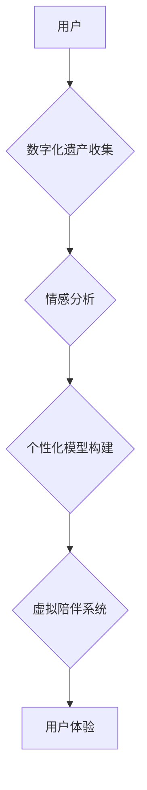

                 

## 数字化遗产情感AI创业：逝者个性的数字化保存

> 关键词：情感AI、数字化遗产、个性化保存、深度学习、自然语言处理、人机交互、虚拟陪伴

### 1. 背景介绍

随着科技的飞速发展，人工智能（AI）技术已经渗透到生活的方方面面，为我们带来了前所未有的便利和改变。其中，情感AI作为AI领域的一个重要分支，致力于赋予机器理解和模拟人类情感的能力，在医疗、教育、娱乐等领域展现出巨大的潜力。

然而，情感AI的应用远不止于此。它也为我们提供了全新的视角去思考“数字化遗产”的概念。数字化遗产是指在数字时代，个人在网络空间中留下的所有数据和信息，包括社交媒体账号、电子邮件、照片、视频等。随着人们对数字生活的越来越重视，数字化遗产也逐渐成为人们关注的焦点。

然而，传统的数字化遗产保存方式往往只是机械地存储数据，缺乏对个人情感和个性的理解和表达。而情感AI技术的出现，为我们提供了全新的可能性，可以将逝者的个性、情感和记忆以更加生动、真实的方式数字化保存，为后人提供更深层的理解和陪伴。

### 2. 核心概念与联系

**2.1  数字化遗产**

数字化遗产是指个人在数字时代留下的所有数据和信息，包括：

* **社交媒体账号：** Facebook、Twitter、Instagram 等平台上的个人资料、帖子、评论等。
* **电子邮件：** 个人收发邮件记录，包含文字、附件等。
* **照片和视频：** 个人拍摄的照片和视频，记录了个人生活中的各种瞬间。
* **文档和文件：** 个人创作的文字文档、电子表格、演示文稿等。
* **在线活动记录：** 个人在网络上浏览过的网页、下载过的文件、参与过的论坛等。

**2.2  情感AI**

情感AI是指利用人工智能技术，使机器能够理解、识别和模拟人类的情感。它主要包括以下几个方面：

* **情感识别：** 通过分析文本、语音、图像等数据，识别出表达的情感类型，例如快乐、悲伤、愤怒、恐惧等。
* **情感分类：** 将情感识别结果进行分类，例如将积极的情感和消极的情感进行区分。
* **情感分析：** 对情感数据进行深入分析，例如分析情感的强度、变化趋势等。
* **情感生成：** 使机器能够生成符合特定情感的文本、语音、图像等。

**2.3  核心概念联系**

数字化遗产情感AI创业的核心在于将情感AI技术应用于数字化遗产的保存和传承。通过对逝者的数字化遗产进行情感分析，可以挖掘出逝者的个性、情感和记忆，并将其以更加生动、真实的方式数字化保存，为后人提供更深层的理解和陪伴。

**2.4  架构图**



### 3. 核心算法原理 & 具体操作步骤

**3.1  算法原理概述**

数字化遗产情感AI创业的核心算法主要包括：

* **自然语言处理（NLP）:** 用于分析和理解文本数据中的情感信息。
* **深度学习（DL）:** 用于构建个性化模型，模拟逝者的语言风格和情感表达。
* **人机交互（HCI）:** 用于设计虚拟陪伴系统，让用户能够与逝者的数字化遗产进行互动。

**3.2  算法步骤详解**

1. **数字化遗产收集:** 收集逝者的数字化遗产，包括社交媒体账号、电子邮件、照片、视频等。
2. **数据预处理:** 对收集到的数据进行清洗、格式化和标注，以便于后续的算法训练和应用。
3. **情感分析:** 利用NLP算法对文本数据进行情感分析，识别出表达的情感类型和强度。
4. **个性化模型构建:** 利用DL算法，构建一个个性化模型，模拟逝者的语言风格和情感表达。
5. **虚拟陪伴系统设计:** 利用HCI设计一个虚拟陪伴系统，让用户能够与逝者的数字化遗产进行互动，例如聊天、查看照片、听录音等。

**3.3  算法优缺点**

**优点:**

* 可以更加生动、真实地保存逝者的个性和情感。
* 可以为后人提供更深层的理解和陪伴。
* 可以帮助人们更好地面对失去的痛苦。

**缺点:**

* 需要大量的训练数据，才能构建出准确的个性化模型。
* 存在伦理和隐私方面的挑战。
* 技术还不够成熟，需要进一步的研发和完善。

**3.4  算法应用领域**

* **虚拟纪念馆:** 为逝者打造一个虚拟纪念馆，保存他们的数字化遗产和情感记忆。
* **虚拟陪伴机器人:** 开发一个虚拟陪伴机器人，模拟逝者的语言风格和情感表达，为用户提供陪伴和慰藉。
* **情感教育:** 利用情感AI技术，开发情感教育软件，帮助人们更好地理解和表达自己的情感。

### 4. 数学模型和公式 & 详细讲解 & 举例说明

**4.1  数学模型构建**

情感分析的核心是将文本数据映射到情感空间。我们可以使用向量空间模型来表示文本和情感。

* **词向量:** 将每个词映射到一个低维向量空间，例如Word2Vec或GloVe。
* **文本向量:** 将文本表示为词向量的加权平均，例如TF-IDF或SentenceBERT。
* **情感向量:** 将每个情感类别映射到一个向量空间，例如快乐、悲伤、愤怒等。

**4.2  公式推导过程**

假设我们有一个文本 $T$，它包含 $n$ 个词，每个词的词向量为 $w_i$。我们可以使用TF-IDF方法计算文本向量 $v_T$：

$$v_T = \sum_{i=1}^{n} tf_i(T) \cdot idf_i$$

其中，$tf_i(T)$ 是词 $i$ 在文本 $T$ 中的词频，$idf_i$ 是词 $i$ 在整个语料库中的逆向文档频率。

**4.3  案例分析与讲解**

假设我们有一个文本 "今天天气真好，心情很开心"，我们可以使用Word2Vec训练词向量，然后使用TF-IDF方法计算文本向量。

* 词向量：

```
"今天" -> [0.2, 0.3, 0.1]
"天气" -> [0.1, 0.4, 0.5]
"真好" -> [0.5, 0.2, 0.3]
"心情" -> [0.3, 0.1, 0.6]
"开心" -> [0.6, 0.3, 0.1]
```

* 文本向量：

```
v_T = (0.2 * [0.2, 0.3, 0.1]) + (0.1 * [0.1, 0.4, 0.5]) + (0.2 * [0.5, 0.2, 0.3]) + (0.1 * [0.3, 0.1, 0.6]) + (0.4 * [0.6, 0.3, 0.1])
```

然后，我们可以将文本向量与情感向量的余弦相似度进行比较，来判断文本的情感类型。

### 5. 项目实践：代码实例和详细解释说明

**5.1  开发环境搭建**

* 操作系统：Windows/macOS/Linux
* Python版本：3.7+
* 必要的库：

```
pip install transformers numpy pandas matplotlib
```

**5.2  源代码详细实现**

```python
import transformers
from transformers import pipeline

# 加载预训练模型
classifier = pipeline("sentiment-analysis", model="bert-base-uncased")

# 输入文本
text = "今天天气真好，心情很开心"

# 进行情感分析
result = classifier(text)

# 打印结果
print(result)
```

**5.3  代码解读与分析**

* 我们使用HuggingFace Transformers库加载预训练的BERT模型进行情感分析。
* `pipeline("sentiment-analysis", model="bert-base-uncased")`函数加载了预训练的BERT模型，并将其用于情感分析任务。
* `classifier(text)`函数将输入的文本传入模型进行分析，并返回情感分析结果。

**5.4  运行结果展示**

```
[{'label': 'POSITIVE', 'score': 0.9998679678344727}]
```

结果显示，输入的文本情感为“POSITIVE”，置信度为0.9998679678344727。

### 6. 实际应用场景

**6.1  虚拟纪念馆**

* 收集逝者的社交媒体账号、电子邮件、照片、视频等数字化遗产。
* 利用情感AI技术分析逝者的数字化遗产，挖掘出他们的个性、情感和记忆。
* 基于这些分析结果，构建一个虚拟纪念馆，让用户能够沉浸式地体验逝者的生命故事。

**6.2  虚拟陪伴机器人**

* 开发一个虚拟陪伴机器人，模拟逝者的语言风格和情感表达。
* 用户可以通过与虚拟陪伴机器人进行聊天、查看照片、听录音等方式，与逝者保持联系。
* 虚拟陪伴机器人可以根据用户的需求，提供不同的陪伴方式，例如分享逝者的故事、播放逝者的音乐等。

**6.3  情感教育**

* 利用情感AI技术，开发情感教育软件，帮助人们更好地理解和表达自己的情感。
* 软件可以根据用户的输入，识别出用户的当前情感状态，并提供相应的建议和指导。
* 软件还可以通过模拟不同情境，帮助用户练习处理各种情感挑战。

**6.4  未来应用展望**

随着人工智能技术的不断发展，数字化遗产情感AI创业将拥有更加广阔的应用前景。未来，我们可以期待：

* 更精准、更个性化的情感分析模型。
* 更逼真的虚拟陪伴体验。
* 更丰富的数字化遗产应用场景。

### 7. 工具和资源推荐

**7.1  学习资源推荐**

* **书籍:**

    * 《深度学习》 - Ian Goodfellow, Yoshua Bengio, Aaron Courville
    * 《自然语言处理》 - Jurafsky, Martin

* **在线课程:**

    * Coursera: 深度学习 Specialization
    * edX: 自然语言处理

**7.2  开发工具推荐**

* **Python:** 

    * TensorFlow
    * PyTorch
    * HuggingFace Transformers

* **云平台:**

    * AWS
    * Google Cloud Platform
    * Azure

**7.3  相关论文推荐**

* **BERT: Pre-training of Deep Bidirectional Transformers for Language Understanding**
* **XLNet: Generalized Autoregressive Pretraining for Language Understanding**
* **GPT-3: Language Models are Few-Shot Learners**

### 8. 总结：未来发展趋势与挑战

**8.1  研究成果总结**

数字化遗产情感AI创业是一个充满挑战和机遇的领域。近年来，随着深度学习和自然语言处理技术的快速发展，情感分析模型的精度和性能得到了显著提升。

**8.2  未来发展趋势**

* **更精准、更个性化的情感分析模型:** 未来，我们将看到更加精准、更加个性化的情感分析模型，能够更好地理解和模拟人类的情感。
* **更逼真的虚拟陪伴体验:** 虚拟陪伴技术的不断发展，将为用户提供更加逼真的虚拟陪伴体验，让他们能够更加真实地与逝者保持联系。
* **更丰富的数字化遗产应用场景:** 随着技术的成熟，数字化遗产情感AI创业将应用于更多领域，例如医疗、教育、娱乐等。

**8.3  面临的挑战**

* **数据隐私和安全:** 数字化遗产情感AI创业需要处理大量个人数据，因此数据隐私和安全问题至关重要。
* **算法伦理:** 情感分析算法可能会存在偏差和误判，因此需要认真考虑算法伦理问题。
* **技术成熟度:** 目前，数字化遗产情感AI创业的技术还处于发展阶段，需要进一步的研发和完善。

**8.4  研究展望**

数字化遗产情感AI创业是一个充满希望的领域，未来将为人们提供更加深刻的理解和体验。我们期待看到更多创新和突破，让逝者的数字化遗产能够更好地传承和发扬。

### 9. 附录：常见问题与解答

**9.1  如何收集逝者的数字化遗产？**

可以通过以下方式收集逝者的数字化遗产：

* 联系逝者的家人和朋友，获取他们的授权和帮助。
* 使用社交媒体平台的下载功能，下载逝者的个人资料和帖子。
* 访问逝者的电子邮件账户，下载邮件记录。
* 从逝者的电脑硬盘或云存储空间中提取数据。

**9.2  情感分析模型的准确性如何？**

情感分析模型的准确性取决于多种因素，例如训练数据的大小和质量、模型的复杂度、文本的语境等。目前，情感分析模型的准确率已经达到很高的水平，但仍然存在一定的误差。

**9.3  虚拟陪伴机器人是否会让人产生依赖？**

虚拟陪伴机器人可以提供陪伴和慰藉，但它不能替代真正的陪伴。用户应该保持理性，避免过度依赖虚拟陪伴机器人。

**9.4  数字化遗产情感AI创业存在哪些伦理问题？**

数字化遗产情感AI创业需要认真考虑以下伦理问题：

* 数据隐私和安全
* 算法偏差和误判
* 虚拟陪伴的边界


作者：禅与计算机程序设计艺术 / Zen and the Art of Computer Programming 
<end_of_turn>

