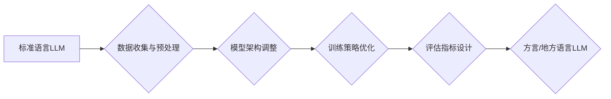

                 

## 方言和地方语言：LLM 的本地化

> 关键词：大型语言模型 (LLM)、本地化、方言、跨语言理解、文化敏感性、自然语言处理 (NLP)、机器翻译

## 1. 背景介绍

大型语言模型 (LLM) 凭借其强大的文本生成、理解和翻译能力，在自然语言处理 (NLP) 领域取得了突破性进展。然而，现有的 LLM 主要基于标准语言训练，对方言和地方语言的支持有限。这导致了在跨语言理解、文化敏感性以及特定地域应用场景中存在显著的局限性。

方言和地方语言是人类语言的多样性体现，蕴含着丰富的文化和历史信息。它们在特定地域扮演着重要的沟通和传承角色，但由于缺乏标准化和数据资源的匮乏，在 LLM 的训练和应用中往往被忽视。

## 2. 核心概念与联系

### 2.1  LLM 本地化

LLM 本地化是指将大型语言模型适配到特定方言或地方语言，使其能够更好地理解和生成该语言的文本。这包括以下几个关键方面：

* **数据收集和预处理:** 收集并预处理足够数量的方言或地方语言文本数据，用于训练和评估 LLM。
* **模型架构调整:** 根据方言或地方语言的特点，对 LLM 的模型架构进行调整，例如增加语言特定的嵌入层或注意力机制。
* **训练策略优化:** 采用针对方言或地方语言的训练策略，例如使用迁移学习或多语言预训练。
* **评估指标设计:** 设计针对方言或地方语言的评估指标，例如准确率、BLEU 分数和文化敏感性评估。

### 2.2  跨语言理解

跨语言理解是指机器能够理解不同语言的文本，并进行信息提取、翻译和对话等任务。LLM 本地化对于跨语言理解至关重要，因为它可以帮助 LLM 更好地理解方言和地方语言，从而实现更准确和自然的跨语言交互。

### 2.3  文化敏感性

文化敏感性是指机器能够理解和尊重不同文化背景下的语言和习俗。LLM 本地化可以提高 LLM 的文化敏感性，因为它可以学习到方言和地方语言中蕴含的文化信息，从而避免产生文化误解或冒犯。

**Mermaid 流程图**



## 3. 核心算法原理 & 具体操作步骤

### 3.1  算法原理概述

LLM 本地化的核心算法原理基于深度学习，特别是 Transformer 架构。Transformer 模型通过自注意力机制能够捕捉文本序列中的长距离依赖关系，并学习到语言的语法和语义特征。

在本地化过程中，会对 Transformer 模型进行以下调整：

* **增加语言特定的嵌入层:** 将方言或地方语言的词语映射到低维向量空间，并学习到语言特定的词义表示。
* **调整注意力机制:** 针对方言或地方语言的特点，调整注意力机制的参数，例如增加对特定语法结构的关注。
* **使用迁移学习:** 利用预训练好的标准语言 LLM 模型作为基础，通过微调的方式适配方言或地方语言。

### 3.2  算法步骤详解

1. **数据收集和预处理:** 收集方言或地方语言的文本数据，并进行清洗、标注和格式化处理。
2. **模型选择:** 选择合适的 Transformer 模型架构，例如 BERT、GPT 或 T5。
3. **语言特定的嵌入层:** 设计和训练语言特定的词嵌入层，例如使用 FastText 或 Word2Vec。
4. **模型微调:** 利用预训练好的标准语言 LLM 模型作为基础，使用方言或地方语言的文本数据对模型进行微调。
5. **评估和优化:** 使用针对方言或地方语言的评估指标，评估模型的性能，并根据评估结果对模型参数进行调整。

### 3.3  算法优缺点

**优点:**

* 能够提高 LLM 对方言和地方语言的理解能力。
* 可以更好地捕捉方言和地方语言的文化信息。
* 能够实现更准确和自然的跨语言交互。

**缺点:**

* 需要大量的方言或地方语言数据进行训练。
* 模型训练和部署成本较高。
* 由于方言和地方语言的多样性，需要针对不同的语言进行单独的本地化。

### 3.4  算法应用领域

* **机器翻译:** 将方言或地方语言文本翻译成标准语言或其他方言。
* **语音识别:** 将方言或地方语言的语音识别成文本。
* **聊天机器人:** 开发能够理解和响应方言或地方语言的聊天机器人。
* **教育:** 提供方言或地方语言的学习资源和工具。
* **文化遗产保护:** 将方言或地方语言的文本和音频资料进行数字化保存和传播。

## 4. 数学模型和公式 & 详细讲解 & 举例说明

### 4.1  数学模型构建

LLM 本地化的数学模型主要基于 Transformer 架构，其核心是自注意力机制。

**自注意力机制**

自注意力机制能够捕捉文本序列中的长距离依赖关系，并学习到语言的语法和语义特征。其计算公式如下：

$$
Attention(Q, K, V) = softmax(\frac{QK^T}{\sqrt{d_k}})V
$$

其中：

* $Q$：查询矩阵
* $K$：键矩阵
* $V$：值矩阵
* $d_k$：键向量的维度
* $softmax$：softmax 函数

**举例说明:**

假设我们有一个句子 "我爱吃苹果"，其词语表示为 $Q$, $K$, $V$ 矩阵。通过自注意力机制，模型可以学习到 "我" 和 "爱" 之间的依赖关系，以及 "吃" 和 "苹果" 之间的依赖关系。

### 4.2  公式推导过程

自注意力机制的计算过程可以分为以下几个步骤：

1. **计算查询值 (Query Value):** 将输入序列中的每个词语映射到查询值和键值向量。
2. **计算注意力权重:** 使用查询值和键值向量计算注意力权重，表示每个词语对其他词语的关注程度。
3. **加权求和:** 使用注意力权重对值向量进行加权求和，得到每个词语的上下文表示。

### 4.3  案例分析与讲解

在 LLM 本地化中，可以使用自注意力机制来捕捉方言或地方语言的特定语法结构和语义特征。例如，一些方言或地方语言可能使用不同的语法结构来表达时间或地点信息，自注意力机制可以帮助模型学习到这些差异。

## 5. 项目实践：代码实例和详细解释说明

### 5.1  开发环境搭建

* **操作系统:** Ubuntu 20.04
* **编程语言:** Python 3.8
* **深度学习框架:** PyTorch 1.8
* **其他依赖库:** transformers, datasets, tokenizers

### 5.2  源代码详细实现

```python
from transformers import AutoModelForSequenceClassification, AutoTokenizer

# 加载预训练模型和词表
model_name = "bert-base-uncased"
tokenizer = AutoTokenizer.from_pretrained(model_name)
model = AutoModelForSequenceClassification.from_pretrained(model_name)

# 定义输入文本
text = "我爱吃苹果"

# 对文本进行token化
inputs = tokenizer(text, return_tensors="pt")

# 将输入文本送入模型进行预测
outputs = model(**inputs)

# 获取预测结果
predictions = outputs.logits.argmax(-1)

# 打印预测结果
print(predictions)
```

### 5.3  代码解读与分析

* 该代码示例使用 Hugging Face 的 Transformers 库加载预训练的 BERT 模型和词表。
* `tokenizer` 用于将输入文本转换为模型可理解的 token 格式。
* `model` 用于对 token 化后的文本进行预测。
* `outputs.logits.argmax(-1)` 获取模型预测的类别标签。

### 5.4  运行结果展示

运行该代码示例，输出结果为模型预测的类别标签。

## 6. 实际应用场景

### 6.1  机器翻译

LLM 本地化可以用于将方言或地方语言文本翻译成标准语言或其他方言。例如，可以开发一个将粤语翻译成普通话的机器翻译系统，帮助粤语使用者更好地进行跨地域交流。

### 6.2  语音识别

LLM 本地化可以提高语音识别系统的准确率，使其能够更好地识别方言或地方语言的语音。例如，可以开发一个能够识别四川方言的语音识别系统，用于语音助手或智能家居设备。

### 6.3  聊天机器人

LLM 本地化可以使聊天机器人能够理解和响应方言或地方语言的对话。例如，可以开发一个能够与用户进行四川方言对话的聊天机器人，为用户提供更个性化的服务。

### 6.4  未来应用展望

随着 LLM 本地化技术的不断发展，其应用场景将更加广泛，例如：

* **文化遗产保护:** 将方言或地方语言的文本和音频资料进行数字化保存和传播。
* **教育:** 提供方言或地方语言的学习资源和工具。
* **医疗保健:** 开发能够理解患者方言或地方语言的医疗诊断系统。

## 7. 工具和资源推荐

### 7.1  学习资源推荐

* **论文:**
    * Devlin, J., Chang, M. W., Lee, K., & Toutanova, K. (2018). Bert: Pre-training of deep bidirectional transformers for language understanding. arXiv preprint arXiv:1810.04805.
    * Vaswani, A., Shazeer, N., Parmar, N., Uszkoreit, J., Jones, L., Gomez, A. N., ... & Polosukhin, I. (2017). Attention is all you need. In Advances in neural information processing systems (pp. 5998-6008).
* **书籍:**
    * Speech and Language Processing by Jurafsky and Martin
    * Deep Learning by Goodfellow, Bengio, and Courville

### 7.2  开发工具推荐

* **Hugging Face Transformers:** https://huggingface.co/transformers/
* **PyTorch:** https://pytorch.org/
* **TensorFlow:** https://www.tensorflow.org/

### 7.3  相关论文推荐

* **Multilingual BERT:** https://arxiv.org/abs/1901.07291
* **XLM-RoBERTa:** https://arxiv.org/abs/1908.09105
* **MarianMT:** https://marian-nmt.github.io/

## 8. 总结：未来发展趋势与挑战

### 8.1  研究成果总结

LLM 本地化取得了显著的进展，能够提高 LLM 对方言和地方语言的理解能力，并应用于机器翻译、语音识别、聊天机器人等领域。

### 8.2  未来发展趋势

* **更强大的模型架构:** 开发更强大的 Transformer 模型架构，能够更好地捕捉方言和地方语言的复杂语法和语义特征。
* **更丰富的训练数据:** 收集和构建更丰富的方言和地方语言文本数据，用于训练和评估 LLM 本地化模型。
* **跨语言理解的提升:** 将 LLM 本地化与跨语言理解技术结合，实现更准确和自然的跨语言交互。
* **文化敏感性增强:** 开发能够更好地理解和尊重不同文化背景下的语言和习俗的 LLM 本地化模型。

### 8.3  面临的挑战

* **数据稀缺性:** 方言和地方语言的数据资源相对稀缺，这限制了模型的训练和性能提升。
* **语言多样性:** 世界上存在着大量的方言和地方语言，每个语言都有其独特的语法和语义特征，这使得 LLM 本地化面临着巨大的挑战。
* **文化差异:** 不同文化背景下的语言和习俗存在差异，这需要 LLM 本地化模型能够理解和尊重这些差异。

### 8.4  研究展望

未来，LLM 本地化研究将继续朝着更强大、更智能、更文化敏感的方向发展，为人类语言的多样性提供更有效的理解和服务。

## 9. 附录：常见问题与解答

### 9.1  Q: 如何评估 LLM 本地化的效果？

**A:** 评估 LLM 本地化效果可以使用针对方言或地方语言的评估指标，例如准确率、BLEU 分数和文化敏感性评估。

### 9.2  Q: 如何解决数据稀缺性问题？

**A:** 可以采用迁移学习、数据增强和跨语言预训练等技术来解决数据稀缺性问题。

### 9.3  Q: 如何提高 LLM 对文化敏感性的理解？

**A:** 可以通过在训练数据中加入文化信息、使用文化敏感性的评估指标以及与文化专家合作来提高 LLM 对文化敏感性的理解。


作者：禅与计算机程序设计艺术 / Zen and the Art of Computer Programming<end_of_turn>

