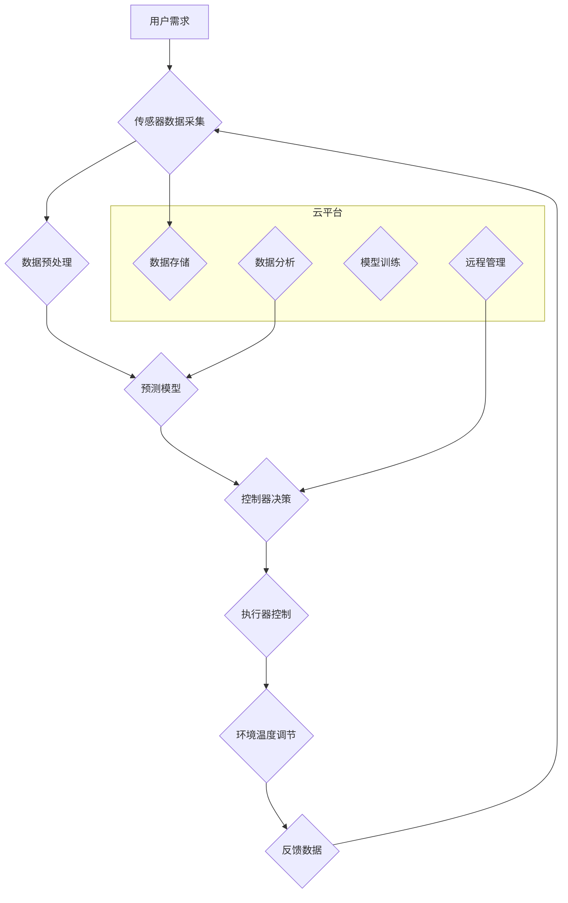

                 

## 智能家居温控创业：精准舒适的居住环境

> 关键词：智能家居、温控系统、机器学习、预测模型、算法优化、用户体验、物联网、数据分析

### 1. 背景介绍

随着科技的飞速发展，智能家居已成为现代生活的重要趋势。其中，智能温控系统作为智能家居的核心应用之一，凭借其能够精准控制室内温度，提升居住舒适度和节能环保的优势，备受关注。

智能温控系统能够根据用户的需求和环境变化，自动调节室内温度，实现个性化、智能化的温度控制。它不仅可以提升居住体验，还能有效降低能源消耗，为用户带来经济效益。

然而，智能温控系统的开发和应用也面临着诸多挑战：

* **数据获取和处理:** 需要收集丰富的环境数据，如温度、湿度、光照等，并进行有效处理和分析。
* **模型预测精度:** 需要建立准确的预测模型，预测用户的温度需求和环境变化趋势。
* **算法优化:** 需要不断优化算法，提高系统响应速度和控制精度。
* **用户体验设计:** 需要设计简洁易用的用户界面，方便用户操作和管理。
* **安全性和隐私保护:** 需要确保系统安全可靠，保护用户的隐私信息。

### 2. 核心概念与联系

智能家居温控系统主要由以下几个核心模块组成：

* **传感器:** 用于采集室内温度、湿度、光照等环境数据。
* **控制器:**  负责接收传感器数据，分析数据，并根据预设规则或预测模型控制温控设备。
* **执行器:**  如电加热器、空调等，根据控制器指令进行温度调节。
* **网络通信模块:**  用于连接控制器和用户设备，实现远程控制和数据传输。
* **云平台:**  用于数据存储、分析和模型训练，提供远程管理和个性化服务。

**核心概念原理和架构的 Mermaid 流程图:**



### 3. 核心算法原理 & 具体操作步骤

#### 3.1  算法原理概述

智能家居温控系统中常用的算法包括：

* **时间序列预测算法:**  用于预测未来温度需求，例如ARIMA、LSTM等。
* **机器学习算法:**  用于学习用户的温度偏好和环境变化规律，例如回归算法、分类算法等。
* **优化算法:**  用于优化控制策略，例如梯度下降法、遗传算法等。

#### 3.2  算法步骤详解

以时间序列预测算法为例，其具体操作步骤如下：

1. **数据收集:** 收集历史温度数据、时间戳、用户行为等相关信息。
2. **数据预处理:** 对数据进行清洗、缺失值处理、特征工程等操作，使其适合模型训练。
3. **模型选择:** 根据数据特点和预测需求选择合适的预测模型，例如ARIMA、LSTM等。
4. **模型训练:** 使用训练数据训练模型，并进行参数调优。
5. **模型评估:** 使用测试数据评估模型的预测精度，并进行模型选择和优化。
6. **预测部署:** 将训练好的模型部署到控制器中，用于实时预测未来温度需求。

#### 3.3  算法优缺点

**时间序列预测算法:**

* **优点:**  能够有效预测未来温度趋势，适应环境变化。
* **缺点:**  对历史数据依赖性强，难以应对突发事件。

**机器学习算法:**

* **优点:**  能够学习用户的个性化需求，提供更精准的控制。
* **缺点:**  需要大量训练数据，训练时间较长。

#### 3.4  算法应用领域

智能家居温控系统中的算法广泛应用于：

* **温度预测:**  预测未来室内温度，提前调节空调或加热器。
* **用户行为分析:**  分析用户的温度偏好和生活习惯，提供个性化控制方案。
* **节能优化:**  根据用户需求和环境变化，优化温控策略，降低能源消耗。
* **故障诊断:**  识别温控系统故障，及时进行维护和修复。

### 4. 数学模型和公式 & 详细讲解 & 举例说明

#### 4.1  数学模型构建

智能家居温控系统中常用的数学模型包括：

* **温度变化模型:**  描述室内温度随时间变化的规律，例如：

$$
T(t) = T_0 + \Delta T \cdot \sin(\omega t + \phi)
$$

其中：

* $T(t)$:  室内温度
* $T_0$:  初始温度
* $\Delta T$:  温度波动幅度
* $\omega$:  角频率
* $\phi$:  相位角

* **用户需求模型:**  描述用户的温度偏好和行为模式，例如：

$$
T_{req} = f(T_{amb}, T_{pref}, H, L)
$$

其中：

* $T_{req}$:  用户需求温度
* $T_{amb}$:  环境温度
* $T_{pref}$:  用户偏好温度
* $H$:  用户活动强度
* $L$:  用户舒适度

#### 4.2  公式推导过程

温度变化模型的推导过程基于以下假设：

* 室内温度变化呈周期性规律。
* 温度波动幅度和周期性受环境因素影响。

根据这些假设，可以建立温度变化的微分方程，并通过解微分方程得到温度变化模型。

#### 4.3  案例分析与讲解

假设室内初始温度为25℃，温度波动幅度为2℃，周期为24小时，则温度变化模型为：

$$
T(t) = 25 + 2 \cdot \sin(\frac{2\pi}{24}t + \phi)
$$

其中，$\phi$ 为相位角，取决于环境因素和初始条件。

通过分析历史温度数据，可以估计$\phi$的值，并得到更准确的温度变化模型。

### 5. 项目实践：代码实例和详细解释说明

#### 5.1  开发环境搭建

智能家居温控系统开发环境通常包括：

* **硬件平台:**  如Raspberry Pi、Arduino等，用于控制温控设备。
* **软件平台:**  如Python、C++等，用于开发控制逻辑和数据处理算法。
* **云平台:**  如AWS、Azure等，用于数据存储、分析和模型训练。

#### 5.2  源代码详细实现

以下是一个使用Python语言实现的简单温控系统代码示例：

```python
import time
import RPi.GPIO as GPIO

# 设置GPIO引脚
GPIO.setmode(GPIO.BCM)
heater_pin = 18

# 设置温度阈值
target_temp = 22
current_temp = 0

# 初始化传感器
# ...

while True:
    # 读取传感器数据
    current_temp = read_sensor()

    # 控制加热器
    if current_temp < target_temp:
        GPIO.output(heater_pin, GPIO.HIGH)
    else:
        GPIO.output(heater_pin, GPIO.LOW)

    # 打印当前温度
    print("Current temperature:", current_temp)

    # 延时
    time.sleep(1)
```

#### 5.3  代码解读与分析

该代码示例实现了简单的温控逻辑：

* 设置GPIO引脚，控制加热器。
* 读取传感器数据，获取当前温度。
* 根据目标温度和当前温度，控制加热器开关。
* 打印当前温度，方便监控。

#### 5.4  运行结果展示

当环境温度低于目标温度时，加热器将开启，直到环境温度达到目标温度。

### 6. 实际应用场景

智能家居温控系统已广泛应用于：

* **住宅:**  为家庭用户提供舒适、节能的居住环境。
* **办公楼:**  调节办公环境温度，提高员工工作效率。
* **酒店:**  提供个性化温度控制服务，提升入住体验。
* **工业厂房:**  控制生产环境温度，保障生产安全和效率。

#### 6.4  未来应用展望

未来，智能家居温控系统将更加智能化、个性化和高效化：

* **更精准的预测:**  利用更先进的机器学习算法，实现更精准的温度预测。
* **更个性化的控制:**  根据用户的行为模式和喜好，提供更个性化的温度控制方案。
* **更智能的交互:**  支持语音控制、远程控制等多种交互方式，提升用户体验。
* **更强大的功能:**  集成其他智能家居设备，实现更全面的家居自动化控制。

### 7. 工具和资源推荐

#### 7.1  学习资源推荐

* **书籍:**  《智能家居系统设计与实现》、《物联网技术与应用》
* **在线课程:**  Coursera、edX等平台上的物联网、机器学习课程
* **技术博客:**  IEEE Spectrum、TechCrunch等科技博客

#### 7.2  开发工具推荐

* **硬件平台:**  Raspberry Pi、Arduino、ESP32等
* **软件平台:**  Python、C++、Node.js等
* **云平台:**  AWS、Azure、Alibaba Cloud等

#### 7.3  相关论文推荐

* **时间序列预测:**  ARIMA模型、LSTM模型
* **机器学习:**  回归算法、分类算法
* **智能家居:**  智能家居系统架构、智能家居应用场景

### 8. 总结：未来发展趋势与挑战

#### 8.1  研究成果总结

智能家居温控系统已取得了显著的成果，能够有效提升居住舒适度和节能环保效果。

#### 8.2  未来发展趋势

未来，智能家居温控系统将朝着更智能化、个性化和高效化的方向发展。

#### 8.3  面临的挑战

智能家居温控系统还面临着一些挑战：

* **数据安全:**  保护用户隐私信息，防止数据泄露。
* **系统可靠性:**  确保系统稳定运行，避免故障影响用户体验。
* **成本控制:**  降低系统成本，使其更易于普及。

#### 8.4  研究展望

未来，需要进一步研究以下方面：

* **更精准的预测模型:**  开发更先进的机器学习算法，实现更精准的温度预测。
* **更个性化的控制方案:**  根据用户的行为模式和喜好，提供更个性化的温度控制方案。
* **更安全的系统架构:**  设计更安全的系统架构，保障用户隐私信息和系统稳定性。

### 9. 附录：常见问题与解答

* **Q1:  智能家居温控系统如何连接到互联网？**

* **A1:**  智能家居温控系统通常通过Wi-Fi、蓝牙或其他无线网络协议连接到互联网。

* **Q2:  智能家居温控系统如何保证安全可靠？**

* **A2:**  智能家居温控系统需要采用安全的通信协议和数据加密技术，并进行定期安全测试，确保系统安全可靠。

* **Q3:  智能家居温控系统如何保护用户隐私信息？**

* **A3:**  智能家居温控系统需要遵守相关隐私保护法规，并采取措施保护用户隐私信息，例如数据匿名化、数据加密等。


作者：禅与计算机程序设计艺术 / Zen and the Art of Computer Programming 
<end_of_turn>

