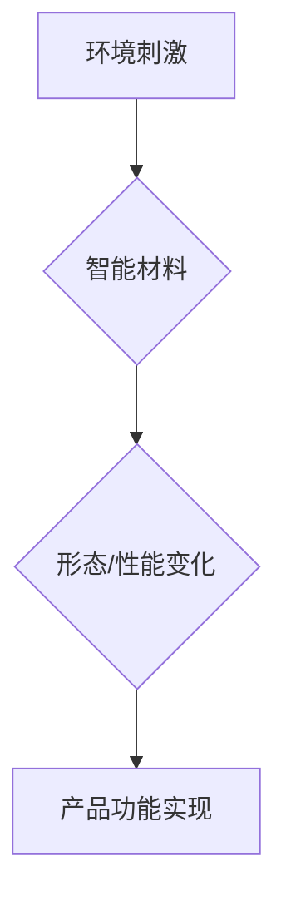

                 

## 智能材料创业：革新产品设计的新材料

> 关键词：智能材料、自适应材料、形状记忆合金、拓扑优化、3D打印、产品设计、创业

### 1. 背景介绍

近年来，智能材料领域取得了长足的进步，其独特的响应环境刺激、自适应变化和智能功能，为产品设计带来了前所未有的可能性。智能材料不再仅仅局限于学术研究，而是逐渐走向商业化应用，为创业者提供了广阔的市场空间。

传统材料的局限性越来越明显，它们往往缺乏灵活性、适应性以及响应环境变化的能力。而智能材料则能够根据外界温度、压力、光照等刺激发生形态、性能或结构的变化，从而实现自适应、自修复、智能控制等功能。

智能材料的应用领域非常广泛，涵盖航空航天、医疗保健、电子消费品、建筑结构等多个领域。例如，形状记忆合金可用于制造可折叠的手机、自适应的医疗器械；拓扑优化材料可用于设计更轻、更坚固的飞机部件；智能涂料可根据环境温度自动调节颜色，实现节能降耗。

### 2. 核心概念与联系

**2.1 智能材料的定义**

智能材料是指能够感知外界环境变化并做出相应反应，从而改变自身性能或形态的材料。这些材料通常具有以下特性：

* **响应性:** 对环境刺激（如温度、压力、光照、电磁场等）具有敏感性，能够感知并响应这些刺激。
* **可变性:** 能够根据环境刺激发生形态、结构、性能或化学成分的变化。
* **自适应性:**  能够根据环境变化自动调整自身状态，以达到最佳性能或功能。

**2.2 智能材料的分类**

智能材料可以根据其响应机制和功能特性进行分类，主要包括：

* **形状记忆合金:**  能够在特定温度下恢复到预先设定的形状，常用于制造可折叠的结构、医疗器械等。
* **压电材料:**  能够在施加机械压力时产生电荷，反之亦然，常用于传感器、振动电机等。
* **磁致伸缩材料:**  能够在磁场作用下发生长度变化，常用于微型执行器、传感器等。
* **光致变色材料:**  能够在光照作用下改变颜色，常用于智能窗、显示器等。
* **自修复材料:**  能够自我修复损伤，常用于涂料、结构材料等。

**2.3 智能材料与产品设计的联系**

智能材料为产品设计带来了革命性的改变，使其能够更加智能化、个性化、高效化。

* **功能增强:** 智能材料可以赋予产品新的功能，例如自适应调节温度、形状变化、自动修复等。
* **性能提升:** 智能材料可以提高产品的性能，例如强度、耐磨性、导电性等。
* **设计自由度提升:** 智能材料可以打破传统材料的局限性，为设计师提供更多的设计自由度，创造出更加创新、独特的产品。

**2.4 智能材料创业的机遇**

智能材料的应用前景广阔，为创业者提供了巨大的机遇。

* **市场需求旺盛:** 智能材料的应用领域不断扩展，市场需求持续增长。
* **技术壁垒高:** 智能材料的研发和应用需要高深的专业知识和技术，具有较高的技术壁垒。
* **投资热度高:** 智能材料领域吸引了大量的投资，为创业公司提供了充足的资金支持。

**2.5 Mermaid 流程图**



### 3. 核心算法原理 & 具体操作步骤

**3.1 算法原理概述**

智能材料的性能和功能通常由其内部结构和化学成分决定。通过对材料的结构和成分进行精确控制，可以调控其响应环境刺激的能力和性能表现。

常见的智能材料算法包括：

* **拓扑优化算法:** 通过计算和模拟，设计出具有特定性能的材料结构，例如轻量化、高强度、自适应等。
* **形状记忆合金设计算法:** 通过控制合金的成分和热处理工艺，实现形状记忆效应，并设计出具有特定形状记忆功能的材料。
* **自修复材料合成算法:** 通过设计特殊的化学反应体系，使材料能够自我修复损伤，并控制修复速度和效果。

**3.2 算法步骤详解**

以拓扑优化算法为例，其具体步骤如下：

1. **定义目标函数:**  根据产品的性能需求，定义一个目标函数，例如最小化材料重量、最大化强度等。
2. **建立有限元模型:**  建立材料的有限元模型，模拟其在不同载荷条件下的变形和应力分布。
3. **优化算法迭代:**  使用优化算法，例如遗传算法、模拟退火算法等，迭代地调整材料的结构参数，以最小化目标函数值。
4. **验证优化结果:**  对优化后的材料结构进行验证，确保其能够满足产品的性能需求。

**3.3 算法优缺点**

**优点:**

* 可以设计出具有优异性能的材料结构。
* 可以有效地降低材料的重量和成本。
* 可以实现材料的个性化设计。

**缺点:**

* 计算量较大，需要强大的计算能力。
* 需要对材料的物理特性和行为有深入的了解。
* 优化结果的可靠性取决于优化算法的选取和参数设置。

**3.4 算法应用领域**

拓扑优化算法广泛应用于航空航天、汽车、建筑等领域，用于设计轻量化、高强度、自适应的材料结构。

### 4. 数学模型和公式 & 详细讲解 & 举例说明

**4.1 数学模型构建**

智能材料的性能和行为可以用数学模型来描述。例如，形状记忆合金的形状记忆效应可以用以下数学模型来描述：

$$
\sigma = E \epsilon + \alpha T
$$

其中：

* $\sigma$ 是应力
* $E$ 是弹性模量
* $\epsilon$ 是应变
* $\alpha$ 是热膨胀系数
* $T$ 是温度

**4.2 公式推导过程**

该公式的推导过程基于材料力学和热力学原理。

* 材料力学原理：应力与应变之间存在线性关系，即 Hooke 定律。
* 热力学原理：材料的热膨胀系数决定了材料在温度变化时体积变化的程度。

**4.3 案例分析与讲解**

假设一个形状记忆合金材料，其弹性模量为 70 GPa，热膨胀系数为 17 x 10^-6 /℃。当温度从 20℃升到 80℃时，该材料的长度会发生变化。

根据公式，我们可以计算出材料在不同温度下的应力变化：

* 当温度为 20℃时，应力为 0。
* 当温度为 80℃时，应力为 70 GPa x 17 x 10^-6 /℃ x 60℃ = 7.14 MPa。

### 5. 项目实践：代码实例和详细解释说明

**5.1 开发环境搭建**

智能材料开发通常需要使用以下工具和软件：

* **编程语言:** Python, C++, MATLAB 等
* **数值计算库:** NumPy, SciPy, Eigen 等
* **有限元分析软件:** ANSYS, Abaqus, COMSOL 等
* **3D 打印软件:** Cura, Simplify3D 等

**5.2 源代码详细实现**

以下是一个使用 Python 和 NumPy 库实现拓扑优化算法的简单代码示例：

```python
import numpy as np

# 定义材料的弹性模量和密度
E = 70e9  # Pa
rho = 2700  # kg/m^3

# 定义目标函数: 最小化材料的总质量
def objective_function(design):
    volume = np.sum(design)
    return volume

# 定义约束条件: 材料应力不能超过最大允许值
def constraint_function(design, stress):
    max_stress = 100e6  # Pa
    return np.max(stress) <= max_stress

# 使用遗传算法优化设计
# ...

# 输出优化后的设计结果
```

**5.3 代码解读与分析**

该代码示例定义了目标函数和约束条件，并使用遗传算法进行优化。目标函数旨在最小化材料的总质量，约束条件则限制了材料的应力值。

**5.4 运行结果展示**

优化后的设计结果可以以图形形式展示，例如三维模型或应力分布图。

### 6. 实际应用场景

**6.1 智能材料在航空航天领域的应用**

* **轻量化结构:**  智能材料可以用于制造轻量化飞机部件，例如机翼、机身、尾翼等，从而降低飞机的重量，提高燃油效率。
* **自适应控制:** 智能材料可以用于制造自适应控制表面，例如襟翼、升降舵等，根据飞行条件自动调整角度，提高飞机的操控性能。
* **主动减振:** 智能材料可以用于制造主动减振系统，吸收和消除飞机振动，提高乘客舒适度。

**6.2 智能材料在医疗保健领域的应用**

* **可植入医疗器械:**  智能材料可以用于制造可植入医疗器械，例如人工关节、心脏支架等，具有生物相容性、自适应性和自修复性。
* **智能药物输送系统:** 智能材料可以用于制造智能药物输送系统，根据患者的生理状态自动释放药物，提高治疗效果。
* **仿生机器人:** 智能材料可以用于制造仿生机器人，例如用于手术辅助、康复训练等。

**6.3 智能材料在电子消费品领域的应用**

* **柔性电子设备:** 智能材料可以用于制造柔性电子设备，例如可弯曲的手机屏幕、可穿戴设备等。
* **自适应显示器:** 智能材料可以用于制造自适应显示器，根据环境光线自动调节亮度和色彩，提高视觉效果。
* **智能传感器:** 智能材料可以用于制造智能传感器，例如压力传感器、温度传感器等，具有高灵敏度和响应速度。

**6.4 未来应用展望**

智能材料的应用前景广阔，未来将有更多创新应用场景出现，例如：

* **智能建筑:** 智能材料可以用于制造自适应调节温度、光照和通风的新型建筑材料。
* **智能交通:** 智能材料可以用于制造自适应路面、智能交通信号灯等，提高交通效率和安全性。
* **智能能源:** 智能材料可以用于制造高效的太阳能电池、储能电池等，促进清洁能源发展。

### 7. 工具和资源推荐

**7.1 学习资源推荐**

* **书籍:**

    * 智能材料 (Smart Materials) -  by Leo P. Lee
    * 智能材料与结构 (Smart Materials and Structures) - by K.K. Chawla
    * 形状记忆合金 (Shape Memory Alloys) - by A.M. Sastry

* **在线课程:**

    * Coursera: Smart Materials and Structures
    * edX: Introduction to Smart Materials

**7.2 开发工具推荐**

* **有限元分析软件:** ANSYS, Abaqus, COMSOL
* **编程语言:** Python, C++, MATLAB
* **数值计算库:** NumPy, SciPy, Eigen

**7.3 相关论文推荐**

* **拓扑优化算法:**

    * Topology Optimization for Lightweight Design - by Sigmund, O.

* **形状记忆合金:**

    * Shape Memory Alloys: Fundamentals and Applications - by Miyazaki, S.

* **自修复材料:**

    * Self-Healing Materials: A Review - by White, S.R.

### 8. 总结：未来发展趋势与挑战

**8.1 研究成果总结**

近年来，智能材料领域取得了长足的进步，在材料设计、合成、性能表征、应用开发等方面取得了重要成果。

* **材料设计:**  拓扑优化算法、机器学习等方法为智能材料的设计提供了新的思路和工具。
* **材料合成:**  新型智能材料的合成方法不断涌现，例如3D打印、自组装等。
* **性能表征:**  新的测试方法和仪器为智能材料的性能表征提供了更精确和全面的手段。
* **应用开发:** 智能材料的应用领域不断扩展，从航空航天、医疗保健到电子消费品等多个领域都有了突破性进展。

**8.2 未来发展趋势**

* **多功能智能材料:**  开发具有多种功能的智能材料，例如同时具备形状记忆效应、压电效应、自修复效应等。
* **生物智能材料:**  开发与生物组织相容的智能材料，用于生物医学应用。
* **可编程智能材料:**  开发能够根据外部刺激或指令进行编程调整性能的智能材料。
* **智能材料的集成化:** 将智能材料与其他技术，例如传感器、微处理器、网络等进行集成，开发更加智能化、复杂化的系统。

**8.3 面临的挑战**

* **材料性能的提升:**  开发具有更高性能、更稳定、更可靠的智能材料。
* **制造成本的降低:**  降低智能材料的制造成本，使其更具市场竞争力。
* **应用领域的拓展:**  探索更多智能材料的应用领域，将其应用于更广泛的领域。
* **安全性与可靠性的保证:**  确保智能材料在实际应用中具有足够的安全性、可靠性和耐久性。

**8.4 研究展望**

智能材料领域充满了机遇和挑战，未来将会有更多创新成果涌现，为人类社会带来更加智能、便捷、舒适的生活。


### 9. 附录：常见问题与解答

**9.1 什么是智能材料？**

智能材料是指能够感知外界环境变化并做出相应反应，从而改变自身性能或形态的材料。

**9.2 智能材料有哪些类型？**

常见的智能材料类型包括形状记忆合金、压电材料、磁致伸缩材料、光致变色材料、自修复材料等。

**9.3 智能材料的应用领域有哪些？**

智能材料的应用领域非常广泛，涵盖航空航天、医疗保健、电子消费品、建筑结构等多个领域。

**9.4 智能材料的未来发展趋势是什么？**

未来智能材料的发展趋势包括多功能化、生物化、可编程化、集成化等。

**9.5 智能材料有哪些挑战？**

智能材料面临的挑战包括材料性能的提升、制造成本的降低、应用领域的拓展、安全性与可靠性的保证等。


作者：禅与计算机程序设计艺术 / Zen and the Art of Computer Programming 
<end_of_turn>

