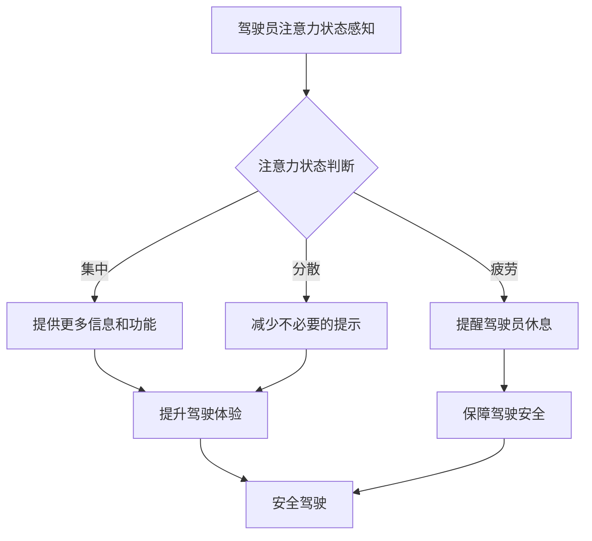

                 

## 智能汽车中控系统的注意力管理

> 关键词：智能汽车、中控系统、注意力管理、用户体验、人机交互、深度学习、计算机视觉

## 1. 背景介绍

智能汽车正以惊人的速度发展，其中控系统作为驾驶员与车辆之间交互的核心，承担着越来越重要的角色。然而，随着功能的不断丰富，中控系统也面临着越来越多的挑战，其中之一便是如何有效地管理驾驶员的注意力。

传统汽车中控系统通常以物理按钮和旋钮为主，操作相对简单直观。但智能汽车中控系统则更加复杂，集成了一系列功能，例如导航、娱乐、语音助手、车联网等，信息量庞大，操作方式多样。这使得驾驶员在驾驶过程中需要频繁切换注意力，容易造成驾驶疲劳和安全隐患。

注意力管理技术旨在通过感知驾驶员的注意力状态，并根据其状态动态调整中控系统的行为，以确保驾驶员能够专注于驾驶任务。

## 2. 核心概念与联系

### 2.1  注意力管理的核心概念

* **注意力：** 指个体在信息处理过程中，对特定刺激或任务的集中和选择性关注。
* **注意力状态：** 指驾驶员在特定时间段内对驾驶任务的注意力水平，可以分为集中、分散、疲劳等状态。
* **人机交互：** 指人与机器之间的交互过程，包括信息传递、反馈和控制。

### 2.2  注意力管理与智能汽车中控系统的联系

注意力管理技术可以应用于智能汽车中控系统，以提升驾驶员的驾驶体验和安全性。

* **感知驾驶员注意力状态：** 通过计算机视觉、生物信号采集等技术，实时监测驾驶员的生理和行为特征，例如眼动、头部转动、驾驶姿势等，判断其注意力状态。
* **动态调整中控系统行为：** 根据驾驶员的注意力状态，动态调整中控系统的行为，例如：
    * 当驾驶员注意力集中时，可以提供更多信息和功能，例如导航路线规划、车联网信息推送等。
    * 当驾驶员注意力分散时，可以减少不必要的提示和信息，例如关闭不必要的通知、降低音乐音量等。
    * 当驾驶员注意力疲劳时，可以提醒驾驶员休息，并提供安全驾驶建议，例如自动开启巡航模式、调整座椅位置等。

**Mermaid 流程图**



## 3. 核心算法原理 & 具体操作步骤

### 3.1  算法原理概述

注意力管理算法通常基于机器学习和计算机视觉技术，通过训练模型识别驾驶员的注意力状态。常见的算法包括：

* **深度卷积神经网络 (CNN)：** 用于分析驾驶员的面部表情、眼动轨迹等视觉特征，识别注意力状态。
* **循环神经网络 (RNN)：** 用于分析驾驶员的行为序列，例如转向、加速、刹车等，识别注意力状态。
* **支持向量机 (SVM)：** 用于分类驾驶员的注意力状态，根据训练数据学习注意力状态的特征。

### 3.2  算法步骤详解

1. **数据采集：** 收集驾驶员的生理和行为数据，例如眼动、头部转动、驾驶姿势、车辆行驶数据等。
2. **数据预处理：** 对采集到的数据进行清洗、去噪、特征提取等处理，使其适合模型训练。
3. **模型训练：** 选择合适的算法，并使用预处理后的数据进行模型训练，学习驾驶员注意力状态的特征。
4. **模型评估：** 使用测试数据评估模型的性能，例如准确率、召回率、F1-score等。
5. **模型部署：** 将训练好的模型部署到智能汽车中控系统中，实时监测驾驶员的注意力状态。

### 3.3  算法优缺点

**优点：**

* 能够实时监测驾驶员的注意力状态。
* 可以根据驾驶员的注意力状态动态调整中控系统的行为。
* 有助于提升驾驶体验和安全性。

**缺点：**

* 需要大量的训练数据。
* 模型的准确率可能受到环境因素和驾驶员个体差异的影响。
* 算法的复杂性可能导致计算资源消耗较大。

### 3.4  算法应用领域

注意力管理算法不仅可以应用于智能汽车中控系统，还可以应用于其他领域，例如：

* **远程驾驶：** 监测远程驾驶员的注意力状态，确保其能够安全地驾驶车辆。
* **医疗保健：** 监测患者的注意力状态，帮助医生诊断和治疗注意力缺陷障碍等疾病。
* **教育：** 监测学生的注意力状态，帮助老师提高教学效果。

## 4. 数学模型和公式 & 详细讲解 & 举例说明

### 4.1  数学模型构建

注意力管理算法通常使用概率模型来表示驾驶员注意力状态。例如，可以使用贝叶斯网络来建模驾驶员注意力状态与各种特征之间的关系。

**贝叶斯网络**是一种概率图模型，可以表示变量之间的依赖关系。在注意力管理中，可以将驾驶员注意力状态作为目标变量，将眼动、头部转动、驾驶姿势等特征作为输入变量。通过训练贝叶斯网络，可以学习驾驶员注意力状态与特征之间的概率关系。

### 4.2  公式推导过程

贝叶斯网络中的概率关系可以用贝叶斯公式来表示：

$$P(A|B) = \frac{P(B|A)P(A)}{P(B)}$$

其中：

* $P(A|B)$ 是在已知事件 B 发生的情况下，事件 A 发生的概率。
* $P(B|A)$ 是在已知事件 A 发生的情况下，事件 B 发生的概率。
* $P(A)$ 是事件 A 发生的概率。
* $P(B)$ 是事件 B 发生的概率。

在注意力管理中，可以使用贝叶斯公式来计算驾驶员注意力状态的概率，例如：

$$P(\text{注意力集中}|\text{眼动稳定, 头部转动少})$$

### 4.3  案例分析与讲解

假设我们训练了一个贝叶斯网络模型，用于预测驾驶员的注意力状态。模型的输入特征包括眼动、头部转动、驾驶姿势等，输出为驾驶员注意力状态的概率，例如集中、分散、疲劳。

当驾驶员的眼动稳定、头部转动少时，模型会输出注意力集中概率较高，因为这些特征通常与注意力集中状态相关。反之，如果驾驶员的眼动频繁、头部转动剧烈，模型会输出注意力分散或疲劳概率较高。

## 5. 项目实践：代码实例和详细解释说明

### 5.1  开发环境搭建

* 操作系统：Ubuntu 20.04
* Python 版本：3.8
* 深度学习框架：TensorFlow 2.0
* 计算机视觉库：OpenCV

### 5.2  源代码详细实现

```python
# 导入必要的库
import tensorflow as tf
from tensorflow.keras.models import Sequential
from tensorflow.keras.layers import Conv2D, MaxPooling2D, Flatten, Dense

# 定义 CNN 模型
model = Sequential()
model.add(Conv2D(32, (3, 3), activation='relu', input_shape=(64, 64, 3)))
model.add(MaxPooling2D((2, 2)))
model.add(Conv2D(64, (3, 3), activation='relu'))
model.add(MaxPooling2D((2, 2)))
model.add(Flatten())
model.add(Dense(10, activation='softmax'))

# 编译模型
model.compile(optimizer='adam',
              loss='sparse_categorical_crossentropy',
              metrics=['accuracy'])

# 训练模型
model.fit(x_train, y_train, epochs=10)

# 评估模型
loss, accuracy = model.evaluate(x_test, y_test)
print('Loss:', loss)
print('Accuracy:', accuracy)
```

### 5.3  代码解读与分析

* 代码首先导入必要的库，包括 TensorFlow、OpenCV 等。
* 然后定义一个 CNN 模型，包含卷积层、池化层、全连接层等。
* 模型使用 Adam 优化器、交叉熵损失函数和 softmax 激活函数。
* 训练模型需要使用训练数据和测试数据，并设置训练轮数等参数。
* 最后评估模型的性能，例如损失值和准确率。

### 5.4  运行结果展示

训练完成后，可以将模型部署到智能汽车中控系统中，实时监测驾驶员的注意力状态。

## 6. 实际应用场景

### 6.1  智能驾驶辅助系统

注意力管理技术可以应用于智能驾驶辅助系统，例如：

* **疲劳驾驶检测：** 当驾驶员表现出疲劳迹象时，系统可以发出警报，提醒驾驶员休息。
* **分心驾驶预警：** 当驾驶员注意力分散时，系统可以减少不必要的提示和信息，避免驾驶员分心。
* **主动安全系统：** 当驾驶员注意力不足时，系统可以自动采取措施，例如减速、转向，避免发生事故。

### 6.2  车联网应用

注意力管理技术还可以应用于车联网应用，例如：

* **远程驾驶：** 当远程驾驶员表现出疲劳迹象时，系统可以自动接管车辆控制，确保安全驾驶。
* **车辆数据分析：** 通过分析驾驶员的注意力状态数据，可以了解驾驶员的驾驶习惯，并提供个性化的驾驶建议。

### 6.3  未来应用展望

随着人工智能技术的不断发展，注意力管理技术将在智能汽车中发挥越来越重要的作用。未来，注意力管理技术可能应用于以下领域：

* **个性化驾驶体验：** 根据驾驶员的注意力状态，系统可以动态调整中控系统的行为，提供个性化的驾驶体验。
* **增强现实驾驶：** 通过增强现实技术，系统可以将驾驶员的注意力引导到重要的信息上，提高驾驶效率和安全性。
* **自动驾驶：** 在自动驾驶系统中，注意力管理技术可以帮助系统更好地理解驾驶员的意图，提高自动驾驶的安全性。

## 7. 工具和资源推荐

### 7.1  学习资源推荐

* **书籍：**
    * 《深度学习》 by Ian Goodfellow, Yoshua Bengio, Aaron Courville
    * 《计算机视觉：算法与应用》 by Richard Szeliski
* **在线课程：**
    * Coursera: Deep Learning Specialization
    * Udacity: Self-Driving Car Engineer Nanodegree

### 7.2  开发工具推荐

* **深度学习框架：** TensorFlow, PyTorch
* **计算机视觉库：** OpenCV, scikit-image
* **数据标注工具：** LabelImg, VGG Image Annotator

### 7.3  相关论文推荐

* **Attention is All You Need:** https://arxiv.org/abs/1706.03762
* **Deep Learning for Driver Drowsiness Detection: A Comprehensive Survey:** https://arxiv.org/abs/2006.09707

## 8. 总结：未来发展趋势与挑战

### 8.1  研究成果总结

注意力管理技术在智能汽车中控系统中的应用取得了显著的进展，能够有效地感知驾驶员的注意力状态，并根据其状态动态调整中控系统的行为，提升驾驶体验和安全性。

### 8.2  未来发展趋势

* **更精准的注意力状态识别：** 利用更先进的算法和传感器，提高注意力状态识别的准确率和可靠性。
* **更个性化的驾驶体验：** 根据驾驶员的注意力状态和驾驶习惯，提供更个性化的驾驶体验。
* **更安全的驾驶环境：** 利用注意力管理技术，构建更安全的驾驶环境，减少交通事故发生。

### 8.3  面临的挑战

* **数据获取和标注：** 训练注意力管理算法需要大量的标注数据，数据获取和标注成本较高。
* **算法复杂度：** 现有的注意力管理算法较为复杂，计算资源消耗较大。
* **隐私保护：** 注意力管理技术涉及到驾驶员的个人隐私，需要考虑隐私保护问题。

### 8.4  研究展望

未来，注意力管理技术将继续朝着更精准、更个性化、更安全的方向发展。随着人工智能技术的不断进步，注意力管理技术将成为智能汽车发展的重要方向之一。

## 9. 附录：常见问题与解答

**Q1：注意力管理技术是否会影响驾驶员的自主性？**

A1：注意力管理技术旨在帮助驾驶员更好地驾驶，而不是取代驾驶员的自主性。系统会根据驾驶员的注意力状态提供建议和提醒，但最终的驾驶决策权仍然掌握在驾驶员手中。

**Q2：注意力管理技术是否会造成驾驶员的依赖？**

A2：注意力管理技术应该被视为一种辅助驾驶工具，而不是一种替代驾驶员的工具。驾驶员应该学会如何使用注意力管理技术，并保持对车辆的自主控制。

**Q3：注意力管理技术的安全性如何保证？**

A3：注意力管理技术的安全性需要通过严格的测试和验证来保证。系统的设计和开发需要遵循相关的安全标准和规范，确保其能够安全可靠地运行。


作者：禅与计算机程序设计艺术 / Zen and the Art of Computer Programming 
<end_of_turn>

